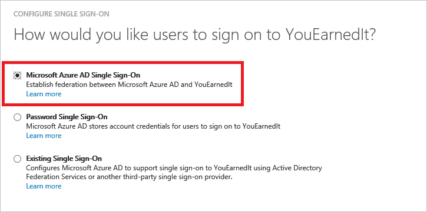
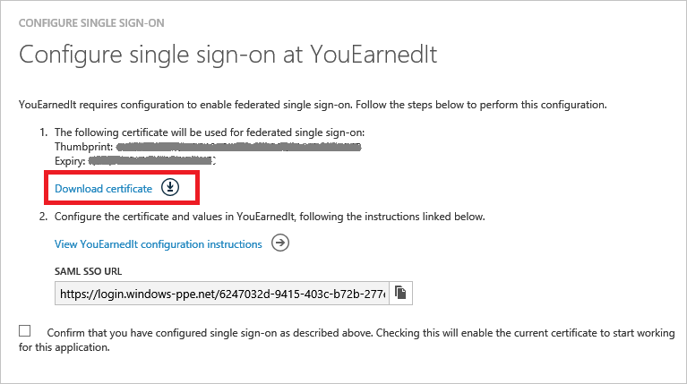

<properties
    pageTitle="Tutorial: Integración de Azure Active Directory con YouEarnedIt | Microsoft Azure"
    description="Obtenga información sobre cómo configurar el inicio de sesión único entre Azure Active Directory y YouEarnedIt."
    services="active-directory"
    documentationCenter=""
    authors="jeevansd"
    manager="femila"
    editor=""/>

<tags
    ms.service="active-directory"
    ms.workload="identity"
    ms.tgt_pltfrm="na"
    ms.devlang="na"
    ms.topic="article"
    ms.date="10/07/2016"
    ms.author="jeedes"/>

# Tutorial: Integración de Azure Active Directory con YouEarnedIt

En este tutorial, aprenderá a integrar YouEarnedIt con Azure Active Directory (AD Azure).

Integrar YouEarnedIt con Azure AD proporciona las siguientes ventajas:

- Puede controlar en Azure AD quién tiene acceso a YouEarnedIt
- Puede habilitar los usuarios automáticamente obtener ha iniciado sesión en YouEarnedIt (inicio de sesión único) con sus cuentas de Azure AD
- Puede administrar las cuentas en una ubicación central: el portal de clásico de Azure

Si desea conocer más detalles sobre la integración de la aplicación de SaaS con Azure AD, vea [¿Qué es el acceso a la aplicación e inicio de sesión único con Azure Active Directory](active-directory-appssoaccess-whatis.md).

## Requisitos previos

Para configurar la integración de Azure AD con YouEarnedIt, necesitará los elementos siguientes:

- Una suscripción de Azure AD
- Un YouEarnedIt inicio de sesión único de suscripción habilitado

> [AZURE.NOTE] Para probar los pasos de este tutorial, no se recomienda utilizar un entorno de producción.

Para probar los pasos de este tutorial, debería seguir estas recomendaciones:

- No debe utilizar su entorno de producción, a menos que esto es necesario.
- Si no tiene un entorno de prueba de Azure AD, puede obtener un mes de una prueba [aquí](https://azure.microsoft.com/pricing/free-trial/).

## Descripción del escenario
En este tutorial, se prueba Azure AD inicio de sesión único en un entorno de prueba.

El escenario descrito en este tutorial se compone de dos bloques de creación:

1. Agregar YouEarnedIt de la Galería
2. Configurar y probar Azure AD de sesión único

## Agregar YouEarnedIt de la Galería
Para configurar la integración de YouEarnedIt en Azure AD, debe agregar YouEarnedIt desde la galería a la lista de aplicaciones de SaaS administradas.

**Para agregar YouEarnedIt de la galería, realice los pasos siguientes:**

1. En el **portal de clásica Azure**, en el panel de navegación izquierdo, haga clic en **Active Directory**.

    ![Active Directory][1]

2. En la lista de **directorio** , seleccione el directorio para el que desea habilitar la integración de directorios.

3. Para abrir la vista de aplicaciones, en la vista de directorio, haga clic en **aplicaciones** en el menú superior.

    ![Aplicaciones][2]

4. Haga clic en **Agregar** en la parte inferior de la página.

    ![Aplicaciones][3]

5. En el cuadro de diálogo **¿Qué desea hacer** , haga clic en **Agregar una aplicación de la Galería**.

    ![Aplicaciones][4]

6. En el cuadro Buscar, escriba **YouEarnedIt**.

    

7. En el panel de resultados, seleccione **YouEarnedIt**y, a continuación, haga clic en **completado** para agregar la aplicación.

    

##  Configurar y probar Azure AD de sesión único
En esta sección, configurar y probar el inicio de sesión único Azure AD con YouEarnedIt en función de un usuario de prueba denominado a "Bárbara Menéndez".

Para que el inicio de sesión único para que funcione, debe saber qué es el usuario equivalente en YouEarnedIt a un usuario en Azure AD Azure AD. En otras palabras, debe establecerse una relación de vínculo entre un usuario de Azure AD y el usuario relacionado en YouEarnedIt.

Esta relación de vínculo se establece por asignar el valor del **nombre de usuario** en Azure AD como el valor del **nombre de usuario** en YouEarnedIt.

Para configurar y probar el inicio de sesión único de Azure AD con YouEarnedIt, debe completar los siguientes bloques de creación:

1. **[Inicio de sesión único en configurar Azure AD](#configuring-azure-ad-single-sign-on)** - para permitir a los usuarios usar esta característica.
2. **[Creación de un anuncio de Azure probar usuario](#creating-an-azure-ad-test-user)** - probar Azure AD inicio de sesión único con Britta Simon.
3. **[Crear un YouEarnedIt probar usuario](#creating-a-predictix-price-reporting-test-user)** - a tiene equivalente de Britta Simon en YouEarnedIt que está vinculado a la representación de Azure AD de ella.
4. **[Asignación de Azure AD probar usuario](#assigning-the-azure-ad-test-user)** - habilitar Britta Simon usar inicio de sesión único en Azure AD.
5. **[Pruebas de inicio de sesión único](#testing-single-sign-on)** : para comprobar si la configuración funciona.

### Configuración de inicio de sesión único de Azure AD en

En esta sección, habilitar inicio de sesión único de Azure AD en el portal de clásico y configurar el inicio de sesión único en la aplicación YouEarnedIt.

**Para configurar el inicio de sesión único Azure AD con YouEarnedIt, siga estos pasos:**

1. En el portal clásico, en la página de integración de aplicación **YouEarnedIt** , haga clic en **configurar inicio de sesión único** para abrir el cuadro de diálogo **Configurar inicio de sesión único** .
     
    ![Configurar el inicio de sesión único][6] 

2. En la página **¿cómo desea que los usuarios para iniciar sesión YouEarnedIt** , seleccione **Azure AD inicio de sesión único**y, a continuación, haga clic en **siguiente**.

     

3. En la página de diálogo **Configurar opciones de aplicación** , realice los pasos siguientes:

     

    una. En el cuadro de texto de **Inicio de sesión en la dirección URL** , escriba la dirección URL utilizada por los usuarios para el inicio de sesión en la aplicación de YouEarnedIt utilizando el modelo siguiente: 

    - Entorno de recinto de seguridad:`https://<company name>.sandbox.youearnedit.com/users/sign_in`
    - Entorno de producción:`https://<company name>.youearnedit.com/users/sign_in`
    
    b. Haga clic en **siguiente**
 
4. En la página **configurar inicio de sesión único en YouEarnedIt** , realice los pasos siguientes:

    

    una. Haga clic en **Descargar certificado**y, a continuación, guarde el archivo en su equipo.

    b. Haga clic en **siguiente**.

5. Para obtener SSO configurado para la aplicación, póngase en contacto con el equipo de soporte técnico de YouEarnedIt y proporcionarles lo siguiente:

    • Descargado **certificado**

    • La **dirección URL de SAML SSO**

6. En el portal clásico, seleccione la confirmación de la configuración de inicio de sesión único y, a continuación, haga clic en **siguiente**.
    
    ![En el inicio de sesión único de Azure AD][10]

7. En la página de **confirmación de inicio de sesión único** , haga clic en **completado**.  
 
    ![En el inicio de sesión único de Azure AD][11]

### Crear un usuario de prueba de Azure AD
En esta sección, creará un usuario de prueba en el portal de clásico denominado a Britta Simon.

![Crear usuario de Azure AD][20]

**Para crear un usuario de prueba en Azure AD, realice los pasos siguientes:**

1. En el **portal de clásica Azure**, en el panel de navegación izquierdo, haga clic en **Active Directory**.

     

2. En la lista de **directorio** , seleccione el directorio para el que desea habilitar la integración de directorios.

3. Para mostrar la lista de usuarios, en el menú de la parte superior, haga clic en **usuarios**.

     

4. Para abrir el cuadro de diálogo **Agregar usuario** , en la barra de herramientas en la parte inferior, haga clic en **Agregar usuario**.

     

5. En la página de diálogo **Díganos sobre este usuario** , siga estos pasos:   

    una. Como tipo de usuario, seleccione Nuevo usuario de su organización.

    b. En el **cuadro de texto**de nombre de usuario, escriba **BrittaSimon**.

    c. Haga clic en **siguiente**.

6.  En la página de diálogo de **Perfil de usuario** , siga estos pasos:  

    una. En el cuadro de texto **nombre** , escriba **Bárbara**.  

    b. En el último cuadro de texto **Nombre** , tipo, **Simon**.

    c. En el cuadro de texto **Nombre para mostrar** , escriba **Bárbara Menéndez**.

    d. En la lista **función** , seleccione el **usuario**.

    e. Haga clic en **siguiente**.

7. En la página de diálogo **obtener una contraseña temporal** , haga clic en **crear**.

     

8. En la página de diálogo **obtener una contraseña temporal** , realice los pasos siguientes:

     

    una. Anote el valor de la **Nueva contraseña**.

    b. Haga clic en **Finalizar**.   

### Crear un usuario de prueba YouEarnedIt

En esta sección, creará un usuario llamado a Britta Simon en YouEarnedIt. Trabaje con el equipo de soporte técnico de YouEarnedIt para agregar los usuarios de la plataforma de YouEarnedIt.

> [AZURE.NOTE]  YouEarnedIt esperar el proveedor de identidades para proporcionar una dirección de correo electrónico o el nombre de usuario en el atributo NameID. Autenticación se producirá un error si no se encuentra dentro de la base de datos o no coincide exactamente de un nombre de usuario correspondiente o dirección de correo electrónico. Esto requiere que las cuentas se importan al sistema de YouEarnedIt antes de la integración de SSO (normalmente ya sea a través de importación CSV o de la API).

### Asignar al usuario de prueba de Azure AD

En esta sección, habilitar Britta Simon utilizar un inicio de sesión único Azure al conceder acceso a YouEarnedIt.

![Asignar usuario][200] 

**Para asignar a Britta Simon a YouEarnedIt, siga estos pasos:**

1. En el portal clásico, para abrir la vista de aplicaciones, en la vista de directorio, haga clic en **aplicaciones** en el menú superior.

    ![Asignar usuario][201] 

2. En la lista de aplicaciones, seleccione **YouEarnedIt**.

     

3. En el menú de la parte superior, haga clic en **usuarios**.

    ![Asignar usuario][203]

4. En la lista de usuarios, seleccione **Bárbara Menéndez**.

5. En la barra de herramientas en la parte inferior, haga clic en **asignar**.

    ![Asignar usuario][205]

### Pruebas de inicio de sesión único

En esta sección, pruebe su Azure AD única sesión configuración mediante el Panel de acceso.

Al hacer clic en el mosaico de YouEarnedIt en el Panel de acceso, debe obtener automáticamente ha iniciado sesión en la aplicación YouEarnedIt.

## Recursos adicionales

* [Lista de tutoriales sobre cómo integrar aplicaciones de SaaS con Azure Active Directory](active-directory-saas-tutorial-list.md)
* [¿Qué es el acceso a la aplicación e inicio de sesión único con Azure Active Directory?](active-directory-appssoaccess-whatis.md)

<!--Image references-->

[1]: ./media/active-directory-saas-youearnedit-tutorial/tutorial_general_01.png
[2]: ./media/active-directory-saas-youearnedit-tutorial/tutorial_general_02.png
[3]: ./media/active-directory-saas-youearnedit-tutorial/tutorial_general_03.png
[4]: ./media/active-directory-saas-youearnedit-tutorial/tutorial_general_04.png

[6]: ./media/active-directory-saas-youearnedit-tutorial/tutorial_general_05.png
[10]: ./media/active-directory-saas-youearnedit-tutorial/tutorial_general_06.png
[11]: ./media/active-directory-saas-youearnedit-tutorial/tutorial_general_07.png
[20]: ./media/active-directory-saas-youearnedit-tutorial/tutorial_general_100.png

[200]: ./media/active-directory-saas-youearnedit-tutorial/tutorial_general_200.png
[201]: ./media/active-directory-saas-youearnedit-tutorial/tutorial_general_201.png
[203]: ./media/active-directory-saas-youearnedit-tutorial/tutorial_general_203.png
[204]: ./media/active-directory-saas-youearnedit-tutorial/tutorial_general_204.png
[205]: ./media/active-directory-saas-youearnedit-tutorial/tutorial_general_205.png
