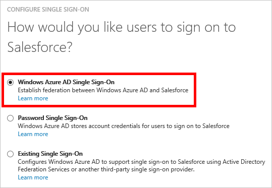
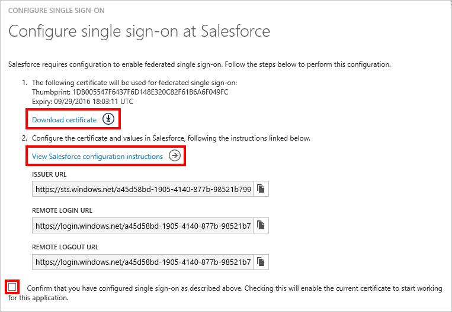

<properties
    pageTitle="Cómo administrar los certificados de federación en Azure AD | Microsoft Azure"
    description="Obtenga información sobre cómo personalizar la fecha de vencimiento para los certificados de federación y cómo renovar certificados que va a expirar pronto."
    services="active-directory"
    documentationCenter=""
    authors="asmalser-msft"
    manager="femila"
    editor=""/>

<tags
    ms.service="active-directory"
    ms.workload="identity"
    ms.tgt_pltfrm="na"
    ms.devlang="na"
    ms.topic="article"
    ms.date="02/09/2016"
    ms.author="asmalser-msft"/>

#Administración de certificados para federados inicio de sesión único de Azure Active Directory

En este artículo trata sobre preguntas comunes relacionadas con los certificados que crea Azure Active Directory para poder establecer federado inicio de sesión único (SSO) a sus aplicaciones de SaaS.

En este artículo solo es relevante para las aplicaciones que están configuradas para usar **Azure AD inicio de sesión único**, como se muestra en el ejemplo siguiente:

##Cómo personalizar la fecha de vencimiento para el certificado de federación

De forma predeterminada, se establecen los certificados que expiren después de dos años. Puede elegir una fecha de caducidad diferente para el certificado siguiendo los pasos siguientes. Las capturas de pantalla incluye usar Salesforce por ejemplo, pero pueden aplicar estos pasos para cualquier aplicación de SaaS federado.

1. En Azure Active Directory, en la página de inicio rápido de la aplicación, haga clic en **configurar inicio de sesión único**.

    

2. Seleccione **Azure AD inicio de sesión único**y, a continuación, haga clic en **siguiente**.

3. Escriba la **Dirección URL de inicio de sesión** de la aplicación y seleccione la casilla de verificación para **Configurar el certificado usado para un inicio de sesión único federado**. A continuación, haga clic en **siguiente**.

    

4. En la siguiente página, seleccione **generar un certificado nuevo**y seleccione cuánto tiempo desea que el certificado que sea válido para. A continuación, haga clic en **siguiente**.

    

5. A continuación, haga clic en **Descargar certificado**. Para obtener información sobre cómo cargar el certificado en la aplicación de SaaS determinada, haga clic en **las instrucciones de configuración de vista**.

    

6. El certificado no estará activado hasta que seleccione la casilla de verificación confirmación en la parte inferior del cuadro de diálogo y, a continuación, pulse Enviar.

##Cómo renovar un certificado que expirará pronto

Los pasos de la renovación se muestra a continuación lo ideal es que deben aparecer en ningún tiempo de inactividad considerable para sus usuarios. Las capturas de pantalla que se usa en esta característica sección Salesforce como ejemplo, pero estos pasos pueden aplicar a cualquier aplicación de SaaS federado.

1. En Azure Active Directory, en la página de inicio rápido de la aplicación, haga clic en **Configurar inicio de sesión único**.

    

2. En la primera página del cuadro de diálogo, **Azure AD inicio de sesión único** debe estar seleccionada, haga clic en **siguiente**.

3. En la segunda página, seleccione la casilla de verificación para **Configurar el certificado usado para un inicio de sesión único federado**. A continuación, haga clic en **siguiente**.

    

4. En la siguiente página, seleccione **generar un certificado nuevo**y seleccione cuánto tiempo desea que el nuevo certificado que sea válido para. A continuación, haga clic en **siguiente**.

    

5. Haga clic en **Descargar certificado**. Para rewnew correctamente el certificado, debe realizar los dos pasos siguientes:

    - Cargar el nuevo certificado en la pantalla de configuración de inicio de sesión único de la aplicación de SaaS. Para obtener información sobre cómo hacer esto para su aplicación SaaS determinada, haga clic en **las instrucciones de configuración de vista**.

    - En Azure AD, seleccione la casilla de verificación confirmación en la parte inferior del cuadro de diálogo para habilitar el nuevo certificado y, a continuación, haga clic en **siguiente** para enviar.

    > [AZURE.IMPORTANT] Inicio de sesión único en la aplicación se deshabilitarán se haya completado el momento en que cada uno de estos dos pasos, pero se volverá a activarse una vez se haya completado el segundo paso. Por lo tanto, para reducir el tiempo de inactividad, prepare para llevar a cabo los pasos en un breve período de tiempo entre sí.

    

## Artículos relacionados

- [Índice de artículos de administración de aplicaciones de Azure Active Directory](active-directory-apps-index.md)
- [Acceso a la aplicación e inicio de sesión único con Azure Active Directory](active-directory-appssoaccess-whatis.md)
- [Solución de problemas basada en SAML inicio de sesión único](active-directory-saml-debugging.md)
