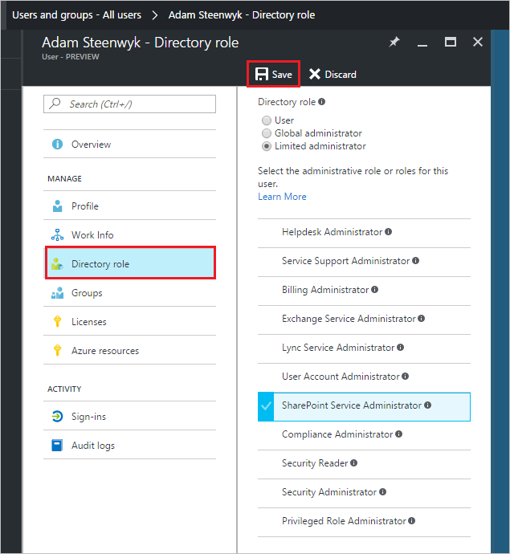

<properties
    pageTitle="Asignar un usuario a los roles de administrador de vista previa de Azure Active Directory | Microsoft Azure"
    description="Explica cómo cambiar la información de usuario administrativo en Azure Active Directory"
    services="active-directory"
    documentationCenter=""
    authors="curtand"
    manager="femila"
    editor=""/>

<tags
    ms.service="active-directory"
    ms.workload="identity"
    ms.tgt_pltfrm="na"
    ms.devlang="na"
    ms.topic="article"
    ms.date="09/12/2016"
    ms.author="curtand"/>

# Asignar a un usuario a los roles de administrador de vista previa de Azure Active Directory

En este artículo se explica cómo asignar un rol administrativo a un usuario en la vista previa de Azure Active Directory (AD Azure). [¿Qué es la vista previa?](active-directory-preview-explainer.md) Para obtener información sobre cómo agregar nuevos usuarios de su organización, vea [Agregar nuevos usuarios a Azure Active Directory](active-directory-users-create-azure-portal.md). Usuarios agregados no tienen permisos de administrador de forma predeterminada, pero puede asignar roles a ellos en cualquier momento.

## Asignar un rol a un usuario

1.  Inicie sesión en el [portal de Azure](https://portal.azure.com) con una cuenta que sea un administrador global para el directorio.

2.  Seleccione **más servicios**, escriba **los usuarios y grupos** en el cuadro de texto y, a continuación, presione **ENTRAR**.

    

3.  En el módulo de **usuarios y grupos** , seleccione **todos los usuarios**.

    

4. En el módulo de **usuarios y grupos: todos los usuarios** , seleccione un usuario de la lista.

5. En el módulo para el usuario seleccionado, seleccione **el rol de directorio**y, a continuación, asignar al usuario a una función de la lista de **funciones de directorio** . Para obtener más información acerca de los roles de usuario y administrador, vea [asignación de roles de administrador en Azure AD](active-directory-assign-admin-roles.md).

      

6. Seleccione **Guardar**.

## ¿Qué es la siguiente

- [Agregar un usuario](active-directory-users-create-azure-portal.md)
- [Restablecer la contraseña de un usuario en el nuevo portal de Azure](active-directory-users-reset-password-azure-portal.md)
- [Cambiar la información del trabajo de un usuario](active-directory-users-work-info-azure-portal.md)
- [Administrar perfiles de usuario](active-directory-users-profile-azure-portal.md)
- [Eliminar un usuario en su Azure AD](active-directory-users-delete-user-azure-portal.md)
