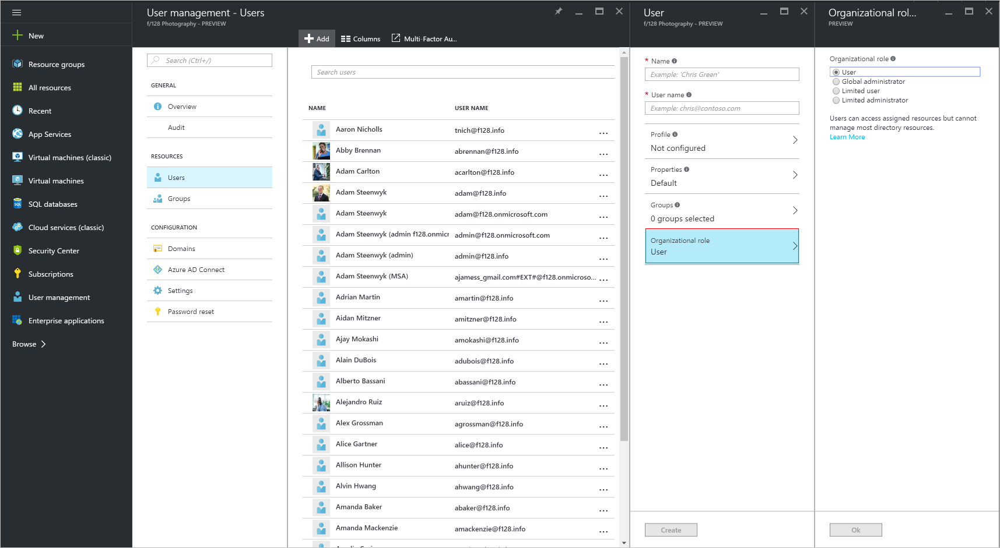

<properties
    pageTitle="Agregar usuarios de otros directorios o colaboradores en vista previa de Azure Active Directory | Microsoft Azure"
    description="Se explica cómo agregar usuarios o cambiar la información de usuario en Azure Active Directory, incluidos los usuarios externos como invitados."
    services="active-directory"
    documentationCenter=""
    authors="curtand"
    manager="femila"
    editor=""/>

<tags
    ms.service="active-directory"
    ms.workload="identity"
    ms.tgt_pltfrm="na"
    ms.devlang="na"
    ms.topic="article"
    ms.date="09/12/2016"
    ms.author="curtand"/>

# Agregar usuarios de otros directorios o las empresas asociadas en vista previa de Azure Active Directory

> [AZURE.SELECTOR]
- [Portal de Azure](active-directory-users-create-external-azure-portal.md)
- [Portal de clásico de Azure](active-directory-create-users-external.md)

En este artículo se explica cómo agregar usuarios de otros directorios de vista previa de Azure Active Directory (AD Azure) o de las empresas asociadas. [¿Qué es la vista previa?](active-directory-preview-explainer.md) Para obtener información sobre cómo agregar nuevos usuarios de su organización y agregar los usuarios que tienen cuentas de Microsoft, vea [Agregar nuevos usuarios a Azure Active Directory](active-directory-users-create-azure-portal.md). Usuarios agregados no tienen permisos de administrador de forma predeterminada, pero puede asignar roles a ellos en cualquier momento.

## Agregar un usuario

1.  Inicie sesión en el [portal de Azure](https://portal.azure.com) con una cuenta que sea un administrador global para el directorio.

2.  Seleccione **más servicios**, escriba **los usuarios y grupos** en el cuadro de texto y, a continuación, presione **ENTRAR**.

    

3.  En el módulo de **usuarios y grupos** , seleccione **usuarios**y, a continuación, seleccione **Agregar**.

    

4. En el módulo de **usuario** , proporcione un nombre para mostrar en **nombre** y nombre de inicio de sesión del usuario en **nombre de usuario**.

5. Copie o anote en caso contrario, la contraseña de usuario generada para que puedan proporcionar al usuario una vez completado este proceso.

6. Opcionalmente, seleccione el **perfil** para agregar los usuarios primero nombre y apellido, un cargo y un nombre de departamento.
    
    

    - Seleccione **grupos** para agregar al usuario a uno o más grupos.

        

    - Seleccione el **rol organizativo** para asignar al usuario a un rol de la lista de **funciones** . Para obtener más información acerca de los roles de usuario y administrador, vea [asignación de roles de administrador en Azure AD](active-directory-assign-admin-roles.md).

        

7. Seleccione **crear**.

8. Distribuir segura la contraseña generada al nuevo usuario para que el usuario puede iniciar sesión.

> [AZURE.IMPORTANT] Si su organización usa más de un dominio, debe conocer los siguientes problemas al agregar una cuenta de usuario:
>
> - **Para agregar cuentas de usuario con el mismo nombre principal de usuario (UPN) a través de dominios, agregar, por ejemplo,** geoffgrisso@contoso.onmicrosoft.com, **seguido** geoffgrisso@contoso.com.
> - **No** agregar geoffgrisso@contoso.com antes de agregar geoffgrisso@contoso.onmicrosoft.com. Este orden es importante y puede ser difícil de deshacer.

Si cambia la información para un usuario cuya identidad se sincroniza con el servicio de Active Directory local, no puede cambiar la información de usuario en el portal de clásico de Azure. Para cambiar la información de usuario, use las herramientas de administración de Active Directory local.

## ¿Qué es la siguiente

- [Agregar un usuario](active-directory-users-create-azure-portal.md)
- [Restablecer la contraseña de un usuario en el nuevo portal de Azure](active-directory-users-reset-password-azure-portal.md)
- [Asignar a un usuario a una función en su Azure AD](active-directory-users-assign-role-azure-portal.md)
- [Cambiar la información del trabajo de un usuario](active-directory-users-work-info-azure-portal.md)
- [Administrar perfiles de usuario](active-directory-users-profile-azure-portal.md)
- [Eliminar un usuario en su Azure AD](active-directory-users-delete-user-azure-portal.md)
