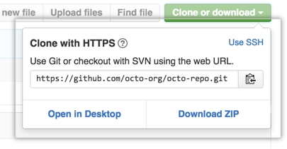
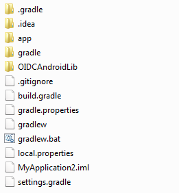

<properties
    pageTitle="Aplicación de Azure Active Directory versión 2.0 Android | Microsoft Azure"
    description="Cómo crear una aplicación de Android inicia sesión los usuarios con tanto personal cuenta de Microsoft y trabajo o escuela cuentas y llamadas de la API de gráfico mediante el uso de bibliotecas de terceros."
    services="active-directory"
    documentationCenter=""
    authors="brandwe"
    manager="mbaldwin"
    editor=""/>

<tags
    ms.service="active-directory"
    ms.workload="identity"
    ms.tgt_pltfrm="na"
    ms.devlang="na"
    ms.topic="article"
    ms.date="09/16/2016"
    ms.author="brandwe"/>

#  <a name="add-sign-in-to-an-android-app-using-a-third-party-library-with-graph-api-using-the-v20-endpoint"></a>Agregar inicio de sesión a una aplicación de Android con una biblioteca de terceros con la API de gráfico con el extremo de la versión 2.0

La plataforma de identidad de Microsoft utiliza estándares abiertos como OAuth2 y OpenID conectarse. Los programadores pueden utilizar cualquier biblioteca que desean integrarlo con nuestros servicios. Para ayudar a los desarrolladores usar nuestra plataforma con otras bibliotecas, hemos escrito algunos tutoriales como este para demostrar cómo configurar las bibliotecas de terceros para conectarse a la plataforma de identidad de Microsoft. Mayoría de las bibliotecas que implementan [la especificación de RFC6749 OAuth2](https://tools.ietf.org/html/rfc6749) puede conectarse a la plataforma de identidad de Microsoft.

Con la aplicación que crea en este tutorial, los usuarios pueden iniciar sesión en su organización y busque por sí mismos en su organización mediante la API de gráfico.

Si es nuevo en OAuth2 o OpenID conectarse, gran parte de esta configuración de ejemplo puede no sentido para usted. Se recomienda que lea [2.0 protocolos: flujo de código de autorización de OAuth 2.0](active-directory-v2-protocols-oauth-code.md) para el fondo.

> [AZURE.NOTE] Algunas características de nuestra plataforma que tienen una expresión en los estándares OAuth2 o OpenID conectar, como acceso condicional y administración de directivas de Intune requerir utilizar nuestro Abrir origen bibliotecas de identidad de Microsoft Azure.

El punto final de la versión 2.0 no admite todas las características y escenarios de Azure Active Directory.

> [AZURE.NOTE] Para determinar si debe usar el extremo de la versión 2.0, lea acerca de [las limitaciones de la versión 2.0](active-directory-v2-limitations.md).


## <a name="download-the-code-from-github"></a>Descargar el código de GitHub
El código de este tutorial se mantiene [en GitHub](https://github.com/Azure-Samples/active-directory-android-native-oidcandroidlib-v2).  Para seguir a lo largo, puede [descargar el esquema de la aplicación como un .zip](https://github.com/Azure-Samples/active-directory-android-native-oidcandroidlib-v2/archive/skeleton.zip) o clonar la estructura:

```
git clone --branch skeleton git@github.com:Azure-Samples/active-directory-android-native-oidcandroidlib-v2.git
```

También puede descargar los datos de ejemplo y empezar ahora mismo:

```
git@github.com:Azure-Samples/active-directory-android-native-oidcandroidlib-v2.git
```

## <a name="register-an-app"></a>Registrar una aplicación
Crear una nueva aplicación en el [portal de registro de aplicación](https://apps.dev.microsoft.com/?referrer=https://azure.microsoft.com/documentation/articles&deeplink=/appList)o siga los pasos detallados a [cómo registrar una aplicación con el extremo de la versión 2.0](active-directory-v2-app-registration.md).  Asegúrese de que:

- Copie el **Identificador de la aplicación** que está asignada a su aplicación porque lo necesitará pronto.
- Agregue la plataforma **Mobile** para su aplicación.

> Nota: El portal de registro de la aplicación proporciona un valor de **URI redirigir** . Sin embargo, en este ejemplo debe utilizar el valor predeterminado de `https://login.microsoftonline.com/common/oauth2/nativeclient`.


## <a name="download-the-nxoauth2-third-party-library-and-create-a-workspace"></a>Descargar la biblioteca de terceros NXOAuth2 y crear un área de trabajo

En este tutorial, usará el OIDCAndroidLib de GitHub, que es una biblioteca de OAuth2 en función del código OpenID conectar de Google. Implementa el perfil de la aplicación nativa y es compatible con el extremo de la autorización del usuario. Estos son todo lo que necesita integrar con la plataforma de identidad de Microsoft.

Clonar la repo OIDCAndroidLib a su equipo.

```
git@github.com:kalemontes/OIDCAndroidLib.git
```



## <a name="set-up-your-android-studio-environment"></a>Configurar el entorno de Studio Android

1. Crear un nuevo proyecto Studio Android y acepte los valores predeterminados en el asistente.

    

    

    

2. Para configurar los módulos del proyecto, mueva el repo duplicado a la ubicación del proyecto. Puede crear también el proyecto y, a continuación, se clonar directamente a la ubicación del proyecto.

    

3. Abra la configuración de módulos del proyecto usando el menú contextual o mediante el método abreviado Ctrl + Alt + rincipales + S.

    

4. Quitar el módulo de aplicación predeterminado porque solo desea que la configuración del contenedor de proyecto.

    

5. Importar módulos de la repo duplicado para el proyecto actual.

    
    

6. Repita estos pasos para la `oidlib-sample` módulo.

7. Comprobar las dependencias de oidclib en la `oidlib-sample` módulo.

    

8. Haga clic en **Aceptar** y espere gradle sincronización.

    El settings.gradle debe tener un aspecto como:

    

9. Crear la aplicación de ejemplo para asegurarse de que los datos de ejemplo ejecutando correctamente.

    No podrá usar con Azure Active Directory todavía. Debemos configurar algunas extremos en primer lugar. Esto es para asegurarse de que no tiene un problemas Studio Android antes de empezar a personalizar la aplicación de ejemplo.

10. Crear y ejecutar `oidlib-sample` como destino en Studio Android.

    

11. Eliminar la `app ` directorio que estaba cuando quita el módulo del proyecto, porque Studio Android no eliminar por motivos de seguridad.

    

12. Abrir el menú **Editar configuraciones** para quitar la configuración de ejecución también se dejó cuando quita el módulo del proyecto.

    
    

## <a name="configure-the-endpoints-of-the-sample"></a>Configurar los extremos de la muestra

Ahora que tiene la `oidlib-sample` ejecutando correctamente, editar algunas extremos para que funcione con Azure Active Directory.

### <a name="configure-your-client-by-editing-the-oidcclientconfxml-file"></a>Configurar a su cliente editando el archivo oidc_clientconf.xml

1. Porque está utilizando flujos de OAuth2 solamente para obtener un token y llamar a la API de gráfico, establezca el cliente hacer OAuth2 solo. OIDC vendrá en un ejemplo posterior.

    ```xml
        <bool name="oidc_oauth2only">true</bool>
    ```

2. Configurar el identificador de cliente que ha recibido en el portal de registro.

    ```xml
        <string name="oidc_clientId">86172f9d-a1ae-4348-aafa-7b3e5d1b36f5</string>
        <string name="oidc_clientSecret"></string>
    ```

3. Configurar el redireccionamiento URI con el siguiente.

    ```xml
        <string name="oidc_redirectUrl">https://login.microsoftonline.com/common/oauth2/nativeclient</string>
    ```

4. Configurar los ámbitos que necesita para obtener acceso a la API de gráfico.

    ```xml
        <string-array name="oidc_scopes">
            <item>openid</item>
            <item>https://graph.microsoft.com/User.Read</item>
            <item>offline_access</item>
        </string-array>
    ```

La `User.Read` de los valores `oidc_scopes` permite leer el perfil básico la sesión de usuario.
Puede obtener más información acerca de todos los ámbitos disponibles en [los ámbitos de permiso de Microsoft Graph](https://graph.microsoft.io/docs/authorization/permission_scopes).

Si le gustaría explicaciones sobre `openid` o `offline_access` como ámbitos en conectar OpenID, vea [2.0 protocolos: flujo de código de autorización de OAuth 2.0](active-directory-v2-protocols-oauth-code.md).

### <a name="configure-your-client-endpoints-by-editing-the-oidcendpointsxml-file"></a>Configurar los extremos de cliente editando el archivo oidc_endpoints.xml

- Abrir la `oidc_endpoints.xml` de archivo y haga los cambios siguientes:

    ```xml
    <!-- Stores OpenID Connect provider endpoints. -->
    <resources>
        <string name="op_authorizationEnpoint">https://login.microsoftonline.com/common/oauth2/v2.0/authorize</string>
        <string name="op_tokenEndpoint">https://login.microsoftonline.com/common/oauth2/v2.0/token</string>
        <string name="op_userInfoEndpoint">https://www.example.com/oauth2/userinfo</string>
        <string name="op_revocationEndpoint">https://www.example.com/oauth2/revoketoken</string>
    </resources>
    ```

Nunca deben cambiar estos extremos si está utilizando OAuth2 como protocolo.

> [AZURE.NOTE]
Los extremos para `userInfoEndpoint` y `revocationEndpoint` no se admiten actualmente Azure Active Directory. Si deja estos con el valor de ejemplo.com de forma predeterminada, se le recordará que no están disponibles en la muestra :-)


## <a name="configure-a-graph-api-call"></a>Configurar una llamada API de gráfico

- Abrir la `HomeActivity.java` de archivo y haga los cambios siguientes:

    ```Java
       //TODO: set your protected resource url
        private static final String protectedResUrl = "https://graph.microsoft.com/v1.0/me/";
    ```

Aquí una llamada de gráfico API simple devuelve nuestra información.

Estos son todos los cambios que debe realizar. Ejecutar la `oidlib-sample` aplicación y haga clic en **iniciar sesión**.

Después de que se han autenticado correctamente, seleccione el botón **Solicitar recursos protegidas** para probar la llamada a la API de gráfico.

## <a name="get-security-updates-for-our-product"></a>Obtener actualizaciones de seguridad de nuestros productos

Le recomendamos que obtener notificaciones sobre incidencias de seguridad al visitar el [TechCenter de seguridad](https://technet.microsoft.com/security/dd252948) y suscribirse a las alertas de aviso de seguridad.
