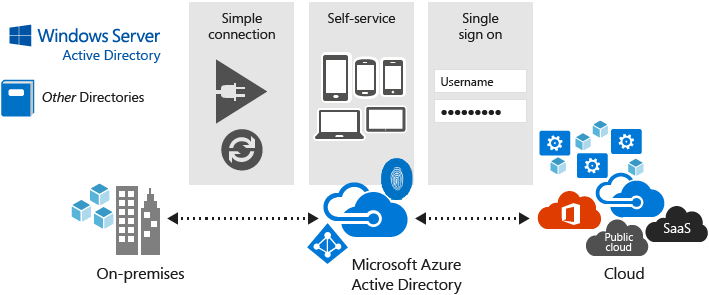

<properties
    pageTitle="¿Qué es Azure Active Directory?"
    description="Use Azure Active Directory para extender su identidad local existente en la nube o desarrollar aplicaciones de Azure AD integrado."
    services="active-directory"
    documentationCenter=""
    authors="markusvi"
    manager="femila"
    editor=""/>

<tags
    ms.service="active-directory"
    ms.workload="identity"
    ms.tgt_pltfrm="na"
    ms.devlang="na"
    ms.topic="article"
    ms.date="08/23/2016"
    ms.author="markusvi"/>

# ¿Qué es Azure Active Directory?

Azure Active Directory (AD Azure) es el directorio de múltiples usuarios basada en la nube de Microsoft y servicio de administración de identidades.

Para administradores de TI, Azure AD proporciona una solución asequible y fácil de usar para dar a empleados y socios solo inicio de sesión único (SSO) acceso a [miles de nube SaaS aplicaciones](http://blogs.technet.com/b/ad/archive/2014/09/03/50-saas-apps-now-support-federation-with-azure-ad.aspx) como Office 365, Salesforce.com, DropBox y Concur.

Para desarrolladores de aplicaciones de Azure AD le permite centrarse en la creación de la aplicación, ya que rápido y sencillo integrar con una solución de administración de identidades de clase mundo usan millones de organizaciones de todo el mundo.

Azure AD también incluye un conjunto completo de las capacidades de administración de identidades incluidos autenticación multifactor, registro de dispositivo, la administración de contraseñas de autoservicio, administración de grupos de autoservicio, administración de cuenta con privilegios, basado en roles, control de acceso, supervisión de uso de aplicaciones, enriquecido auditoría y supervisión de seguridad y alertas. Estas capacidades pueden ayudar a las aplicaciones segura basada en la nube, simplificar los procesos de TI, reducir los costos y ayudar a garantizar que se cumplan los objetivos de cumplimiento.

Además, con solo [cuatro clics](http://blogs.technet.com/b/ad/archive/2014/08/04/connecting-ad-and-azure-ad-only-4-clicks-with-azure-ad-connect.aspx), puede integrarse Azure AD con una existente Windows Server Active Directory, ofreciendo organizaciones inversiones identidad para administrar el acceso a la nube según aplicaciones SaaS a local de la capacidad de aprovechar sus existente.

Si es un cliente de Office 365, Azure o Dynamics CRM Online, podría no advertir que ya está usando Azure AD. Cada inquilino de Office 365, Azure y Dynamics CRM está ya es un inquilino de Azure AD. Siempre que lo desee que puede comenzar a usar ese inquilino para administrar el acceso a miles de otras aplicaciones de nube Azure AD se integra con!

## ¿Cómo confiable es Azure AD?

Diseño de múltiples arrendatarios, distribuido geo, alta disponibilidad significa de Azure AD que puede confiar en él para necesidades empresariales más importantes. Se está quedando sin centros de 28 datos todo el mundo con tras error automatizada, tendrá la comodidad de saber que Azure AD es muy confiable y que incluso si se trata de un centro de datos hacia abajo, copias del directorio datos están activos en al menos dos regional dispersión centros de datos y obtener acceso instantáneo.

Para obtener más detalles, consulte [Service Level Agreements](https://azure.microsoft.com/support/legal/sla/).

## ¿Cuáles son las ventajas de Azure AD?

Su organización puede usar Azure AD para mejorar la productividad de los empleados, simplificar los procesos de TI, mejorar la seguridad y reducir los costos de muchas formas:

-   Adoptar rápidamente servicios en la nube, proporcionar a los empleados y asociados con un signo de un solo fácil experiencia ofrecido por Azure AD totalmente automatizado SaaS aplicación Administración y aprovisionar servicios capacidades de acceso.
-   Permiten a los empleados con acceso a aplicaciones de nube de clase de llamadas internacionales y capacidades de autoservicio desde dondequiera que necesitan para trabajar en los dispositivos que les gusta usar.
-   Administrar proveedores y empleados acceso a sus cuentas de redes sociales corporativa fácil y segura.
-   Mejorar la seguridad de la aplicación con la autenticación de Azure AD y acceso condicional.
-   Implementar la administración de acceso de aplicación coherentes y autoservicio, otorgar a los propietarios de empresas para desplazarse rápidamente mientras se reduce los costos de TI y los gastos generales.
-   Supervisar el uso de la aplicación y proteja su negocio de amenazas avanzadas con la seguridad de supervisión y generación de informes.
-   Acceso móvil (remoto) a aplicaciones locales.

## ¿Cómo puedo empezar?
-   Si es un administrador de TI:
 - [¡Pruébelo!](https://azure.microsoft.com/trial/get-started-active-directory/) -puede registrarse para una prueba de 30 gratuita hoy e implementar la solución de nube primera en menos de 5 minutos con este vínculo
 - Lea "Introducción a Azure AD" de sugerencias y trucos sobre cómo empezar a un inquilino de Azure AD con rapidez
-   Si es un desarrollador:
 - Consulte nuestra [Guía para programadores](active-directory-developers-guide.md) de Azure Active Directory
 - [Iniciar una prueba](https://azure.microsoft.com/trial/get-started-active-directory/) : suscribirme a una prueba gratuita de 30 días hoy y empezar a integrar sus aplicaciones con Azure AD

## ¿Dónde puedo obtener más información?

Para ayudarle a aprender todo sobre Azure AD tenemos una tonelada de excelentes recursos en línea. Aquí tiene una lista de artículos muy interesantes para empezar:

- [Habilitar el directorio para la administración de híbrido con Azure AD Connect](active-directory-aadconnect.md)

- [Seguridad adicional para un mundo nunca conectado](../multi-factor-authentication/multi-factor-authentication.md)

- [Automatizar usuario de aprovisionamiento y baja para las aplicaciones SaaS con Azure Active Directory](active-directory-saas-app-provisioning.md)

- [Introducción a informes de Azure AD](active-directory-reporting-getting-started.md)

- [Administrar sus contraseñas desde cualquier lugar](active-directory-passwords.md)

- [¿Qué es el acceso a la aplicación e inicio de sesión único con Azure Active Directory?](active-directory-appssoaccess-whatis.md)

- [Automatizar usuario de aprovisionamiento y baja para las aplicaciones SaaS con Azure Active Directory](active-directory-saas-app-provisioning.md)

- [Cómo proporcionar acceso remoto seguro a aplicaciones locales](active-directory-application-proxy-get-started.md)

- [Administrar el acceso a los recursos con grupos de Azure Active Directory](active-directory-manage-groups.md)

- [¿Qué es la licencia de Microsoft Azure Active Directory?](active-directory-licensing-what-is.md)

- [¿Cómo puedo descubrir aplicaciones no sancionada nube que se utilizan dentro de mi organización](active-directory-cloudappdiscovery-whatis.md)
