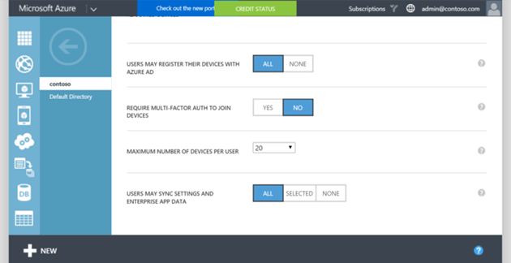
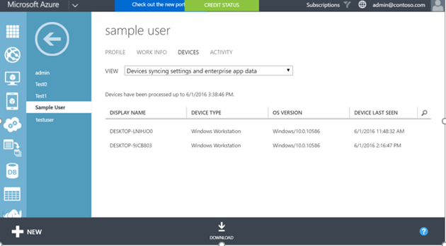

<properties
    pageTitle="Habilitar el estado de Enterprise movilidad de Azure Active Directory | Microsoft Azure"
    description="Preguntas más frecuentes sobre la configuración de movilidad de estado de empresa en dispositivos de Windows. Movilidad de estado de Enterprise proporciona a los usuarios una experiencia unificada en todos sus dispositivos de Windows y reduce el tiempo necesario para configurar un nuevo dispositivo."
    services="active-directory"
    keywords="estado de Enterprise movilidad nube de windows, cómo habilitar la movilidad de estado de enterprise"
    documentationCenter=""
    authors="femila"
    manager="swadhwa"
    editor="curtand"/>

<tags
    ms.service="active-directory"  
    ms.workload="identity"
    ms.tgt_pltfrm="na"
    ms.devlang="na"
    ms.topic="article"
    ms.date="09/27/2016"
    ms.author="femila"/>

# Habilitar el estado de Enterprise movilidad de Azure Active Directory

Movilidad de estado de empresa está disponible para cualquier organización con una suscripción Premium Azure Active Directory (AD Azure). Para obtener más detalles sobre cómo obtener una suscripción de Azure AD, consulte la [página de producto de Azure AD](https://azure.microsoft.com/services/active-directory).

Al habilitar la movilidad de estado de empresa, la organización automáticamente concederá licencias para una suscripción gratuita, uso limitado a Azure Rights Management. Esta suscripción gratuita se limita a cifrar y descifrar la configuración de la empresa y los datos de aplicación sincronizados en el servicio de Roaming de estado de Enterprise; debe tener una suscripción de pago para usar todas las funciones de Azure Rights Management.

Después de obtener una suscripción Premium Azure AD, siga estos pasos para habilitar la movilidad de estado de Enterprise:

1. Inicie sesión en el portal de clásico de Azure.
2. En la parte izquierda, seleccione **ACTIVE DIRECTORY**y, a continuación, seleccione el directorio para el que desea habilitar la movilidad de estado de Enterprise.

3. Vaya a la ficha **Configurar** en la parte superior.

4.  Desplácese hasta la página, seleccione **los usuarios pueden sincronizar configuración y datos de aplicación de empresa**y, a continuación, haga clic en **Guardar**.

Para que un dispositivo de Windows 10 movilidad configuración con el servicio de Roaming de estado de empresa, el dispositivo debe autenticar mediante una identidad de Azure AD. Para los dispositivos que se unen a Azure AD, inicio de sesión del usuario principal es la identidad de Azure AD, por lo que se necesite ninguna configuración adicional. Para los dispositivos que utilizan un Active Directory local tradicional, el Administrador de TI debe [conecte los dispositivos de dominio a Azure AD para experiencias de Windows 10](active-directory-azureadjoin-devices-group-policy.md).

## Almacenamiento de datos de sincronización
Datos móviles de estado de empresa se hospedan en una o varias [áreas de Azure](https://azure.microsoft.com/regions/ ) que mejor se alinea con el valor de país o región establecido en la instancia de Azure Active Directory. Datos móviles de estado de empresa se dividen en función de tres regiones geográficas principales: Norteamérica, EMEA y APAC. Movilidad de estado de Enterprise datos del inquilino localmente ubicado en la región geográfica y no se duplica en todas las regiones.  Por ejemplo, los clientes que tengan el valor de país o región establecido en uno de los países EMEA como "Francia" o "Zambia" tendrán sus datos alojados en uno o de las regiones de Europa Azure.  Clientes que configure su valor de país o región en Azure AD a uno de los países de Norteamérica como "Estados Unidos" o "Canadá" tendrán sus datos alojados en uno o más de las regiones Azure dentro de los Estados Unidos.  Clientes que configure su valor de país o región en Azure AD a uno de los países APAC como "Australia" o "Nueva Zelanda" tendrán sus datos alojados en uno o más de las regiones Azure en Asia.  Países de Sudamérica y datos Antártida se alojarán en uno o más regiones Azure dentro de los Estados Unidos.  El valor de país o región se establece como parte del proceso de creación de directorio de Azure AD y no se puede modificar posteriormente. 

Si necesita más detalles sobre la ubicación de almacenamiento de datos, por favor, archivo un vale con el [soporte de Azure](https://azure.microsoft.com/support/options/).

## Administrar la movilidad de estado de la empresa
Los administradores globales de Azure AD pueden habilitar y deshabilitar Enterprise movilidad de estado en el portal de clásico de Azure.

Los administradores globales pueden limitar la sincronización de configuración de los grupos de seguridad específicos.

Los administradores globales también pueden ver un informe de estado de sincronización de dispositivo por usuario, seleccione un usuario concreto en la lista de **usuarios** de la instancia de Active Directory y al hacer clic en la pestaña **dispositivos** y seleccione **dispositivos de sincronización de datos de aplicación de empresa y la configuración**de la vista.

##Retención de datos
Datos que se sincronizan con Azure a través de movilidad de estado de Enterprise se conservarán indefinidamente a menos que se realiza una operación de eliminación manual o los datos en cuestión se determinan como obsoletos. 

**Eliminación explícita:** Cuando un administrador de Azure elimina un usuario o un directorio o un administrador solicita explícitamente que los datos son va a eliminar, se eliminan los datos.

- **Eliminación de usuario**: cuando un usuario se elimina de Azure AD, la cuenta de usuario de los datos móviles se marcará para su eliminación y se eliminará entre 90 y 180 días. 
- **Eliminación de directorio**: eliminar todo el directorio de Azure AD es una operación inmediata. Todos los datos de configuración asociado con el directorio, se marcará para su eliminación y entre 90 y 180 días, se eliminarán. 
- **En la eliminación de la solicitud**: si desea que el Administrador de Azure AD eliminar manualmente los datos o datos de configuración de un usuario específico, el administrador puede abrir un vale de [soporte técnico de Azure](https://azure.microsoft.com/support/). 

**Eliminación de datos obsoletos**: datos que no se tiene acceso a un año ("el período de retención") se tratará como obsoleto y puede ser eliminado de Azure. El período de retención está sujeto a cambios pero no será menos de 90 días. Los datos obsoletos pueden ser un conjunto de configuración de Windows/application o toda la configuración para un usuario específico. Por ejemplo:
 
- Si ningún dispositivo de acceso a una colección de configuración determinado (por ejemplo, una aplicación se quitará el dispositivo o está deshabilitado para todos los dispositivos de un usuario de un grupo de configuración como "Tema"), entonces esa colección quedarán obsoleta tras el período de retención y puede ser eliminada. 
- Si un usuario ha desactivado la sincronización de la configuración en todos sus dispositivos, a continuación, ninguno de los datos de configuración serán accesibles y todos los datos de configuración para ese usuario quedarán obsoletos y pueden ser eliminados después del período de retención. 
- Si el administrador del directorio de Azure AD desactiva Enterprise estado movilidad para todo el directorio, a continuación, todos los usuarios de este directorio detendrá la sincronización de configuración, y todos los datos de configuración para todos los usuarios quedarán obsoletos y pueden ser eliminados después del período de retención. 

**Recuperación de datos eliminados**: no es posible configurar la directiva de retención de datos. Una vez que se ha eliminado permanentemente los datos, no estarán recuperable. Sin embargo, es importante que tenga en cuenta que solo se eliminarán los datos de configuración de Azure, no el dispositivo del usuario final. Si cualquier dispositivo posteriormente vuelve a conectarse al servicio de Roaming de estado de empresa, la configuración de nuevo se sincronizan y almacenada en Azure.

## Temas relacionados
- [Información general de movilidad de estado de Enterprise](active-directory-windows-enterprise-state-roaming-overview.md)
- [Preguntas más frecuentes de movilidad de datos y la configuración](active-directory-windows-enterprise-state-roaming-faqs.md)
- [Configuración de directiva y MDM para la sincronización de la configuración de grupo](active-directory-windows-enterprise-state-roaming-group-policy-settings.md)
- [Referencia de configuración de servicio de roaming de Windows 10](active-directory-windows-enterprise-state-roaming-windows-settings-reference.md)
