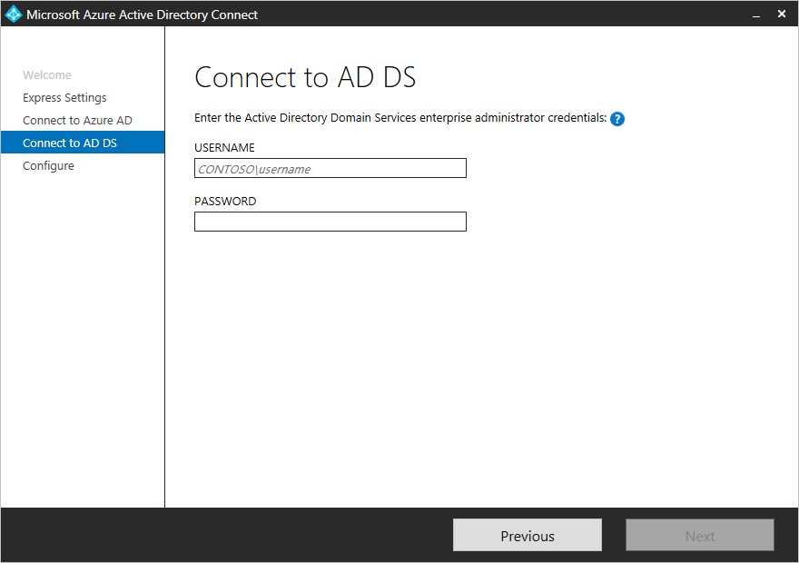

<properties
    pageTitle="Azure AD Connect: Introducción con configuración express | Microsoft Azure"
    description="Obtenga información sobre cómo descargar, instalar y ejecutar al Asistente de configuración de Azure AD Connect."
    services="active-directory"
    documentationCenter=""
    authors="andkjell"
    manager="femila"
    editor="curtand"/>

<tags
    ms.service="active-directory"
    ms.workload="identity"
    ms.tgt_pltfrm="na"
    ms.devlang="na"
    ms.topic="get-started-article"
    ms.date="09/13/2016"
    ms.author="billmath"/>

# Introducción a Azure AD Connect usando la configuración de express
Cuando tenga una topología de bosque único y la [sincronización de contraseñas](../active-directory-aadconnectsync-implement-password-synchronization.md) para la autenticación, se utiliza de conexión de Azure AD **Configuración rápida** . **Configuración rápida** es la opción predeterminada y se usa para el escenario más comúnmente implementado. Son solo unos clics breves ausente para extender el directorio local en la nube.

Antes de iniciar la instalación de Azure AD Connect, asegúrese de descargar [Azure AD Connect](http://go.microsoft.com/fwlink/?LinkId=615771) y completar el requisito previo pasos en [Azure AD Connect: Hardware y los requisitos previos](../active-directory-aadconnect-prerequisites.md).

Si configuración express no coincide con la topología, vea la [documentación relacionada](#related-documentation) para otros escenarios.

## Instalación Express de Azure AD Connect
Puede ver estos pasos de acción en la sección de [vídeos](#videos) .

1. Inicie sesión como administrador local en el servidor que desea instalar Azure AD Connect en. Debe hacer esto en el servidor que desea que el servidor de sincronización.
2. Vaya a y haga doble clic en **AzureADConnect.msi**.
3. En la pantalla de bienvenida, active la casilla de acuerdo con los términos de licencia y haga clic en **continuar**.  
4. En la pantalla de configuración Express, haga clic en **configuración de uso de express**.  

5. En conectarse a la pantalla de Azure AD, escriba el nombre de usuario y contraseña de administrador global para su Azure AD. Haga clic en **siguiente**.  
 si recibe un error y tiene problemas con la conectividad, consulte [solucionar problemas de conectividad](../active-directory-aadconnect-troubleshoot-connectivity.md).
6. En conectarse a la pantalla de AD DS, escriba el nombre de usuario y la contraseña para una cuenta de administrador de empresa. Puede especificar la parte del dominio en el formato de NetBios o FQDN, es decir, FABRIKAM\administrator o fabrikam.com\administrator. Haga clic en **siguiente**.  

7. La página [**configuración de inicio de sesión de Azure AD**](../active-directory-aadconnect-user-signin.md#azure-ad-sign-in-configuration) solo se muestra si no se ha completado [comprobar sus dominios](../active-directory-add-domain.md) en los [requisitos previos](../active-directory-aadconnect-prerequisites.md).
  
Si ve esta página, revise cada dominio marcado **No agrega** y **No verificado**. Asegúrese de que se haya verificado esos dominios que usar en Azure AD. Cuando haya comprobado sus dominios, haga clic en el símbolo de actualización.
8. Listo para configurar la pantalla, haga clic en **instalar**.
    - Opcionalmente, en listo para configurar página, puede anular la selección de la casilla de verificación **iniciar el proceso de sincronización tan pronto como finaliza la configuración** . Debe anular la selección de esta casilla si desea realizar una configuración adicional, como el [filtrado](../active-directory-aadconnectsync-configure-filtering.md). Si anula la selección de esta opción, el asistente configura la sincronización pero deja al programador deshabilitado. No se ejecuta hasta que la habilite manualmente volviendo a ejecutar [el Asistente para instalación](../active-directory-aadconnectsync-installation-wizard.md).
    - Si tiene Exchange en Active Directory local, también tiene una opción para habilitar la [**implementación híbrida de Exchange**](https://technet.microsoft.com/library/jj200581.aspx). Habilite esta opción si desea tener buzones de Exchange en la nube y local al mismo tiempo.

9. Cuando finalice la instalación, haga clic en **Salir**.
10. Cuando haya finalizado la instalación, firmar y volver a iniciar sesión antes de utilizar el administrador del servicio de sincronización o Editor de reglas de sincronización.

## Vídeos

Para ver un vídeo sobre el uso de la instalación rápida, vea:

>[AZURE.VIDEO azure-active-directory-connect-express-settings]

## Pasos siguientes
Ahora que ya tiene instalado de Azure AD Connect puede [comprobar la instalación y asignar licencias](../active-directory-aadconnect-whats-next.md).

Obtenga más información sobre estas funciones, que se han habilitado con la instalación: [actualización automática](../active-directory-aadconnect-feature-automatic-upgrade.md), [accidental evitar eliminaciones](../active-directory-aadconnectsync-feature-prevent-accidental-deletes.md)y [Estado de conexión de Azure AD](../active-directory-aadconnect-health-sync.md).

Obtenga más información sobre estos temas comunes: [programador y cómo desencadenar una sincronización](../active-directory-aadconnectsync-feature-scheduler.md).

Más información acerca de cómo [integrar las identidades locales con Azure Active Directory](../active-directory-aadconnect.md).

## Documentación relacionada

Tema |  
--------- | ---------
Introducción a Azure AD Connect | [Integrar las identidades locales con Azure Active Directory](../active-directory-aadconnect.md)
Instalar usando ajustes personalizados | [Instalación personalizada de Azure AD Connect](active-directory-aadconnect-get-started-custom.md)
Actualización de sincronización de directorios | [Actualizar desde la herramienta de sincronización de Azure AD (DirSync)](active-directory-aadconnect-dirsync-upgrade-get-started.md)
Cuentas utilizadas para la instalación | [Más información sobre permisos y cuentas de Azure AD Connect](active-directory-aadconnect-accounts-permissions.md)
