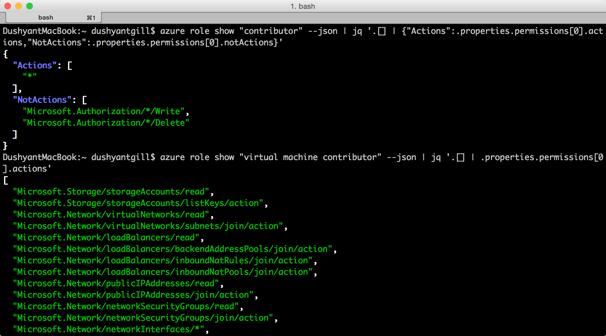
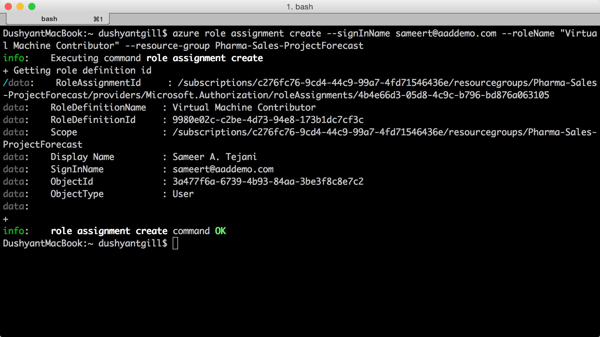
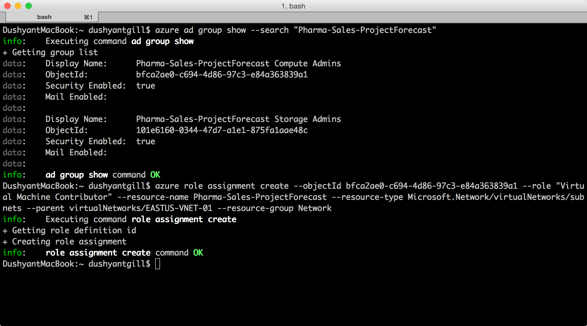

<properties
    pageTitle="Administrar el Control de acceso basado en roles (RBAC) con CLI Azure | Microsoft Azure"
    description="Obtenga información sobre cómo administrar función Control de acceso (RBAC) con la interfaz de línea de comandos de Azure con una lista de funciones y acciones de la función y mediante la asignación de roles a los ámbitos de aplicación y de suscripción."
    services="active-directory"
    documentationCenter=""
    authors="kgremban"
    manager="femila"
    editor=""/>

<tags
    ms.service="active-directory"
    ms.devlang="na"
    ms.topic="article"
    ms.tgt_pltfrm="na"
    ms.workload="identity"
    ms.date="07/22/2016"
    ms.author="kgremban"/>

# <a name="manage-role-based-access-control-with-the-azure-command-line-interface"></a>Administrar el Control de acceso basado en roles con la interfaz de línea de comandos de Azure

> [AZURE.SELECTOR]
- [PowerShell](role-based-access-control-manage-access-powershell.md)
- [CLI de Azure](role-based-access-control-manage-access-azure-cli.md)
- [API DE REST](role-based-access-control-manage-access-rest.md)

Puede usar el Control de acceso basado en roles (RBAC) en el portal de Azure y Azure API de administrador de recursos para administrar el acceso a su suscripción y recursos en un nivel específico. Con esta característica, puede conceder acceso a usuarios, grupos o identidades de servicio de Active Directory asignándoles algunas de las funciones en un ámbito particular.

Para poder usar la interfaz de línea de comandos de Azure (CLI) para administrar RBAC, debe tener el siguiente:

- Azure CLI versión 0.8.8 o posterior. Para instalar la última versión y asociar con su suscripción de Azure, vea [instalar y configurar la CLI de Azure](../xplat-cli-install.md).
- Administrador de recursos de Azure en Azure CLI. Vaya al [uso de la CLI de Azure con el Administrador de recursos](../xplat-cli-azure-resource-manager.md) para obtener más detalles.

## <a name="list-roles"></a>Lista de funciones

### <a name="list-all-available-roles"></a>Todas las funciones disponibles de la lista
Para obtener una lista de todas las funciones disponibles, use:

        azure role list

En el ejemplo siguiente se muestra la lista de *todas las funciones disponibles*.

```
azure role list --json | jq '.[] | {"roleName":.properties.roleName, "description":.properties.description}'
```


### <a name="list-actions-of-a-role"></a>Acciones de lista de una función
Para mostrar las acciones de una función, utilice:

    azure role show "<role name>"

En el ejemplo siguiente se muestra las acciones de los roles de *Colaborador* y *Colaborador de máquina Virtual* .

```
azure role show "contributor" --json | jq '.[] | {"Actions":.properties.permissions[0].actions,"NotActions":properties.permissions[0].notActions}'

azure role show "virtual machine contributor" --json | jq '.[] | .properties.permissions[0].actions'
```



##  <a name="list-access"></a>Acceso a la lista
### <a name="list-role-assignments-effective-on-a-resource-group"></a>Asignaciones de roles de lista eficaces en un grupo de recursos
Para mostrar las asignaciones de roles que existen en un grupo de recursos, utilice:

    azure role assignment list --resource-group <resource group name>

En el ejemplo siguiente se muestra la asignación de rol en el grupo *projecforcast de ventas de pharma* .

```
azure role assignment list --resource-group pharma-sales-projecforcast --json | jq '.[] | {"DisplayName":.properties.aADObject.displayName,"RoleDefinitionName":.properties.roleName,"Scope":.properties.scope}'
```


### <a name="list-role-assignments-for-a-user"></a>Lista de las asignaciones de roles de un usuario
Para mostrar las asignaciones de roles para un usuario específico y las asignaciones que están asignadas a grupos de un usuario, use:

    azure role assignment list --signInName <user email>

También puede ver las asignaciones de roles que se heredan de grupos modificando el comando:

    azure role assignment list --expandPrincipalGroups --signInName <user email>

En el ejemplo siguiente se muestra las asignaciones de roles que se conceden a los *sameert@aaddemo.com* usuario. Esto incluye funciones que están asignadas directamente al usuario y funciones que se heredan de grupos.

```
azure role assignment list --signInName sameert@aaddemo.com --json | jq '.[] | {"DisplayName":.properties.aADObject.DisplayName,"RoleDefinitionName":.properties.roleName,"Scope":.properties.scope}'

azure role assignment list --expandPrincipalGroups --signInName sameert@aaddemo.com --json | jq '.[] | {"DisplayName":.properties.aADObject.DisplayName,"RoleDefinitionName":.properties.roleName,"Scope":.properties.scope}'
```


##  <a name="grant-access"></a>Conceder acceso
Para conceder acceso una vez haya identificado la función que desea asignar, use:

    azure role assignment create

### <a name="assign-a-role-to-group-at-the-subscription-scope"></a>Asignar un rol a grupo en el ámbito de la suscripción
Para asignar un rol a un grupo en el ámbito de la suscripción, use:

    azure role assignment create --objectId  <group object id> --roleName <name of role> --subscription <subscription> --scope <subscription/subscription id>

En el ejemplo siguiente se asigna la función de *lector* al *grupo de Christine Koch* en el ámbito de la *suscripción* .


### <a name="assign-a-role-to-an-application-at-the-subscription-scope"></a>Asignar un rol a una aplicación en el ámbito de la suscripción
Para asignar un rol a una aplicación en el ámbito de la suscripción, use:

    azure role assignment create --objectId  <applications object id> --roleName <name of role> --subscription <subscription> --scope <subscription/subscription id>

En el ejemplo siguiente se concede el rol de *Colaborador* para una aplicación de *Azure AD* en la suscripción seleccionada.

 

### <a name="assign-a-role-to-a-user-at-the-resource-group-scope"></a>Asignar un rol a un usuario en el ámbito de grupo de recursos
Para asignar un rol a un usuario en el ámbito de grupo de recursos, use:

    azure role assignment create --signInName  <user email address> --roleName "<name of role>" --resourceGroup <resource group name>

En el ejemplo siguiente se concede el rol de *Colaborador de máquina Virtual* para *samert@aaddemo.com* usuario en el ámbito de grupo de recursos de *ProjectForcast de ventas de Pharma* .



### <a name="assign-a-role-to-a-group-at-the-resource-scope"></a>Asignar un rol a un grupo en el ámbito de recursos
Para asignar un rol a un grupo en el ámbito de recursos, use:

    azure role assignment create --objectId <group id> --role "<name of role>" --resource-name <resource group name> --resource-type <resource group type> --parent <resource group parent> --resource-group <resource group>

En el ejemplo siguiente se concede el rol de *Colaborador de máquina Virtual* a un grupo de *Azure AD* en una *subred*.



##  <a name="remove-access"></a>Quitar el acceso
Para quitar una asignación de roles, use:

    azure role assignment delete --objectId <object id to from which to remove role> --roleName "<role name>"

En el ejemplo siguiente se quita la asignación de roles de *Máquina Virtual colaborador* desde el *sammert@aaddemo.com* usuario en el grupo de recursos de *ProjectForcast de ventas de Pharma* .
El ejemplo a continuación, quita la asignación de roles de un grupo en la suscripción.


## <a name="create-a-custom-role"></a>Crear una función personalizada
Para crear una función personalizada, use:

    azure role create --inputfile <file path>

En el ejemplo siguiente se crea una función personalizada denominada *Operador de máquina Virtual*. La función personalizada concede acceso a todas las operaciones de lectura de los proveedores de recursos *Microsoft.Compute*, *Microsoft.Storage*y *Microsoft.Network* y acceso para comenzar, reinicie y supervisar máquinas virtuales de Windows. La función personalizada puede usarse en dos suscripciones. Este ejemplo usa un archivo JSON como entrada.


## <a name="modify-a-custom-role"></a>Modificar una función personalizada

Para modificar una función personalizada, use la `azure role show` comando recuperar la definición de la función. En segundo término, realice los cambios que desee para el archivo de definición de rol. Por último, utilice `azure role set` para guardar la definición de una función modificada.

    azure role set --inputfile <file path>

En el ejemplo siguiente se agrega la operación *Microsoft.Insights/diagnosticSettings/* a las **acciones**y a continuación, una suscripción de Azure a la **AssignableScopes** de la función personalizada del operador de máquina Virtual.


## <a name="delete-a-custom-role"></a>Eliminar una función personalizada

Para eliminar una función personalizada, use la `azure role show` comando para determinar el **identificador** de la función. A continuación, utilice la `azure role delete` comando para eliminar la función especificando el **ID**.

En el ejemplo siguiente se quita la función de *Operador de máquina Virtual* personalizada.


## <a name="list-custom-roles"></a>Lista de funciones personalizado

Para mostrar los roles que están disponibles para la asignación en un ámbito, utilice la `azure role list` comando.

En el ejemplo siguiente se enumeran todas las funciones que están disponibles para la asignación en la suscripción seleccionada.

```
azure role list --json | jq '.[] | {"name":.properties.roleName, type:.properties.type}'
```


En el ejemplo siguiente, la función personalizada del *Operador de máquina Virtual* no está disponible en la suscripción *Production4* porque la suscripción no está en la **AssignableScopes** de la función.

```
azure role list --json | jq '.[] | if .properties.type == "CustomRole" then .properties.roleName else empty end'
```


## <a name="rbac-topics"></a>Temas RBAC
[AZURE.INCLUDE [role-based-access-control-toc.md](../../includes/role-based-access-control-toc.md)]
