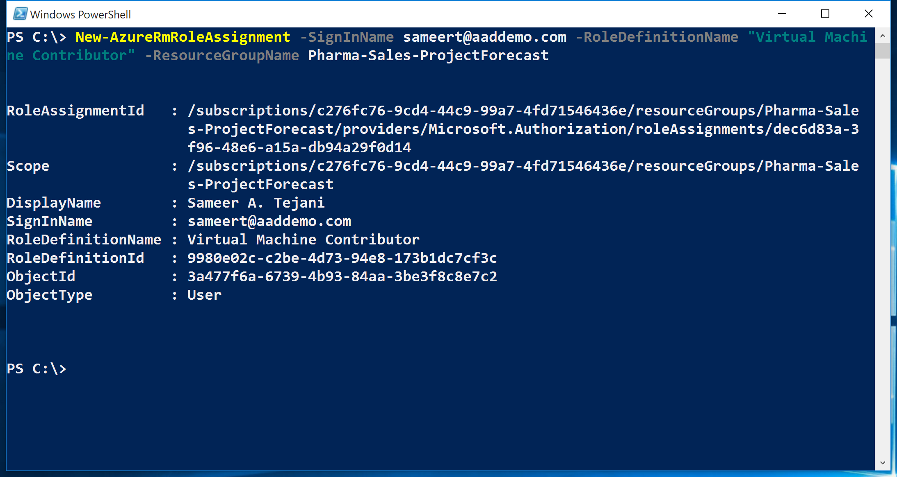
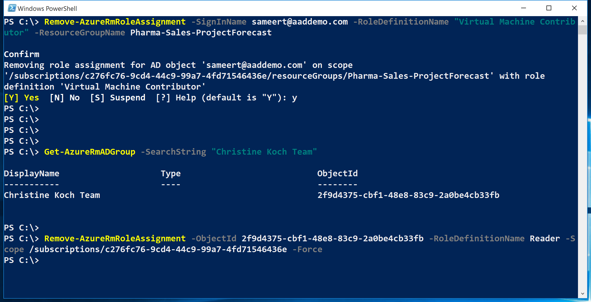

<properties
    pageTitle="Administrar el Control de acceso basado en roles (RBAC) con PowerShell Azure | Microsoft Azure"
    description="Cómo administrar RBAC con PowerShell de Azure, incluidos listado roles, asignar roles y eliminar las asignaciones de roles."
    services="active-directory"
    documentationCenter=""
    authors="kgremban"
    manager="femila"
    editor=""/>

<tags
    ms.service="active-directory"
    ms.devlang="na"
    ms.topic="article"
    ms.tgt_pltfrm="na"
    ms.workload="identity"
    ms.date="07/22/2016"
    ms.author="kgremban"/>

# <a name="manage-role-based-access-control-with-azure-powershell"></a>Administrar el Control de acceso basado en roles con PowerShell Azure

> [AZURE.SELECTOR]
- [PowerShell](role-based-access-control-manage-access-powershell.md)
- [CLI de Azure](role-based-access-control-manage-access-azure-cli.md)
- [API DE REST](role-based-access-control-manage-access-rest.md)


Puede usar el Control de acceso basado en roles (RBAC) en el portal de Azure y Azure API de administración de recursos para administrar el acceso a la suscripción a un nivel específico. Con esta característica, puede conceder acceso a usuarios, grupos o identidades de servicio de Active Directory asignándoles algunas de las funciones en un ámbito particular.

Para poder usar PowerShell para administrar RBAC, debe tener el siguiente:

- Azure PowerShell versión 0.8.8 o posterior. Para instalar la última versión y asociar con su suscripción de Azure, consulte [cómo instalar y configurar Azure PowerShell](../powershell-install-configure.md).

- Cmdlets de Azure Administrador de recursos. Instalar el [Administrador de recursos de Azure cmdlets](https://msdn.microsoft.com/library/mt125356.aspx) de PowerShell.

## <a name="list-roles"></a>Lista de funciones

### <a name="list-all-available-roles"></a>Todas las funciones disponibles de la lista
Funciones de RBAC de lista que están disponibles para la asignación que inspeccionar las operaciones que conceda acceso, uso y `Get-AzureRmRoleDefinition`.

```
Get-AzureRmRoleDefinition | FT Name, Description
```


### <a name="list-actions-of-a-role"></a>Acciones de lista de una función
Para mostrar las acciones para un rol específico, utilice `Get-AzureRmRoleDefinition <role name>`.

```
Get-AzureRmRoleDefinition Contributor | FL Actions, NotActions

(Get-AzureRmRoleDefinition "Virtual Machine Contributor").Actions
```


## <a name="see-who-has-access"></a>Ver quién tiene acceso
Para mostrar las asignaciones de access RBAC, use `Get-AzureRmRoleAssignment`.

### <a name="list-role-assignments-at-a-specific-scope"></a>Lista de las asignaciones de roles en un ámbito específico
Puede ver todas las asignaciones de acceso para una suscripción especificada, un grupo de recursos o un recurso. Por ejemplo, para ver todas las asignaciones activas de un grupo de recursos, use `Get-AzureRmRoleAssignment -ResourceGroupName <resource group name>`.

```
Get-AzureRmRoleAssignment -ResourceGroupName Pharma-Sales-ProjectForcast | FL DisplayName, RoleDefinitionName, Scope
```


### <a name="list-roles-assigned-to-a-user"></a>Funciones de la lista asignadas a un usuario
Para mostrar todos los roles asignados a un usuario especificado y los roles asignados a los grupos a los que pertenece el usuario, utilice `Get-AzureRmRoleAssignment -SignInName <User email> -ExpandPrincipalGroups`.

```
Get-AzureRmRoleAssignment -SignInName sameert@aaddemo.com | FL DisplayName, RoleDefinitionName, Scope

Get-AzureRmRoleAssignment -SignInName sameert@aaddemo.com -ExpandPrincipalGroups | FL DisplayName, RoleDefinitionName, Scope
```


### <a name="list-classic-service-administrator-and-coadmin-role-assignments"></a>Asignaciones de roles de administrador y coadmin servicio clásico de lista
Asignaciones de acceso de lista para el Administrador de suscripciones clásica y coadministrators, use:

    Get-AzureRmRoleAssignment -IncludeClassicAdministrators

## <a name="grant-access"></a>Conceder acceso
### <a name="search-for-object-ids"></a>Búsqueda de identificadores de objeto
Para asignar un rol, debe identificar el objeto (usuario, grupo o aplicación) y el ámbito.

Si no conoce el identificador de la suscripción, puede encontrar en el módulo de **suscripciones** en el portal de Azure. Para obtener información sobre cómo crear una consulta con el identificador de la suscripción, vea [Get-AzureSubscription](https://msdn.microsoft.com/library/dn495302.aspx) en MSDN.

Para obtener el identificador de objeto para un grupo de Azure AD, use:

    Get-AzureRmADGroup -SearchString <group name in quotes>

Para obtener el identificador de objeto para una aplicación o servicio principal de Azure AD, use:

    Get-AzureRmADServicePrincipal -SearchString <service name in quotes>

### <a name="assign-a-role-to-an-application-at-the-subscription-scope"></a>Asignar un rol a una aplicación en el ámbito de la suscripción
Para conceder acceso a una aplicación en el ámbito de la suscripción, use:

    New-AzureRmRoleAssignment -ObjectId <application id> -RoleDefinitionName <role name> -Scope <subscription id>


### <a name="assign-a-role-to-a-user-at-the-resource-group-scope"></a>Asignar un rol a un usuario en el ámbito de grupo de recursos
Para conceder acceso a un usuario en el ámbito de grupo de recursos, use:

    New-AzureRmRoleAssignment -SignInName <email of user> -RoleDefinitionName <role name in quotes> -ResourceGroupName <resource group name>



### <a name="assign-a-role-to-a-group-at-the-resource-scope"></a>Asignar un rol a un grupo en el ámbito de recursos
Para conceder acceso a un grupo en el ámbito de recursos, use:

    New-AzureRmRoleAssignment -ObjectId <object id> -RoleDefinitionName <role name in quotes> -ResourceName <resource name> -ResourceType <resource type> -ParentResource <parent resource> -ResourceGroupName <resource group name>


## <a name="remove-access"></a>Quitar el acceso
Para quitar el acceso de usuarios, grupos y aplicaciones, use:

    Remove-AzureRmRoleAssignment -ObjectId <object id> -RoleDefinitionName <role name> -Scope <scope such as subscription id>



## <a name="create-a-custom-role"></a>Crear una función personalizada
Para crear una función personalizada, use la `New-AzureRmRoleDefinition` comando.

Cuando se crea una función personalizada con PowerShell, debe empezar con una de las [funciones integradas](role-based-access-built-in-roles.md). Editar los atributos para agregar *acciones*, *notActions*o *ámbitos* que desee y, a continuación, guarde los cambios como una nueva función.

En el ejemplo siguiente se inicia con el rol de *Colaborador de máquina Virtual* y se utiliza para crear una función personalizada denominada *Operador de máquina Virtual*. La nueva función concede acceso a todas las operaciones de lectura de los proveedores de recursos *Microsoft.Compute*, *Microsoft.Storage*y *Microsoft.Network* y acceso para comenzar, reinicie y supervisar máquinas virtuales de Windows. La función personalizada puede usarse en dos suscripciones.

```
$role = Get-AzureRmRoleDefinition "Virtual Machine Contributor"
$role.Id = $null
$role.Name = "Virtual Machine Operator"
$role.Description = "Can monitor and restart virtual machines."
$role.Actions.Clear()
$role.Actions.Add("Microsoft.Storage/*/read")
$role.Actions.Add("Microsoft.Network/*/read")
$role.Actions.Add("Microsoft.Compute/*/read")
$role.Actions.Add("Microsoft.Compute/virtualMachines/start/action")
$role.Actions.Add("Microsoft.Compute/virtualMachines/restart/action")
$role.Actions.Add("Microsoft.Authorization/*/read")
$role.Actions.Add("Microsoft.Resources/subscriptions/resourceGroups/read")
$role.Actions.Add("Microsoft.Insights/alertRules/*")
$role.Actions.Add("Microsoft.Support/*")
$role.AssignableScopes.Clear()
$role.AssignableScopes.Add("/subscriptions/c276fc76-9cd4-44c9-99a7-4fd71546436e")
$role.AssignableScopes.Add("/subscriptions/e91d47c4-76f3-4271-a796-21b4ecfe3624")
New-AzureRmRoleDefinition -Role $role
```


## <a name="modify-a-custom-role"></a>Modificar una función personalizada
Para modificar una función personalizada, en primer lugar, use la `Get-AzureRmRoleDefinition` comando para recuperar la definición de función. En segundo término, realice los cambios deseados a la definición de función. Por último, utilice la `Set-AzureRmRoleDefinition` comando para guardar la definición de una función modificada.

En el ejemplo siguiente se agrega la `Microsoft.Insights/diagnosticSettings/*` operación al rol personalizado *Máquina Virtual operador* .

```
$role = Get-AzureRmRoleDefinition "Virtual Machine Operator"
$role.Actions.Add("Microsoft.Insights/diagnosticSettings/*")
Set-AzureRmRoleDefinition -Role $role
```


En el ejemplo siguiente se agrega una suscripción de Azure a los ámbitos de la función personalizada del *Operador de máquina Virtual* puede asignables.

```
Get-AzureRmSubscription - SubscriptionName Production3

$role = Get-AzureRmRoleDefinition "Virtual Machine Operator"
$role.AssignableScopes.Add("/subscriptions/34370e90-ac4a-4bf9-821f-85eeedead1a2"
Set-AzureRmRoleDefinition -Role $role)
```


## <a name="delete-a-custom-role"></a>Eliminar una función personalizada

Para eliminar una función personalizada, use la `Remove-AzureRmRoleDefinition` comando.

En el ejemplo siguiente se quita la función de *Operador de máquina Virtual* personalizada.

```
Get-AzureRmRoleDefinition "Virtual Machine Operator"

Get-AzureRmRoleDefinition "Virtual Machine Operator" | Remove-AzureRmRoleDefinition
```


## <a name="list-custom-roles"></a>Lista de funciones personalizado
Para mostrar los roles que están disponibles para la asignación en un ámbito, utilice la `Get-AzureRmRoleDefinition` comando.

En el ejemplo siguiente se enumeran todas las funciones que están disponibles para la asignación en la suscripción seleccionada.

```
Get-AzureRmRoleDefinition | FT Name, IsCustom
```


En el ejemplo siguiente, la función personalizada del *Operador de máquina Virtual* no está disponible en la suscripción *Production4* porque la suscripción no está en la **AssignableScopes** de la función.


## <a name="see-also"></a>Vea también
- [Usar PowerShell Azure con el Administrador de recursos Azure](../powershell-azure-resource-manager.md)
[AZURE.INCLUDE [role-based-access-control-toc.md](../../includes/role-based-access-control-toc.md)]
