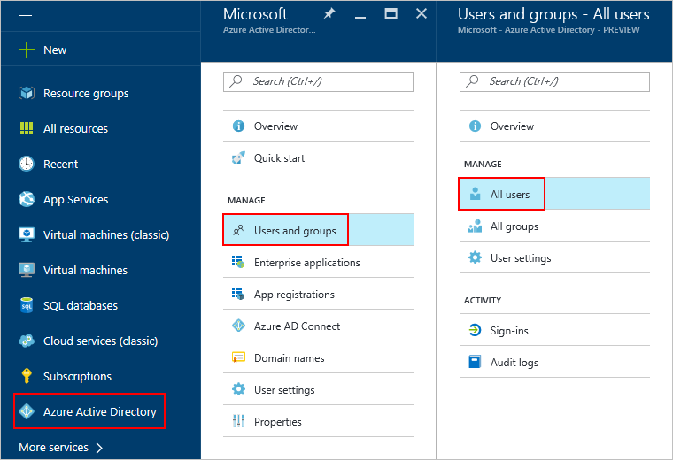
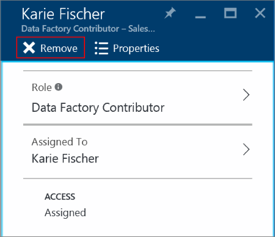

<properties
    pageTitle="Ver las asignaciones de recursos de Azure access | Microsoft Azure"
    description="Ver y administrar todas las asignaciones de Control de acceso basado en roles para cualquier usuario o grupo en el portal de Azure"
    services="active-directory"
    documentationCenter=""
    authors="kgremban"
    manager="femila"
    editor="jeffsta"/>

<tags
    ms.service="active-directory"
    ms.devlang="na"
    ms.topic="article"
    ms.tgt_pltfrm="na"
    ms.workload="identity"
    ms.date="10/10/2016"
    ms.author="kgremban"/>

# Ver las asignaciones de acceso de los usuarios y grupos en el portal de Azure - Public preview

> [AZURE.SELECTOR]
- [Administrar el acceso de usuario o grupo](role-based-access-control-manage-assignments.md)
- [Administrar el acceso por recurso](role-based-access-control-configure.md)

Con basado en roles Access Control (RBAC) en la vista previa de Azure Active Directory, puede administrar el acceso a los recursos de Azure. [¿Qué es la vista previa?](active-directory-preview-explainer.md)

Acceso asignado con RBAC es poseen porque puede restringir los permisos de dos formas:

- **Ámbito:** Ámbito de las asignaciones de roles RBAC están una suscripción específica, un grupo de recursos o un recurso. Un usuario concedido acceso a un recurso no puede acceder a los otros recursos en la misma suscripción.
- **Rol:** En el ámbito de la asignación, se estrecha acceso aún más por asignar un rol. Funciones pueden ser alto nivel, como propietario o específico, como el lector de máquina virtual.

Funciones solo pueden asignarse dentro de la suscripción, el grupo de recursos o el recurso que se encuentra el ámbito de la asignación. Pero puede ver todas las asignaciones de acceso para un usuario o grupo en un único lugar.

Obtenga más información acerca de cómo [las asignaciones de roles de uso para administrar el acceso a los recursos de suscripción de Azure](role-based-access-control-configure.md).

##  Ver las asignaciones de access

Para buscar las asignaciones de acceso para un único usuario o grupo, empiece en Azure Active Directory en el [portal de Azure](http://portal.azure.com).

1. Seleccione **Azure Active Directory**. Si esta opción no está visible en la lista de navegación, seleccione **Más servicios** y, a continuación, desplácese hacia abajo hasta **Azure Active Directory**.
2. Seleccione **usuarios y grupos**y, a continuación, **todos los usuarios** o **todos los grupos**. En este ejemplo, centrarse en los usuarios individuales.
    
3. Busque el usuario por nombre o el nombre de usuario.
4. Seleccione **recursos de Azure** en el módulo de usuario. Aparecen todas las asignaciones de acceso para ese usuario.

### Permisos de lectura para ver las asignaciones

Esta página solo muestra las asignaciones de access que tiene permiso de lectura. Por ejemplo, que tiene acceso de lectura a la suscripción A y vaya a la hoja de recursos Azure a comprobar las asignaciones de un usuario. Puede ver sus asignaciones de acceso de suscripción A, pero no verá también tiene acceso a las asignaciones de suscripción B.

## Eliminar las asignaciones de access

En este módulo, puede eliminar las asignaciones de access que se asignaron directamente a un usuario o grupo. Si la asignación de acceso se heredan de un grupo primario, debe ir a la suscripción o recursos y administrar la asignación allí.

1. En la lista de todas las asignaciones de acceso para un usuario o grupo, seleccione el que desea eliminar.
2. Seleccione **Quitar** y luego **Sí** para confirmar.
    

## Temas relacionados

- Introducción a Control de acceso basado en roles a [las asignaciones de roles de uso para administrar el acceso a los recursos de suscripción de Azure](role-based-access-control-configure.md)
- Vea las [funciones integradas de RBAC](role-based-access-built-in-roles.md)
