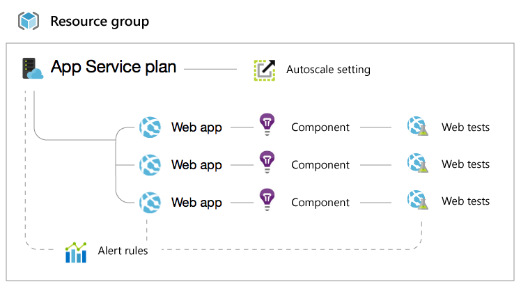

<properties
    pageTitle="Basado en roles en la solución de problemas de control de acceso | Microsoft Azure"
    description="Obtener ayuda con problemas o preguntas acerca de los recursos de Control de acceso en función de funciones."
    services="azure-portal"
    documentationCenter="na"
    authors="kgremban"
    manager="femila"
    editor=""/>

<tags
    ms.service="active-directory"
    ms.workload="identity"
    ms.tgt_pltfrm="na"
    ms.devlang="na"
    ms.topic="article"
    ms.date="07/12/2016"
    ms.author="kgremban"/>

# Solucionar de Control de acceso basado en roles

## Introducción

[Control de acceso basado en roles](role-based-access-control-configure.md) es una característica eficaz que le permite delegar acceso específico a los recursos de Azure. Esto significa que puede estar seguro de conceder el derecho a usar exactamente lo que necesitan de una persona determinada y no más. Sin embargo, a veces el modelo de recursos para los recursos de Azure puede ser complicado y puede ser difícil de comprender exactamente lo que concede permisos a.

Este documento le permitirá saberlo que pasará al usar algunas de las funciones en el portal de Azure. Estas tres funciones cubren todos los tipos de recursos:

- Propietario  
- Colaborador  
- Lector  

Propietarios y colaboradores tengan acceso completo a la experiencia de administración, pero no puede conceder acceso a un colaborador a otros usuarios o grupos. Puede ser un poco más interesante con la función Lector, por lo es donde se le pase algún tiempo. Vea el [artículo de introducción para obtener el Control de acceso basado en roles](role-based-access-control-configure.md) para obtener más información sobre cómo conceder acceso.

## Cargas de trabajo del servicio de aplicación

### Capacidades de acceso de escritura

Si se concede un acceso de solo lectura del usuario a una aplicación web única, se deshabilitan algunas características que no cabría esperar. Las siguientes capacidades de administración requieren acceso de **escritura** para una aplicación web (colaborador o propietario) y no estarán disponibles en cualquier escenario de solo lectura.

- Comandos (por ejemplo, iniciar, detener, etcetera)
- Cambiar la configuración como configuración general, configuración de escala, configuración de copia de seguridad y configuración de supervisión
- Obtener acceso a las credenciales de publicación y otra información confidencial como cadenas de conexión y la configuración de la aplicación
- Transmisión de registros
- Configuración de registros de diagnóstico
- Consola (símbolo del sistema)
- Implementaciones recientes y activas (para la implementación continuo git local)
- Estimado dedica
- Pruebas Web
- Red virtual (sólo visible para un lector si previamente se ha configurado una red virtual por un usuario con acceso de escritura).

Si no puede acceder a cualquiera de estos iconos, debe solicitar al administrador acceso como colaboradores a la aplicación web.

### Trabajar con recursos relacionados

Aplicaciones Web son complicadas por la presencia de algunos recursos diferentes que interacción. Aquí es un grupo de recursos típico con sitios Web un par:

Como resultado, si alguien conceder acceso a solo la aplicación web, muchas de las funciones en el módulo en el sitio Web en el portal de Azure se desactivará.

Estos elementos requieren acceso de **escritura** para el **plan de servicios de aplicación** que corresponde a su sitio Web:  

- Visualización de la aplicación web de precios del nivel (libre o estándar)  
- Configuración de escala (número de instancias, el tamaño de la máquina virtual, la configuración de Autoescala)  
- Cuotas (almacenamiento, ancho de banda de la CPU)  

Estos elementos requieren acceso de **escritura** a todo el **grupo de recursos** que contiene su sitio Web:  

- Certificados SSL y enlaces (es porque certificados SSL pueden compartirse entre sitios en el mismo grupo de recursos y ubicación geográfica)  
- Reglas de alertas  
- Configuración de Autoescala  
- Componentes de perspectivas de aplicación  
- Pruebas Web  

## Cargas de trabajo de máquina virtual

Mucho como con aplicaciones web, algunas características en el módulo de máquina virtual requieren acceso de escritura a la máquina virtual o a otros recursos en el grupo de recursos.

Máquinas virtuales están relacionadas con nombres de dominio, redes virtuales, cuentas de almacenamiento y las reglas de alertas.

Estos elementos requieren acceso de **escritura** para la **Máquina Virtual**:

- Extremos  
- Direcciones IP  
- Discos  
- Extensiones  

Se requiere acceso de **escritura** para la **Máquina Virtual**tanto el **grupo de recursos** (junto con el nombre de dominio) que se encuentra en:  

- Conjunto de disponibilidad  
- Cargar conjunto equilibrada  
- Reglas de alertas  

Si no puede acceder a cualquiera de estos iconos, debe solicitar al administrador acceso de colaborador para el grupo de recursos.

## Ver más
- [Control de acceso en función de roles](role-based-access-control-configure.md): Introducción a RBAC en el portal de Azure.
- [Funciones integradas](role-based-access-built-in-roles.md): obtener detalles acerca de las funciones que vienen en RBAC.
- [Funciones personalizadas en Azure RBAC](role-based-access-control-custom-roles.md): Obtenga información sobre cómo crear funciones personalizadas a sus necesidades de acceso.
- [Crear un acceso cambiar informe histórico](role-based-access-control-access-change-history-report.md): realizar un seguimiento de cambiar las asignaciones de roles en RBAC.
