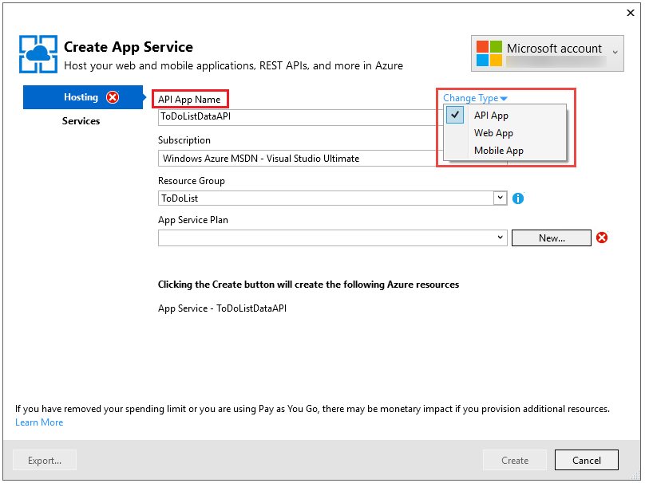
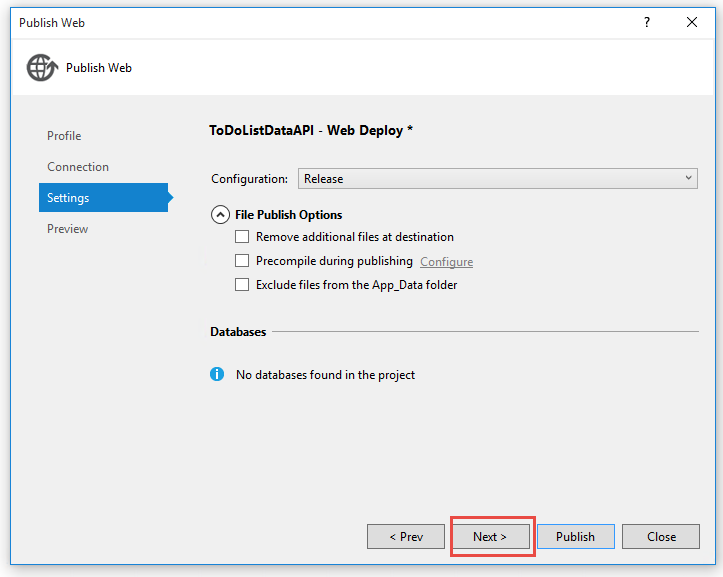
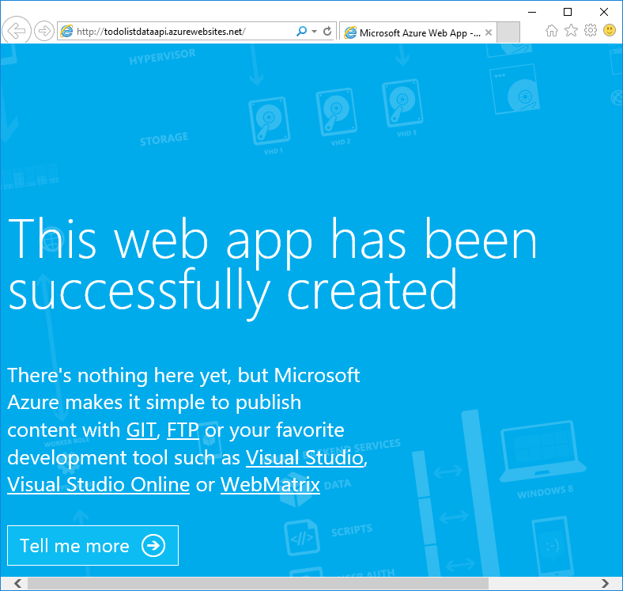
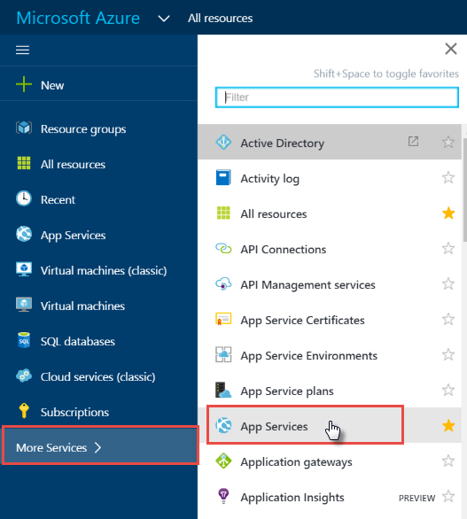
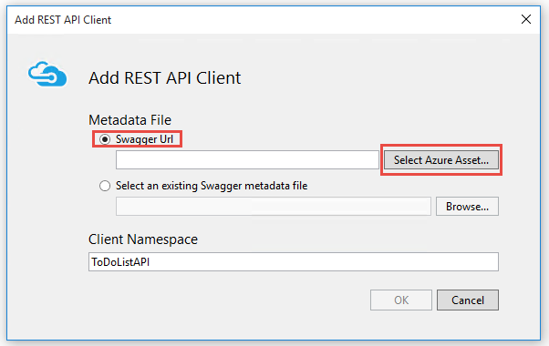
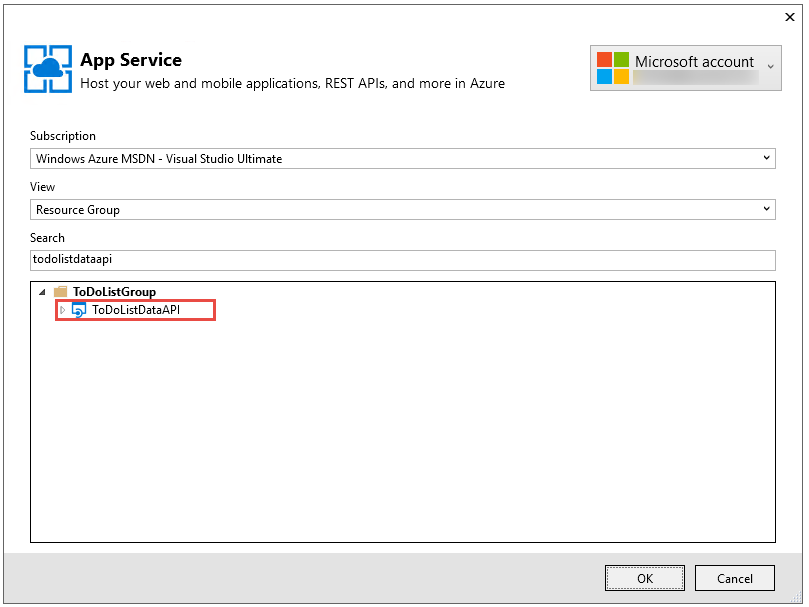
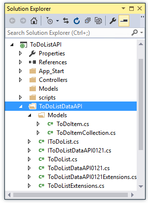

<properties
    pageTitle="Introducción a aplicaciones API y ASP.NET en la aplicación de servicio | Microsoft Azure"
    description="Aprenda a crear, implementar y utilizar una aplicación de ASP.NET API de servicio de la aplicación de Azure, mediante Visual Studio de 2015."
    services="app-service\api"
    documentationCenter=".net"
    authors="tdykstra"
    manager="wpickett"
    editor=""/>

<tags
    ms.service="app-service-api"
    ms.workload="na"
    ms.tgt_pltfrm="dotnet"
    ms.devlang="na"
    ms.topic="hero-article"
    ms.date="09/20/2016"
    ms.author="rachelap"/>

# Introducción a aplicaciones de la API, ASP.NET y Swagger en el servicio de aplicación de Azure

[AZURE.INCLUDE [selector](../../includes/app-service-api-get-started-selector.md)]

Éste es el primero de una serie de tutoriales que muestran cómo usar las características de servicio de la aplicación de Azure que son útiles para el desarrollo y las API de REST de hospedaje.  Este tutorial trata sobre soporte técnico para API de metadatos en formato de Swagger.

Aprenderá:

* Cómo crear e implementar [aplicaciones de la API](app-service-api-apps-why-best-platform.md) de servicio de la aplicación de Azure mediante herramientas integradas en Visual Studio de 2015.
* Cómo automatizar la detección de la API mediante el paquete de Swashbuckle NuGet para generar dinámicamente Swagger API metadatos.
* Cómo usar metadatos Swagger API para generar automáticamente el código de cliente para una aplicación de API.

## Información general sobre la aplicación de ejemplo

En este tutorial, se trabaja con una aplicación de ejemplo de la lista de tareas pendientes sencilla. La aplicación tiene un front-end de aplicación de una sola página (SPA), un nivel intermedio de ASP.NET Web API y un nivel de datos de la API de Web de ASP.NET.

Aquí tiene una captura de pantalla de [AngularJS](https://angularjs.org/) front-end.

La solución de Visual Studio incluye tres proyectos:

* **ToDoListAngular** - front-end: un SPA AngularJS que llama el nivel intermedio.

* **ToDoListAPI** - el nivel intermedio: un proyecto de ASP.NET Web API que llama el nivel de datos para realizar operaciones de CRUD en elementos pendientes.

* **ToDoListDataAPI** - el nivel de datos: un proyecto de ASP.NET Web API que ejecuta las operaciones de CRUD en los elementos de tareas pendientes.

La arquitectura de tres niveles es una de muchas arquitecturas que puede implementar utilizando aplicaciones API y se utiliza aquí solo con fines de demostración. El código de cada nivel es tan sencillo como sea posible mostrar las características de aplicaciones de la API; Por ejemplo, el nivel de datos utiliza memoria del servidor en lugar de una base de datos como mecanismo de persistencia.

En completar este tutorial, tendrá los dos proyectos de Web API hacia arriba y en la nube en las aplicaciones de la API del servicio de aplicación.

El siguiente tutorial de la serie implementa el front-end SPA a la nube.

## Requisitos previos

* API de Web ASP.NET: las instrucciones del tutorial se supone que tiene un conocimiento básico de cómo trabajar con ASP.NET [Web API 2](http://www.asp.net/web-api/overview/getting-started-with-aspnet-web-api/tutorial-your-first-web-api) en Visual Studio.

* Cuenta de Azure, puede [Abrir una cuenta de Azure gratuitamente](/pricing/free-trial/?WT.mc_id=A261C142F) o [Activar Visual Studio ventajas de suscriptor](/pricing/member-offers/msdn-benefits-details/?WT.mc_id=A261C142F).

    Si desea empezar a trabajar con el servicio de aplicación de Azure antes de suscribirse a una cuenta de Azure, vaya a [Probar el servicio de aplicación](http://go.microsoft.com/fwlink/?LinkId=523751). Allí, puede crear inmediatamente una aplicación de corta duración starter en la aplicación de servicio: **necesaria ninguna tarjeta de crédito**y sin compromisos.

* 2015 de Visual Studio con el [SDK de Azure para .NET](https://azure.microsoft.com/downloads/archive-net-downloads/) - el SDK instala 2015 de Visual Studio automáticamente si todavía no tiene.

    * En Visual Studio, haga clic en Ayuda -> acerca de Microsoft Visual Studio y asegúrese de que ha "V2.9.1 herramientas de Azure de aplicación de servicio" o posterior instalado.

    

    >[AZURE.NOTE] Dependiendo de cuántos las dependencias SDK ya tiene en su equipo, instalar el SDK podría tardar mucho tiempo, desde varios minutos a media hora o más.

## Descargar la aplicación de ejemplo

1. Descargue el repositorio [Azure-Samples/app-service-api-dotnet-to-do-list](https://github.com/Azure-Samples/app-service-api-dotnet-todo-list) .

    Puede haga clic en el botón **Descargar ZIP** o clonar el repositorio en el equipo local.

2. Abra la solución ToDoList en Visual Studio de 2015 o 2013.
   1. Debe confiar en cada solución.
        

3. Crear la solución (CTRL + MAYÚS + B) para restaurar los paquetes de NuGet.

    Si desea ver la aplicación en operación antes de implementarlo, puede ejecutar localmente. Asegúrese de que ToDoListDataAPI es el proyecto de inicio y ejecute la solución. Debe esperar a que vea un error 403 de HTTP en el explorador.

## Usar la API Swagger metadatos y la interfaz de usuario

Soporte para [Swagger](http://swagger.io/) 2.0 API metadatos integrado en el servicio de aplicación de Azure. Cada aplicación API puede especificar un punto final de la dirección URL que devuelve los metadatos de la API en formato JSON Swagger. Los metadatos devueltos de ese extremo pueden usarse para generar código de cliente.

Un proyecto de ASP.NET Web API puede generar dinámicamente Swagger metadatos mediante el paquete de NuGet [Swashbuckle](https://www.nuget.org/packages/Swashbuckle) . Ya está instalado el paquete de Swashbuckle NuGet en los proyectos ToDoListDataAPI y ToDoListAPI que ha descargado.

En esta sección del tutorial, mire los metadatos de Swagger 2.0 generado y, después de probar una prueba de la interfaz de usuario que se basa en los metadatos de Swagger.

1. Establecer el proyecto ToDoListDataAPI (**no** el proyecto ToDoListAPI) como el proyecto de inicio.

    

2. Presione F5 o haga clic en **Depurar > Iniciar depuración** para ejecutar el proyecto en modo de depuración.

    El explorador se abre y muestra la página de error de HTTP 403.

3. En la barra de direcciones del explorador, agregue `swagger/docs/v1` hasta el final de la línea y, a continuación, presione RETORNO. (La dirección URL es `http://localhost:45914/swagger/docs/v1`.)

    Esta es la dirección URL predeterminada usada Swashbuckle para devolver los metadatos de Swagger 2.0 JSON para la API.

    Si está usando Internet Explorer, el explorador le pide que descargue un archivo de *v1.json* .

    

    Si usa Chrome, Firefox o borde, el explorador mostrará la JSON en la ventana del explorador. Distintos navegadores controlen JSON diferente, y la ventana del explorador no puede tener un aspecto exactamente como en el ejemplo.

    

    En el ejemplo siguiente se muestra la primera sección de los metadatos de Swagger de la API, con la definición del método Get. Estos metadatos están qué unidades de la interfaz de usuario Swagger que usar en los siguientes pasos y se usa en una sección posterior del tutorial para generar automáticamente el código de cliente.

        {
          "swagger": "2.0",
          "info": {
            "version": "v1",
            "title": "ToDoListDataAPI"
          },
          "host": "localhost:45914",
          "schemes": [ "http" ],
          "paths": {
            "/api/ToDoList": {
              "get": {
                "tags": [ "ToDoList" ],
                "operationId": "ToDoList_GetByOwner",
                "consumes": [ ],
                "produces": [ "application/json", "text/json", "application/xml", "text/xml" ],
                "parameters": [
                  {
                    "name": "owner",
                    "in": "query",
                    "required": true,
                    "type": "string"
                  }
                ],
                "responses": {
                  "200": {
                    "description": "OK",
                    "schema": {
                      "type": "array",
                      "items": { "$ref": "#/definitions/ToDoItem" }
                    }
                  }
                },
                "deprecated": false
              },

4. Cierre el explorador y dejar de depuración de Visual Studio.

5. En el proyecto ToDoListDataAPI en el **Explorador de soluciones**, abrir el archivo *App_Start\SwaggerConfig.cs* y, a continuación, desplácese hacia abajo hasta la línea 174 y quite el código siguiente.

        /*
            })
        .EnableSwaggerUi(c =>
            {
        */

    El archivo *SwaggerConfig.cs* se crea al instalar el paquete de Swashbuckle en un proyecto. El archivo proporciona varias maneras de configurar Swashbuckle.

    El código que ha comentario permite la interfaz de usuario Swagger que usar en los siguientes pasos. Al crear un proyecto de Web API con la plantilla de proyecto de aplicación de API, este código es comentado predeterminada como una medida de seguridad.

6. Vuelva a ejecutar el proyecto.

7. En la barra de direcciones del explorador, agregue `swagger` hasta el final de la línea y, a continuación, presione RETORNO. (La dirección URL es `http://localhost:45914/swagger`.)

8. Cuando aparezca la página de la interfaz de usuario Swagger, haga clic en **ToDoList** para ver los métodos disponibles.

    

9. Haga clic en el botón **obtener** primero en la lista.

10. En la sección **parámetros** , escriba un asterisco como el valor de la `owner` parámetro y, a continuación, haga clic en **Pruébelo**.

    Cuando agregue autenticación en los tutoriales posteriores, el nivel intermedio proporcionará el identificador de usuario real al nivel de datos. Por ahora, todas las tareas tendrá asterisco como su ID de propietario mientras se ejecuta la aplicación sin la autenticación habilitada.

    

    La interfaz de usuario Swagger llamadas ToDoList Get método y muestra el código de respuesta y JSON resultados.

    

11. Haga clic en **Publicar**y, a continuación, haga clic en el cuadro en el **Modelo de esquema**.

    Haga clic en el esquema del modelo prefills el cuadro de entrada donde puede especificar el valor del parámetro para el método de entrada. (Si esto no funciona en Internet Explorer, use un explorador diferente o escriba el valor del parámetro manualmente en el siguiente paso.)  

    

12. Cambiar el JSON en el `todo` parámetro de entrada cuadro forma que parece que el ejemplo siguiente o sustituir su propio texto Descripción:

        {
          "ID": 2,
          "Description": "buy the dog a toy",
          "Owner": "*"
        }

13. Haga clic en **Pruébelo**.

    La API de ToDoList devuelve un código de respuesta de HTTP 204 que indica éxito.

14. Haga clic en el primer botón **obtener** y haga clic en el botón **Pruébelo** en esa sección de la página.

    La respuesta del método Get incluye ahora el elemento de nuevo.

15. Opcional: Pruebe también la colocar, eliminar y obtener métodos de ID.

16. Cierre el explorador y dejar de depuración de Visual Studio.

Swashbuckle funciona con cualquier proyecto ASP.NET Web API. Si desea agregar la generación de metadatos de Swagger a un proyecto existente, solo tiene que instalar el paquete de Swashbuckle.

>[AZURE.NOTE] Metadatos de swagger incluyen un identificador único para cada operación de API. De forma predeterminada, Swashbuckle puede generar operación duplicado Swagger identificadores para los métodos de controlador de Web API. Esto ocurre si el controlador sobrecarga métodos HTTP, como por ejemplo `Get()` y `Get(id)`. Para obtener información sobre cómo controlar sobrecargas, vea [definiciones de API genera Swashbuckle personalizar](app-service-api-dotnet-swashbuckle-customize.md). Si crea un proyecto de Web API en Visual Studio con la plantilla de aplicación de la API de Azure, código que genera identificadores de operación único se agrega automáticamente al archivo *SwaggerConfig.cs* .  

## Crear una aplicación de la API en Azure e implementar código

En esta sección, use las herramientas de Azure que se integren en el Asistente de **Publicación Web** de Visual Studio para crear una nueva aplicación de la API en Azure. A continuación, implemente el proyecto ToDoListDataAPI la nueva aplicación API y llamar a la API mediante la ejecución de la interfaz de usuario Swagger.

1. En el **Explorador de soluciones**, haga clic en el proyecto ToDoListDataAPI y, a continuación, haga clic en **Publicar**.

    

2.  En el paso de **perfil** del Asistente para la **Publicación Web** , haga clic en **Servicio de aplicación de Microsoft Azure**.

    

3. Inicie sesión en su cuenta de Azure si aún no lo ha hecho, o actualice sus credenciales si haya expirado.

4. En el cuadro de diálogo Servicios de aplicación, elija la Azure **suscripción** que desea usar y, a continuación, haga clic en **nuevo**.

    

    Aparece la pestaña **Hosting** del cuadro de diálogo **Crear aplicación de servicio** .

    Porque está implementar un proyecto de Web API que tiene Swashbuckle instalado, Visual Studio asume que desea crear un App API. Esto viene indicado por el título del **Nombre de la aplicación de API** y por el hecho de que la lista desplegable **Tipo de cambio** se establece en **Aplicación de la API**.

    

5. Escriba un **Nombre de aplicación de la API** que sea único en el dominio *azurewebsites.net* . Puede aceptar el nombre predeterminado que Visual Studio propone.

    Si escribe un nombre de otra persona ya ha utilizado, verá un signo de exclamación rojo a la derecha.

    La dirección URL de la aplicación de la API será `{API app name}.azurewebsites.net`.

6. En la lista desplegable **Grupo de recursos** , haga clic en **nuevo**y, a continuación, escriba "ToDoListGroup" u otro nombre si lo prefiere.

    Un grupo de recursos es una colección de Azure recursos como API de aplicaciones, bases de datos, máquinas virtuales y así sucesivamente. En este tutorial, es mejor crear un nuevo grupo de recursos, ya hace que sea fácil eliminar en un paso de todos los recursos de Azure que se crean para el tutorial.

    Este cuadro permite seleccione un [grupo de recursos](../azure-resource-manager/resource-group-overview.md) de existente o cree uno nuevo escribiendo un nombre diferente de cualquier grupo de recursos existente en su suscripción.

7. Haga clic en el botón **nuevo** junto a la lista desplegable **Plan de servicio de aplicación** .

    La captura de pantalla muestra los valores de ejemplo de **Nombre de aplicación de la API de** **suscripción**y de **Grupo de recursos** : los valores serán diferentes.

    

    En los siguientes pasos se crea un plan de servicio de aplicación para el nuevo grupo de recursos. Un plan de servicio de aplicación especifica los recursos de cálculo que se ejecuta la aplicación de la API en. Por ejemplo, si elige el nivel gratuito, la aplicación de la API se ejecuta en VM compartidas, mientras que para algunos niveles de pagadas se ejecuta en máquinas virtuales dedicadas. Para obtener información acerca de los planes de servicio de aplicaciones, vea [información general de los planes de aplicación de servicio](../app-service/azure-web-sites-web-hosting-plans-in-depth-overview.md).

8. En el cuadro de diálogo **Configurar el Plan de servicio de aplicación** , escriba "ToDoListPlan" u otro nombre si lo prefiere.

9. En la lista desplegable de **ubicación** , elija la ubicación más cercana a usted.

    Esta opción especifica qué centro de datos de Azure se ejecuta la aplicación en. Elija una ubicación cerca minimizar [latencia](http://www.bing.com/search?q=web%20latency%20introduction&qs=n&form=QBRE&pq=web%20latency%20introduction&sc=1-24&sp=-1&sk=&cvid=eefff99dfc864d25a75a83740f1e0090).

10. En la lista desplegable **tamaño** , haga clic en **liberar**.

    En este tutorial, el nivel de precio gratuito le proporcionará un rendimiento suficiente.

11. En el cuadro de diálogo **Configurar el Plan de servicio de aplicación** , haga clic en **Aceptar**.

    

12. En el cuadro de diálogo **Crear aplicación de servicio** , haga clic en **crear**.

    

    Visual Studio crea la aplicación de la API y un perfil de publicación que tiene todos los valores necesarios para la aplicación de la API. A continuación, se abre al Asistente de **Publicación Web** , que usará para implementar el proyecto.

    Se abre el Asistente de **Publicación Web** en la pestaña **conexión** (que se muestra a continuación).

    En la pestaña **conexión** , elija la configuración de **servidor** y el **nombre del sitio** la aplicación de la API. El **nombre de usuario** y la **contraseña** son las credenciales de implementación que Azure crea automáticamente. Después de la implementación, Visual Studio abre un explorador a la **Dirección URL de destino** (que es el único propósito de la **Dirección URL de destino**).  

13. Haga clic en **siguiente**.

    

    La pestaña siguiente es la pestaña **configuración** (que se muestra a continuación). Aquí puede cambiar la pestaña de configuración de compilación para implementar una versión de depuración de [depuración remota](../app-service-web/web-sites-dotnet-troubleshoot-visual-studio.md#remotedebug). La ficha también ofrece varias **Opciones de publicación de archivo**:

    * Quitar archivos adicionales en destino
    * Precompilar durante la publicación
    * Excluir archivos de la carpeta App_Data

    En este tutorial no necesita cualquiera de estas acciones. Para obtener más detalles sobre qué hacen, vea [Cómo: implementar un proyecto usando uno y haga clic en publicación Web en Visual Studio](https://msdn.microsoft.com/library/dd465337.aspx).

14. Haga clic en **siguiente**.

    

    A continuación, es la ficha **vista previa** (que se muestra a continuación), que proporciona una oportunidad para ver los archivos que va a copiar de su proyecto a la aplicación de la API. Al implementar un proyecto para una aplicación de API que ha implementado en una versión anterior, se copian sólo los archivos modificados. Para ver una lista de lo que se copiará, haga clic en el botón de **Vista previa de inicio** .

15. Haga clic en **Publicar**.

    

    Visual Studio implementa el proyecto ToDoListDataAPI en la nueva API de aplicación. Implementación correcta de registros de la ventana de **resultados** y una página de "creado correctamente" aparece en una ventana de explorador abierto a la dirección URL de la aplicación de la API.

    

    

16. Agregar "swagger" a la dirección URL en la barra de direcciones del explorador y, a continuación, presione ENTRAR. (La dirección URL es `http://{apiappname}.azurewebsites.net/swagger`.)

    El explorador mostrará la misma Swagger interfaz de usuario se ha visto anteriormente, pero ahora se ejecuta en la nube. Pruebe el método Get y verá que es volver a los elementos de tareas pendientes 2 de forma predeterminada. Los cambios realizados anteriormente se guardaron en memoria en el equipo local.

17. Abra el [portal de Azure](https://portal.azure.com/).

    El portal de Azure es una interfaz de web para la administración de recursos de Azure como aplicaciones de la API.

18. Haga clic en **más servicios > Servicios de aplicación**.

    

19. En el módulo de **Servicios de aplicación** , busque y haga clic en la nueva API de aplicación. (En el portal de Azure ventanas que se abren a la derecha se denominan *módulos*).

    

    Abra dos módulos. Un módulo tiene una descripción general de la aplicación de la API, y tiene una lista larga de configuración que puede ver y cambiar.

20. En el módulo de **configuración** , busque la sección **API** y haga clic en **Definición de la API**.

    

    El módulo de **Definición de la API** le permite especificar la dirección URL que devuelve los metadatos de Swagger 2.0 en formato JSON. Cuando Visual Studio crea la aplicación de la API, Establece la URL de definición de la API para el valor predeterminado para base generados por Swashbuckle los metadatos que se ha visto anteriormente, que es la aplicación de la API URL más `/swagger/docs/v1`.

    

    Al seleccionar una aplicación de API para generar código de cliente para el mismo, Visual Studio recupera los metadatos de esta dirección URL.

## Generar código de cliente para el nivel de datos

Una de las ventajas de integrar Swagger en aplicaciones de la API de Azure es la generación automática de código. Las clases de cliente generado que sea más fácil escribir código que llama a una aplicación de API.

El proyecto de ToDoListAPI ya tiene el código de cliente generado, pero en los siguientes pasos deberá eliminar y regenerar para ver cómo hacer la generación de código.

1. En Visual Studio el **Explorador de soluciones**, en el proyecto ToDoListAPI, elimine la carpeta *ToDoListDataAPI* . **Precaución: Eliminar solo la carpeta, no el proyecto ToDoListDataAPI.**

    

    Esta carpeta se creó mediante el proceso de generación de código que va a pasar por.

2. Haga clic en el proyecto ToDoListAPI y, a continuación, haga clic en **Agregar > cliente de la API de REST**.

    

3. En el cuadro de diálogo **Agregar cliente API de REST** , haga clic en la **Dirección URL Swagger**y, a continuación, haga clic en **Seleccionar activos de Azure**.

    

4. En el cuadro de diálogo **Servicios de aplicación** , expanda el grupo de recursos que está usando para este tutorial y seleccione la aplicación de la API y, a continuación, haga clic en **Aceptar**.

    

    Observe que cuando vuelva al cuadro de diálogo **Agregar cliente API de REST** , el cuadro de texto se ha rellenado con la definición de la API valor de dirección URL que ha visto anteriormente en el portal.

    

    >[AZURE.TIP] Una forma alternativa para obtener los metadatos de generación de código es escriba la dirección URL directamente en lugar de utilizar el cuadro de diálogo Examinar. O bien, si desea generar código de cliente antes de implementar a Azure, puede ejecutar el proyecto de Web API localmente, vaya a la dirección URL que proporciona el archivo Swagger JSON, guarde el archivo y use la opción de **Seleccionar un archivo de metadatos de Swagger existente** .

5. En el cuadro de diálogo **Agregar cliente API de REST** , haga clic en **Aceptar**.

    Visual Studio crea una carpeta con el nombre de la aplicación de la API y genera clases de cliente.

    

6. En el proyecto ToDoListAPI, abra *Controllers\ToDoListController.cs* para ver el código en línea 40 que llama a la API mediante el cliente generado.

    El fragmento de código siguiente muestra cómo el código de una instancia del objeto de cliente y llama al método Get.

        private static ToDoListDataAPI NewDataAPIClient()
        {
            var client = new ToDoListDataAPI(new Uri(ConfigurationManager.AppSettings["toDoListDataAPIURL"]));
            return client;
        }

        public async Task<IEnumerable<ToDoItem>> Get()
        {
            using (var client = NewDataAPIClient())
            {
                var results = await client.ToDoList.GetByOwnerAsync(owner);
                return results.Select(m => new ToDoItem
                {
                    Description = m.Description,
                    ID = (int)m.ID,
                    Owner = m.Owner
                });
            }
        }

    El parámetro de constructor Obtiene la dirección URL del extremo de la `toDoListDataAPIURL` configuración de aplicación. En el archivo Web.config, ese valor se establece en la URL de Express de IIS local del proyecto API para que pueda ejecutar la aplicación localmente. Si se omite el parámetro de constructor, el extremo predeterminado es la dirección URL que generó el código.

7. Se generará la clase de cliente con un nombre diferente en función de su nombre de la aplicación API; Cambie el código de *Controllers\ToDoListController.cs* para que el nombre de tipo coincide con lo que se ha generado en su proyecto. Por ejemplo, si el nombre de la API App ToDoListDataAPI071316 podría cambiar este código:

        private static ToDoListDataAPI NewDataAPIClient()
        {
            var client = new ToDoListDataAPI(new Uri(ConfigurationManager.AppSettings["toDoListDataAPIURL"]));

a este:

        private static ToDoListDataAPI071316 NewDataAPIClient()
        {
            var client = new ToDoListDataAPI071316(new Uri(ConfigurationManager.AppSettings["toDoListDataAPIURL"]));

## Crear una aplicación de API para hospedar el nivel intermedio

Anteriores que [creó la aplicación de API de nivel de datos e implementar código a él](#createapiapp).  Ahora siga el mismo procedimiento para la aplicación de la API de nivel intermedio.

1. En el **Explorador de soluciones**, haga clic en el nivel intermedio ToDoListAPI project (no el nivel de datos ToDoListDataAPI) y, a continuación, haga clic en **Publicar**.

    

2.  En la pestaña **perfil** del Asistente para la **Publicación Web** , haga clic en **Servicio de aplicación de Microsoft Azure**.

3. En el cuadro de diálogo **Servicios de aplicación** , haga clic en **nuevo**.

4. En la pestaña de **hospedaje** del cuadro de diálogo **Crear aplicación de servicio** , acepte el **Nombre de la aplicación de API** predeterminado o escriba un nombre que sea único en el dominio *azurewebsites.net* .

5. Elija la Azure **suscripción** ha estado utilizando.

6. En la lista desplegable **Grupo de recursos** , elija el mismo grupo de recursos que creó anteriormente.

7. En la lista desplegable **Plan de servicios de aplicación** , elija el mismo plan que creó anteriormente. El valor predeterminado será ese valor.

8. Haga clic en **crear**.

    Visual Studio crea la aplicación de la API, crea un perfil de publicación y muestra el paso de **conexión** del Asistente para la **Publicación Web** .

9.  En el paso de la **conexión** del Asistente para la **Publicación Web** , haga clic en **Publicar**.

    Visual Studio implementa el proyecto ToDoListAPI a la nueva aplicación API y abre un explorador a la dirección URL de la aplicación de la API. Aparece la página "creada correctamente".

## Configurar el nivel intermedio para llamar el nivel de datos

Si llama ahora la aplicación de la API de nivel intermedio, ¿intente llamar el nivel de datos con la URL del host local que aún está en el archivo Web.config. En esta sección se introduce la URL de aplicación de API de nivel de datos en una configuración de entorno en la aplicación de la API de nivel intermedio. Cuando el código en la aplicación de nivel intermedio API recupera el valor de dirección URL de nivel de datos, la configuración de entorno reemplazará lo que está en el archivo Web.config.

1. Vaya al [portal de Azure](https://portal.azure.com/)y, a continuación, desplácese hasta el módulo de **Aplicación de la API** para la aplicación de la API que creó para hospedar el proyecto TodoListAPI (nivel medio).

2. Módulo de **configuración** de la App API, haga clic en **configuración de la aplicación**.

3. En el módulo de **Configuración de la aplicación** de la App API, desplácese hacia abajo hasta la sección **configuración de la aplicación** y agregue la siguiente clave y valor. El valor será la dirección URL de la primera App API publicado en este tutorial.

  	| **Clave** | toDoListDataAPIURL |
  	|---|---|
  	| **Valor** | nombre de aplicación de nivel API de datos de https://{Your} .azurewebsites .net |
  	| **Ejemplo** | https://todolistdataapi.azurewebsites.NET |

4. Haga clic en **Guardar**.

    

    Cuando el código se ejecuta en Azure, este valor anulará ahora la dirección URL del host local que se encuentra en el archivo Web.config.

## Prueba

1. En una ventana del explorador, vaya a la dirección URL de la nueva aplicación de API de nivel intermedio que acaba de crear para ToDoListAPI. Puede acceder a ellos haciendo clic en la dirección URL en el módulo principal de la API la aplicación en el portal.

2. Agregar "swagger" a la dirección URL en la barra de direcciones del explorador y, a continuación, presione ENTRAR. (La dirección URL es `http://{apiappname}.azurewebsites.net/swagger`.)

    El explorador muestra la misma Swagger interfaz de usuario se ha visto anteriormente para ToDoListDataAPI, pero ahora `owner` no es un campo obligatorio para la operación Get, porque la aplicación de nivel intermedio API envía ese valor a la aplicación de API de nivel de datos para usted. (Cuando realice los tutoriales de autenticación, el nivel intermedio enviará identificadores de usuario real la `owner` parámetro; para ahora es codificar un asterisco.)

3. Pruebe el método Get y los otros métodos para validar que la aplicación de la API de nivel intermedio llama correctamente a la aplicación de API de nivel de datos.

    

## Solución de problemas

En caso de que ejecute un problema como vaya a través de este tutorial aquí tiene algunas ideas para solucionar problemas:

* Asegúrese de que está usando la versión más reciente de [Azure SDK para .NET](http://go.microsoft.com/fwlink/?linkid=518003).

* Dos de los nombres de proyecto son similar (ToDoListAPI, ToDoListDataAPI). Si no tiene el aspecto tal como se describe en las instrucciones que aparecen cuando se trabaja con un proyecto, asegúrese de que ha abierto el proyecto correcto.

* Si está en una red corporativa y está intentando implementar al servicio de la aplicación de Azure a través de un firewall, asegúrese de que los puertos 443 y 8172 están abiertos para implementar Web. Si no puede abrir los puertos, puede usar otros métodos de implementación.  Vea [implementar su aplicación de servicio de aplicaciones de Azure](../app-service-web/web-sites-deploy.md).

* "Los nombres de ruta deben ser únicos" errores--podría obtener estas Si accidentalmente implemente el proyecto de un error en una aplicación de API y, a continuación, más adelante implementar el correcto a él. Para corregir esto, bola el proyecto correcto para la aplicación de la API y, en la pestaña **configuración** del Asistente para la **Publicación Web** seleccione **Quitar archivos adicionales en el destino**.

Una vez que la aplicación de la API de ASP.NET ejecuta en el servicio de aplicación de Azure, desea obtener más información sobre las características de Visual Studio que simplifican la solución de problemas. Para obtener información acerca del registro, depuración remota y obtener más información, consulte [aplicaciones de servicio de solución de problemas de aplicaciones de Azure en Visual Studio](../app-service-web/web-sites-dotnet-troubleshoot-visual-studio.md).

## Pasos siguientes

Ha visto cómo implementar los proyectos existentes de Web API para las aplicaciones de la API, generar código de cliente para las aplicaciones de la API y consumir aplicaciones API de clientes .NET. El siguiente tutorial de esta serie muestra cómo [usar CORS para consumir aplicaciones de la API de JavaScript clientes](app-service-api-cors-consume-javascript.md).

Para obtener más información sobre la generación de código de cliente, vea el repositorio de [Azure/AutoRest](https://github.com/azure/autorest) en GitHub.com. Para obtener ayuda con problemas mediante el cliente generado, abra un [problema en el repositorio de AutoRest](https://github.com/azure/autorest/issues).

Si desea crear nuevos proyectos de aplicación de la API desde cero, use la plantilla de **Aplicación de la API de Azure** .

La plantilla de proyecto de **Aplicación de la API de Azure** es equivalente a elegir el **vacío** ASP.NET 4.5.2 plantilla, haga clic en la casilla de verificación para agregar compatibilidad con la API de Web e instalando el paquete de Swashbuckle NuGet. Además, la plantilla agrega Swashbuckle configuración código diseñado para evitar la creación de duplicados Swagger operación identificadores. Una vez que haya creado un proyecto de API App, puede implementarlo en una aplicación de la API del mismo modo que hemos visto en este tutorial.
