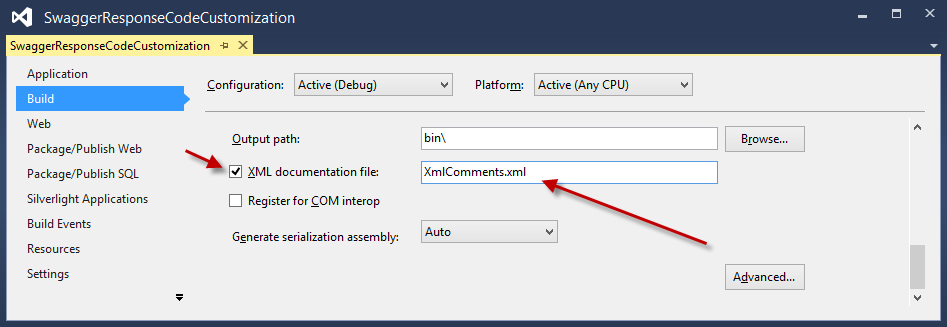
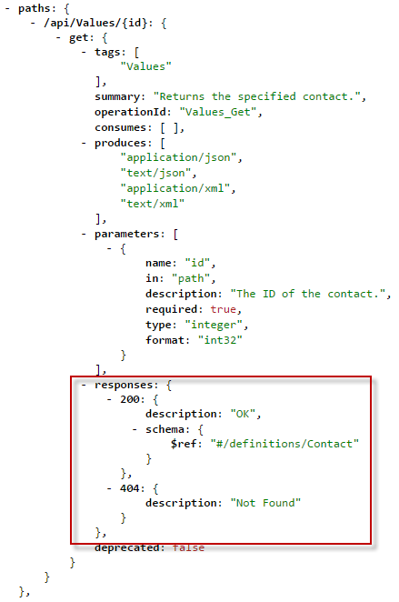
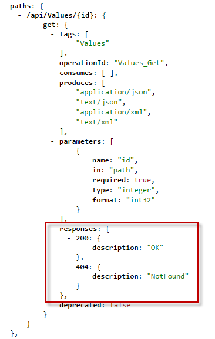

<properties 
    pageTitle="Personalizar las definiciones de API generados por Swashbuckle" 
    description="Aprenda a personalizar las definiciones de Swagger API generadas por Swashbuckle para una aplicación de API de servicio de aplicaciones de Azure." 
    services="app-service\api" 
    documentationCenter=".net" 
    authors="bradygaster" 
    manager="wpickett" 
    editor="jimbe"/>

<tags 
    ms.service="app-service-api" 
    ms.workload="web" 
    ms.tgt_pltfrm="dotnet" 
    ms.devlang="na" 
    ms.topic="article" 
    ms.date="08/29/2016" 
    ms.author="rachelap"/>

# Personalizar las definiciones de API generados por Swashbuckle 

## Información general

En este artículo se explica cómo personalizar Swashbuckle para controlar escenarios comunes donde desea alterar el comportamiento predeterminado:

* Swashbuckle genera identificadores de operación duplicados para sobrecargas de métodos de controlador
* Swashbuckle se supone que la respuesta sólo válida desde un método HTTP 200 (OK) 
 
## Personalizar la generación de identificador de operación

Swashbuckle genera identificadores de operación Swagger concatenando el nombre del controlador y el nombre del método. Este patrón crea un problema cuando tiene varias sobrecargas de un método: Swashbuckle genera identificadores de operación duplicados, que es JSON Swagger no válido.

Por ejemplo, el siguiente código de controlador hace Swashbuckle para generar los tres identificadores de operación Contact_Get.

Para resolver el problema de forma manual asignando nombres únicos, como la siguiente en este ejemplo de los métodos:

* Obtener
* GetById
* GetPage

La alternativa es ampliar Swashbuckle para que sea generar automáticamente identificadores únicos operación.

Los pasos siguientes muestran cómo personalizar Swashbuckle mediante el archivo *SwaggerConfig.cs* que se incluye en el proyecto de la plantilla de proyecto de Visual Studio API aplicaciones Preview.  También puede personalizar Swashbuckle en un proyecto de Web API configurar para su implementación como una aplicación de API.

1. Crear un personalizado `IOperationFilter` implementación 

    La `IOperationFilter` interfaz proporciona un punto de la capacidad de ampliación para usuarios de Swashbuckle que desea personalizar distintos aspectos del proceso de metadatos Swagger. El código siguiente muestra un método para cambiar el comportamiento de la operación de generación de id. El código anexa los nombres de parámetro en el nombre del Id. de operación.  

        using Swashbuckle.Swagger;
        using System.Web.Http.Description;
        
        namespace ContactsList
        {
            public class MultipleOperationsWithSameVerbFilter : IOperationFilter
            {
                public void Apply(
                    Operation operation,
                    SchemaRegistry schemaRegistry,
                    ApiDescription apiDescription)
                {
                    if (operation.parameters != null)
                    {
                        operation.operationId += "By";
                        foreach (var parm in operation.parameters)
                        {
                            operation.operationId += string.Format("{0}",parm.name);
                        }
                    }
                }
            }
        }

2. En el archivo *App_Start\SwaggerConfig.cs* , llame a la `OperationFilter` método causar Swashbuckle utilizar el nuevo `IOperationFilter` implementación.

        c.OperationFilter<MultipleOperationsWithSameVerbFilter>();

    

    El archivo *SwaggerConfig.cs* que se coloca en el paquete de Swashbuckle NuGet contiene muchos ejemplos comentados de puntos de capacidad de ampliación. Los comentarios adicionales no se muestran aquí. 

    Después de realizar este cambio, su `IOperationFilter` implementación se usa y hace identificadores únicos de operación a generarse.
 
    

    
## Permitir códigos de respuesta distinto de 200

De forma predeterminada, Swashbuckle supone que una respuesta HTTP 200 (OK) es la respuesta *solo* legítimos de un método de Web API. En algunos casos, es aconsejable devolver otros códigos de respuesta sin hacer que el cliente generar una excepción.  Por ejemplo, el siguiente código de Web API muestra un escenario en el que quiera que el cliente para aceptar un 200 o un error 404 como respuestas válidas.

    [ResponseType(typeof(Contact))]
    public HttpResponseMessage Get(int id)
    {
        var contacts = GetContacts();

        var requestedContact = contacts.FirstOrDefault(x => x.Id == id);

        if (requestedContact == null)
        {
            return Request.CreateResponse(HttpStatusCode.NotFound);
        }
        else
        {
            return Request.CreateResponse<Contact>(HttpStatusCode.OK, requestedContact);
        }
    }

En este escenario, la Swagger que genera Swashbuckle predeterminada especifica solo un código de estado HTTP legítimo, HTTP 200.

Puesto que Visual Studio utiliza la definición de la API Swagger para generar el código del cliente, crea el código de cliente que genera una excepción para todas las respuestas que no sea un 200 HTTP. El código siguiente es de un cliente C# generado para este método de Web API de ejemplo.

    if (statusCode != HttpStatusCode.OK)
    {
        HttpOperationException<object> ex = new HttpOperationException<object>();
        ex.Request = httpRequest;
        ex.Response = httpResponse;
        ex.Body = null;
        if (shouldTrace)
        {
            ServiceClientTracing.Error(invocationId, ex);
        }
        throw ex;
    } 

Swashbuckle proporciona dos formas de personalizar la lista de códigos de respuesta HTTP esperados que genera, con comentarios XML o la `SwaggerResponse` atributo. El atributo es más fácil, pero solo está disponible en Swashbuckle 5.1.5 o posterior. La plantilla de proyecto nuevo de vista previa de aplicaciones de la API de 2013 de Visual Studio incluye Swashbuckle versión 5.0.0, por lo que si utiliza la plantilla y no desea actualizar Swashbuckle, su única opción es usar comentarios XML. 

### Personalizar los códigos de respuesta esperado con comentarios XML

Use este método para especificar los códigos de respuesta si su versión de Swashbuckle es anterior a 5.1.5.

1. En primer lugar, agregue comentarios de documentación XML sobre los métodos para que desea especificar códigos de respuesta HTTP. Toma de la API de Web muestra acción anterior y aplicar la documentación XML a él daría como resultado código como el siguiente ejemplo. 

        /// 

        /// Returns the specified contact.
        /// 

        /// <param name="id">The ID of the contact.</param>
        /// <returns>A contact record with an HTTP 200, or null with an HTTP 404.</returns>
        /// <response code="200">OK</response>
        /// <response code="404">Not Found</response>
        [ResponseType(typeof(Contact))]
        public HttpResponseMessage Get(int id)
        {
            var contacts = GetContacts();
        
            var requestedContact = contacts.FirstOrDefault(x => x.Id == id);
        
            if (requestedContact == null)
            {
                return Request.CreateResponse(HttpStatusCode.NotFound);
            }
            else
            {
                return Request.CreateResponse<Contact>(HttpStatusCode.OK, requestedContact);
            }
        }

1. Agregue instrucciones en el archivo de *SwaggerConfig.cs* para dirigir Swashbuckle utilizar el XML archivo de documentación.

    * Abra *SwaggerConfig.cs* y cree un método en la clase *SwaggerConfig* para especificar la ruta de acceso al archivo XML de documentación. 

            private static string GetXmlCommentsPath()
            {
                return string.Format(@"{0}\XmlComments.xml", 
                    System.AppDomain.CurrentDomain.BaseDirectory);
            }

    * Desplácese hacia abajo en el archivo *SwaggerConfig.cs* hasta que aparezca la línea comentados de código similar de la captura de pantalla siguiente. 

        
    
    * Elimine la línea para habilitar el procesamiento durante la generación de Swagger de los comentarios XML. 
    
        
    
1. Para generar el archivo de documentación XML, vaya a las propiedades del proyecto y habilitar el archivo de documentación XML, como se muestra en la siguiente captura de pantalla. 

     

Después de realizar estos pasos, el JSON Swagger generados por Swashbuckle reflejarán los códigos de respuesta HTTP especificada en los comentarios XML. La siguiente captura de pantalla muestra esta nueva carga JSON. 

Cuando utiliza Visual Studio para generar el código de cliente de la API de REST, el código C# acepta los HTTP Aceptar y no se encontró códigos de estado sin que se produzca una excepción, lo que permite el código utilizado tomar decisiones sobre cómo tratar el retorno de un registro de contacto null. 

        if (statusCode != HttpStatusCode.OK && statusCode != HttpStatusCode.NotFound)
        {
            HttpOperationException<object> ex = new HttpOperationException<object>();
            ex.Request = httpRequest;
            ex.Response = httpResponse;
            ex.Body = null;
            if (shouldTrace)
            {
                ServiceClientTracing.Error(invocationId, ex);
            }
                throw ex;
        }

El código para esta demostración se puede encontrar en [el repositorio de GitHub](https://github.com/Azure-Samples/app-service-api-dotnet-swashbuckle-swaggerresponse). Junto con la API de Web marcado con comentarios de documentación XML del proyecto es un proyecto de aplicación de consola que contenga a un cliente generado para esta API. 

### Personalizar los códigos de respuesta esperada utilizando el atributo SwaggerResponse

El atributo [SwaggerResponse](https://github.com/domaindrivendev/Swashbuckle/blob/master/Swashbuckle.Core/Swagger/Annotations/SwaggerResponseAttribute.cs) está disponible en Swashbuckle 5.1.5 y versiones posteriores. En caso de que tiene una versión anterior del proyecto, esta sección empieza por explicar cómo actualizar el paquete Swashbuckle NuGet para que pueda utilizar este atributo.

1. En el **Explorador de soluciones**, haga clic en el proyecto de Web API y haga clic en **Administrar paquetes de NuGet**. 

    

1. Haga clic en el botón *Actualizar* junto al paquete de NuGet *Swashbuckle* . 

    

1. Agregue los atributos de *SwaggerResponse* a los métodos de acción de Web API para el que desea especificar códigos de respuesta HTTP válidos. 

        [SwaggerResponse(HttpStatusCode.OK)]
        [SwaggerResponse(HttpStatusCode.NotFound)]
        [ResponseType(typeof(Contact))]
        public HttpResponseMessage Get(int id)
        {
            var contacts = GetContacts();

            var requestedContact = contacts.FirstOrDefault(x => x.Id == id);
            if (requestedContact == null)
            {
                return Request.CreateResponse(HttpStatusCode.NotFound);
            }
            else
            {
                return Request.CreateResponse<Contact>(HttpStatusCode.OK, requestedContact);
            }
        }

2. Agregar un `using` declaración de espacio de nombres del atributo:

        using Swashbuckle.Swagger.Annotations;
        
1. Vaya a la dirección URL de */swagger/docs/v1* del proyecto y los distintos códigos de respuesta HTTP será visibles en el JSON Swagger. 

    

El código para esta demostración se puede encontrar en [el repositorio de GitHub](https://github.com/Azure-Samples/API-Apps-DotNet-Swashbuckle-Customization-MultipleResponseCodes-With-Attributes). Junto con la API de Web project decorada con el atributo *SwaggerResponse* es un proyecto de aplicación de consola que contenga a un cliente generado para esta API. 

## Pasos siguientes

En este artículo se muestra cómo personalizar la forma que swashbuckle genera identificadores de operación y códigos de respuesta válida. Para obtener más información, vea [Swashbuckle en GitHub](https://github.com/domaindrivendev/Swashbuckle).
 
