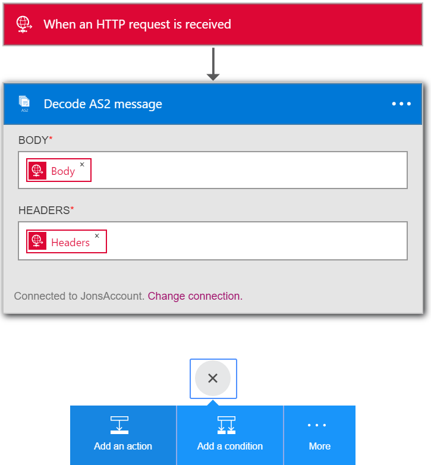
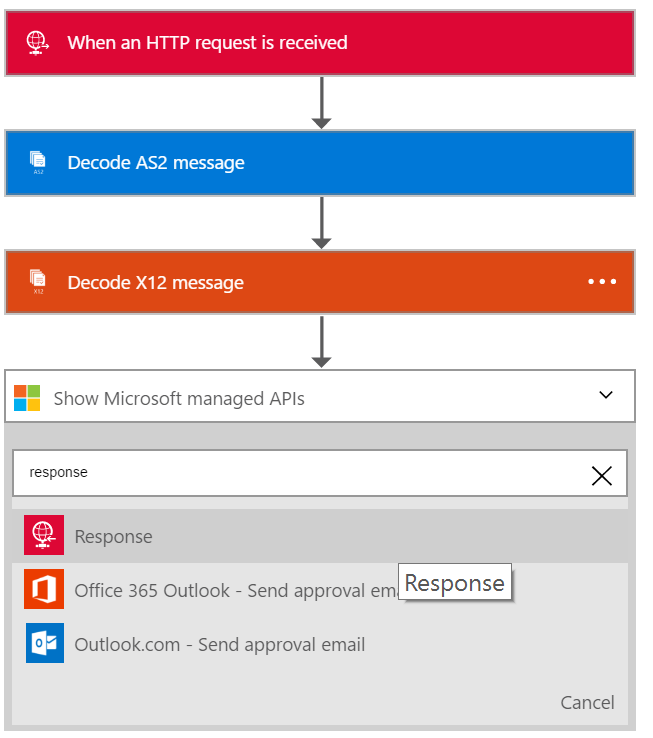

<properties 
    pageTitle="Creación de soluciones B2B con paquete de integración de empresa | Servicio de aplicaciones de Microsoft Azure | Microsoft Azure" 
    description="Obtenga más información sobre la recepción de datos usando las características de B2B del paquete de integración de Enterprise" 
    services="logic-apps" 
    documentationCenter=".net,nodejs,java"
    authors="msftman" 
    manager="erikre" 
    editor="cgronlun"/>

<tags 
    ms.service="logic-apps" 
    ms.workload="integration" 
    ms.tgt_pltfrm="na" 
    ms.devlang="na" 
    ms.topic="article" 
    ms.date="07/08/2016" 
    ms.author="deonhe"/>

# Obtenga más información sobre la recepción de datos usando las características de B2B del paquete de integración de Enterprise#

## Información general ##

Este documento forma parte del paquete de integración de lógica de aplicaciones empresariales. Consulte la información general para obtener más información sobre las [capacidades del paquete de integración de Enterprise](./app-service-logic-enterprise-integration-overview.md).

## Requisitos previos ##

Usar la AS2 y X12 acciones necesita una cuenta de integración de empresa

[Cómo crear una cuenta de integración de empresa](./app-service-logic-enterprise-integration-accounts.md)

## Cómo usar los conectores lógica aplicaciones B2B ##

Una vez que ha creado una cuenta de integración y asociados y agreements a él esté listo para crear una aplicación de la lógica implementa un flujo de trabajo de negocio a negocio (B2B).

En este walkthru verá cómo usar la AS2 y X12 acciones para crear una aplicación de lógica de empresa a empresa que recibe los datos de un socio comercial.

1. Crear una nueva aplicación de lógica y [vincularlo a su cuenta de integración](./app-service-logic-enterprise-integration-accounts.md).  
2. Agregar un desencadenador de **solicitud - solicitud HTTP un cuando se reciba** a su aplicación lógica  
  
3. Agregar la acción **AS2 descodificar** por seleccionando **Agregar una acción**  
  
4. Escriba la palabra **as2** en el cuadro de búsqueda para filtrar todas las acciones que desea usar  
  
6. Seleccione la acción **AS2 - descodificar AS2 mensaje**  
  
7. Como se muestra, agregue el **cuerpo** que lleve a cabo como entrada. En este ejemplo, seleccione el cuerpo de la solicitud HTTP que activó la aplicación lógica. Como alternativa, puede escribir una expresión para los encabezados en el campo de**ENCABEZADOS** de entrada:

    @triggerOutputs()['headers']

8. Agregue los **encabezados** necesarios para AS2. Se trata en los encabezados de solicitud HTTP. En este ejemplo, seleccione los encabezados de la solicitud HTTP que activó la aplicación lógica.
9. Agregar ahora la acción de mensaje descodificar X12 seleccionando volver a **Agregar una acción**  
   
10. Escriba la palabra **x12** en el cuadro de búsqueda para filtrar todas las acciones que desea usar  
  
11. Seleccione el **X12-descodificar X12 mensaje** acción para agregarlo a la aplicación de lógica  
  
12. Debe especificar la entrada que esta acción que será el resultado de la acción de AS2 anterior. El contenido real del mensaje está en un objeto JSON y está codificado base 64. Por lo tanto, debe especificar una expresión como la entrada para escribir la expresión siguiente en el campo de entrada **X12 plano archivo mensaje para descodificar**  

    @base64ToString(body('Decode_AS2_message')?['AS2Message']?['Content'])  

13. Este paso descodifica la X12 datos recibidos desde el socio comercial y dará como resultado un número de elementos de un objeto JSON. Para comunicar el partner de la recepción de los datos se puede volver a enviar una respuesta que contiene la notificación de disposición de mensaje (MDN) de AS2 en una acción de respuesta de HTTP  
14. Para agregar la acción de **respuesta** , seleccione **Agregar una acción**   
  
15. Escriba la **respuesta** de word en el cuadro de búsqueda para filtrar todas las acciones que desea usar  
  
16. Seleccione la acción de **respuesta** para agregarlo  
  
17. Establezca el campo de **cuerpo** de respuesta mediante la siguiente expresión para tener acceso a la MDN desde el resultado de la acción **descodificar X12 mensaje**  

    @base64ToString(body('Decode_AS2_message')?['OutgoingMdn']?['Content'])  

  
18. Guarde su trabajo  
  

En este momento, haya terminado de configurar la aplicación de la lógica de B2B. En una aplicación del mundo real, desea almacenar la X12 descodificar datos en un almacén de datos o aplicación LOB. Puede agregar fácilmente más acciones para hacerlo o escribir API personalizadas para conectarse a sus propio aplicaciones LOB y usar estas API en la aplicación de la lógica.

## Características y casos de uso ##

- La AS2 y X12 descodificar y codificar acciones permiten recibir datos desde y enviar datos a socios mediante protocolos estándar con aplicaciones de lógica  
- Puede usar AS2 y X12 con o sin entre sí para intercambiar datos con socios según sea necesario
- Las acciones de B2B que sea más fácil crear asociados y agreements en la cuenta de integración y consumen en una aplicación de lógica  
- Ampliar la aplicación lógica con otras acciones puede enviar y recibir datos hacia y desde otras aplicaciones y servicios como SalesForce  

## Aprende más ##

[Obtenga más información sobre el paquete de integración de Enterprise](./app-service-logic-enterprise-integration-overview.md)  