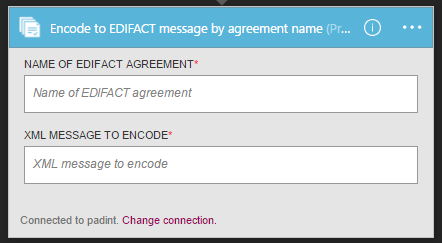
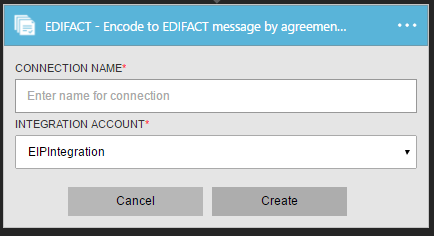
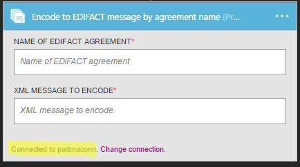

<properties 
    pageTitle="Obtenga más información sobre Enterprise Integration Pack codificar EDIFACT mensaje Connctor | Servicio de aplicaciones de Microsoft Azure | Microsoft Azure" 
    description="Obtenga información sobre cómo utilizar asociados con las aplicaciones empresariales Integration Pack y lógica" 
    services="logic-apps" 
    documentationCenter=".net,nodejs,java"
    authors="padmavc" 
    manager="erikre" 
    editor=""/>

<tags 
    ms.service="logic-apps" 
    ms.workload="integration" 
    ms.tgt_pltfrm="na" 
    ms.devlang="na" 
    ms.topic="article" 
    ms.date="08/15/2016" 
    ms.author="padmavc"/>

# Introducción a codificar EDIFACT mensaje

Valide EDI y propiedades específicas del partner 

## Crear la conexión

### Requisitos previos

* Una cuenta de Azure puede crear una [cuenta gratuita](https://azure.microsoft.com/free)

* Se requiere una cuenta de integración utilizar EDIFACT codificar mensaje conector. Ver detalles sobre cómo crear una [Cuenta de integración](./app-service-logic-enterprise-integration-create-integration-account.md), [socios](./app-service-logic-enterprise-integration-partners.md) y [contrato EDIFACT](./app-service-logic-enterprise-integration-edifact.md)

### Conectarse a descodificar EDIFACT mensaje con los pasos siguientes:

1. [Crear una aplicación de lógica](./app-service-logic-create-a-logic-app.md) proporciona un ejemplo.

2. Este conector tener desencadenadores. Usar otros desencadenadores para iniciar la aplicación de la lógica, como un desencadenador de solicitud.  En el Diseñador de la aplicación de la lógica, agregar un desencadenador y agregue una acción.  Seleccione Mostrar Microsoft API administradas en el menú desplegable de la lista y, a continuación, escriba "EDIFACT" en el cuadro de búsqueda.  Seleccione en codificar mensaje EDIFACT por nombre de contrato o codificar al mensaje EDIFACT por identidades.

      

3. Si todavía no lo ha creado previamente las conexiones con integración de cuenta, se le pedirá los detalles de conexión

      

4. Escriba los detalles de la cuenta de integración.  Propiedades con un asterisco son necesarias

  	| (Propiedad) | Detalles |
  	| -------- | ------- |
  	| Nombre de la conexión * | Escriba un nombre para la conexión |
  	| Integración cuenta * | Escriba el nombre de cuenta de integración. Asegúrese de que su cuenta de integración y la aplicación de la lógica se encuentran en la misma ubicación de Azure 

    Cuando haya finalizado, los detalles de la conexión ser similares al siguiente

    
    
5. Seleccione **crear**
    
6. Observe que la conexión se ha creado

    
    
#### Codificar mensaje EDIFACT por nombre de acuerdo

7.  Proporcionar mensaje de xml y el nombre del contrato de EDIFACT para codificar.

    
    
#### Codificar mensaje EDIFACT identidades

7. Proporcionar identificador del remitente, calificador de remitente, el identificador de receptor y calificador de receptor como configurado en el acuerdo de EDIFACT.  Seleccione el mensaje de xml para codificar

    
    
## Codificar EDIFACT hace siguiendo

* Resolver el contrato correspondiente al calificador de remitente & identificador y calificador receptor y el identificador
* Serializa el intercambio EDI, convertir mensajes con codificación XML en conjuntos de transacciones EDI en el intercambio.
* Se aplica a segmentos de encabezado y final del conjunto de transacción
* Genera un número de control de intercambio, un número de control de grupo y un número de control de transacciones establecido para cada intercambio saliente
* Reemplaza los separadores en los datos de carga
* Valide EDI y propiedades específicas del partner
    * Validación de esquema de los elementos de datos del conjunto de transacciones con el esquema de mensaje.
    * Validación de EDI se realiza en elementos de datos del conjunto de transacciones.
    * Validación extendida realizada en elementos de datos del conjunto de transacciones
* Genera un documento XML para cada conjunto de transacciones.
* Solicita una confirmación de técnicas o funcionales (si está configurado).
    * Como una confirmación técnica, el mensaje CONTRL indica confirmación de un intercambio.
    * Como una confirmación funcional, el mensaje CONTRL indica la aceptación o rechace el intercambio recibido, un grupo o un mensaje, con una lista de errores o funciones no compatibles

## Pasos siguientes

[Obtenga más información sobre el paquete de integración de Enterprise] (./app-service-logic-enterprise-integration-overview.md "Obtenga más información sobre el paquete de integración de Enterprise") 