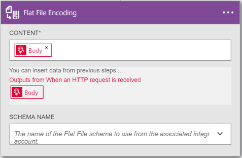
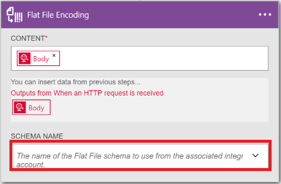

<properties
    pageTitle="Más información sobre cómo codificar o descodificar archivos sin formato con las aplicaciones empresariales Integration Pack y lógica | Servicio de aplicaciones de Microsoft Azure | Microsoft Azure"
    description="Usar las características de Enterprise Integration Pack y lógica de aplicaciones para codificar o descodificar archivos sin formato"
    services="app-service\logic"
    documentationCenter=".net,nodejs,java"
    authors="msftman"
    manager="erikre"
    editor="cgronlun"/>

<tags 
    ms.service="logic-apps" 
    ms.workload="integration" 
    ms.tgt_pltfrm="na" 
    ms.devlang="na" 
    ms.topic="article" 
    ms.date="07/08/2016" 
    ms.author="deonhe"/>

# Integración de Enterprise con los archivos sin formato

## Información general

Desea codificar contenido XML antes de enviarlo a un socio de empresa en un escenario de negocio a negocio (B2B). En una aplicación de lógica realizada por la característica de lógica aplicaciones del servicio de aplicación de Azure, puede usar el archivo plano codificación conector para hacer esto. La aplicación de la lógica que cree puede obtener su XML contenido desde una gran variedad de orígenes, incluidos desde un desencadenador de solicitud HTTP, desde otra aplicación o incluso desde uno de los muchos [conectores](../connectors/apis-list.md). Para obtener más información sobre las aplicaciones de lógica, consulte la [documentación de aplicaciones de lógica](./app-service-logic-what-are-logic-apps.md "más información sobre las aplicaciones de lógica").  

## Cómo crear el archivo plano codificación conector

Siga estos pasos para agregar un archivo plano codificación conector a su aplicación lógica.

1. Crear una aplicación de lógica y [vincularlo a su cuenta de integración](./app-service-logic-enterprise-integration-accounts.md "información sobre cómo vincular una cuenta de integración a una aplicación de lógica"). Esta cuenta contiene el esquema que se usa para codificar los datos XML.  
2. Agregar un desencadenador de **solicitud - solicitud HTTP un cuando se reciba** a su aplicación lógica.  
    
3. Agregue el archivo plano codificación acción, como sigue:

    una. Seleccione **el signo más** .

    b. Seleccione el vínculo **Agregar una acción** (aparece después de haber seleccionado el signo más).

    c. En el cuadro Buscar, escriba *plano* para filtrar todas las acciones que desea usar.

    d. Seleccione la opción de **Codificación de archivo plano** de la lista.   
   
4. En el cuadro de diálogo **Codificación de archivo plano** , seleccione el cuadro de texto de **contenido** .  
  
5. Seleccione la etiqueta de cuerpo como el contenido que desea codificar. La etiqueta de cuerpo llenará el campo de contenido.     
  
6. Seleccione el cuadro **Nombre de esquema** de la lista y elija el esquema que desea usar para codificar el contenido de la entrada.    
  
7. Guarde su trabajo.   
  

En este momento, haya terminado de configurar el conector de codificación de archivo plano. En una aplicación del mundo real, desea almacenar los datos codificados en una aplicación de línea de negocio, como Salesforce. O puede enviar que datos codificados a una cotización del partner. Puede agregar fácilmente una acción para enviar el resultado de la acción de codificación para Salesforce, o para el socio comercial, mediante uno de los demás conectores proporcionado.

Ahora puede probar el conector realizar una solicitud al extremo HTTP y el contenido XML se incluyen en el cuerpo de la solicitud.  

## Cómo crear el archivo plano descodificar conector

>[AZURE.NOTE] Para completar estos pasos, debe tener un archivo de esquema cargado en la cuenta de integración.

1. Agregar un desencadenador de **solicitud - solicitud HTTP un cuando se reciba** a su aplicación lógica.  
    
2. Agregue el archivo plano descodificar acción, como sigue:

    una. Seleccione **el signo más** .

    b. Seleccione el vínculo **Agregar una acción** (aparece después de haber seleccionado el signo más).

    c. En el cuadro Buscar, escriba *plano* para filtrar todas las acciones que desea usar.

    d. Seleccione la opción **Descodificar de archivo plano** de la lista.   
   
- Seleccione el control de **contenido** . Esto crea una lista del contenido de los pasos anteriores que puede usar como el contenido para descodificar. Observe que está disponible para utilizarlo como el contenido para descodificar el *cuerpo* de la solicitud HTTP entrante. También puede escribir el contenido descodificar directamente en el control de **contenido** .     
- Seleccione la etiqueta de *cuerpo* . Observe que la etiqueta de cuerpo está ahora en el control de **contenido** .
- Seleccione el nombre del esquema que desea usar para descodificar el contenido. La siguiente captura de pantalla muestra que *OrderFile* es el nombre del esquema seleccionado. Este nombre de esquema ' d se ha cargado previamente en la cuenta de integración.

     
- Guarde su trabajo.  
    

En este momento, haya terminado de configurar su archivo plano descodificar conector. En una aplicación del mundo real, desea almacenar los datos descodificados en una aplicación de línea de negocio como Salesforce. Puede agregar fácilmente una acción para enviar el resultado de la acción descodificación a Salesforce.

Ahora puede probar el conector realizando una solicitud al extremo HTTP y incluido el contenido XML que desea descodificar en el cuerpo de la solicitud.  

## Pasos siguientes
- [Obtenga más información sobre el paquete de integración de Enterprise] (./app-service-logic-enterprise-integration-overview.md "Obtenga más información sobre el paquete de integración de Enterprise").  
