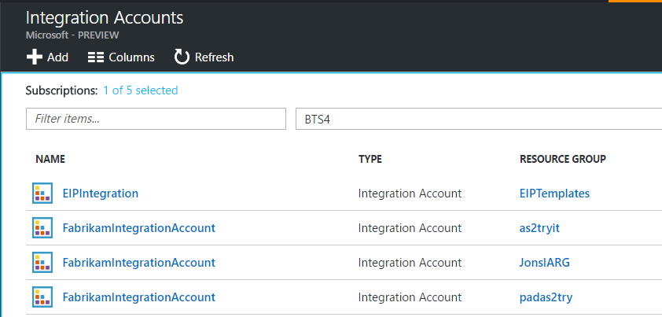
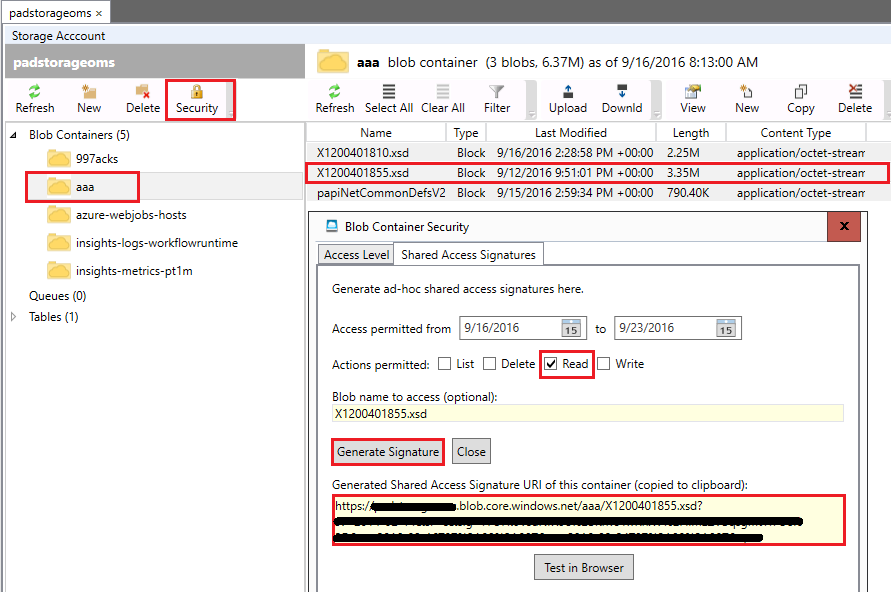

<properties
    pageTitle="Descripción general de esquemas y el paquete de integración de empresa | Microsoft Azure"
    description="Aprenda a usar los esquemas con las aplicaciones empresariales Integration Pack y lógica"
    services="logic-apps"
    documentationCenter=".net,nodejs,java"
    authors="msftman"
    manager="erikre"
    editor="cgronlun"/>

<tags
    ms.service="logic-apps"
    ms.workload="integration"
    ms.tgt_pltfrm="na"
    ms.devlang="na"
    ms.topic="article"
    ms.date="07/29/2016"
    ms.author="deonhe"/>

# Obtenga información sobre los esquemas y el paquete de integración de Enterprise  

## ¿Por qué usar un esquema?
Utilizar esquemas para confirmar que recibe los documentos XML son válidos, con los datos esperados en un formato predefinido. Los esquemas se utilizan para validar los mensajes que se ha intercambiado en un escenario de B2B.

## Agregar un esquema
Desde el portal de Azure:  

1. Seleccione **más servicios**.  
    

2. En el cuadro de búsqueda de filtro, escriba **integración**y seleccione **Cuentas de integración** de la lista de resultados.     
  
3. Seleccione la **cuenta de integración** al que agregar el esquema.    
  

4. Seleccione el icono de **esquemas** .  
  

### Agregar un archivo de esquema menor que 2 MB  

1. En el módulo de **esquemas** que se abre (desde los pasos anteriores), seleccione **Agregar**.  
  

2. Escriba un nombre para el esquema. Para cargar el archivo de esquema, seleccione el icono de carpeta junto al cuadro de texto de **esquema** . Después de completa el proceso de carga, seleccione **Aceptar**.    
  

### Agregar un archivo de esquema más de 2 MB (hasta un máximo de 8 MB)  

El proceso para este depende el nivel de acceso del contenedor de blob: **público** o **sin acceso anónimo**. Para determinar este nivel de acceso, en el **Explorador de almacenamiento de Azure**en **Contenedores de Blob**, seleccione el contenedor de blob que desee. Seleccione **seguridad**y seleccione la pestaña de **Nivel de acceso** .

1. Si el nivel de acceso de seguridad de blob es **público**, siga estos pasos.  
    

    una. Cargar el esquema con el almacenamiento y copie el URI.  
      

    b. En **Agregar esquema**, seleccione **archivo de gran tamaño**y proporcionar el URI en el cuadro de texto de **URI del contenido** .  
      

2. Si el nivel de acceso de seguridad de blob no es **acceso anónimo**, siga estos pasos.  
    

    una. Cargue el esquema al almacenamiento.  
    

    b. Generar una firma de acceso compartido para el esquema.  
    

    c. En **Agregar esquema**, seleccione **archivo de gran tamaño**y proporcionar la firma de acceso compartido URI en el cuadro de texto de **URI del contenido** .  
      

3. En el módulo de **esquemas** de la cuenta de integración de EIP, ahora debe ver el esquema recién agregado.  

  

## Editar esquemas
1. Seleccione el icono de **esquemas** .  
2. Seleccione el esquema que desea editar en el módulo de **esquemas** que se abre.
3. En el módulo de **esquemas** , seleccione **Editar**.  
    
4. Seleccione el archivo de esquema que desea editar mediante el cuadro de diálogo Selector de archivo que se abre.
5. Seleccione **Abrir** en el selector de archivos.  
  
6. Recibir una notificación que indica que la carga se realizó correctamente.  

## Eliminar esquemas
1. Seleccione el icono de **esquemas** .  
2. Seleccione el esquema que desea eliminar de la hoja de **esquemas** que se abre.  
3. En el módulo de **esquemas** , seleccione **Eliminar**.
  

4. Para confirmar su elección, seleccione **Sí**.  
  
5. Por último, observe que se actualiza la lista de esquemas en el módulo de **esquemas** y el esquema eliminó ya no aparece.  
    

## Pasos siguientes

- [Obtenga más información sobre el paquete de integración de Enterprise] (./app-service-logic-enterprise-integration-overview.md "Obtenga información sobre el paquete de integración de enterprise").  
