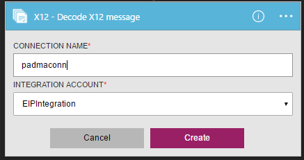

<properties 
    pageTitle="Obtenga más información sobre Enterprise Integration Pack descodificar X12 mensaje Connctor | Servicio de aplicaciones de Microsoft Azure | Microsoft Azure" 
    description="Obtenga información sobre cómo utilizar asociados con las aplicaciones empresariales Integration Pack y lógica" 
    services="logic-apps" 
    documentationCenter=".net,nodejs,java"
    authors="padmavc" 
    manager="erikre" 
    editor=""/>

<tags 
    ms.service="logic-apps" 
    ms.workload="integration" 
    ms.tgt_pltfrm="na" 
    ms.devlang="na" 
    ms.topic="article" 
    ms.date="08/15/2016" 
    ms.author="padmavc"/>

# Introducción a descodificar X12 mensaje

Valide EDI y propiedades específicas del partner, genera documento XML para cada conjunto de transacciones y genera confirmación para transacción procesada.

## Crear la conexión

### Requisitos previos

* Una cuenta de Azure puede crear una [cuenta gratuita](https://azure.microsoft.com/free)

* Se requiere una cuenta de integración usar descodificar X12 conector de mensaje. Ver detalles sobre cómo crear una [Cuenta de integración](./app-service-logic-enterprise-integration-create-integration-account.md), [socios](./app-service-logic-enterprise-integration-partners.md) y [X12 contrato](./app-service-logic-enterprise-integration-x12.md)

### Conectar con mensaje descodificar X12 con los pasos siguientes:

1. [Crear una aplicación de lógica](./app-service-logic-create-a-logic-app.md) proporciona un ejemplo

2. Este conector tener desencadenadores. Usar otros desencadenadores para iniciar la aplicación de la lógica, como un desencadenador de solicitud.  En el Diseñador de la aplicación de la lógica, agregar un desencadenador y agregue una acción.  Seleccione Mostrar Microsoft API administradas en el menú desplegable de la lista y, a continuación, escriba "x12" en el cuadro de búsqueda.  Seleccione X12 – descodificar X12 mensaje

      

3. Si todavía no lo ha creado previamente las conexiones con integración de cuenta, se le pedirá los detalles de conexión

        

4. Escriba los detalles de la cuenta de integración.  Propiedades con un asterisco son necesarias

  	| (Propiedad) | Detalles |
  	| -------- | ------- |
  	| Nombre de la conexión * | Escriba un nombre para la conexión |
  	| Integración cuenta * | Escriba el nombre de cuenta de integración. Asegúrese de que su cuenta de integración y la aplicación de la lógica se encuentran en la misma ubicación de Azure |

    Cuando haya finalizado, los detalles de la conexión ser similares al siguiente
    
     

5. Seleccione **crear**
    
6. Observe que se ha creado la conexión.

     

7. Seleccione X12 plano mensaje archivo descodificar

     

## X12 descodificar sirve siguiendo

* Valide el envolvente contra cotización de acuerdo con el socio
* Genera un documento XML para cada conjunto de transacciones.
* Valide EDI y propiedades específicas del partner
    * Validación de EDI estructural y la validación de esquema extendido
    * Validación de la estructura de los sobres de intercambio.
    * Validación de esquema de los sobres con el esquema de control.
    * Validación de esquema de los elementos de datos del conjunto de transacciones con el esquema de mensaje.
    * Validación de EDI realizada en elementos de datos del conjunto de transacciones 
* Comprueba si los números de control de conjunto de intercambio, grupo y transacción no son duplicados
    * Comprueba el número de control de intercambio contra intercambios ya ha recibido.
    * Comprueba el número de control de grupo con otros números de control de grupo en el intercambio.
    * Comprueba que la transacción establece el número de control con otros números de control de conjunto de transacciones de ese grupo.
* Convierte el intercambio completo en XML 
    * Intercambio de división como conjuntos de transacciones - suspender conjuntos de transacciones en error: analiza cada transacción establecer en un intercambio en otro documento XML. Si establece una o más transacciones en el intercambio no validación, X12 descodificar suspende solo los conjuntos de transacciones.
    * Intercambio de división como conjuntos de transacciones - suspender intercambio error: analiza cada transacción establecer en un intercambio en otro documento XML.  Si establece una o más transacciones en el intercambio no validación, X12 descodificar suspende el intercambio completo.
    * Mantener el intercambio - suspender conjuntos de transacciones en error: crea un documento XML para el intercambio por lotes completo. X12 descodificar suspende los conjuntos de transacciones que un error de validación, mientras sigue procesar todas las demás transacciones establece
    * Mantener el intercambio - suspender intercambio error: crea un documento XML para el intercambio por lotes completo. Si establece una o más transacciones en el intercambio no validación, X12 descodificar suspende el intercambio de todo 
* Genera una confirmación de técnicas o funcionales (si está configurado).
    * Una confirmación técnica genera como resultado de la validación de encabezado. La confirmación técnica informa del estado del procesamiento de un encabezado de intercambio y final por el receptor de dirección.
    * Una confirmación funcional genera como resultado de la validación de cuerpo. Cada error al procesamiento del documento recibido informes de la confirmación funcional

## Pasos siguientes

[Obtenga más información sobre el paquete de integración de Enterprise] (./app-service-logic-enterprise-integration-overview.md "Obtenga más información sobre el paquete de integración de Enterprise") 

