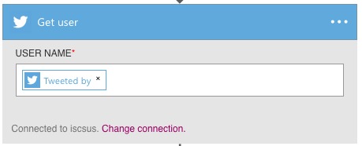
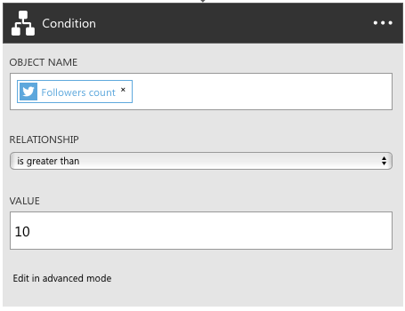

<properties 
    pageTitle="Usar características de aplicación lógica | Microsoft Azure" 
    description="Obtenga información sobre cómo usar las funciones avanzadas de aplicaciones de lógica." 
    authors="stepsic-microsoft-com" 
    manager="erikre" 
    editor="" 
    services="logic-apps" 
    documentationCenter=""/>

<tags
    ms.service="logic-apps"
    ms.workload="integration"
    ms.tgt_pltfrm="na"
    ms.devlang="na"
    ms.topic="article"
    ms.date="03/28/2016"
    ms.author="stepsic"/> 
    
# Usar características de aplicaciones de lógica

En el [tema anterior](app-service-logic-create-a-logic-app.md), ha creado su primera aplicación de lógica. Ahora le mostraremos cómo crear un proceso más completado con aplicaciones de lógica de servicios de aplicación. Este tema presenta los nuevos conceptos de aplicaciones de la lógica siguientes:

- Lógica condicional, que se ejecuta una acción únicamente cuando se cumple una condición.
- Vista de código para modificar una aplicación existente de lógica.
- Opciones para iniciar un flujo de trabajo.

Antes de completar este tema, debe completar los pasos de [crear una nueva aplicación de lógica](app-service-logic-create-a-logic-app.md). En el [portal de Azure], vaya a su aplicación lógica y haga clic en **desencadenadores y acciones** en el resumen para editar la definición de aplicación de la lógica.

## Material de referencia

Los documentos siguientes pueden resultarle útiles:

- [Administración y tiempo de ejecución de las API de REST](https://msdn.microsoft.com/library/azure/mt643787.aspx) - incluido cómo invocar lógica aplicaciones directamente
- [Referencia del lenguaje](https://msdn.microsoft.com/library/azure/mt643789.aspx) - una lista completa de todas las funciones compatibles y expresiones
- [Tipos de desencadenador y acción](https://msdn.microsoft.com/library/azure/mt643939.aspx) : los diferentes tipos de acciones y las entradas que se toman
- [Información general de aplicación de servicio](../app-service/app-service-value-prop-what-is.md) : descripción de los componentes para elegir el momento crear una solución

## Agregar lógica condicional

Aunque el flujo original funciona, hay algunas áreas que se podrían mejorar. 

### Condicional
Esta aplicación lógica puede provocar que recibe una gran cantidad de mensajes de correo electrónico. Los siguientes pasos agregan lógica para asegurarse de que solo se recibe un correo electrónico cuando la tweet proviene de alguien con un número determinado de seguidores. 

1. Haga clic en el signo más y busque la acción *Usuario obtener* Twitter.

2. Pase el campo **Tweeted por** desde el desencadenador para obtener la información sobre el usuario de Twitter.

    

3. Haga clic en el signo más nuevo, pero esta vez seleccione **Agregar condición**

4. En el primer cuadro, haga clic en el **...** **Usuario obtener** para buscar el campo de **recuento seguidores** subyacente.

5. En el menú desplegable, seleccione **mayor que**

6. En el segundo cuadro, escriba el número de seguidores que desee que tengan los usuarios.

    

7.  Por último, cuadro de arrastrar y colocar el correo electrónico en el cuadro **Si sí** . Esto significa que solo recibirá mensajes de correo electrónico cuando se cumple el recuento de indicador.

## Repetición de una lista con forEach

El bucle especifica una matriz para repetir una acción sobre. Si no es una matriz se produce un error en el flujo. Por ejemplo, si tiene action1 que genera una matriz de mensajes y que desea enviar cada mensaje, puede incluir esta instrucción en las propiedades de la acción: forEach:"@action('action1').outputs.messages"
 

## Usar la vista código para editar una aplicación de lógica

Además de diseñador, puede editar directamente el código que define una aplicación de la lógica de manera. 

1. Haga clic en el botón de la **vista código** en la barra de comandos. 

    Se abrirá un editor completo que muestra la definición que acaba de modificar.

    

    Mediante el editor de texto, puede copiar y pegar cualquier número de acciones dentro de la misma aplicación lógica o entre las aplicaciones de lógica. Fácilmente también puede agregar o quitar secciones enteras de la definición y definiciones también puede compartir con otras personas.

2. Después de realizar los cambios en la vista código, simplemente haga clic en **Guardar**. 

### Parámetros
Existen algunas capacidades de aplicaciones de lógica que solo se pueden usar en la vista código. Un ejemplo de estos es parámetros. Parámetros facilitan la reutilización valores a lo largo de la aplicación de la lógica. Por ejemplo, si tiene una dirección de correo electrónico que desee utilizar en varias acciones, debe definir como parámetro.

La siguiente actualiza su aplicación lógica existente para usar parámetros para el término de la consulta.

1. En la vista código, busque la `parameters : {}` objeto e inserte el siguiente objeto de tema:

        "topic" : {
            "type" : "string",
            "defaultValue" : "MicrosoftAzure"
        }
    
2. Desplácese hasta la `twitterconnector` acción, busque el valor de la consulta y reemplácelo con `#@{parameters('topic')}`.
    También puede utilizar la función de **concatenación** para unir dos o más cadenas, por ejemplo: `@concat('#',parameters('topic'))` es idéntica a la anterior. 
 
Parámetros son una buena manera de extraer los valores que podrían cambiar muchas. Son especialmente útiles cuando necesite reemplazar parámetros en diferentes entornos. Para obtener más información sobre cómo reemplazar parámetros basados en el entorno, consulte la [documentación de la API de REST](https://msdn.microsoft.com/library/mt643787.aspx).

Ahora, al hacer clic en **Guardar**, cada hora Obtiene cualquier tweets nuevos que tengan más de 5 retweets entregados a una carpeta denominada **tweets** en la lista desplegable.

Para obtener más información acerca de las definiciones de aplicación lógica, consulte [crear definiciones de lógica de aplicación](app-service-logic-author-definitions.md).

## Iniciar un flujo de trabajo de la aplicación lógica
Existen varias opciones para iniciar el flujo de trabajo definido en la aplicación de la lógica. Un flujo de trabajo siempre se puede iniciar a petición en el [portal de Azure].

### Desencadenadores de periodicidad
Un desencadenador de periodicidad se ejecuta en un intervalo que especifique. Cuando el desencadenador tiene lógica condicional, el desencadenador determina si no necesita ejecutar el flujo de trabajo. Un desencadenador indica que se debe ejecutar al devolver un `200` código de estado. Cuando no se necesita ejecutar, devuelve una `202` código de estado.

### Devolución de llamada mediante las API de REST
Servicios pueden llamar a un extremo de aplicación lógica para iniciar un flujo de trabajo. Para obtener más información, consulte [aplicaciones de lógica como extremos puede llamadas](app-service-logic-connector-http.md) . Para empezar a ese tipo de aplicación lógica a petición, haga clic en el botón **Ejecutar ahora** en la barra de comandos. 

<!-- Shared links -->
[Portal de Azure]: https://portal.azure.com 