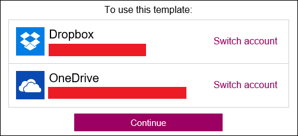

<properties
 pageTitle="Plantillas de aplicaciones de lógica | Microsoft Azure"
 description="Aprenda a usar las plantillas de aplicaciones de lógica creadas previamente para ayudarle a empezar a"
 authors="kevinlam1"
 manager="dwrede"
 editor=""
 services="app-service\logic"
 documentationCenter=""/>

<tags
    ms.service="app-service-logic"
    ms.workload="integration"
    ms.tgt_pltfrm="na"
    ms.devlang="na"
    ms.topic="article"
    ms.date="08/24/2016"
    ms.author="klam"/>

# Plantillas de aplicaciones de lógica

## ¿Qué son las plantillas de aplicaciones de lógica

Una plantilla de aplicación lógica es una aplicación de lógica predefinida que puede usar para comenzar rápidamente a crear su propio flujo de trabajo. 

Estas plantillas son una buena forma de descubrir diversos patrones que pueden crearse mediante aplicaciones de lógica. Puede usar estas plantillas como-está o modificarlos para ajustar su situación.

## Información general sobre plantillas disponibles

Hay muchas plantillas disponibles actualmente publicadas en la plataforma de aplicación de la lógica. Algunas categorías de ejemplo, así como el tipo de conectores utilizados en ellos, se muestran a continuación.

### Plantillas de nube de empresa
Plantillas que se integran Dynamics CRM, Salesforce, cuadro, blobs de Windows Azure y otros conectores según las necesidades de nube de empresa. Algunos ejemplos de lo que puede hacer con estas plantillas incluyen organizar los clientes potenciales y realizar copias de seguridad de los datos de archivos corporativos.

### Plantillas de paquete de integración de empresa
Configuraciones de VETER (validar, extraer, transformar, enriquecer, enrutar) canalizaciones, recibe una X12 EDI documento sobre AS2 y transformar XML, así como mensaje X12 y AS2 manipulación.

### Plantillas de trama de protocolo
Estas plantillas constan de aplicaciones de lógica que contienen modelos de protocolo como respuesta de la solicitud a través de HTTP, así como integraciones a través de FTP y SFTP. Utilice estos tal y como están o como base para crear modelos de protocolo más complejos.  

### Plantillas de productividad personal
Patrones para mejorar la productividad personal incluyen plantillas que establecer avisos diarios, elementos de trabajo importantes se convierten en listas de tareas pendientes y automatizan tareas largas hacia abajo hasta un paso de aprobación de usuario único.

### Plantillas de nube de consumidor
Plantillas simples que se integran con servicios de medios sociales como Twitter, margen de demora y correo electrónico, en última instancia capaz de medios sociales iniciativas de marketing de consolidación. También se incluyen plantillas como copiar cubierto, que le ayudarán a aumentar la productividad guardando el tiempo invertido en tareas repetitivas tradicionalmente. 

## Cómo crear una aplicación de lógica usando una plantilla 

Para empezar a usar una plantilla de aplicación lógica, vaya en el Diseñador de la aplicación de lógica. Si se introduce el diseñador, abra una aplicación de lógica existente, la aplicación de la lógica se carga automáticamente en la vista de diseñador. Sin embargo, si está creando una nueva aplicación lógica, verá la pantalla siguiente.  
   

Desde esta pantalla, puede elegir iniciar una aplicación lógica en blanco o una plantilla predefinida. Si selecciona una de las plantillas, se proporcionan información adicional. En este ejemplo, usamos la plantilla *cuando se crea un nuevo archivo en Dropbox, cópielo en OneDrive* .  
   

Si decide usar la plantilla, seleccione el botón *usar esta plantilla* . Se le pedirá que iniciar sesión en sus cuentas en función de qué conectores utiliza la plantilla. O bien, si previamente ha establecido una conexión con estos conectores, seleccione Continuar tal como se muestra a continuación.  
   

Después de establecer la conexión y seleccionar *continuar*, la aplicación de la lógica se abre en la vista del diseñador.  
   

En el ejemplo anterior, como ocurre con muchas plantillas, algunos de los campos de propiedad obligatoria pueden rellenarse dentro de los conectores; Sin embargo, algunos puede requerir un valor antes de poder implementar correctamente la aplicación de la lógica. Si intenta implementar sin introducir algunos de los campos que faltan, se le notificará con un mensaje de error.

Si desea volver al Visor de plantilla, seleccione el botón de *plantillas* en la barra de navegación superior. Al cambiar al Visor de plantilla, perderá cualquier progreso no guardado. Antes de cambiar en el Visor de plantilla, verá un mensaje de advertencia que le informa de este.  
   

## Cómo implementar una aplicación de lógica creada a partir de una plantilla

Una vez haya cargado la plantilla y realiza los cambios que desee, seleccione Guardar botón en la esquina superior izquierda. Esto guarda y publica la aplicación lógica.  
   

Si desea obtener más información sobre cómo agregar más pasos en una plantilla de aplicación lógica existente o realizar modificaciones en general, más al [crear una aplicación de lógica](app-service-logic-create-a-logic-app.md).