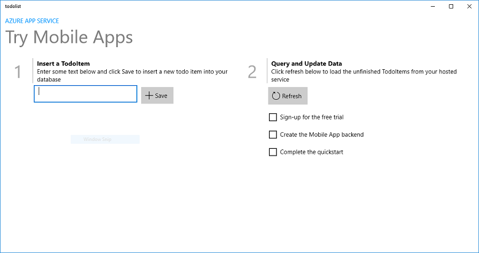

<properties
    pageTitle="Crear una plataforma de Windows Universal (UWP) que se usa en aplicaciones móviles | Microsoft Azure"
    description="Siga este tutorial para empezar con el uso de una aplicación móvil Azure back-ends para el desarrollo de aplicaciones de plataforma de Windows Universal (UWP) en C#, Visual Basic o JavaScript."
    services="app-service\mobile"
    documentationCenter="windows"
    authors="adrianhall"
    manager="erikre"
    editor=""/>

<tags
    ms.service="app-service-mobile"
    ms.workload="mobile"
    ms.tgt_pltfrm="mobile-windows"
    ms.devlang="dotnet"
    ms.topic="hero-article"
    ms.date="10/01/2016"
    ms.author="adrianha"/>

#Crear una aplicación de Windows

[AZURE.INCLUDE [app-service-mobile-selector-get-started](../../includes/app-service-mobile-selector-get-started.md)]

##Información general

En este tutorial se muestra cómo agregar un servicio basado en la nube de back-end a una aplicación de la plataforma de Windows Universal (UWP). Para obtener más información, consulte [¿qué aplicaciones móviles](app-service-mobile-value-prop.md). A continuación se indican las capturas de pantalla de la aplicación completada:

   
Cuando se ejecuta en un equipo de escritorio. 

  
Cuando se ejecuta en un teléfono

Realizar este tutorial es un requisito previo para todos los otros tutoriales de aplicación Mobile para aplicaciones UWP. 

##Requisitos previos

Para completar este tutorial, necesita lo siguiente:

* Una cuenta de Azure active. Si no tiene una cuenta, puede suscribirse a una prueba de Azure y obtener hasta 10 aplicaciones móviles gratuitas que puede seguir usando incluso cuando su prueba termine. Para obtener información detallada, vea [Prueba gratuita de Azure](https://azure.microsoft.com/pricing/free-trial/).

* [Comunidad de Visual Studio 2015] o una versión posterior.

>[AZURE.NOTE] Si desea empezar a trabajar con el servicio de aplicación de Azure antes de suscribirse a una cuenta de Azure, vaya a [Probar el servicio de aplicación](https://tryappservice.azure.com/?appServiceName=mobile). Allí, puede crear inmediatamente una aplicación móvil de corta duración starter en la aplicación de servicio: sin tarjeta de crédito obligatorio y sin compromisos.

##Crear la aplicación móvil de Azure back-end

Siga estos pasos para crear la aplicación móvil back-end.

[AZURE.INCLUDE [app-service-mobile-dotnet-backend-create-new-service](../../includes/app-service-mobile-dotnet-backend-create-new-service.md)]

Ahora haya proporcionado un back-end de aplicación de Azure Mobile que se puede utilizar las aplicaciones cliente móvil. A continuación, se descargará un proyecto de servidor para una sencilla "lista de tareas pendientes" back-end y publíquela en Azure.

## Configurar el proyecto de servidor

[AZURE.INCLUDE [app-service-mobile-configure-new-backend.md](../../includes/app-service-mobile-configure-new-backend.md)]

##Descargar y ejecutar el proyecto de cliente

Una vez haya configurado la aplicación móvil de back-end, puede crear una nueva aplicación de cliente o modificar una aplicación existente para conectarse a Azure. En esta sección, descargar un proyecto de plantilla de aplicación UWP personalizado para conectarse a su aplicación móvil de back-end.

1. En el módulo de **Inicio rápido** para su aplicación móvil de back-end, haga clic en **crear una nueva aplicación** > **Descargar**, a continuación, extraer el proyecto comprimido archivos a su equipo local.

    

3. (Opcional) Agregar el proyecto de aplicación UWP a la misma solución que el proyecto de servidor. Esto facilita depurar y probar la aplicación y el back-end en la misma solución de Visual Studio, si decide hacerlo. Para agregar un proyecto de aplicación UWP a la solución, debe estar usando Visual Studio de 2015 o una versión posterior.

4. Con la aplicación UWP como proyecto de inicio, presione la tecla F5 para implementar y ejecutar la aplicación.

5. En la aplicación, escriba el texto descriptivo, como *completado el tutorial*, en el cuadro de texto **Insertar un TodoItem** y, a continuación, haga clic en **Guardar**.

    

    Envía una solicitud de entrada a la nueva aplicación móvil back-end que se hospeda en Azure.

6. (Opcional) Detener la aplicación y reinicie en un dispositivo diferente o emulador móvil.

    

    Observe que guardó en el paso anterior carga los datos de Azure se inicia la aplicación UWP. 

##Pasos siguientes

* [Agregar autenticación para su aplicación](app-service-mobile-windows-store-dotnet-get-started-users.md)  
  Aprenda a autenticar a los usuarios de la aplicación con un proveedor de identidades.

* [Agregar las notificaciones de inserción a la aplicación](app-service-mobile-windows-store-dotnet-get-started-push.md)  
  Obtenga información sobre cómo agregar inserción notificaciones de soporte técnico a su aplicación y configurar la aplicación móvil de back-end para utilizar Hubs de notificación de Azure para enviar notificaciones de inserción.

* [Habilitar la sincronización sin conexión para la aplicación](app-service-mobile-windows-store-dotnet-get-started-offline-data.md)  
  Obtenga información sobre cómo agregar la aplicación con una aplicación móvil de back-end de soporte técnico sin conexión. Sincronización sin conexión permite a los usuarios finales interactuar con una aplicación móvil&mdash;ver, agregar o modificar datos&mdash;incluso cuando no hay ninguna conexión de red.

<!-- Anchors. -->
<!-- Images. -->
<!-- URLs. -->
[Mobile App SDK]: http://go.microsoft.com/fwlink/?LinkId=257545
[Azure portal]: https://portal.azure.com/
[Comunidad de Visual Studio de 2015]: https://go.microsoft.com/fwLink/p/?LinkID=534203
