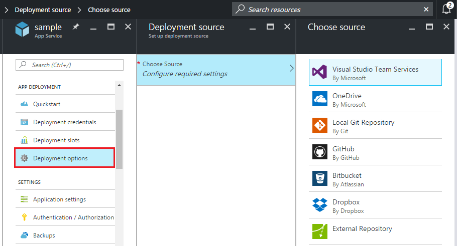
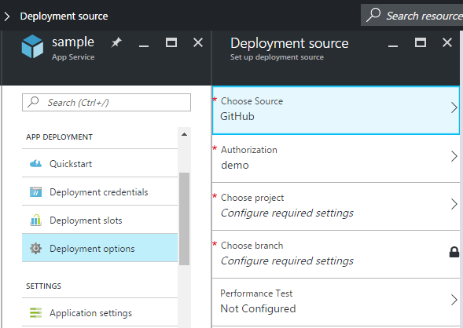
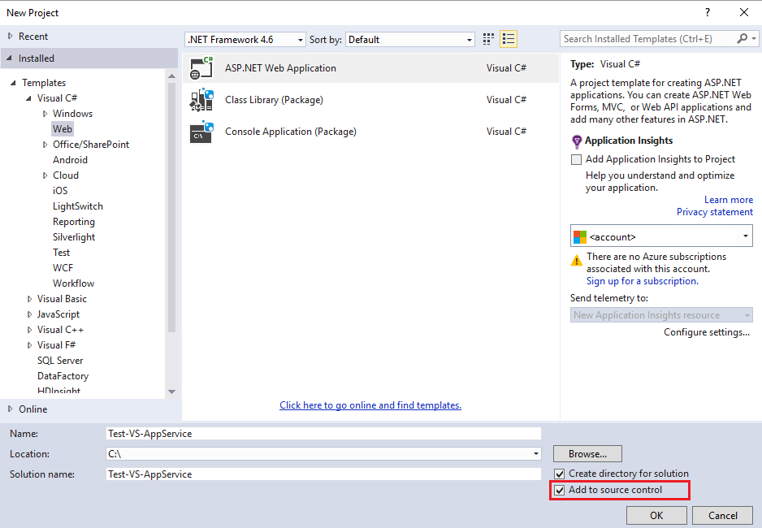

<properties
    pageTitle="Implementación continua al servicio de aplicación de Azure | Microsoft Azure"
    description="Obtenga información sobre cómo habilitar implementación continua al servicio de la aplicación de Azure."
    services="app-service"
    documentationCenter=""
    authors="dariagrigoriu"
    manager="wpickett"
    editor="mollybos"/>

<tags
    ms.service="app-service"
    ms.workload="na"
    ms.tgt_pltfrm="na"
    ms.devlang="na"
    ms.topic="article"
    ms.date="10/28/2016"
    ms.author="dariagrigoriu"/>
    
# Implementación continua Azure de aplicación de servicio

En este tutorial se muestra cómo configurar un flujo de trabajo de implementación continua para la aplicación de [Servicio de aplicaciones de Azure] . Integración de servicios de aplicación con BitBucket, GitHub y Visual Studio Team Services (VSTS) permite un flujo de trabajo de implementación continua donde Azure extrae las actualizaciones más recientes de su proyecto publicado en uno de estos servicios. Implementación continua es una buena opción para proyectos donde varios e integradas de contribuciones frecuentes.

## Habilitar la implementación continua

Para habilitar la implementación continua 

1. Publicar el contenido de la aplicación en el repositorio que se usará para su implementación continuo.  
    Para obtener más información sobre la publicación de su proyecto a estos servicios, vea [crear un repo (GitHub)], [crear una repo (BitBucket)]y [empezar a trabajar con VSTS].

2. En el módulo de menú de la aplicación en el [portal de Azure], haga clic en **implementación de la aplicación > Opciones de implementación**. Haga clic en **Elegir origen**, seleccione el origen de implementación.  

    
    
    > [AZURE.NOTE] Para configurar un VSTS cuenta para su implementación de servicio de aplicaciones, vea este [tutorial](https://github.com/projectkudu/kudu/wiki/Setting-up-a-VSTS-account-so-it-can-deploy-to-a-Web-App).
    
3. Completar el flujo de trabajo de autorización. 

4. En el módulo de **origen de la implementación** , elija el proyecto y rama para implementar desde. Cuando haya terminado, haga clic en **Aceptar**.
  
    

    > [AZURE.NOTE] Al habilitar implementación continua con GitHub o BitBucket, se mostrarán los proyectos públicos y privados.

    Aplicación de servicio crea una asociación con el repositorio seleccionado, extrae los archivos de la rama especificada y mantiene un duplicado del repositorio de la aplicación de servicio de aplicación. Al configurar la implementación continua de VSTS desde el portal de Azure, la integración usa la aplicación de servicio [motor de implementación de Kudu](https://github.com/projectkudu/kudu/wiki), que ya automatiza las tareas de compilación e implementación con cada `git push`. No es necesario configurar por separado implementación continua en VSTS. Una vez finalizado este proceso, el módulo de aplicación de **Opciones de implementación** mostrará una implementación activa que indica la implementación se realizó correctamente.

5. Para comprobar que la aplicación se implementa correctamente, haga clic en la **dirección URL** en la parte superior del módulo de la aplicación en el portal de Azure. 

6. Para comprobar que se está produciendo implementación continua del repositorio de su elección, insertar un cambio en el repositorio. Debe actualizar la aplicación para reflejar los cambios poco después de que finalice la inserción al repositorio. Puede comprobar que se introduce la actualización en el módulo de **Opciones de implementación** de la aplicación.

## Implementación continua de una solución de Visual Studio 

Insertar una solución Visual Studio al servicio de la aplicación de Azure es tan fácil como insertar un archivo index.html simple. El proceso de implementación de servicio de aplicación simplifica todos los detalles, incluido restaurar NuGet dependencias y la creación de los archivos binarios. Puede seguir los procedimientos recomendados de control de origen de mantener el código solo en el repositorio de Git y permitir la implementación de servicio de aplicaciones ocuparse del resto.

Los pasos para insertar la solución de Visual Studio al servicio de aplicación son igual que en la [sección anterior](#overview), siempre que configurar la solución y repositorio como sigue:

-   Use la opción de control de origen de Visual Studio para generar un `.gitignore` de archivos, como agregar la imagen a continuación o manualmente un `.gitignore` archivo en la raíz del repositorio con contenido parecido a este [ejemplo .gitignore](https://github.com/github/gitignore/blob/master/VisualStudio.gitignore). 

    
 
-   Agregar árbol del directorio de la solución completa al repositorio, con el archivo sln en la raíz del repositorio.

Cuando haya configurado su repositorio tal como se describe y configurado su aplicación en Azure para publicación continua de uno de los repositorios Git en línea, puede desarrollar su aplicación ASP.NET localmente en Visual Studio e implementar continuamente el código presionando los cambios en el repositorio de Git en línea.

## Deshabilitar implementación continua

Para deshabilitar la implementación continua, 

1. En el módulo de menú de la aplicación en el [portal de Azure], haga clic en **implementación de la aplicación > Opciones de implementación**. A continuación, haga clic en **Desconectar** en el módulo de **Opciones de implementación** .

        

2. Después de responder a **Sí** para el mensaje de confirmación, puede volver a módulo de la aplicación y haga clic en **implementación de la aplicación > Opciones de implementación** si desea configurar publicación desde otro origen.

## Recursos adicionales

* [Cómo investigar problemas comunes con la implementación continua](https://github.com/projectkudu/kudu/wiki/Investigating-continuous-deployment)
* [Cómo usar PowerShell para Azure]
* [Cómo usar las herramientas de línea de comandos de Azure para Mac y Linux]
* [Documentación GIT]
* [Proyecto Kudu](https://github.com/projectkudu/kudu/wiki)

>[AZURE.NOTE] Si desea empezar a trabajar con el servicio de aplicación de Azure antes de suscribirse para una cuenta de Azure, vaya a [Probar el servicio de aplicaciones](http://go.microsoft.com/fwlink/?LinkId=523751), donde puede crear inmediatamente una aplicación web de starter corta duración en la aplicación de servicio. Sin tarjetas de crédito obligatoria; sin compromisos.

[Servicio de aplicaciones de Azure]: https://azure.microsoft.com/en-us/documentation/articles/app-service-changes-existing-services/ 
[Portal de Azure]: https://portal.azure.com
[VSTS Portal]: https://www.visualstudio.com/en-us/products/visual-studio-team-services-vs.aspx
[Installing Git]: http://git-scm.com/book/en/Getting-Started-Installing-Git
[Cómo usar PowerShell para Azure]: ../articles/powershell-install-configure.md
[Cómo usar las herramientas de línea de comandos de Azure para Mac y Linux]: ../articles/xplat-cli-install.md
[Documentación GIT]: http://git-scm.com/documentation

[Crear un repo (GitHub)]: https://help.github.com/articles/create-a-repo
[Crear un repo (BitBucket)]: https://confluence.atlassian.com/display/BITBUCKET/Create+an+Account+and+a+Git+Repo
[Empezar a trabajar con VSTS]: https://www.visualstudio.com/get-started/overview-of-get-started-tasks-vs
[Continuous delivery to Azure using Visual Studio Team Services]: ../articles/cloud-services/cloud-services-continuous-delivery-use-vso.md
