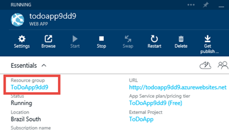
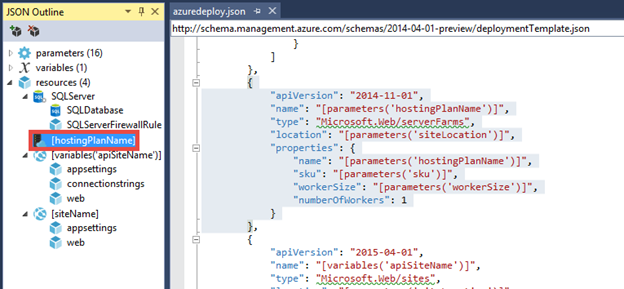
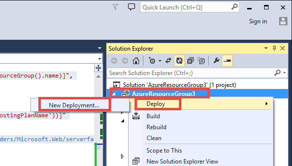
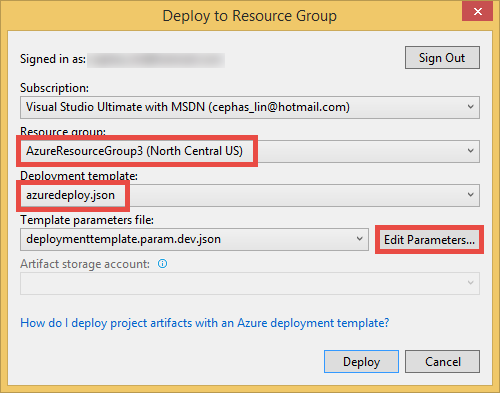

<properties
    pageTitle="Aprovisionar e implementar microservices predecible en Azure"
    description="Obtenga información sobre cómo implementar una aplicación se compone de microservices en el servicio de aplicación de Azure como una sola unidad y de forma predecible con plantillas de grupo de recursos JSON y secuencias de comandos de PowerShell."
    services="app-service"
    documentationCenter=""
    authors="cephalin"
    manager="wpickett"
    editor="jimbe"/>

<tags
    ms.service="app-service"
    ms.workload="na"
    ms.tgt_pltfrm="na"
    ms.devlang="na"
    ms.topic="article"
    ms.date="01/06/2016"
    ms.author="cephalin"/>

# Aprovisionar e implementar microservices predecible en Azure #

Este tutorial muestra cómo aprovisionar e implementar una aplicación se compone de [microservices](https://en.wikipedia.org/wiki/Microservices) en el [Servicio de aplicación de Azure](/services/app-service/) como una sola unidad y de forma predecible con plantillas de grupo de recursos JSON y secuencias de comandos de PowerShell. 

Cuando aprovisionamiento e implementar aplicaciones de gran escala que se componen de altamente desacoplado microservices, la capacidad de repetición y la predicción son fundamentales para el éxito. [Servicio de aplicación de Azure](/services/app-service/) le permite crear microservices que incluyan aplicaciones web, aplicaciones móviles, API aplicaciones y aplicaciones de lógica. [Administrador de recursos de Azure](../azure-resource-manager/resource-group-overview.md) le permite administrar todos los microservices como una unidad, junto con las dependencias de recursos como base de datos y configuración de control de origen. Ahora, también puede implementar dicha aplicación con plantillas JSON y secuencias de comandos de PowerShell simple. 

[AZURE.INCLUDE [app-service-web-to-api-and-mobile](../../includes/app-service-web-to-api-and-mobile.md)] 

## Lo que debe hacer ##

En el tutorial, se implementa una aplicación que incluye:

-   Dos web apps (es decir, dos microservices)
-   Un base de datos SQL de back-end
-   Configuración de la aplicación, las cadenas de conexión y control de código fuente
-   Las opciones de ajuste automático, alertas, perspectivas de aplicación

## Herramientas que se usa ##

En este tutorial, usará las herramientas siguientes. Dado que no está completa discusión en herramientas, voy a limitarse al escenario de llevar a cabo y solo le ofrecen una breve introducción a cada uno, y donde puede encontrar más información sobre él. 

### Plantillas de administrador de recursos de Azure (JSON) ###
 
Cada vez que cree una aplicación web en la aplicación de servicio de Azure, por ejemplo, Administrador de recursos de Azure usa una plantilla JSON para crear el grupo de recursos completa con los recursos de componente. Una plantilla complejos de [Azure Marketplace](/marketplace) como la aplicación de [WordPress Scalable](/marketplace/partners/wordpress/scalablewordpress/) puede incluir la base de datos MySQL, cuentas de almacenamiento, el plan de servicios de aplicación, la aplicación web, las reglas de alertas, configuración de la aplicación, configuración Autoescala y más y, a continuación, todas estas plantillas están disponibles a través de PowerShell. Para obtener información sobre cómo descargar y usar estas plantillas, vea [con Azure con el Administrador de recursos de Azure](../powershell-azure-resource-manager.md).

Para obtener más información sobre las plantillas de administrador de recursos de Azure, vea [Crear plantillas de administrador de recursos de Azure](../resource-group-authoring-templates.md)

### Azure SDK 2.6 para Visual Studio ###

El SDK más reciente contiene mejoras en la compatibilidad de la plantilla de administrador de recursos en el editor de JSON. Puede usar para crear una plantilla de grupo de recursos desde cero o abrir una plantilla JSON existente (como una plantilla de la Galería descargados) rápidamente para modificación, rellenar el archivo de parámetros e incluso implementar el grupo de recursos directamente desde una solución de grupo de recursos de Azure.

Para obtener más información, vea [Azure SDK 2.6 para Visual Studio](/blog/2015/04/29/announcing-the-azure-sdk-2-6-for-net/).

### Azure PowerShell 0.8.0 o posterior ###

A partir de la versión 0.8.0, la instalación de Azure PowerShell incluye el módulo de administrador de recursos de Azure además del módulo Azure. Este nuevo módulo permite la implementación de grupos de recursos de secuencias de comandos.

Para obtener más información, vea [con Azure con el Administrador de recursos de Azure](../powershell-azure-resource-manager.md)

### Explorador de recursos de Azure ###

Esta [herramienta de vista previa](https://resources.azure.com) le permite explorar las definiciones de JSON de todos los grupos de recursos de la suscripción y los recursos individuales. En la herramienta, puede editar las definiciones de JSON de un recurso, eliminar toda una jerarquía de recursos y crear nuevos recursos.  La información disponible en esta herramienta es muy útil para la creación de plantilla, ya que muestra las propiedades que debe establecer para un determinado tipo de recurso, los valores correctos, etcetera. Incluso puede crear el grupo de recursos en el [Portal de Azure](https://portal.azure.com/)y luego Inspeccionar sus definiciones de JSON en la herramienta de explorador que le ayudarán a templatize el grupo de recursos.

### Implementar a botón de Azure ###

Si utiliza GitHub para control de código fuente, puede colocar una [implementación al botón Azure](/blog/2014/11/13/deploy-to-azure-button-for-azure-websites-2/) en el archivo Léame. MD, lo que permite una implementación de llave UI en Azure. Aunque puede hacerlo cualquier aplicación web simple, puede ampliar esta opción para habilitar la implementación de un grupo de recursos toda la colocación de un archivo azuredeploy.json en la raíz del repositorio. El botón Azure de implementación utilizará este archivo JSON, que contiene la plantilla de grupo de recursos, para crear el grupo de recursos. Para obtener un ejemplo, vea el ejemplo [ToDoApp](https://github.com/azure-appservice-samples/ToDoApp) , que se usará en este tutorial.

## Obtener la plantilla de grupo de recursos de ejemplo ##

Ahora vamos a obtener derecho a ella.

1.  Vaya a la muestra de servicio de la aplicación [ToDoApp](https://github.com/azure-appservice-samples/ToDoApp) .

2.   En readme.md, haga clic en **implementar en Azure**.
 
3.  Es necesario para el sitio de [implementar a azure](https://deploy.azure.com) y pedirá que implementación parámetros de entrada. Observe que la mayoría de los campos se rellena con el nombre de repositorio y algunas cadenas aleatorias. Puede cambiar todos los campos si lo desea, pero lo único que tenga que escribir es el inicio de sesión administrativa de SQL Server y la contraseña, a continuación, haga clic en **siguiente**.
 
    

4.  A continuación, haga clic en **implementar** para iniciar el proceso de implementación. Una vez que el proceso se ejecuta hasta el final, haga clic en el http://todoapp*XXXX*. azurewebsites.net vínculo para examinar la aplicación implementada. 

    

    La interfaz de usuario podría ser un poco lento al primero explorarlo porque solo están iniciando las aplicaciones, pero convencerle usted mismo que es una aplicación totalmente funcional.

5.  En la página implementar, haga clic en el vínculo **Administrar** para ver la nueva aplicación en el Portal de Azure.

6.  En la lista desplegable **Essentials** , haga clic en el vínculo del grupo de recursos. Observe también que la aplicación web ya está conectada al repositorio GitHub en el **Proyecto externo**. 

    
 
7.  En el módulo de grupo de recursos, tenga en cuenta que existen dos aplicaciones web y una base de datos de SQL en el grupo de recursos.

    
 
Todo lo que ha visto en unos minutos breves es una aplicación de microservice de dos totalmente implementado, con todos los componentes, dependencias, configuración, base de datos y publicación continua, configurar una orquestación automatizado en el Administrador de recursos de Azure. Todo ello dos causas:

-   El botón Azure de implementación
-   azuredeploy.JSON en la raíz de repo

Puede implementar esta misma aplicación decenas, cientos o miles de veces y tener la misma configuración cada vez. La capacidad de repetición y la predicción de este enfoque le permiten implementar aplicaciones de alto nivel con gran facilidad y confianza.

## Examine AZUREDEPLOY (o editar). JSON ##

Ahora vamos a ver cómo se haya configurado el repositorio de GitHub. Estará usando el editor de JSON en el SDK de .NET Azure, así que si no ha instalado ya [Azure .NET SDK 2.6](/downloads/), hágalo ahora.

1.  Duplicar el repositorio de [ToDoApp](https://github.com/azure-appservice-samples/ToDoApp) mediante la herramienta git favoritos. En la captura de pantalla a continuación, hago esto en el Explorador de equipo en Visual Studio de 2013.

    

2.  Desde la raíz de repositorio, abra azuredeploy.json en Visual Studio. Si no ve el panel de esquema de JSON, debe instalar Azure .NET SDK.

    

No voy a describir todos los detalles del formato JSON, pero la sección [Más recursos](#resources) contiene vínculos para el idioma de plantilla de grupo de recursos de aprendizaje. A continuación, voy a mostrar las características interesantes que pueden ayudarle a empezar a realizar su propia plantilla personalizada para la implementación de la aplicación.

### Parámetros ###

Eche un vistazo a la sección de parámetros para comprobar que la mayoría de estos parámetros es lo que el botón de **implementar a Azure** le pide que especifique. El sitio detrás del botón **distribuir a Azure** rellena la interfaz de usuario mediante los parámetros definidos en azuredeploy.json de entrada. Estos parámetros se usan en las definiciones de recursos, como los nombres de los recursos, valores de propiedad, etcetera.

### Recursos ###

En el nodo de recursos, puede ver que se definen los recursos de primer nivel 4, incluyendo una instancia de SQL Server, un plan de servicio de aplicaciones y dos aplicaciones web. 

#### Plan de servicios de aplicación ####

Comencemos con un recurso de nivel raíz simple en el JSON. En el esquema de JSON, haga clic en el plan de servicios de aplicación denominado **[hostingPlanName]** para resaltar el código JSON correspondiente. 

Tenga en cuenta que el `type` elemento especifica la cadena a un plan de servicio de la aplicación (se llamaba una granja de servidores un mucho, mucho tiempo hace), y otros elementos y propiedades se rellenan con los parámetros definidos en el archivo JSON para este recurso no dispone de los recursos anidados.

>[AZURE.NOTE] Tenga en cuenta también que el valor de `apiVersion` indica qué versión de la API de REST para usar la definición del recurso JSON con y puede afectar a cómo se deben aplicar formato a los recursos dentro de Azure la `{}`. 

#### SQL Server ####

A continuación, haga clic en el recurso de SQL Server con el nombre de **SQL Server** en el esquema de JSON.

 
Tenga en cuenta lo siguiente sobre el código JSON resaltado:

-   El uso de parámetros garantiza que los recursos creados se denominado y configurados de manera que los hace coherentes entre sí.
-   El recurso de SQL Server tiene dos recursos anidados, cada uno con un valor diferente para `type`.
-   Los recursos anidados dentro de `“resources”: […]`, donde se definen la base de datos y las reglas de firewall, que tiene un `dependsOn` elemento que especifica el identificador de recursos de los recursos de SQL Server de nivel raíz. Esto indica el Administrador de recursos de Azure, "antes de crear este recurso, que ya deben existir otros recursos; y si ese recurso se define en la plantilla, crean que uno primero".

    >[AZURE.NOTE] Para obtener información detallada sobre cómo usar la `resourceId()` función, vea [Funciones de plantilla de administrador de recursos de Azure](../resource-group-template-functions.md).

-   El efecto de la `dependsOn` elemento es que el Administrador de recursos de Azure puede saber qué recursos pueden crearse en paralelo y los recursos que deben crearse secuencialmente. 

#### Aplicación Web ####

Ahora, vamos a pasar a las aplicaciones web real, que son más complicadas. Haga clic en la aplicación web de [variables('apiSiteName')] en el esquema de JSON para resaltar su código JSON. Observe que cosas reciben mucho más interesantes. Para ello, hablo sobre las características de uno a uno:

##### Recurso raíz #####

La aplicación web depende de dos recursos distintos. Esto significa que el Administrador de recursos de Azure va a crear la aplicación web solo después de crearán el plan de servicio de aplicaciones y la instancia de SQL Server.

##### Configuración de la aplicación #####

La configuración de aplicación también se define como un recurso anidado.

En la `properties` elemento para `config/appsettings`, tiene dos opciones de aplicación en el formato `“<name>” : “<value>”`.

-   `PROJECT`es una [opción de KUDU](https://github.com/projectkudu/kudu/wiki/Customizing-deployments) que indica el proyecto que usar en una solución de Visual Studio de varios proyecto de implementación de Azure. Le mostrará más adelante cómo está configurado el control de código fuente, pero ya que es el código de ToDoApp en una solución de varios proyecto Visual Studio, se necesita esta configuración.
-   `clientUrl`es simplemente una aplicación de configuración de código de la aplicación que utiliza.

##### Cadenas de conexión #####

Las cadenas de conexión también se definen como un recurso anidado.

En la `properties` elemento para `config/connectionstrings`, cada cadena de conexión también se define como un par de nombre: valor, con el formato específico de `“<name>” : {“value”: “…”, “type”: “…”}`. Para el `type` elemento, los valores posibles son `MySql`, `SQLServer`, `SQLAzure`, y `Custom`.

>[AZURE.TIP] Para obtener una lista definitiva de los tipos de cadena de conexión, ejecute el comando siguiente en Azure PowerShell: \[Enum]::GetNames("Microsoft.WindowsAzure.Commands.Utilities.Websites.Services.WebEntities.DatabaseType")
    
##### Control de código fuente #####

La configuración de control de código fuente también se define como un recurso anidado. Administrador de recursos de Azure utiliza este recurso para configurar publicación continua (vea advertencia en `IsManualIntegration` más adelante) y también para empezar la implementación de código de la aplicación automáticamente durante el procesamiento del archivo JSON.

`RepoUrl`y `branch` deben ser muy intuitiva y deben apuntar al repositorio Git y el nombre de la rama para publicarlos en. De nuevo, se definen por los parámetros de entrada. 

Nota en la `dependsOn` elemento que, además del recurso de la aplicación web, `sourcecontrols/web` también depende de `config/appsettings` y `config/connectionstrings`. Esto es porque una vez que `sourcecontrols/web` está configurado, el proceso de implementación de Azure intentará automáticamente a implementar, genere e inicie el código de la aplicación. Por lo tanto, insertar esta dependencia le permite asegurarse de que la aplicación tiene acceso a la configuración de la aplicación necesarios y cadenas de conexión antes de ejecuta el código de la aplicación. 

>[AZURE.NOTE] Tenga en cuenta también que `IsManualIntegration` está establecida en `true`. Esta propiedad es necesaria en este tutorial, porque no es propietario del repositorio de GitHub realmente y realmente no puede conceder permiso a Azure para configurar la publicación continua de [ToDoApp](https://github.com/azure-appservice-samples/ToDoApp) (es decir Insertar repositorio automática actualizaciones de Azure). Puede usar el valor predeterminado `false` para el repositorio especificado solo si ha configurado las credenciales del propietario GitHub en el [portal de Azure](https://portal.azure.com/) antes. En otras palabras, si configurado previamente control de origen para GitHub o BitBucket cualquier aplicación en el [Portal de Azure](https://portal.azure.com/) , usando sus credenciales de usuario, a continuación, Azure le recuerde las credenciales y usarlos siempre implementar cualquier aplicación de GitHub o BitBucket en el futuro. Sin embargo, si todavía no lo ha hecho ya, se producirá un error en la implementación de la plantilla JSON al administrador de recursos de Azure intenta configurar las opciones de control de origen de la aplicación web porque no puede iniciar sesión en GitHub o BitBucket con las credenciales del propietario del repositorio.

## Comparar la plantilla JSON con el grupo de recursos implementada ##

Aquí, puede ir a través de módulos de todos los de la aplicación web en el [Portal de Azure](https://portal.azure.com/), pero hay otra herramienta que simplemente como útil, si no es más. Vaya a la herramienta de vista previa del [Explorador de recursos de Azure](https://resources.azure.com) , que ofrece una representación JSON de todos los grupos de recursos de las suscripciones, ya que realmente existen en el servidor de Azure. También puede ver cómo se corresponde con la jerarquía del archivo de plantilla que se utiliza para crear jerarquía JSON del grupo de recursos en Azure.

Por ejemplo, al ir a la herramienta de [Explorador de recursos de Azure](https://resources.azure.com) y expanda los nodos en el explorador, puedo ver el grupo de recursos y los recursos de nivel raíz que se recopilan en sus tipos de recursos respectivos.

Si Rastrear desagrupando datos de una aplicación web, debería poder ver los detalles de configuración de aplicación web similar a la debajo de captura de pantalla:

De nuevo, los recursos anidados deben tener una jerarquía muy similar a los de su archivo de plantilla JSON y verá la configuración de la aplicación, las cadenas de conexión, por ejemplo, refleja correctamente en el panel JSON. Ausencia de configuración de aquí puede indicar un problema con el archivo JSON y puede ayudar a solucionar problemas de su archivo de plantilla JSON.

## Implementar la plantilla de grupo de recursos usted mismo ##

El botón de **implementar a Azure** es ideal, pero le permite implementar la plantilla de grupo de recursos en azuredeploy.json solo si ya ha insertado azuredeploy.json a GitHub. Azure .NET SDK también proporciona las herramientas para implementar cualquier archivo de plantilla JSON directamente desde su equipo local. Para ello, siga los pasos siguientes:

1.  En Visual Studio, haga clic en **archivo** > **nuevo** > **proyecto**.

2.  Haga clic en **Visual C#** > **nube** > **Grupo de recursos de Azure**, a continuación, haga clic en **Aceptar**.

    

3.  En **Seleccionar plantilla de Azure**, seleccione la **Plantilla en blanco** y haga clic en **Aceptar**.

4.  Arrastre la carpeta de **plantillas** del nuevo proyecto azuredeploy.json.

    

5.  Desde el Explorador de soluciones, abra la azuredeploy.json copiada.

6.  Para ilustrar la demostración, vamos a agregar algunos recursos estándares de una perspectiva de aplicación a nuestro archivo JSON, haciendo clic en **Agregar recurso**. Si le interesa simplemente implementar el archivo JSON, vaya a los pasos de implementación.

    

7.  Seleccione **Perspectivas de aplicación para las aplicaciones Web**, a continuación, asegúrese de que un servicio de aplicación existente planear y web app está seleccionada y, a continuación, haga clic en **Agregar**.

    

    Ahora podrá ver varios nuevos recursos que, según el recurso y lo que hace, tiene dependencias en el plan de servicio de aplicación o la aplicación web. Estos recursos no están habilitados por su definición existente y va a cambiar.

    
 
8.  En el esquema de JSON, haga clic en **appInsights Autoescala** para resaltar su código JSON. Esta es la configuración de escalado de su plan de servicios de aplicación.

9.  En el código JSON resaltado, busque la `location` y `enabled` propiedades y definirlos como se muestra a continuación.

    

10. En el esquema de JSON, haga clic en **CPUHigh appInsights** para resaltar su código JSON. Se trata de una alerta.

11. Busque la `location` y `isEnabled` propiedades y definirlos como se muestra a continuación. Haga lo mismo para las demás tres alertas (bulbos púrpuras).

    

12. Ahora ya está listo para implementar. Haga clic en el proyecto y seleccione **implementar** > **Implementación de nuevo**.

    

13. Inicie sesión en su cuenta de Azure si aún no lo ha hecho.

14. Seleccione un grupo de recursos existente en su suscripción o cree uno nuevo, seleccione **azuredeploy.json**y, a continuación, haga clic en **Editar parámetros**.

    

    Ahora podrá editar todos los parámetros definidos en el archivo de plantilla en una tabla bueno. Parámetros que definen valores predeterminados ya tendrán sus valores predeterminados, y se muestran los parámetros que definen una lista de valores permitidos como listas desplegables.

    

15. Rellene todos los parámetros vacíos y use la [dirección de repo GitHub ToDoApp](https://github.com/azure-appservice-samples/ToDoApp.git) **repoUrl**. A continuación, haga clic en **Guardar**.
 
    

    >[AZURE.NOTE] Ajuste automático es una característica ofrecida en nivel **estándar** o versiones posteriores, y alertas de nivel de plan son características ofrecidas en nivel **básico** o versiones posteriores, tendrá que establecer el parámetro **sku** a **estándar** o **Premium** para poder ver todos sus ideas de aplicación nuevos recursos se encenderán.
    
16. Haga clic en **desplegar**. Si ha seleccionado **Guardar contraseñas**, se guardará la contraseña en el parámetro archivo **en texto sin formato**. En caso contrario, le pedirá que introduzca la contraseña de base de datos durante el proceso de implementación.

¡Eso es todo! Ahora solo debe ir en el [Portal de Azure](https://portal.azure.com/) y la herramienta de [Azure Explorador de recursos](https://resources.azure.com) para ver las alertas de nuevas y configuración de Autoescala agregado a su JSON implementar aplicación.

Los pasos de esta sección principalmente lleva a cabo lo siguiente:

1.  Preparar el archivo de plantilla
2.  Crear un archivo de parámetro con el archivo de plantilla
3.  Implementa el archivo de plantilla con el parámetro

El último paso se realiza fácilmente un cmdlet de PowerShell. Para ver lo que hizo Visual Studio cuando implementa la aplicación, abra Scripts\Deploy AzureResourceGroup.ps1. Hay una gran cantidad de código, pero voy a resaltar todo el código pertinente que necesita para implementar el archivo de plantilla con el parámetro.

El último cmdlet, `New-AzureResourceGroup`, es el que realmente realiza la acción. Que todo esto deberá demostrar que, con la Ayuda de herramientas, es relativamente sencillo implementar la aplicación de nube predecible. Cada vez que ejecute el cmdlet en la misma plantilla con el mismo parámetro de archivo, va a obtener el mismo resultado.

## Resumen ##

En DevOps, capacidad de repetición y predicción son claves para cualquier implementación correcta de una aplicación de alto nivel que se compone de microservices. En este tutorial, ha implementado una aplicación de dos microservice en Azure como un único grupo de recursos con la plantilla de administrador de recursos de Azure. Afortunadamente, ha dado el conocimiento que necesita para comenzar a convertir la aplicación en Azure en una plantilla y pueden aprovisionar e implementarlo predecible. 

## Pasos siguientes ##

Descubra cómo [Aplicar metodologías ágiles y publicar continuamente la aplicación microservices con facilidad](app-service-agile-software-development.md) y avanzadas de implementación técnicas como [implementación flighting](app-service-web-test-in-production-controlled-test-flight.md) fácilmente.

## Más recursos ##

-   [Lenguaje de la plantilla de administrador de recursos de Azure](../resource-group-authoring-templates.md)
-   [Creación de plantillas de administrador de recursos de Azure](../resource-group-authoring-templates.md)
-   [Funciones de plantilla de administrador de recursos de Azure](../resource-group-template-functions.md)
-   [Implementar una aplicación con la plantilla de administrador de recursos de Azure](../resource-group-template-deploy.md)
-   [Usar PowerShell Azure con el Administrador de recursos Azure](../powershell-azure-resource-manager.md)
-   [Solución de problemas de implementaciones de grupo de recursos en Azure](../resource-manager-troubleshoot-deployments-portal.md)

 
