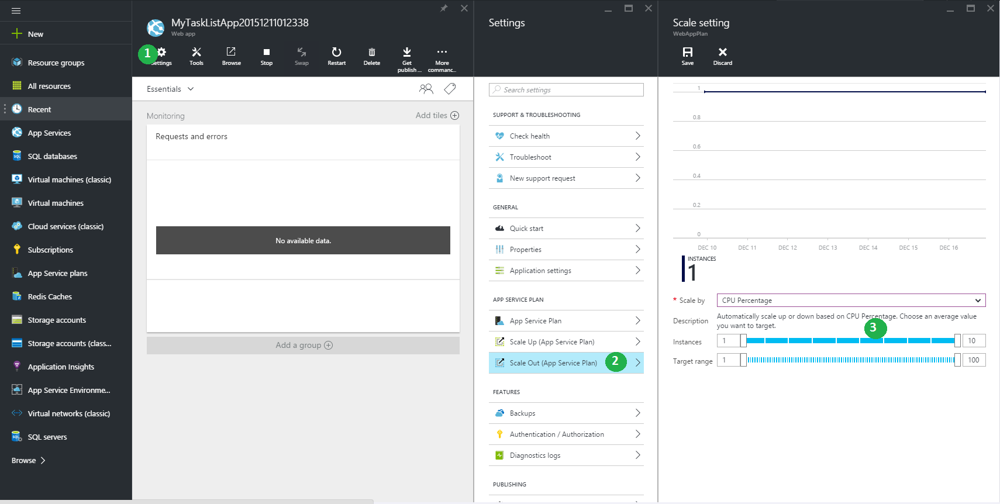
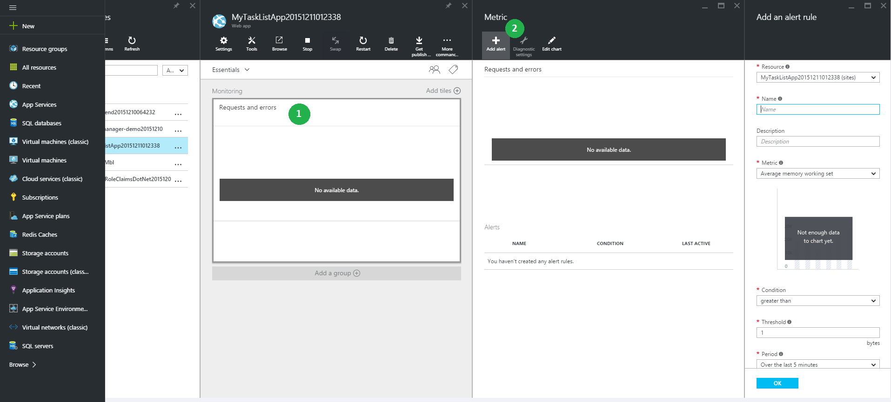

<properties
    pageTitle="Referencia para navegar por el portal de Azure"
    description="Obtenga información sobre la experiencia de usuario diferentes para la aplicación de servicio Web entre el portal de administración y el Portal de Azure"
    services="app-service"
    documentationCenter=""
    authors="jaime-espinosa"
    manager="wpickett"
    editor="jimbe"/>

<tags
    ms.service="app-service"
    ms.workload="na"
    ms.tgt_pltfrm="na"
    ms.devlang="na"
    ms.topic="article"
    ms.date="02/26/2016"
    ms.author="jaime-espinosa"/>

# Referencia para navegar por el portal de Azure

Sitios Web Azure ahora se denomina [Aplicaciones de aplicación de servicio Web](http://go.microsoft.com/fwlink/?LinkId=529714). Estamos actualizando toda nuestra documentación para que refleje este cambio de nombre y proporcione instrucciones para el Portal de Azure. Hasta que haya finalizado ese proceso, puede utilizar este documento como guía para trabajar con Web Apps en el portal de Azure.

[AZURE.INCLUDE [app-service-web-to-api-and-mobile](../../includes/app-service-web-to-api-and-mobile.md)] 
 
## El futuro del Portal clásico de Azure

Mientras se observa los cambios de personalización de marca en el Portal de Azure clásica, ese portal va a ser reemplazados por el Portal de Azure. Mientras se está omitiendo el portal clásico, está cambiando el enfoque de desarrollo de nuevos en el Portal de Azure. En el Portal de Azure vaya todas las próximas características para las aplicaciones Web. Empezar a usar el Portal de Azure para aprovechar las ventajas de la última y mejor que aplicaciones Web tiene que ofrecer.

## Diferencias de diseño entre el Portal de Azure y Azure clásica Portal

En el portal clásico, se muestran todos los servicios de Azure en el lado izquierdo. Navegación en el portal de clásica sigue una estructura de árbol, donde empieza desde el servicio y vaya a cada elemento. Esta estructura funciona bien cuando administrar componentes independientes. Sin embargo, aplicaciones basadas en Azure son una colección de servicios interconectados y la estructura de árbol no es ideal para trabajar con conjuntos de servicios. 

El portal de Azure facilita la generar aplicaciones-to-end con los componentes de servicios múltiples. El portal se organiza como *viajes*. Un *viaje* es una serie de *módulos*, que son contenedores para los distintos componentes. Por ejemplo, Configurar escala automática para una aplicación web es un *viaje* que toma varias aspas tal como se muestra en el siguiente ejemplo: módulo de **sitio web** (que título placa aún no se ha actualizado para usar la nueva terminología), el módulo de **configuración** y el módulo de **escalado** . En el ejemplo, Autoescala está está configurado para dependen de uso de CPU, por lo que también hay un módulo de **Porcentaje de CPU** . Los componentes de los *módulos* se denominan *partes*, que aspecto mosaicos. 

## Ejemplo de navegación: crear una aplicación web

Crear nuevas aplicaciones web es tan fácil como 1-2-3. La imagen siguiente muestra el portal clásico y el portal en paralelo para demostrar que no ha cambiado mucho en el número de pasos necesarios para obtener una aplicación web hacia arriba y ejecutar. 

En el portal puede elegir entre los tipos más comunes de aplicaciones web, incluidas las aplicaciones de la Galería populares como WordPress. Para obtener una lista completa de aplicaciones disponibles, visite el [Catálogo de soluciones de Azure].

Cuando se crea una aplicación web, especificar la dirección URL, plan de servicios de aplicación y la ubicación en el portal de igual que lo haría en el portal de clásico. 

Además, el portal le permite definir otras opciones de configuración comunes. Por ejemplo, [grupos de recursos](../azure-resource-manager/resource-group-overview.md) que sea fácil de ver y administrar recursos relacionados de Azure. 

## Ejemplo de navegación: características y configuración

Todos los valores y las características ahora se agrupan lógicamente en un único módulo, desde la que puede navegar.

Por ejemplo, puede crear dominios personalizados, haga clic en **dominios personalizados y SSL** en el módulo de **configuración** .

Para configurar una alerta de supervisión, haga clic en **errores y solicitudes** y, a continuación, **Agregar alerta**.

Para habilitar diagnósticos, haga clic en **registros de diagnósticos** en el módulo de **configuración** .

 
Para configurar la aplicación, haga clic en **configuración de la aplicación** en el módulo de **configuración** . 

Que no sea el nombre de la marca, ha cambiado el nombre o agrupados de forma diferente para que sea más fácil encontrarlas algunas cosas en el portal. Por ejemplo, a continuación, encontrará una captura de pantalla de la página correspondiente de la aplicación configuración (**Configurar**) en el portal de clásico.

## Más recursos

[Azure Portal]: https://portal.azure.com
[Azure Marketplace]: /marketplace/

>[AZURE.NOTE] Si desea empezar a trabajar con el servicio de aplicación de Azure antes de suscribirse para una cuenta de Azure, vaya a [Probar el servicio de aplicaciones](http://go.microsoft.com/fwlink/?LinkId=523751), donde puede crear inmediatamente una aplicación web de starter corta duración en la aplicación de servicio. Sin tarjetas de crédito obligatoria; sin compromisos.

## ¿Qué ha cambiado
* Encontrará una guía para el cambio de sitios Web a la aplicación de servicio: [servicio de aplicación de Azure y su influencia sobre los servicios de Azure existentes](http://go.microsoft.com/fwlink/?LinkId=529714)
 
