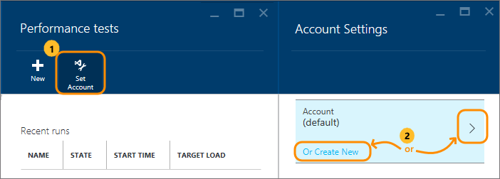
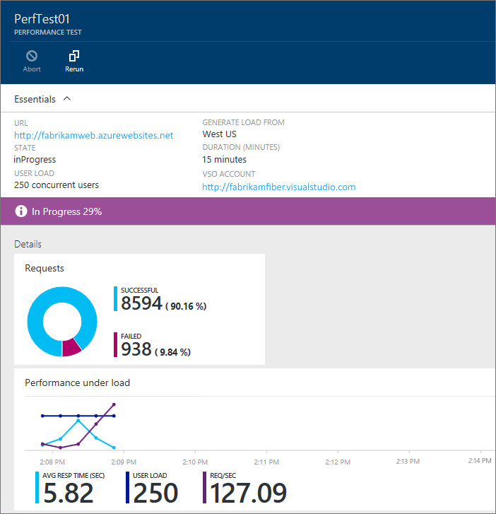

<properties
   pageTitle="Probar el rendimiento de la aplicación web de Azure | Microsoft Azure"
   description="Realizar pruebas de rendimiento de aplicación web de Azure para comprobar cómo la aplicación controla la carga de usuarios. Medir el tiempo de respuesta y encontrar errores que pueden indicar problemas."
   services="app-service\web"
   documentationCenter=""
   authors="ecfan"
   manager="douge"
   editor="jimbe"/>

<tags
   ms.service="app-service-web"
   ms.workload="web"
   ms.tgt_pltfrm="na"
   ms.devlang="na"
   ms.topic="article"
   ms.date="05/25/2016"
   ms.author="estfan; manasma; ahomer"/>

# <a name="performance-test-your-azure-web-app-under-load"></a>La aplicación de Azure en la carga de prueba de rendimiento

Comprobar el rendimiento de la aplicación web antes de iniciarlo o implemente actualizaciones de producción. De este modo, puede evaluar mejor si la aplicación está lista para versión. Estar seguro de que su aplicación puede controlar el tráfico durante el uso de recursos asignadas o en la siguiente inserción de marketing.

Durante la versión preliminar pública, puede prueba de rendimiento a su aplicación de forma gratuita en el Portal de Azure.
Estas pruebas simulan carga de usuario en la aplicación durante un período de tiempo específico y medir la respuesta de la aplicación. Por ejemplo, los resultados de pruebas muestran la velocidad se responde la aplicación a un número específico de usuarios. También se muestran cuántas peticiones error, que podría indicar problemas con la aplicación.      


## <a name="before-you-start"></a>Antes de empezar

* Necesitará una [suscripción de Azure](https://account.windowsazure.com/subscriptions), si aún no tiene una. Obtenga información sobre cómo puede [Abrir una cuenta de Azure de forma gratuita](https://azure.microsoft.com/pricing/free-trial/?WT.mc_id=A261C142F).

* Tendrá una cuenta de [Visual Studio Team Services](https://www.visualstudio.com/products/what-is-visual-studio-online-vs) para mantener el historial de la prueba de rendimiento. Se creará automáticamente una cuenta adecuada al configurar la prueba de rendimiento. O bien, puede crear una nueva cuenta o usar una cuenta existente si es el propietario de la cuenta. 

* Implemente la aplicación para realizar pruebas en un entorno de producción no. Haga que su aplicación use un plan de servicio de aplicación que no sea el plan de producción. De este modo, no afectará a los clientes existentes o ralentizar la aplicación de producción. 

## <a name="set-up-and-run-your-performance-test"></a>Configurar y ejecutar la prueba de rendimiento

0.  Inicie sesión en el [Portal de Azure](https://portal.azure.com). Para usar una cuenta de Visual Studio Team Services que es el propietario, inicie sesión como el propietario de la cuenta.

0.  Vaya a la aplicación web.

    

0.  Vaya a la **prueba de rendimiento**.

    
 
0. Ahora podrá vincular una cuenta de [Visual Studio Team Services](https://www.visualstudio.com/products/what-is-visual-studio-online-vs) para mantener el historial de la prueba de rendimiento.

    Si tiene una cuenta de servicios de grupo, seleccione esa cuenta. Si no, cree una nueva cuenta.

    

0.  Crear la prueba de rendimiento. Establecer los detalles y ejecutar la prueba. 

Puede ver los resultados en tiempo real mientras se ejecuta la prueba.

Por ejemplo, supongamos que tenemos una aplicación que le proporcionó los cupones de venta de vacaciones del año pasado. Este evento había pasado 15 minutos con una carga máxima de 100 clientes simultáneas. Queremos doble el número de clientes este año. También queremos mejorar la satisfacción del cliente, reduciendo el tiempo de carga de página de 5 segundos a 2 segundos. Por lo tanto, se deberá probar el rendimiento de nuestros actualizada la aplicación con 250 usuarios de 15 minutos.

Se le simular carga en nuestra aplicación generando usuarios virtuales (clientes) que visite nuestro sitio web al mismo tiempo. Esto le mostrará nos cuántas peticiones son errores o responde lentamente.

  

   *  Dirección URL de la aplicación predeterminada se agrega automáticamente. 
   Puede cambiar la dirección URL para probar otras páginas (solo solicitudes HTTP GET).

   *  Para simular las condiciones locales y reducir la latencia, seleccione una ubicación más cercana a los usuarios para generar la carga.

  Aquí es la prueba en curso. Durante el primer minuto, nuestra página de carga más despacio de queremos.

  

  Cuando haya terminado la prueba, aprendemos que cargue la página después del primer minuto con mayor rapidez. Esto ayuda a identificar dónde que podría desear hacer para solucionar el problema.

  

## <a name="test-multiple-urls"></a>Probar varias direcciones URL

También puede ejecutar pruebas de rendimiento que incorpora varias direcciones URL que representan un escenario de usuario de llevar a cabo al cargar un archivo de prueba de Visual Studio Web. Algunas de las formas puede crear una prueba de Visual Studio Web son de archivo:

* [Capturar el tráfico utilizando Fiddler y exportar como un archivo de prueba de Visual Studio Web](http://docs.telerik.com/fiddler/Save-And-Load-Traffic/Tasks/VSWebTest)
* [Crear un archivo de prueba de carga en Visual Studio](https://www.visualstudio.com/docs/test/performance-testing/run-performance-tests-app-before-release)

Para cargar y ejecutar un archivo de prueba de Visual Studio Web:
 
0. Siga los pasos anteriores para abrir el módulo de **prueba de rendimiento nuevo** .
   En este módulo, elija la opción probar utilizando CONFIGFURE para abrir el módulo **de prueba configurar mediante** .  

    

0. Compruebe que el tipo de prueba se establece en **Visual Studio Web Test** y seleccione el archivo de almacenamiento de HTTP.
    Utilice el icono de "carpeta" para abrir el cuadro de diálogo de selector de archivo.

    

    Después de que se ha cargado el archivo, verá la lista de direcciones URL para comprobar en la sección de detalles de la dirección URL.
 
0. Especificar la carga de usuarios y duración de la prueba y luego elija **Ejecutar prueba**.

    

    Cuando haya finalizado la prueba, verá los resultados en dos paneles. El panel izquierdo muestra la información de performnace como una serie de gráficos.

    

    El panel derecho muestra una lista de solicitudes de errores, con el tipo de error y el número de veces que ha producido.

    

0. Vuelva a ejecutar la prueba seleccionando el icono de **volver a ejecutar** en la parte superior del panel derecho.

    

##  <a name="q--a"></a>Preguntas y respuestas

#### <a name="q-is-there-a-limit-on-how-long-i-can-run-a-test"></a>P: ¿hay algún límite en cuánto puedo ejecutar una prueba? 

**Respuestas**: Sí, puede ejecutar su prueba hasta una hora en el Portal de Azure.

#### <a name="q-how-much-time-do-i-get-to-run-performance-tests"></a>P: ¿cuánto tiempo puedo ejecutar pruebas de rendimiento? 

**A**: después de versión preliminar pública, obtiene 20.000 usuario virtual minutos (VUMs) gratuito cada mes con su cuenta de Visual Studio Team Services. Un VUM es el número de usuarios virtuales multiplica por el número de minutos de la prueba. Si sus necesidades superan el límite gratuito, puede comprar más tiempo y pagar solo por lo que usa.

#### <a name="q-where-can-i-check-how-many-vums-ive-used-so-far"></a>P: ¿dónde puedo comprobar cuántos VUMs utilizados hasta ahora?

**A**: puede comprobar esta cantidad en el Portal de Azure.


#### <a name="q-what-is-the-default-option-and-are-my-existing-tests-impacted"></a>P: ¿cuál es la opción predeterminada y se ven afectadas de las pruebas existentes?

**A**: la opción predeterminada para las pruebas de carga de rendimiento es una prueba manual - la misma antes de la dirección URL varios probar opción se agregó en el portal.
Las pruebas existentes seguirán usando la dirección URL configurada y funcionan como antes.

#### <a name="q-what-features-not-supported-in-the-visual-studio-web-test-file"></a>P: ¿qué características no compatibles con el archivo de prueba de Visual Studio Web?

**A**: actualmente esta característica no admite plug-ins, orígenes de datos y las reglas de extracción de prueba Web. Debe editar el archivo de prueba Web para eliminarlos. Esperamos agregar soporte técnico para estas funciones en futuras actualizaciones.

#### <a name="q-does-it-support-any-other-web-test-file-formats"></a>P: ¿admite otros formatos de archivo de prueba Web?
  
**A**: al presentar solo Visual Studio Web Test son compatibles con los archivos de formato.
Podamos satisfechos a conocer si necesita soporte para otros formatos de archivo. Un correo electrónico a [vsoloadtest@microsoft.com](mailto:vsoloadtest@microsoft.com).

#### <a name="q-what-else-can-i-do-with-a-visual-studio-team-services-account"></a>P: ¿qué más puedo hacer con una cuenta de Visual Studio Team Services?

**A**: para buscar la nueva cuenta, vaya a ```https://{accountname}.visualstudio.com```. Compartir su código, compilar, probar, realizar un seguimiento del trabajo y software de envío: todo en la nube mediante cualquier lenguaje o herramienta. Más información sobre cómo las características de [Visual Studio Team Services](https://www.visualstudio.com/products/what-is-visual-studio-online-vs) y servicios de ayudar a su equipo colaborar más fácilmente e implementar continuamente.

## <a name="see-also"></a>Vea también

* [Realizar pruebas de rendimiento de nube simple](https://www.visualstudio.com/docs/test/performance-testing/getting-started/get-started-simple-cloud-load-test)
* [Realizar pruebas de rendimiento Apache Jmeter](https://www.visualstudio.com/docs/test/performance-testing/getting-started/get-started-jmeter-test)
* [La grabación y reproducción de pruebas de carga en la nube](https://www.visualstudio.com/docs/test/performance-testing/getting-started/record-and-replay-cloud-load-tests)
* [Prueba de rendimiento de la aplicación en la nube](https://www.visualstudio.com/docs/test/performance-testing/getting-started/getting-started-with-performance-testing)
