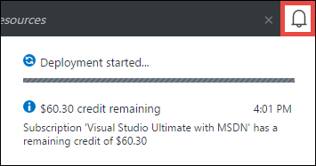

<properties 
    pageTitle="Implementar la primera aplicación web de Java en Azure de cinco minutos | Microsoft Azure" 
    description="Aprenda lo fácil que es ejecutar aplicaciones web en el servicio de aplicación al implementar una aplicación de ejemplo. Empezar a hacer desarrollo real rápidamente y ver los resultados inmediatamente." 
    services="app-service\web"
    documentationCenter=""
    authors="cephalin"
    manager="wpickett"
    editor=""
/>

<tags
    ms.service="app-service-web"
    ms.workload="web"
    ms.tgt_pltfrm="na"
    ms.devlang="na"
    ms.topic="hero-article"
    ms.date="10/13/2016" 
    ms.author="cephalin"
/>
    
# Implementar la primera aplicación web de Java en Azure de cinco minutos

Este tutorial le ayuda a implementar una aplicación web de Java simple al [Servicio de la aplicación de Azure](../app-service/app-service-value-prop-what-is.md).
Puede usar la aplicación de servicio para crear aplicaciones web, [una aplicación móvil extremos](/documentation/learning-paths/appservice-mobileapps/)y [aplicaciones de la API](../app-service-api/app-service-api-apps-why-best-platform.md).

Podrá: 

- Crear una aplicación web en la aplicación de servicio de Azure.
- Implementar una aplicación de Java de ejemplo.
- Vea el código que se ejecuta live en producción.

## Requisitos previos

- Obtener a un cliente FTP y FTPS como [FileZilla](https://filezilla-project.org/).
- Obtener una cuenta de Microsoft Azure. Si no tiene una cuenta, puede [registrarse para una prueba gratuita](/pricing/free-trial/?WT.mc_id=A261C142F) o [activar las ventajas de suscriptor de Visual Studio](/pricing/member-offers/msdn-benefits-details/?WT.mc_id=A261C142F).

>[AZURE.NOTE] Puede [Probar el servicio de aplicación](http://go.microsoft.com/fwlink/?LinkId=523751) sin una cuenta de Azure. Crear una aplicación de inicio y jugar con él para hasta una hora--necesaria ninguna tarjeta de crédito, sin compromisos.

## Crear una aplicación web

1. Inicie sesión en el [portal de Azure](https://portal.azure.com) con su cuenta de Azure.

2. En el menú de la izquierda, haga clic en **nuevo** > **Web + Mobile** > **Web App**.

    

3. En el módulo de creación de la aplicación, use la siguiente configuración para la nueva aplicación:

    - **Nombre de aplicación**: escriba un nombre único.
    - **Grupo de recursos**: seleccione **Crear nuevo** y asigne un nombre al grupo de recursos.
    - **Ubicación o plan de servicio de aplicaciones**: haga clic en ella para configurar, haga clic en **Crear nuevo** para establecer el nombre, la ubicación y el nivel de precios del plan de servicio de aplicación. No dude en usar **libre** nivel de precios.

    Cuando haya terminado, el módulo de creación de la aplicación debería tener este aspecto:

    

3. En la parte inferior, haga clic en **crear** . Puede hacer clic en el icono de **notificación** en la parte superior para ver el progreso.

    

4. Cuando haya finalizado la implementación, verá este mensaje de notificación. Haga clic en el mensaje para abrir la hoja de la implementación.

    

5. En el módulo de **implementación correcta** , haga clic en el vínculo de **recursos** para abrir el módulo de la aplicación web nueva.

    

## Implementar una aplicación de Java en la aplicación web

Ahora, vamos a implementar una aplicación de Java en Azure con FTPS.

5. En el módulo de aplicación web, desplácese hacia abajo hasta la **configuración de la aplicación** o buscar y luego haga clic en él. 

    

6. En la **versión de Java**, seleccione **Java 8** y haga clic en **Guardar**.

    

    Cuando recibe la notificación **se actualizó correctamente la configuración de la aplicación web**, vaya a http://*&lt;nombre de aplicación >*. azurewebsites.net para ver el servidor JSP predeterminado en acción.

7. En el módulo de aplicación web, desplácese hacia abajo hasta **las credenciales de la implementación** o buscar y luego haga clic en él.

8. Establecer las credenciales de implementación y haga clic en **Guardar**.

7. En el módulo de aplicación web, haga clic en **información general**. Junto al **nombre de usuario FTP e implementación** y **FTPS hostname**, haga clic en el botón **Copiar** para copiar estos valores.

    

    Ahora ya está listo para implementar la aplicación de Java con FTPS.

8. En el cliente de FTP y FTPS conectarse al servidor de FTP de la aplicación web de Azure con los valores que ha copiado en el último paso. Utilice la contraseña de implementación que creó anteriormente.

    La siguiente captura de pantalla muestra FileZilla al usar el registro.

    

    Es posible que vea advertencias de seguridad para el certificado SSL no reconocida de Azure. Continuar y continuar.

9. Haga clic en [este vínculo](https://github.com/Azure-Samples/app-service-web-java-get-started/raw/master/webapps/ROOT.war) para descargar el archivo de guerra en el equipo local.

9. En el cliente FTP y FTPS, vaya a **/site/wwwroot/webapps** en el sitio remoto y arrastre el archivo de guerra descargado en su equipo local en ese directorio remoto.

    

    Haga clic en **Aceptar** para reemplazar el archivo en Azure.

    >[AZURE.NOTE] Según el comportamiento predeterminado de Tomcat filename **ROOT.war** en /site/wwwroot/webapps proporciona la aplicación web de raíz (http://*&lt;nombre de aplicación >*. azurewebsites.net) y el nombre de archivo ** * &lt;0.anyname >*.war** le da una aplicación web con nombre (http://*&lt;nombre de aplicación >*.azurewebsites.net/*&lt;0.anyname >*).

¡Eso es todo! La aplicación de Java se está ejecutando live en Azure. En el explorador, vaya a http://*&lt;nombre de aplicación >*. azurewebsites.net para verlo en acción. 

## Realizar actualizaciones a su aplicación

Siempre que tenga que realizar una actualización, simplemente cargar el archivo de guerra nuevo en el mismo directorio remoto con su cliente FTP y FTPS.

## Pasos siguientes

[Crear una aplicación web de Java desde una plantilla en Azure Marketplace](web-sites-java-get-started.md#marketplace). Puede obtener su propio contenedor Tomcat totalmente personalizable y obtener la UI Manager familiarizado. 

Depurar la aplicación web de Azure, directamente en [IntelliJ](app-service-web-debug-java-web-app-in-intellij.md) o [Eclipse](app-service-web-debug-java-web-app-in-eclipse.md).

O bien, hacer más cosas con su primera aplicación web. Por ejemplo:

- Pruebe [otros modos de implementar código para Azure](../app-service-web/web-sites-deploy.md). 
- Llevar su aplicación Azure al siguiente nivel. Autenticar a sus usuarios. Escala que basa a petición. Configurar algunas alertas de rendimiento. Con unos pocos clics. Consulte [Agregar funcionalidad a su primera aplicación web](app-service-web-get-started-2.md).

