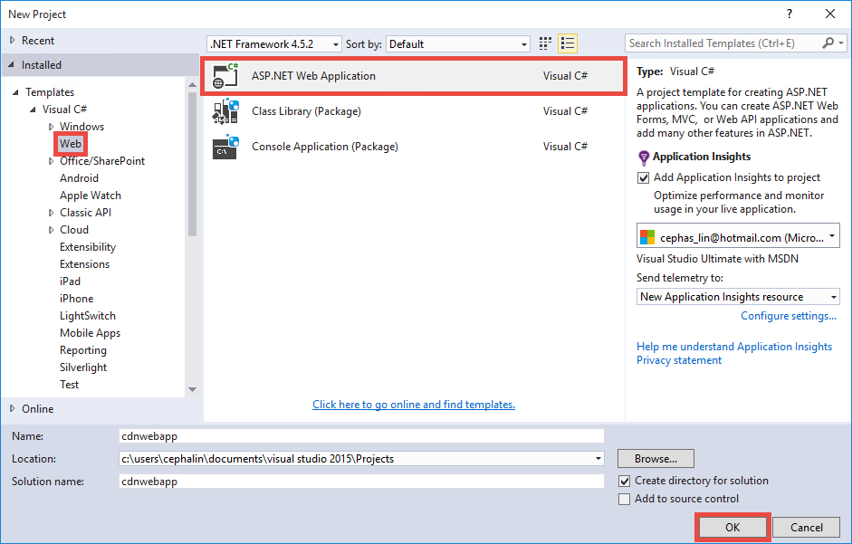
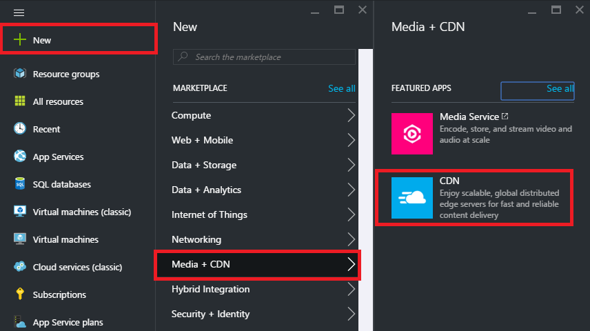
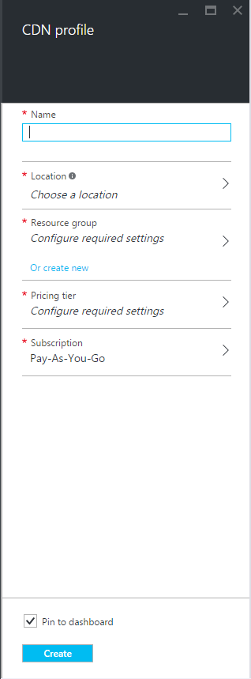
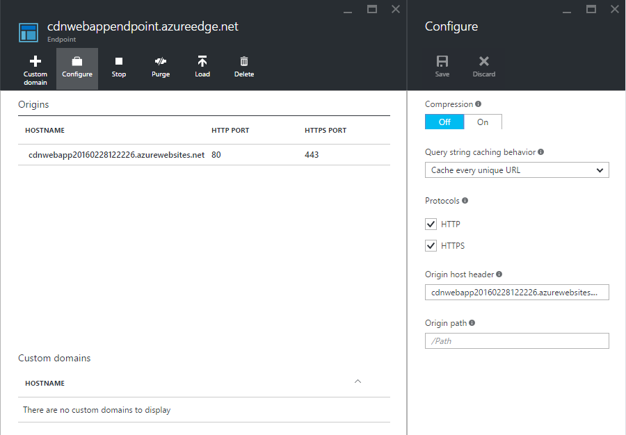
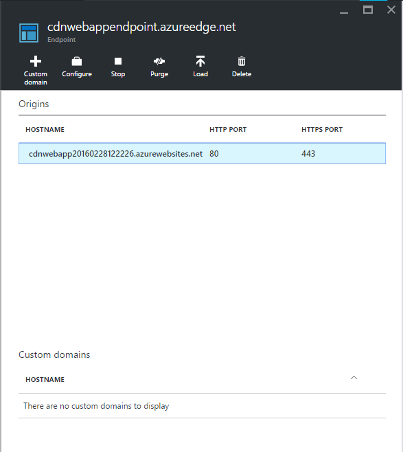

<properties 
    pageTitle="Usar CDN Azure en Azure de aplicación de servicio" 
    description="Un tutorial que le enseña cómo implementar una aplicación web en el servicio de aplicación de Azure que sirve el contenido de un extremo de Azure CDN integrado" 
    services="app-service\web,cdn" 
    documentationCenter=".net" 
    authors="cephalin" 
    manager="wpickett" 
    editor="jimbe"/>

<tags 
    ms.service="app-service" 
    ms.workload="tbd" 
    ms.tgt_pltfrm="na" 
    ms.devlang="dotnet" 
    ms.topic="article" 
    ms.date="07/01/2016" 
    ms.author="cephalin"/>


# <a name="use-azure-cdn-in-azure-app-service"></a>Usar CDN Azure en Azure de aplicación de servicio

[Aplicación de servicio](http://go.microsoft.com/fwlink/?LinkId=529714) se puede integrar con [Azure CDN](/services/cdn/), agregar a las capacidades de escala globales inherentes en las [Aplicaciones de aplicación de servicio Web](http://go.microsoft.com/fwlink/?LinkId=529714) que sirven para el contenido de la aplicación web globalmente desde nodos de servidor cerca de sus clientes (puede encontrar una lista actualizada de todas las ubicaciones de nodo actual [aquí](http://msdn.microsoft.com/library/azure/gg680302.aspx)). En escenarios como servir imágenes estáticas, esta integración puede aumentar considerablemente el rendimiento de las aplicaciones de Azure aplicación de servicio Web y significativamente mejora la experiencia del usuario de la aplicación web en todo el mundo. 

Integración de aplicaciones Web con Azure CDN proporciona las siguientes ventajas:

- Integrar la distribución de contenido (imágenes, scripts y hojas de estilo) como parte del proceso de [implementación continua](app-service-continuous-deployment.md) de la aplicación web
- Actualizar fácilmente los paquetes de NuGet en la aplicación web de servicio de la aplicación de Azure, como jQuery o versiones de inicio 
- Administrar la aplicación Web y su contenido servida CDN desde la misma interfaz Visual Studio
- Intégrelo agrupación de ASP.NET y reducción CDN de Azure

[AZURE.INCLUDE [app-service-web-to-api-and-mobile](../../includes/app-service-web-to-api-and-mobile.md)] 

## <a name="what-you-will-build"></a>¿Qué va a crear ##

Implementar una aplicación web al servicio de aplicación de Azure con el valor predeterminado de plantilla de ASP.NET MVC en Visual Studio, agregará código para servir contenido desde un CDN de Azure integradas, como una imagen, los resultados de acción de controlador y el predeterminado JavaScript y archivos CSS y también escribir código para configurar el mecanismo de reserva para paquetes servida en caso de que la CDN está desconectada.

## <a name="what-you-will-need"></a>Lo que necesita ##

Este tutorial tiene los siguientes requisitos previos:

-   Una [cuenta de Microsoft Azure](/account/) de activos
-   2015 de Visual Studio con [Azure SDK para .NET](http://go.microsoft.com/fwlink/p/?linkid=323510&clcid=0x409). Si utiliza Visual Studio, los pasos pueden variar.

> [AZURE.NOTE] Necesita una cuenta de Azure para completar este tutorial:
> + Puede [Abrir una cuenta de Azure gratis](/pricing/free-trial/) : obtenga créditos puede usar para probar los servicios de Azure pagados e incluso después de que se usan puede mantener la cuenta y usar libre Azure servicios, como aplicaciones Web.
> + Puede [activar las ventajas de suscriptor de Visual Studio](/pricing/member-offers/msdn-benefits-details/) : Visual Studio su suscripción le proporciona créditos cada mes que puede usar para los servicios de Azure pagados.
>
> Si desea empezar a trabajar con el servicio de aplicación de Azure antes de suscribirse para una cuenta de Azure, vaya a [Probar el servicio de aplicaciones](http://go.microsoft.com/fwlink/?LinkId=523751), donde puede crear inmediatamente una aplicación web de starter corta duración en la aplicación de servicio. Sin tarjetas de crédito obligatoria; sin compromisos.

## <a name="deploy-a-web-app-to-azure-with-an-integrated-cdn-endpoint"></a>Implementar una aplicación web en Azure con un extremo CDN integrado ##

En esta sección, se implementar la plantilla de aplicación de ASP.NET MVC en Visual Studio de 2015 predeterminado para la aplicación de servicio y, a continuación, integrarlo con un nuevo extremo CDN. Siga las instrucciones siguientes:

1. En Visual Studio de 2015, crear una nueva aplicación web ASP.NET desde la barra de menús, vaya a **archivo > Nuevo > proyecto > Web > aplicación Web de ASP.NET**. Asigne un nombre y haga clic en **Aceptar**.

    

3. Seleccione **MVC** y haga clic en **Aceptar**.

    

4. Si todavía no lo ha iniciado en su cuenta de Azure, haga clic en el icono de la cuenta en la esquina superior derecha y siga el cuadro de diálogo Iniciar sesión en su cuenta de Azure. Una vez que haya terminado, configure su aplicación tal como se muestra a continuación, haga clic en **nuevo** para crear un nuevo plan de servicio de aplicación de la aplicación.  

    

5. Configurar un nuevo plan de servicio de aplicaciones en el cuadro de diálogo tal como se muestra a continuación y haga clic en **Aceptar**. 

    

8. Haga clic en **crear** para crear la aplicación web.

    

9. Una vez creada la aplicación ASP.NET, publicarlo en Azure en el panel de la actividad de servicio de aplicación de Azure haciendo clic en **publicar `<app name>` para esta aplicación Web ahora**. Haga clic en **Publicar** para completar el proceso.

    

    Una vez completada la publicación, verá la aplicación web publicada en el explorador. 

1. Para crear un extremo CDN, inicie sesión en el [portal de Azure](https://portal.azure.com). 
2. Haga clic en **+ nuevo** > **multimedia + CDN** > **CDN**.

    

3. Especificar la **CDN**, **ubicación**, **grupo de recursos**, **el nivel de precios**y luego haga clic en **crear**

       

4. En el **Perfil de CDN** módulo, haga clic en **+ punto final** . Asigne un nombre, seleccione la **Aplicación Web** en la lista desplegable **Tipo de origen** y la aplicación web de la lista desplegable de **nombre de host de origen** y haga clic en **Agregar**.  

    


    > [AZURE.NOTE] Una vez creado el extremo CDN, el módulo de **punto final** le mostrará su URL CDN y el dominio de origen que está integrado con. Sin embargo, puede pasar un tiempo para la configuración de la nueva CDN del extremo totalmente propagar a todas las ubicaciones de nodo CDN. 

3. En el módulo de **punto final** , haga clic en el nombre del extremo CDN que acaba de crear.

    

3. Haga clic en el botón **Configurar** . En el módulo de **Configurar** , seleccione **cada dirección URL única en caché** en **la memoria caché o el comportamiento de cadena de consulta** en la lista desplegable, haga clic en el botón **Guardar** .


    

Una vez que habilitar esta opción, se almacenarán en caché del mismo vínculo acceso cadenas de consulta diferente como entradas separadas.

>[AZURE.NOTE] Habilitar la cadena de consulta, no es necesario para esta sección tutorial que desea hacer esto como pronto como sea posible para mayor comodidad desde cualquier cambio aquí va a tardar un tiempo en propagarse a todos los nodos CDN y no quiere cualquier contenido no consulta cadena-habilitados obstruir la caché CDN (contenido CDN actualización se explicará más adelante).

2. Ahora, vaya a la dirección de extremo CDN. Si el punto final está preparado, verá la aplicación web de muestra. Si recibe un error **404 de HTTP** , el extremo CDN no está listo. Tendrá que esperar hasta una hora para la configuración de CDN para propagarse a todos los nodos de borde. 

    

1. A continuación, intente tener acceso al archivo **~/Content/bootstrap.css** en su proyecto ASP.NET. En la ventana del explorador, vaya a * *http://*&lt;cdnName >*.azureedge.net/Content/bootstrap.css**. En configuración de mi, esta URL es:

        http://az673227.azureedge.net/Content/bootstrap.css

    Que corresponde a la siguiente dirección URL de origen en el extremo CDN:

        http://cdnwebapp.azurewebsites.net/Content/bootstrap.css

    Cuando se desplaza a * *http://*&lt;cdnName >*.azureedge.net/Content/bootstrap.css**, se le pedirá que descargue el bootstrap.css que proviene de la aplicación web de Azure. 

    

Del mismo modo puede tener acceso a cualquier dirección URL accesible públicamente en * *http://*&lt;serviceName >*.cloudapp.net/** directamente desde el extremo CDN. Por ejemplo:

-   Un archivo de js desde la ruta de acceso de /Script
-   Cualquier archivo de contenido de la /contenido ruta de acceso
-   Cualquier acción de controlador 
-   Si la cadena de consulta está habilitada en el extremo CDN, una dirección URL con las cadenas de consulta
-   La aplicación web de Azure completo, si todo el contenido es público

Tenga en cuenta que es posible que no sea siempre una buena idea (o, en general, una buena idea) para proporcionar el servicio de una aplicación web de Azure completo a través de CDN de Azure. Algunas de las advertencias son:

-   Este enfoque requiere todo su sitio sea pública, porque CDN Azure no puede servir cualquier contenido privado.
-   Si el extremo CDN se desconecta por cualquier motivo, si mantenimiento programado o error de usuario, la aplicación web completa pierde la conexión a menos que se pueden redirigir los clientes a la dirección URL de origen * *http://*&lt;nombre del sitio >*.azurewebsites.net/**. 
-   Incluso con la configuración de Control de caché personalizada (consulte [Configurar opciones de caché para archivos estáticos en la aplicación web de Azure](#configure-caching-options-for-static-files-in-your-azure-web-app)), un extremo CDN mejora el rendimiento de contenido altamente dinámicos. Si ha intentado cargar la página de inicio desde el extremo CDN como se indicó anteriormente, observe que tardó al menos 5 segundos para cargar la página principal predeterminada la primera vez, que es una página bastante simple. Imagine lo que ocurre a la experiencia del cliente si esta página contiene contenido dinámico que debe actualizar cada minuto. Servir contenido dinámico de un extremo CDN requiere la caducidad de la caché breve, que se traduce en caché frecuentes en el extremo CDN. Esto duele el rendimiento de la aplicación web de Azure y anula la finalidad de una CDN.

La alternativa es determinar qué contenido servir de Azure CDN caso por caso, en la aplicación web de Azure. Para ello, ya ha visto cómo tener acceso a archivos de contenido individuales desde el extremo CDN. Le mostrará cómo servir una acción de controlador específico a través del extremo CDN en [servir contenido desde acciones de controlador a través de CDN de Azure](#serve-content-from-controller-actions-through-azure-cdn).

## <a name="configure-caching-options-for-static-files-in-your-azure-web-app"></a>Configurar opciones de almacenamiento en caché para los archivos estáticos en la aplicación web de Azure ##

Con la integración de CDN de Azure en la aplicación web de Azure, puede especificar cómo desea que el contenido estático en caché en el extremo CDN. Para ello, abra el *archivo Web.config* de su proyecto ASP.NET (por ejemplo, **cdnwebapp**) y agregue una `<staticContent>` elemento a `<system.webServer>`. El XML siguiente configura la caché para que caduque 3 días.  

    <system.webServer>
      <staticContent>
        <clientCache cacheControlMode="UseMaxAge" cacheControlMaxAge="3.00:00:00"/>
      </staticContent>
      ...
    </system.webServer>

Una vez que se hace esto, todos los archivos estáticos en la aplicación web de Azure observará la misma regla en la memoria caché CDN. Para un control más detallado de configuración de caché, agregue un archivo *Web.config* a una carpeta y la configuración no existe. Por ejemplo, agregue un archivo *Web.config* a la carpeta *\Content* y reemplace el contenido con el siguiente código XML:

    <?xml version="1.0"?>
    <configuration>
      <system.webServer>
        <staticContent>
          <clientCache cacheControlMode="UseMaxAge" cacheControlMaxAge="15.00:00:00"/>
        </staticContent>
      </system.webServer>
    </configuration>

Esta opción hace que todos los archivos estáticos de la carpeta *\Content* en caché de 15 días.

Para obtener más información sobre cómo configurar la `<clientCache>` elemento, vea [caché cliente &lt;clientCache >](http://www.iis.net/configreference/system.webserver/staticcontent/clientcache).

En la siguiente sección, también mostrará cómo configurar opciones de caché de resultados de la acción de controlador en la caché CDN.

## <a name="serve-content-from-controller-actions-through-azure-cdn"></a>Servir contenido desde acciones de controlador a través de CDN de Azure ##

Al realizar la integración de aplicaciones Web con Azure CDN, es relativamente fácil servir el contenido de las acciones de controlador mediante la CDN de Azure. De nuevo, si decide imprimir y usar la aplicación de todo el sitio web Azure a través de su CDN, no es necesario hacer esto en absoluto puesto que ya están accesibles a través de la CDN todas las acciones de controlador. Pero por razones que ya ha señalado en [implementar una aplicación web de Azure con un extremo CDN integrado](#deploy-a-web-app-to-azure-with-an-integrated-cdn-endpoint), puede decidir contra y elija en su lugar para seleccionar la acción de controlador que desea servir de CDN de Azure. [Maarten Balliauw](https://twitter.com/maartenballiauw) muestra cómo hacer con una divertida MemeGenerator controlador de [reducción de latencia en la web con la CDN de Azure](http://channel9.msdn.com/events/TechDays/Techdays-2014-the-Netherlands/Reducing-latency-on-the-web-with-the-Windows-Azure-CDN). Le simplemente reproducirlo aquí.

Supongamos que en la aplicación que desea generar memes basado en una imagen de Chuck Norris los (fotografía por [Alan luz](http://www.flickr.com/photos/alan-light/218493788/)) similar a esta:


Tiene una sencilla `Index` acción que permite a los clientes especificar la superlativos en la imagen, a continuación, genera la meme una vez que se envíe a la acción. Puesto que es Chuck Norris, esperaría esta página para convertirse en totalmente populares globalmente. Este es un buen ejemplo de servir contenido dinámico semiestructurados con Azure CDN. 

Siga los pasos anteriores para esta acción de controlador de configuración:

1. En la carpeta *\Controllers* , cree un nuevo archivo. cs denominado *MemeGeneratorController.cs* y reemplace el contenido con el siguiente código. Sustituir la ruta de acceso de `~/Content/chuck.bmp` y su nombre CDN para `yourCDNName`.


        using System;
        using System.Collections.Generic;
        using System.Diagnostics;
        using System.Drawing;
        using System.IO;
        using System.Net;
        using System.Web.Hosting;
        using System.Web.Mvc;
        using System.Web.UI;

        namespace cdnwebapp.Controllers
        {
          public class MemeGeneratorController : Controller
          {
            static readonly Dictionary<string, Tuple<string ,string>> Memes = new Dictionary<string, Tuple<string, string>>();

            public ActionResult Index()
            {
              return View();
            }

            [HttpPost, ActionName("Index")]
            public ActionResult Index_Post(string top, string bottom)
            {
              var identifier = Guid.NewGuid().ToString();
              if (!Memes.ContainsKey(identifier))
              {
                Memes.Add(identifier, new Tuple<string, string>(top, bottom));
              }

              return Content("<a href=\"" + Url.Action("Show", new {id = identifier}) + "\">here's your meme</a>");
            }

            [OutputCache(VaryByParam = "*", Duration = 1, Location = OutputCacheLocation.Downstream)]
            public ActionResult Show(string id)
            {
              Tuple<string, string> data = null;
              if (!Memes.TryGetValue(id, out data))
              {
                return new HttpStatusCodeResult(HttpStatusCode.NotFound);
              }

              if (Debugger.IsAttached) // Preserve the debug experience
              {
                return Redirect(string.Format("/MemeGenerator/Generate?top={0}&bottom={1}", data.Item1, data.Item2));
              }
              else // Get content from Azure CDN
              {
                return Redirect(string.Format("http://<yourCDNName>.azureedge.net/MemeGenerator/Generate?top={0}&bottom={1}", data.Item1, data.Item2));
              }
            }

            [OutputCache(VaryByParam = "*", Duration = 3600, Location = OutputCacheLocation.Downstream)]
            public ActionResult Generate(string top, string bottom)
            {
              string imageFilePath = HostingEnvironment.MapPath("~/Content/chuck.bmp");
              Bitmap bitmap = (Bitmap)Image.FromFile(imageFilePath);

              using (Graphics graphics = Graphics.FromImage(bitmap))
              {
                SizeF size = new SizeF();
                using (Font arialFont = FindBestFitFont(bitmap, graphics, top.ToUpperInvariant(), new Font("Arial Narrow", 100), out size))
                {
                    graphics.DrawString(top.ToUpperInvariant(), arialFont, Brushes.White, new PointF(((bitmap.Width - size.Width) / 2), 10f));
                }
                using (Font arialFont = FindBestFitFont(bitmap, graphics, bottom.ToUpperInvariant(), new Font("Arial Narrow", 100), out size))
                {
                    graphics.DrawString(bottom.ToUpperInvariant(), arialFont, Brushes.White, new PointF(((bitmap.Width - size.Width) / 2), bitmap.Height - 10f - arialFont.Height));
                }
              }
              MemoryStream ms = new MemoryStream();
              bitmap.Save(ms, System.Drawing.Imaging.ImageFormat.Png);
              return File(ms.ToArray(), "image/png");
            }

            private Font FindBestFitFont(Image i, Graphics g, String text, Font font, out SizeF size)
            {
              // Compute actual size, shrink if needed
              while (true)
              {
                size = g.MeasureString(text, font);

                // It fits, back out
                if (size.Height < i.Height &&
                     size.Width < i.Width) { return font; }

                // Try a smaller font (90% of old size)
                Font oldFont = font;
                font = new Font(font.Name, (float)(font.Size * .9), font.Style);
                oldFont.Dispose();
              }
            }
          }
        }

2. Haga clic en el valor predeterminado `Index()` acción y seleccione **Agregar vista**.

    

3.  Acepte los valores siguientes y haga clic en **Agregar**.

    

4. Abra el nuevo *Views\MemeGenerator\Index.cshtml* y reemplace el contenido con el siguiente HTML simple para enviar la superlativos:

        <h2>Meme Generator</h2>
        
        <form action="" method="post">
            <input type="text" name="top" placeholder="Enter top text here" />
            <br />
            <input type="text" name="bottom" placeholder="Enter bottom text here" />
            <br />
            <input class="btn" type="submit" value="Generate meme" />
        </form>

5. Vuelva a publicar la aplicación web de Azure y navegue hasta * *http://*&lt;serviceName >*.cloudapp.net/MemeGenerator/Index** en el explorador. 

Al enviar los valores del formulario a `/MemeGenerator/Index`, el `Index_Post` método de acción devuelve un vínculo a la `Show` método de acción con el identificador de la entrada correspondiente. Al hacer clic en el vínculo, ponerse en contacto con el siguiente código:  

    [OutputCache(VaryByParam = "*", Duration = 1, Location = OutputCacheLocation.Downstream)]
    public ActionResult Show(string id)
    {
      Tuple<string, string> data = null;
      if (!Memes.TryGetValue(id, out data))
      {
        return new HttpStatusCodeResult(HttpStatusCode.NotFound);
      }

      if (Debugger.IsAttached) // Preserve the debug experience
      {
        return Redirect(string.Format("/MemeGenerator/Generate?top={0}&bottom={1}", data.Item1, data.Item2));
      }
      else // Get content from Azure CDN
      {
        return Redirect(string.Format("http://<yourCDNName>.azureedge.net/MemeGenerator/Generate?top={0}&bottom={1}", data.Item1, data.Item2));
      }
    }

Si se asocia el depurador local, obtendrá la experiencia de depuración normal con una redirección local. Si está ejecutando en la aplicación web de Azure, le redirigirá a:

    http://<yourCDNName>.azureedge.net/MemeGenerator/Generate?top=<formInput>&bottom=<formInput>

Que corresponde a la siguiente dirección URL de origen en el extremo CDN:

    http://<yourSiteName>.azurewebsites.net/cdn/MemeGenerator/Generate?top=<formInput>&bottom=<formInput>

Después de reescritura de URL regla aplicado anteriormente, el archivo real que se almacena en caché para el extremo CDN es:

    http://<yourSiteName>.azurewebsites.net/MemeGenerator/Generate?top=<formInput>&bottom=<formInput>

A continuación, puede usar el `OutputCacheAttribute` atributo en la `Generate` método para especificar cómo el resultado de la acción debe almacenarse en caché, que respetan CDN de Azure. El código siguiente especifique una expiración de la memoria caché de 1 hora (3.600 segundos).

    [OutputCache(VaryByParam = "*", Duration = 3600, Location = OutputCacheLocation.Downstream)]

Del mismo modo, puede servir contenido de cualquier acción de controlador de la aplicación web de Azure a través de su CDN de Azure, con la opción de almacenamiento en caché que desee.

En la siguiente sección, le mostrará cómo servir las secuencias de comandos agrupados y reducir y CSS a través de CDN de Azure. 

## <a name="integrate-aspnet-bundling-and-minification-with-azure-cdn"></a>Intégrelo agrupación de ASP.NET y reducción CDN de Azure ##

Hojas de estilo CSS y scripts cambian con poca frecuencia y son candidatos principales para la caché de CDN de Azure. Servir de la aplicación de todo el sitio web a través de su CDN Azure es la manera más sencilla de integrar agrupación y reducción con Azure CDN. Sin embargo, como puede elegir contra este enfoque por las razones descritas en [integrar un extremo de Azure CDN con su Azure web app y servir contenido estático en las páginas Web de CDN de Azure](#deploy-a-web-app-to-azure-with-an-integrated-cdn-endpoint), mostrará cómo hacerlo sin perder la experiencia de Developer deseado de agrupación de ASP.NET y reducción, como por ejemplo:

-   Experiencia de depuración excelente modo
-   Implementación simplificada
-   Actualizaciones inmediatas a los clientes para actualizaciones de versión de secuencia de comandos/CSS
-   Mecanismo de reserva cuando se produce un error en el extremo CDN
-   Modificación del código de minimizar

En el proyecto ASP.NET que creó en [integrar un extremo de Azure CDN con su Azure web app y servir contenido estático en las páginas Web de Azure CDN](#deploy-a-web-app-to-azure-with-an-integrated-cdn-endpoint), abra *App_Start\BundleConfig.cs* y eche un vistazo a la `bundles.Add()` método llamadas.

    public static void RegisterBundles(BundleCollection bundles)
    {
        bundles.Add(new ScriptBundle("~/bundles/jquery").Include(
                    "~/Scripts/jquery-{version}.js"));
        ...
    }

La primera `bundles.Add()` instrucción agrega un paquete de secuencia de comandos en el directorio virtual `~/bundles/jquery`. A continuación, abra *Views\Shared\_Layout.cshtml* para ver cómo se procesa la etiqueta de paquete de script. Debería poder encontrar la siguiente línea de código Razor:

    @Scripts.Render("~/bundles/jquery")

Cuando se ejecuta este código Razor en la aplicación web de Azure, representará una `<script>` etiqueta para el paquete de secuencia de comandos similar al siguiente: 

    <script src="/bundles/jquery?v=FVs3ACwOLIVInrAl5sdzR2jrCDmVOWFbZMY6g6Q0ulE1"></script>

Sin embargo, cuando se ejecuta en Visual Studio escribiendo `F5`, se representan cada archivo de script con el paquete de forma individual (en el caso anterior, archivo de solo script está en el paquete):

    <script src="/Scripts/jquery-1.10.2.js"></script>

Esto le permite depurar el código de JavaScript en su entorno de desarrollo mientras reducir las conexiones de cliente simultáneas (agrupación) y mejorar el archivo descargar rendimiento (reducción) de producción. Es una excelente característica conservar con integración de CDN de Azure. Además, dado que el paquete representado ya contiene una cadena de versión generada automáticamente, desea replicar que la funcionalidad de modo que siempre que actualice su versión de jQuery mediante NuGet, se puede actualizar en el cliente tan pronto como sea posible.

Siga los pasos a continuación para integración ASP.NET agrupación y reducción con el extremo CDN.

1. En el *App_Start\BundleConfig.cs*, modifique la `bundles.Add()` métodos para utilizar un diferentes [constructor del paquete](http://msdn.microsoft.com/library/jj646464.aspx), que se especifica una dirección CDN. Para ello, reemplace el `RegisterBundles` definición de método con el siguiente código:  
    
        public static void RegisterBundles(BundleCollection bundles)
        {
          bundles.UseCdn = true;
          var version = System.Reflection.Assembly.GetAssembly(typeof(Controllers.HomeController))
            .GetName().Version.ToString();
          var cdnUrl = "http://<yourCDNName>.azureedge.net/{0}?" + version;

          bundles.Add(new ScriptBundle("~/bundles/jquery", string.Format(cdnUrl, "bundles/jquery")).Include(
                "~/Scripts/jquery-{version}.js"));

          bundles.Add(new ScriptBundle("~/bundles/jqueryval", string.Format(cdnUrl, "bundles/jqueryval")).Include(
                "~/Scripts/jquery.validate*"));

          // Use the development version of Modernizr to develop with and learn from. Then, when you're
          // ready for production, use the build tool at http://modernizr.com to pick only the tests you need.
          bundles.Add(new ScriptBundle("~/bundles/modernizr", string.Format(cdnUrl, "bundles/modernizr")).Include(
                "~/Scripts/modernizr-*"));

          bundles.Add(new ScriptBundle("~/bundles/bootstrap", string.Format(cdnUrl, "bundles/bootstrap")).Include(
                "~/Scripts/bootstrap.js",
                "~/Scripts/respond.js"));

          bundles.Add(new StyleBundle("~/Content/css", string.Format(cdnUrl, "Content/css")).Include(
                "~/Content/bootstrap.css",
                "~/Content/site.css"));
        }


    Asegúrese de reemplazar `<yourCDNName>` con el nombre de su CDN de Azure.

    En palabras sencillas, se establece `bundles.UseCdn = true` y agrega una dirección URL de CDN cuidadosamente a cada paquete. Por ejemplo, el primer constructor en el código:

        new ScriptBundle("~/bundles/jquery", string.Format(cdnUrl, "bundles/jquery"))

    es el mismo que: 

        new ScriptBundle("~/bundles/jquery", string.Format(cdnUrl, "http://<yourCDNName>.azureedge.net/bundles/jquery?<W.X.Y.Z>"))

    Este constructor indica la agrupación de ASP.NET y reducción para representar archivos de script individuales al depurar localmente, pero use la dirección CDN especificada para tener acceso a la secuencia de comandos en cuestión. Sin embargo, tenga en cuenta dos características importantes con esta dirección URL de CDN cuidadosamente:
    
    - El origen de esta URL CDN es `http://<yourSiteName>.azurewebsites.net/bundles/jquery?<W.X.Y.Z>`, que es realmente el directorio virtual de la agrupación de secuencia de comandos en la aplicación Web.
    - Puesto que está utilizando constructor CDN, la etiqueta de script CDN para el paquete ya no contiene la cadena de versión generada automáticamente en la dirección URL representada. Debe generar manualmente una cadena de versión único cada vez que se modifica el paquete de secuencia de comandos para forzar un error de caché en su CDN de Azure. Al mismo tiempo, esta cadena de versión único debe permanecer constante la vida de la implementación para maximizar la caché en su CDN Azure después de que se implementa el paquete.

3. La cadena de consulta `<W.X.Y.Z>` extrae *Properties\AssemblyInfo* en su proyecto ASP.NET. Puede tener un flujo de trabajo de implementación que incluya incremento de la versión de ensamblado cada vez que publique en Azure. O bien, solo puede modificar *Properties\AssemblyInfo* en el proyecto para incrementar automáticamente la cadena de versión cada vez que genere, con el carácter comodín ' *'. Por ejemplo, cambiar `AssemblyVersion` tal como se muestra a continuación:
    
        [assembly: AssemblyVersion("1.0.0.*")]
    
    Cualquier otra estrategia de simplificar la generación de una cadena única para la vida de una implementación funcionará aquí.

3. Volver a publicar la aplicación de ASP.NET y obtener acceso a la página principal.
 
4. Ver el código HTML de la página. Debería poder ver la dirección URL de CDN representado por una cadena de versión único cada vez que vuelva a publicar los cambios a la aplicación web de Azure. Por ejemplo:  
    
        ...
        <link href="http://az673227.azureedge.net/Content/css?1.0.0.25449" rel="stylesheet"/>
        <script src="http://az673227.azureedge.net/bundles/modernizer?1.0.0.25449"></script>
        ...
        <script src="http://az673227.azureedge.net/bundles/jquery?1.0.0.25449"></script>
        <script src="http://az673227.azureedge.net/bundles/bootstrap?1.0.0.25449"></script>
        ...

5. En Visual Studio, depurar la aplicación de ASP.NET en Visual Studio escribiendo `F5`., 

6. Ver el código HTML de la página. Aún se muestra cada archivo de script representado por separado para que pueda tener una depuración coherente experiencia en Visual Studio.  
    
        ...
        <link href="/Content/bootstrap.css" rel="stylesheet"/>
        <link href="/Content/site.css" rel="stylesheet"/>
        <script src="/Scripts/modernizr-2.6.2.js"></script>
        ...
        <script src="/Scripts/jquery-1.10.2.js"></script>
        <script src="/Scripts/bootstrap.js"></script>
        <script src="/Scripts/respond.js"></script>
        ...    

## <a name="fallback-mechanism-for-cdn-urls"></a>Mecanismo de reserva para las direcciones URL de CDN ##

Cuando se produce un error en el extremo de Azure CDN por cualquier motivo, desea su página Web suficientemente inteligente obtener acceso a su servidor Web de origen como la opción de reserva para cargar JavaScript o inicio. Es suficientemente grave pérdida de imágenes de la aplicación web debido a la falta de disponibilidad CDN, pero mucho más graves perder la funcionalidad de página fundamentales de los scripts y hojas de estilo.

La clase de [paquete](http://msdn.microsoft.com/library/system.web.optimization.bundle.aspx) contiene una propiedad denominada [CdnFallbackExpression](http://msdn.microsoft.com/library/system.web.optimization.bundle.cdnfallbackexpression.aspx) que le permite configurar el mecanismo de reserva error CDN. Para usar esta propiedad, siga los pasos siguientes:

1. En el proyecto ASP.NET, abra *App_Start\BundleConfig.cs*, donde ha agregado una dirección URL de CDN en cada [constructor de paquete](http://msdn.microsoft.com/library/jj646464.aspx)y agregue `CdnFallbackExpression` el código de cuatro lugares tal como se muestra a agregar un mecanismo de reserva a los paquetes de forma predeterminada.  
    
        public static void RegisterBundles(BundleCollection bundles)
        {
          var version = System.Reflection.Assembly.GetAssembly(typeof(BundleConfig))
            .GetName().Version.ToString();
          var cdnUrl = "http://cdnurl.azureedge.net/.../{0}?" + version;
          bundles.UseCdn = true;

          bundles.Add(new ScriptBundle("~/bundles/jquery", string.Format(cdnUrl, "bundles/jquery")) 
                { CdnFallbackExpression = "window.jquery" }
                .Include("~/Scripts/jquery-{version}.js"));

          bundles.Add(new ScriptBundle("~/bundles/jqueryval", string.Format(cdnUrl, "bundles/jqueryval")) 
                { CdnFallbackExpression = "$.validator" }
                .Include("~/Scripts/jquery.validate*"));

          // Use the development version of Modernizr to develop with and learn from. Then, when you're
          // ready for production, use the build tool at http://modernizr.com to pick only the tests you need.
          bundles.Add(new ScriptBundle("~/bundles/modernizr", string.Format(cdnUrl, "bundles/modernizer")) 
                { CdnFallbackExpression = "window.Modernizr" }
                .Include("~/Scripts/modernizr-*"));

          bundles.Add(new ScriptBundle("~/bundles/bootstrap", string.Format(cdnUrl, "bundles/bootstrap"))     
                { CdnFallbackExpression = "$.fn.modal" }
                .Include(
                        "~/Scripts/bootstrap.js",
                        "~/Scripts/respond.js"));

          bundles.Add(new StyleBundle("~/Content/css", string.Format(cdnUrl, "Content/css")).Include(
                "~/Content/bootstrap.css",
                "~/Content/site.css"));
        }

    Cuando `CdnFallbackExpression` es no nulo script se inserta en el código HTML para comprobar si el paquete se ha cargado correctamente y, si no, el paquete de acceso directamente desde el servidor Web de origen. Esta propiedad debe estar establecida en una expresión de JavaScript que comprueba si el paquete CDN respectivo está cargado correctamente. La expresión es necesaria probar cada paquete varía según el contenido. Para los paquetes de forma predeterminada anteriores:
    
    - `window.jquery`se define en jquery-{versión} js
    - `$.validator`se define en jquery.validate.js
    - `window.Modernizr`se define en modernizer-{versión} js
    - `$.fn.modal`se define en bootstrap.js
    
    Es posible que haya observado que no ha definido CdnFallbackExpression para la `~/Cointent/css` paquete. Esto es porque hay un [error en System.Web.Optimization](https://aspnetoptimization.codeplex.com/workitem/104) que inserta un `<script>` etiqueta de la reserva CSS en lugar de la esperada `<link>` etiqueta.
    
    Sin embargo, hay una buena [Estilo paquete reserva](https://github.com/EmberConsultingGroup/StyleBundleFallback) ofrecido por [Ember Consulting Group](https://github.com/EmberConsultingGroup). 

2. Para usar la solución alternativa para CSS, cree un nuevo archivo. cs en carpeta de *App_Start* de su proyecto ASP.NET denominada *StyleBundleExtensions.cs*y reemplace su contenido con el [código de GitHub](https://github.com/EmberConsultingGroup/StyleBundleFallback/blob/master/Website/App_Start/StyleBundleExtensions.cs). 

4. En *App_Start\StyleFundleExtensions.cs*, cambie el nombre del espacio de nombres al espacio de nombres de la aplicación de ASP.NET (por ejemplo, **cdnwebapp**). 

3. Volver a `App_Start\BundleConfig.cs` y reemplace la última `bundles.Add` instrucción con el siguiente código:  

        bundles.Add(new StyleBundle("~/Content/css", string.Format(cdnUrl, "Content/css"))
          .IncludeFallback("~/Content/css", "sr-only", "width", "1px")
          .Include(
            "~/Content/bootstrap.css",
            "~/Content/site.css"));

    Este nuevo método de extensión usa la misma idea para insertar script en el código HTML para comprobar el DOM para la un nombre de la clase coincidentes, el nombre de la regla y el valor de regla definidos en el paquete CSS y cae el servidor Web de origen si no puede encontrar la coincidencia.

4. Vuelva a publicar la aplicación web de Azure y tener acceso a la página principal. 
5. Ver el código HTML de la página. Encontrará secuencias de comandos insertados similar al siguiente:    
    
    ```
    ...
    <link href="http://az673227.azureedge.net/Content/css?1.0.0.25474" rel="stylesheet"/>
<script>(function() {
                var loadFallback,
                    len = document.styleSheets.length;
                for (var i = 0; i < len; i++) {
                    var sheet = document.styleSheets[i];
                    if (sheet.href.indexOf('http://az673227.azureedge.net/Content/css?1.0.0.25474') !== -1) {
                        var meta = document.createElement('meta');
                        meta.className = 'sr-only';
                        document.head.appendChild(meta);
                        var value = window.getComputedStyle(meta).getPropertyValue('width');
                        document.head.removeChild(meta);
                        if (value !== '1px') {
                            document.write('<link href="/Content/css" rel="stylesheet" type="text/css" />');
                        }
                    }
                }
                return true;
            }())||document.write('<script src="/Content/css"><\/script>');</script>

    <script src="http://az673227.azureedge.net/bundles/modernizer?1.0.0.25474"></script>
    <script>(window.Modernizr)||document.write('<script src="/bundles/modernizr"><\/script>');</script>
    ... 
    <script src="http://az673227.azureedge.net/bundles/jquery?1.0.0.25474"></script>
    <script>(window.jquery)||document.write('<script src="/bundles/jquery"><\/script>');</script>

    <script src="http://az673227.azureedge.net/bundles/bootstrap?1.0.0.25474"></script>
    <script>($.fn.modal)||document.write('<script src="/bundles/bootstrap"><\/script>');</script>
    ...
    ```

    Tenga en cuenta que script insertado para el paquete CSS todavía contiene el residuo erróneas desde el `CdnFallbackExpression` propiedad en la línea:

        }())||document.write('<script src="/Content/css"><\/script>');</script>

    Pero desde la primera parte de la || expresión siempre devolverá true (en la línea directamente encima), nunca se ejecutará la función de la sección.

6. Para comprobar si la secuencia de comandos reserva funciona, vuelva a la hoja del extremo de su CDN y haga clic en **Detener**.

    

7. Actualizar la ventana del explorador para la aplicación web de Azure. Ahora debe ver que todos los scripts y hojas de estilo se cargan correctamente.

## <a name="more-information"></a>Más información 
- [Información general de la red de Azure entrega de contenido (CDN)](../cdn/cdn-overview.md)
- [Uso de Azure CDN](../cdn/cdn-create-new-endpoint.md)
- [Integrar un servicio de nube con CDN de Azure](../cdn/cdn-cloud-service-with-cdn.md)
- [Reducción y agrupación de ASP.NET](http://www.asp.net/mvc/tutorials/mvc-4/bundling-and-minification)

