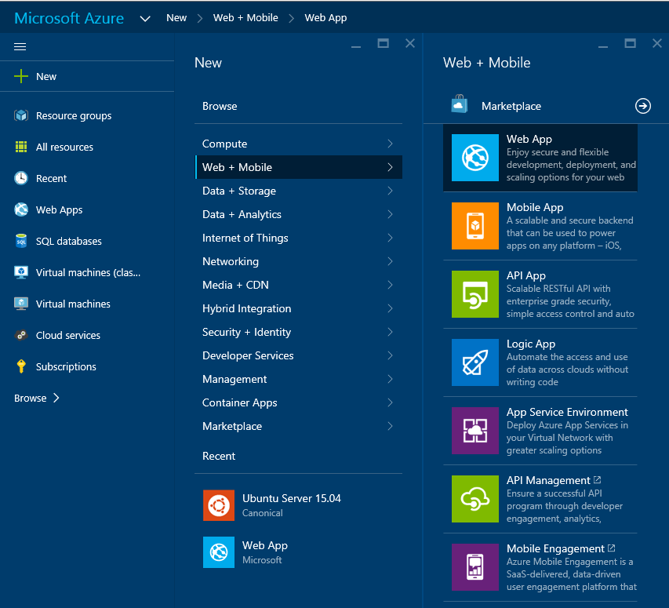
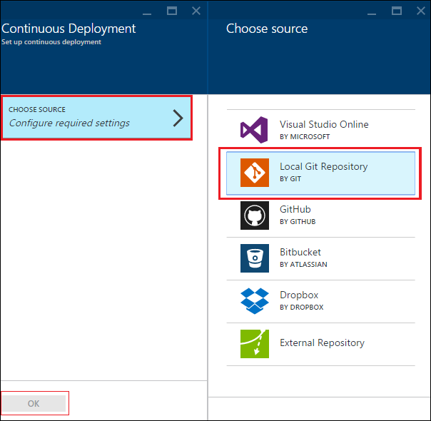
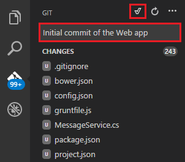

<properties
   pageTitle="Crear una aplicación web de ASP.NET 5 en código de Visual Studio"
   description="Este tutorial muestra cómo crear una aplicación web de ASP.NET 5 usando código de Visual Studio."
   services="app-service\web"
   documentationCenter=".net"
   authors="erikre"
   manager="wpickett"
   editor="jimbe"/>

<tags
    ms.service="app-service-web" 
    ms.workload="web" 
    ms.tgt_pltfrm="dotnet" 
    ms.devlang="na" 
    ms.topic="article" 
    ms.date="02/26/2016" 
    ms.author="cephalin"/>

# Crear una aplicación web de ASP.NET 5 en código de Visual Studio

## Información general

En este tutorial se muestra cómo crear una aplicación web de ASP.NET 5 usando [Código de Visual Studio (VS código)](http://code.visualstudio.com//Docs/whyvscode) e implementar al [Servicio de la aplicación de Azure](../app-service/app-service-value-prop-what-is.md). 

> [AZURE.NOTE] Aunque en este artículo se refiere a aplicaciones web, también se aplica a aplicaciones de la API y aplicaciones móviles. 

ASP.NET 5 es un nuevo diseño significativo de ASP.NET. ASP.NET 5 es un nuevo marco de código abierto y entre plataformas para la creación de aplicaciones web moderna basada en nube mediante .NET. Para obtener más información, vea [Introducción a 5 ASP.NET](http://docs.asp.net/en/latest/conceptual-overview/aspnet.html). Para obtener información sobre las aplicaciones de servicio de Azure aplicación web, vea [Introducción a aplicaciones Web](app-service-web-overview.md).

[AZURE.INCLUDE [app-service-web-try-app-service.md](../../includes/app-service-web-try-app-service.md)]

## Requisitos previos  

* Instalar [VS código](http://code.visualstudio.com/Docs/setup).
* Instalar [Node.js](http://nodejs.org) - Node.js es una plataforma para generar aplicaciones de servidor rápidas y scalable utilizando JavaScript. Nodo es el tiempo de ejecución (nodo) y [npm](http://www.npmjs.com/) es el Administrador de paquete para módulos de nodo. Use npm a scaffold una aplicación web de ASP.NET 5 en este tutorial.
* Instalar Git - instalarlo desde cualquiera de estas ubicaciones: [Chocolatey](https://chocolatey.org/packages/git) o [scm.com git](http://git-scm.com/downloads). Si es nuevo en Git, elija [git scm.com](http://git-scm.com/downloads) y seleccione la opción para **Usar Git desde el símbolo del sistema de Windows**. Una vez instalado Git, también deberá establecer el nombre de usuario Git y correo electrónico como es necesario más adelante en el tutorial (al realizar una confirmación de código de VS).  

## Instalar ASP.NET 5 y DNX
ASP.NET 5/DNX (el entorno de ejecución de .NET) es una pila de .NET eficiente para la creación de nube moderna y aplicaciones web que se ejecutan en OS X, Linux y Windows. Se ha generado desde el principio proporcionar un marco de desarrollo optimizado para las aplicaciones que se implementa en la nube o ejecutar local. Consta de los componentes modulares con una sobrecarga mínima, para conservar la flexibilidad al crear sus soluciones.

En este tutorial se ha diseñado para empezar la creación de aplicaciones con las últimas versiones de desarrollo de 5 ASP.NET y DNX. Las siguientes instrucciones son específicas de Windows. Para obtener más instrucciones de instalación para OS X, Linux y Windows, consulte [instalar ASP.NET 5 y DNX](https://code.visualstudio.com/Docs/ASPnet5#_installing-aspnet-5-and-dnx). 

1. Para instalar el Administrador de versión de .NET (DNVM) en Windows, abra un símbolo del sistema y ejecute el siguiente comando.

        @powershell -NoProfile -ExecutionPolicy unrestricted -Command "&{$Branch='dev';iex ((new-object net.webclient).DownloadString('https://raw.githubusercontent.com/aspnet/Home/dev/dnvminstall.ps1'))}"

    Esto descargará la secuencia de comandos DNVM y colocarlo en el directorio de perfil de usuario. 

2. **Reinicie Windows** para completar la instalación de DNVM. 

    Después de reiniciar Windows, puede abrir el símbolo del sistema para comprobar la ubicación de DNVM, escriba lo siguiente:

        where dnvm

    El símbolo mostrará una ruta de acceso similar a la siguiente.

    

3. Ahora que tiene DNVM, debe usar para descargar DNX para ejecutar las aplicaciones. Ejecute el siguiente en el símbolo del sistema:

        dnvm upgrade

    Compruebe su DNVM y ver el tiempo de ejecución activa escribiendo lo siguiente en el símbolo del sistema:

        dnvm list

    El símbolo mostrará los detalles de la ejecución activa.

    

    Si se enumera más de un tiempo de ejecución DNX, puede escribir el siguiente (o una versión más reciente) en el símbolo del sistema para establecer el tiempo de ejecución DNX activa. Establecer a la misma versión que se utiliza en el generador de 5 ASP.NET cuando se crea la aplicación web más adelante en este tutorial. *No tendrá que cambiar el tiempo de ejecución activa si se establece en la última fecha disponible.*

        dnvm use 1.0.0-update1 –p

> [AZURE.NOTE] Para obtener más instrucciones de instalación para OS X, Linux y Windows, consulte [instalar ASP.NET 5 y DNX](https://code.visualstudio.com/Docs/ASPnet5#_installing-aspnet-5-and-dnx). 

## Crear la aplicación web 

Esta sección muestra cómo scaffold una nueva aplicación web ASP.NET de aplicación. El Administrador de paquetes de nodo (npm) que usa para instalar [Yeoman](http://yeoman.io/) (herramienta de aplicación scaffolding - el equivalente de VS código de Visual Studio **archivo > Nuevo proyecto** operación), [gustan](http://gruntjs.com/) (JavaScript ejecutor de tareas) y [Bower](http://bower.io/) (Administrador de paquetes de lado cliente). 

1. Abra un símbolo del sistema con derechos de administrador y desplácese hasta la ubicación donde desea crear el proyecto ASP.NET. Por ejemplo, cree un directorio *vscodeprojects* en la raíz de C:\.

2. Escriba lo siguiente en el símbolo del sistema para instalar Yeoman y las herramientas de soporte.

        npm install -g yo grunt-cli generator-aspnet bower

    > [AZURE.NOTE] Puede obtener una advertencia sugiriendo que su versión de npm está actualizada. Esta advertencia no debería afectar este tutorial.

3. Escriba lo siguiente en el símbolo del sistema para crear la carpeta del proyecto y scaffold la aplicación.

        yo aspnet

4. Use las teclas de dirección para seleccionar el tipo **Básico de aplicación Web** desde el menú del generador de 5 ASP.NET y a continuación, presione ** &lt;ENTRAR >**.

    

5. Establecer el nombre de la nueva aplicación web ASP.NET a **SampleWebApp**. Como este nombre se utiliza en el tutorial, si selecciona un nombre diferente, debe sustituir cada aparición de **SampleWebApp**. Al presionar ** &lt;ENTRAR >**, Yeoman creará una nueva carpeta denominada **SampleWebApp** y los archivos necesarios para la nueva aplicación.

6. En el símbolo del sistema, cambie los directorios a la nueva carpeta de proyecto:

        cd SampleWebApp

7. También en el símbolo del sistema, para instalar los paquetes de NuGet necesarios para ejecutar la aplicación, escriba el siguiente comando:

        dnu restore

8. Abrir código VS escribiendo lo siguiente en el símbolo del sistema:

        code .

## Ejecutar la aplicación web localmente

Ahora que ha creado la aplicación web y recuperen todos los paquetes de NuGet para la aplicación, puede ejecutar la aplicación web localmente.

1. En la **Paleta de comando** de código VS, escriba lo siguiente para mostrar las opciones de comando ejecutar disponibles:

        dnx: Run Command

    > [AZURE.NOTE] Si el servidor Omnisharp no se está ejecutando, se iniciará. Vuelva a escribir el comando anterior.

    A continuación, seleccione el comando siguiente para ejecutar la aplicación web:
        
        dnx web - (SampleWebApp)

    Se mostrará la ventana de comandos que se ha iniciado la aplicación. Si la ventana de comandos no muestre este mensaje, compruebe el inferior izquierda corning de código VS errores en el proyecto.
    
    > [AZURE.NOTE]Comando de la **Paleta de comando** requiere un **>** carácter al principio de la línea de comandos. Puede ver los detalles relacionados con el comando de **web** en el archivo *project.json* .   
    > Si el comando no aparecen o no está disponible, debe instalar la extensión de C#. Ejecutar `>Extensions: Install Extension` y `ext install c#` para instalar las extensiones de C#.

2. Abra un explorador y vaya a la siguiente URL.

    **http://localhost:5000**

    La página predeterminada de la aplicación web aparecerá como sigue.

    

3. Cierre el explorador. En la **Ventana de comandos**, presione **CTRL+c** para cerrar la aplicación y cierre la **Ventana de comandos**. 

## Crear una aplicación web en el Portal de Azure

Los siguientes pasos le guiará a través de la creación de una aplicación web en el Portal de Azure.

1. Inicie sesión en el [Portal de Azure](https://portal.azure.com).

2. Haga clic en **nuevo** en la parte superior izquierda del Portal.

3. Haga clic en **aplicaciones Web > Web App**.

    

4. Escriba un valor de **nombre**, como **SampleWebAppDemo**. Tenga en cuenta que este nombre debe ser único y el portal se exigir cuando intenta escribir el nombre. Por lo tanto, si selecciona una especifique un valor diferente, debe sustituir ese valor para cada aparición de **SampleWebAppDemo** que se observan en este tutorial. 

5. Seleccione un **Plan de servicio de aplicación** existente o cree uno nuevo. Si crea un nuevo plan, seleccione el nivel de precios, ubicación y otras opciones. Para obtener más información sobre planes de servicio de aplicación, vea el artículo [introducción exhaustiva de planes de servicio de aplicaciones de Azure](../app-service/azure-web-sites-web-hosting-plans-in-depth-overview.md).

    

6. Haga clic en **crear**.

    

## Habilitar la publicación de Git para la nueva aplicación web

GIT es un sistema de control de versiones distribuidos que puede usar para implementar la aplicación de servicio de aplicaciones de Azure. Va a almacenar el código que escriba para la aplicación web en un repositorio Git local y, a continuación, deberá implementar su código en Azure presionando a un repositorio remoto.   

1. Inicie sesión en el [Portal de Azure](https://portal.azure.com).

2. Haga clic en **Examinar**.

3. Haga clic en **Aplicaciones Web** para ver una lista de las aplicaciones web asociada a su suscripción de Azure.

4. Seleccione la aplicación web que creó en este tutorial.

5. En el módulo de aplicación web, haga clic en **configuración de** > **implementación continuo**. 

    

6. Haga clic en **Elegir origen > repositorio Git Local**.

7. Haga clic en **Aceptar**.

    

8. Si no ha configurado las credenciales de implementación para una aplicación web u otra aplicación de servicio de la aplicación de publicación, configurarlos ahora:

    * Haga clic en **configuración** > **credenciales de implementación**. Se mostrará el módulo de **establecer las credenciales de la implementación** .

    * Crear un nombre de usuario y contraseña.  Necesitará esta contraseña más adelante cuando configure Git.

    * Haga clic en **Guardar**.

9. En el módulo de la aplicación web, haga clic en **Configuración > Propiedades**. La dirección URL del repositorio Git remoto que se va a implementar en se muestra en la **Dirección URL de GIT**.

10. Copie el valor de **Dirección URL GIT** para su uso posterior en el tutorial.

    

## Publicar la aplicación web de servicio de la aplicación de Azure

En esta sección, creará un repositorio Git local y la inserción de repositorio a Azure para implementar la aplicación web de Azure.

1. En el código de VS, seleccione la opción de **Git** en la barra de navegación izquierda.

    

2. Seleccione **inicializar git repositorio** para asegurarse de que el área de trabajo está bajo control de código fuente git. 

    

3. Abra la ventana de comandos y cambie los directorios al directorio de la aplicación web. A continuación, escriba el siguiente comando:

        git config core.autocrlf false

    Este comando impide que un problema sobre el texto cuando se trate de finales de CRLF y finales LF.

4. En el código de VS, agregue un mensaje de confirmación y haga clic en el icono de verificación **Confirmación todos** .

    

5. Una vez haya completado el procesamiento Git, verá que no hay ningún archivo que aparece en la ventana Git en **cambios**. 

    

6. Cambiar a la ventana de comandos donde el símbolo de destino en el directorio donde se encuentra la aplicación web.

7. Crear una referencia remota para insertar actualizaciones a su aplicación web mediante la dirección URL de Git (que terminen en ".git") que copió anteriormente.

        git remote add azure [URL for remote repository]

8. Configurar Git para guardar localmente sus credenciales para que se agregarán automáticamente a los comandos de inserción generados a partir de código VS.

        git config credential.helper store

9. Insertar los cambios en Azure escribiendo el siguiente comando. Después de esta inserción inicial en Azure, podrá hacer todos los comandos de inserción de código VS. 

        git push -u azure master

    Se le pedirá la contraseña que creó anteriormente en Azure. **Nota: La contraseña no será visible.**

    El resultado del comando anterior termina con un mensaje que implementación es correcta.

        remote: Deployment successful.
        To https://user@testsite.scm.azurewebsites.net/testsite.git
        [new branch]      master -> master

> [AZURE.NOTE] Si realiza cambios en la aplicación, puede volver a publicar directamente en el código de VS con la funcionalidad de Git integrada seleccionando la opción **Confirmar todo** seguida de la opción **de inserción** . Encontrará la opción **de inserción** disponible en el menú desplegable junto a los botones **Guardar todo** y **Actualizar** .

Si necesita para colaborar en un proyecto, considere la posibilidad de presión a GitHub entre la presión a Azure.

## Ejecute la aplicación en Azure
Ahora que ha implementado la aplicación web, vamos a ejecutar la aplicación mientras hospedado en Azure. 

Esto puede hacerse de dos maneras:

* Abra un explorador y escriba el nombre de la aplicación web de manera.   

        http://SampleWebAppDemo.azurewebsites.net
 
* En el Portal de Azure, busque el módulo de la aplicación web para la aplicación web y haga clic en **Examinar** para ver la aplicación 
* en el explorador predeterminado.

## Resumen
En este tutorial, ha aprendido cómo crear una aplicación web en el código de VS e implementar en Azure. Para obtener más información sobre el código de VS, consulte el artículo [¿por qué el código de Visual Studio?](https://code.visualstudio.com/Docs/) Para obtener información sobre las aplicaciones de servicio de aplicación web, vea [Introducción a aplicaciones Web](app-service-web-overview.md). 
