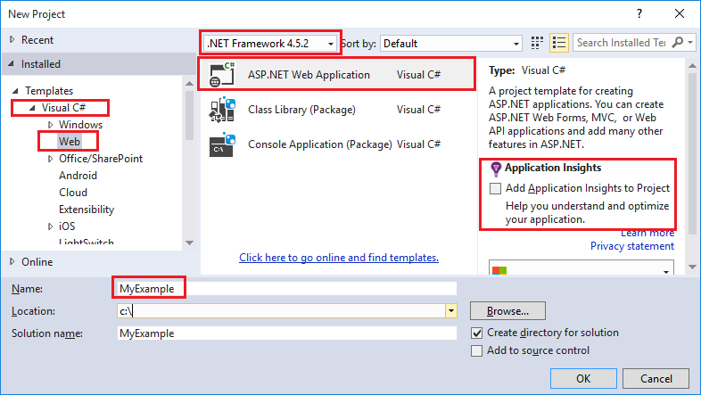
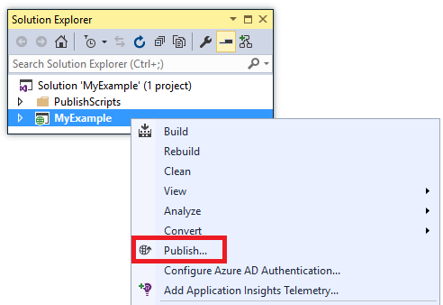
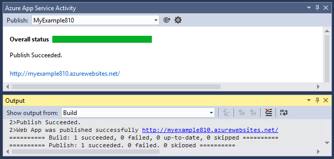
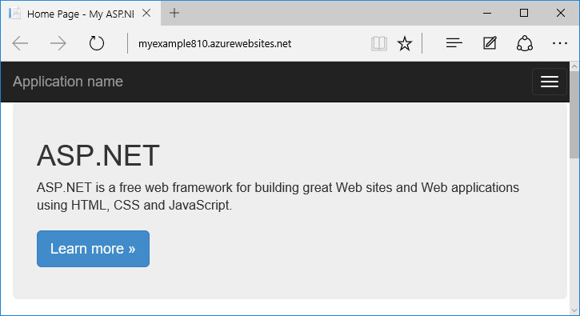

<properties
    pageTitle="Implementar una aplicación ASP.NET al servicio de aplicación de Azure con Visual Studio | Microsoft Azure"
    description="Obtenga información sobre cómo implementar un proyecto web ASP.NET a una nueva aplicación web de servicio de aplicación de Azure, con Visual Studio."
    services="app-service\web"
    documentationCenter=".net"
    authors="tdykstra"
    manager="wpickett"
    editor=""/>

<tags
    ms.service="app-service-web"
    ms.workload="web"
    ms.tgt_pltfrm="na"
    ms.devlang="dotnet"
    ms.topic="get-started-article"
    ms.date="07/22/2016"
    ms.author="rachelap"/>

# Implementar una aplicación web de ASP.NET al servicio de aplicación de Azure, con Visual Studio

[AZURE.INCLUDE [tabs](../../includes/app-service-web-get-started-nav-tabs.md)]

## Información general

Este tutorial muestra cómo implementar una aplicación web ASP.NET a una [aplicación web en la aplicación de servicio de Azure](app-service-web-overview.md) mediante Visual Studio de 2015.

El tutorial se supone que un desarrollador ASP.NET que no tiene ninguna experiencia con el uso de Azure. Cuando haya terminado, tendrá una aplicación web simple hacia arriba y en la nube.

Aprenderá:

* Cómo crear una nueva aplicación de servicio de aplicación web mientras crea un nuevo proyecto web en Visual Studio.
* Cómo implementar un proyecto web en una aplicación de servicio de aplicación web mediante Visual Studio.

El diagrama muestra qué hacer en el tutorial.

Al final del tutorial, una sección de [solución de problemas](#troubleshooting) proporciona ideas sobre qué hacer si algo no funciona y una sección de [pasos siguientes](#next-steps) proporciona vínculos a otros tutoriales de entrar en más profundidad sobre cómo usar el servicio de aplicación de Azure.

Como se trata de un tutorial Introducción, el proyecto web que se muestra cómo implementar es una sencilla que no usa una base de datos y no autenticación o autorización. Para obtener vínculos a temas más avanzados de implementación, vea [cómo implementar una aplicación web de Azure](web-sites-deploy.md).

Aparte del tiempo necesario para instalar el SDK de Azure para .NET, este tutorial tardarán entre 10 y 15 minutos en completar.

## Requisitos previos

* El tutorial se supone que ha trabajado con ASP.NET MVC y Visual Studio. Si necesita una introducción, vea [Introducción a ASP.NET MVC 5](http://www.asp.net/mvc/overview/getting-started/introduction/getting-started).

* Necesita una cuenta de Azure. Puede [Abrir una cuenta gratuita de Azure](/pricing/free-trial/?WT.mc_id=A261C142F) o [Activar Visual Studio ventajas de suscriptor](/pricing/member-offers/msdn-benefits-details/?WT.mc_id=A261C142F). 

    Si desea empezar a trabajar con el servicio de aplicación de Azure antes de suscribirse a una cuenta de Azure, vaya a [Probar el servicio de aplicación](http://go.microsoft.com/fwlink/?LinkId=523751). Se puede crear una aplicación de corta duración starter en la aplicación de servicio: sin tarjeta de crédito obligatorio y sin compromisos.

## Configurar el entorno de desarrollo

El tutorial está escrito para Visual Studio de 2015 con el [SDK de Azure para .NET](../dotnet-sdk.md) 2,9 o posterior. 

* [Descargar el SDK de Azure más reciente de Visual Studio de 2015](http://go.microsoft.com/fwlink/?linkid=518003). El SDK instala 2015 de Visual Studio, si todavía no tiene.

    >[AZURE.NOTE] Dependiendo de cuántos las dependencias SDK ya tiene en su equipo, instalar el SDK podría tardar mucho tiempo, desde varios minutos a media hora o más.

Si tiene 2013 de Visual Studio y prefiere utilice, puede [descargar el SDK de Azure más reciente para Visual Studio de 2013](http://go.microsoft.com/fwlink/?LinkID=324322). Algunas pantallas pueden tener un aspecto diferentes de las ilustraciones.

## Configurar un nuevo proyecto de web

El siguiente paso es crear un proyecto web en Visual Studio y una aplicación web de servicio de aplicaciones de Azure. En esta sección del tutorial se configura el nuevo proyecto web. 

1. Abra Visual Studio de 2015.

2. Haga clic en **archivo > Nuevo > proyecto**.

3. En el cuadro de diálogo **Nuevo proyecto** , haga clic en **Visual C# > Web > aplicación Web de ASP.NET**.

3. Asegúrese de que está seleccionado **.NET Framework 4.5.2** como marco de destino.

4.  [Información de la aplicación de Azure](../application-insights/app-insights-overview.md) supervisa la aplicación web de disponibilidad, rendimiento y uso. De forma predeterminada la primera vez que se cree un proyecto web después de instalar Visual Studio, está seleccionada la casilla de verificación **Agregar perspectivas de aplicación al proyecto** . Desactive la casilla de verificación si está seleccionada pero no desea probar perspectivas de aplicación.

4. Nombre de la aplicación **MyExample**y, a continuación, haga clic en **Aceptar**.

    

5. En el cuadro de diálogo **Nuevo proyecto** , seleccione la plantilla **MVC** y, a continuación, haga clic en **Cambiar autenticación**.

    En este tutorial, implementar un proyecto web de ASP.NET MVC. Si desea obtener información sobre cómo implementar un proyecto ASP.NET Web API, consulte la sección [pasos siguientes](#next-steps) . 

    

6. En el cuadro de diálogo **Cambiar autenticación** , haga clic en **Sin autenticación**y, a continuación, haga clic en **Aceptar**.

    

    Este tutorial Introducción está implementando una aplicación simple que no funciona en el registro de usuario.

5. En la sección de **Microsoft Azure** del cuadro de diálogo **Nuevo proyecto de ASP.NET** , asegúrese de que está seleccionada la opción **alojar en la nube** y que el **Servicio de aplicación** está seleccionado en la lista desplegable.

    

    Esta configuración directa Visual Studio para crear una aplicación web de Azure para el proyecto web.

6. Haga clic en **Aceptar**

## Configurar recursos de Azure para una nueva aplicación web

Ahora puede decirle a Visual Studio acerca de los recursos de Azure que desee crear.

5. En el cuadro de diálogo **Crear aplicación de servicio** , haga clic en **Agregar una cuenta**y, a continuación, inicie sesión en Azure con el ID y contraseña de la cuenta que usa para administrar la suscripción de Azure.

    

    Si ha iniciado una versión anterior en el mismo equipo, posible que no vea el botón **Agregar una cuenta** . En ese caso, puede omitir este paso, o puede que tenga que volver a escribir sus credenciales.
 
3. Escriba un **Nombre de la aplicación Web** que sea único en el dominio *azurewebsites.net* . Por ejemplo, se puede asígnele el nombre MyExample con números a la derecha para que sea único, por ejemplo, MyExample810. Si se creará un nombre web predeterminado, será único y que pueda usarlo.

    Si alguien más ha utilizado el nombre que especifique, verá un signo de exclamación rojo a la derecha en lugar de una marca de verificación verde y tiene que escribir un nombre diferente.

    La dirección URL de la aplicación es este nombre plus *. azurewebsites.net*. Por ejemplo, si el nombre es `MyExample810`, la dirección URL es `myexample810.azurewebsites.net`.

    También puede usar un dominio personalizado con una aplicación web de Azure. Para obtener más información, consulte [configurar un nombre de dominio personalizado en la aplicación de servicio de Azure](web-sites-custom-domain-name.md).

6. Haga clic en el botón **nuevo** junto al cuadro de **Grupo de recursos** y, a continuación, escriba "MyExample" u otro nombre si lo prefiere. 

    

    Un grupo de recursos es una colección de Azure recursos como aplicaciones web, bases de datos y máquinas virtuales. Para obtener un tutorial es generalmente mejor crear un nuevo grupo de recursos, ya hace que sea fácil eliminar en un paso los recursos de Azure que se crean para el tutorial. Para obtener más información, vea [información general del Administrador de recursos de Azure](../azure-resource-manager/resource-group-overview.md).

4. Haga clic en el botón **nuevo** junto a la lista desplegable **Plan de servicio de aplicación** .

    

    Aparece el cuadro de diálogo **Configurar el Plan de servicio de aplicación** .

    

    En los siguientes pasos para configurar un plan de servicio de aplicación para el nuevo grupo de recursos. Un plan de servicio de aplicación especifica los recursos de cálculo que se inicia la aplicación web. Por ejemplo, si elige el nivel gratuito, la aplicación de la API se ejecuta en VM compartidas, mientras que para algunos niveles de pagadas se ejecuta en máquinas virtuales dedicadas. Para obtener más información, vea [información general de los planes de aplicación de servicio](../app-service/azure-web-sites-web-hosting-plans-in-depth-overview.md).

5. En el cuadro de diálogo **Configurar el Plan de servicio de aplicación** , escriba "MyExamplePlan" u otro nombre si lo prefiere.

5. En la lista desplegable de **ubicación** , elija la ubicación más cercana a usted.

    Esta opción especifica qué centro de datos de Azure se ejecuta la aplicación en. En este tutorial, puede seleccionar cualquier región y que no será una gran diferencia. Pero para una aplicación de producción, que desea que el servidor sea lo más cerca posible a los clientes que tienen acceso a ella, para minimizar la [latencia](http://www.bing.com/search?q=web%20latency%20introduction&qs=n&form=QBRE&pq=web%20latency%20introduction&sc=1-24&sp=-1&sk=&cvid=eefff99dfc864d25a75a83740f1e0090).

5. En la lista desplegable **tamaño** , haga clic en **liberar**.

    Para este tutorial, el nivel de precio gratuito le proporcionará buen rendimiento suficiente.

6. En el cuadro de diálogo **Configurar el Plan de servicio de aplicación** , haga clic en **Aceptar**.

7. En el cuadro de diálogo **Crear aplicación de servicio** , haga clic en **crear**.

## Visual Studio crea la aplicación web y project

En poco tiempo, suele ser menor que un minuto, Visual Studio crea el proyecto web y la aplicación web.  

La ventana **Explorador de soluciones** muestra los archivos y carpetas en el nuevo proyecto.

La ventana de **Actividad de servicio de aplicación de Azure** muestra que se ha creado la aplicación web.

La ventana del **Explorador de nube** le permite ver y administrar recursos de Azure, incluyendo la nueva aplicación web que acaba de crear.

    
## Implementar el proyecto web en la aplicación web de Azure

En esta sección, se implementa el proyecto web en la aplicación web.

1. En el **Explorador de soluciones**, haga clic en el proyecto y elija **Publicar**.

    

    En unos segundos, aparecerá el Asistente de **Publicación Web** . Se abre el Asistente para un *perfil de publicar* cuya configuración para implementar el proyecto web en la nueva aplicación web.

    El perfil de publicación incluye un nombre de usuario y contraseña para su implementación.  Estas credenciales se han generado automáticamente y no es necesario que introducirlos. La contraseña se cifra en un archivo oculto de específica del usuario en el `Properties\PublishProfiles` carpeta.
 
8. En la pestaña **conexión** del Asistente para la **Publicación Web** , haga clic en **siguiente**.

    

    A continuación, es la pestaña **configuración** . Aquí puede cambiar la configuración de compilación para implementar una versión de depuración para la [depuración remota](../app-service-web/web-sites-dotnet-troubleshoot-visual-studio.md#remotedebug). La ficha también ofrece varias [Opciones de publicación del archivo](https://msdn.microsoft.com/library/dd465337.aspx#Anchor_2).

10. En la pestaña **configuración** , haga clic en **siguiente**.

    

    La ficha **vista previa** es el siguiente paso. Aquí tiene una oportunidad para ver qué tipo de archivos que se van a copiar desde el proyecto en la aplicación de la API. Al implementar un proyecto para una aplicación de API que ha implementado en una versión anterior, se copian sólo los archivos modificados. Para ver una lista de lo que se copiará, haga clic en el botón de **Vista previa de inicio** .

11. En la ficha de **vista previa** , haga clic en **Publicar**.

    

    Al hacer clic en **Publicar**, Visual Studio inicia el proceso de copiar los archivos en el servidor de Azure. Esto puede tardar un minuto o dos.

    Las ventanas de **salida** y la **Actividad de servicio de aplicación de Azure** mostrar las acciones de implementación tomadas y éxito de la implementación de informes.

    

    Tras la implementación correcta, el explorador predeterminado se abre automáticamente a la dirección URL de la aplicación web implementado y ahora se está ejecutando la aplicación que ha creado en la nube. La dirección URL en la barra de direcciones del explorador muestra que la aplicación web se carga desde Internet.

    

    > [AZURE.TIP]Puede habilitar la barra de herramientas **Web una haga clic en publicar** para su implementación rápida. Haga clic en **Vista > barras de herramientas**y, a continuación, seleccione **Una haga clic en publicación Web**. Puede usar la barra de herramientas para seleccionar un perfil, haga clic en un botón Publicar o haga clic en un botón para abrir al Asistente de **Publicación Web** .
    > 

## Solución de problemas

Si tiene un problema durante este tutorial, asegúrese de que está usando la versión más reciente de Azure SDK para .NET. La manera más sencilla de hacerlo es [descargar el SDK de Azure para Visual Studio de 2015](http://go.microsoft.com/fwlink/?linkid=518003). Si tiene instalada la versión actual, el instalador de plataforma Web le permite saber que no es necesario realizar ninguna instalación.

Si está en una red corporativa y está intentando implementar al servicio de la aplicación de Azure a través de un firewall, asegúrese de que los puertos 443 y 8172 están abiertos para implementar Web. Si no puede abrir los puertos, vea la siguiente sección de pasos siguientes para ver otras opciones de implementación.

Una vez que la aplicación web de ASP.NET ejecuta en el servicio de aplicación de Azure, desea obtener más información sobre las características de Visual Studio que simplifican la solución de problemas. Para obtener información acerca del registro, depuración remota y obtener más información, vea [solución de problemas de Azure web apps en Visual Studio](web-sites-dotnet-troubleshoot-visual-studio.md).

## Pasos siguientes

En este tutorial, ha visto cómo crear una aplicación web simple e implementar una aplicación web de Azure. Estos son algunos temas relacionados y recursos para obtener más información sobre la aplicación de servicio de Azure:

* Supervisar y administrar la aplicación web en el [portal de Azure](https://portal.azure.com/). 

    Para obtener más información, vea [información general sobre el portal de Azure](/services/management-portal/) y [Configurar web apps en el servicio de aplicación de Azure](web-sites-configure.md).

* Implementar un proyecto web existente a una nueva aplicación web, en Visual Studio

    Haga clic en el proyecto en el **Explorador de soluciones**y, a continuación, haga clic en **Publicar**. Elija la **Aplicación de servicio de Microsoft Azure** como el destino de publicación y, a continuación, haga clic en **nuevo**. Los cuadros de diálogo, a continuación, son los mismos que ha visto en este tutorial.

* Implementar un proyecto web desde el control de código fuente

    Para obtener información acerca de cómo [automatizar la implementación](http://www.asp.net/aspnet/overview/developing-apps-with-windows-azure/building-real-world-cloud-apps-with-windows-azure/continuous-integration-and-continuous-delivery) de un [sistema de control de código fuente](http://www.asp.net/aspnet/overview/developing-apps-with-windows-azure/building-real-world-cloud-apps-with-windows-azure/source-control), vea [Introducción a aplicaciones web en el servicio de aplicación de Azure](app-service-web-get-started.md) y [cómo implementar una aplicación web de Azure](web-sites-deploy.md).

* Implementar una API Web de ASP.NET en una aplicación de API de Azure de aplicación de servicio

    Ha visto cómo crear una instancia de servicio de aplicación de Azure pretende principalmente para hospedar un sitio Web. Aplicación de servicio también ofrece características de hospedaje Web API, como la compatibilidad con CORS y soporte técnico de metadatos de API para la generación de código de cliente. Puede usar funciones de la API en una aplicación web, pero si desea principalmente hospedar una API en una instancia de aplicación de servicio, una **aplicación de API** sería una opción mejor. Para obtener más información, vea [Introducción a aplicaciones API y ASP.NET en la aplicación de servicio de Azure](../app-service-api/app-service-api-dotnet-get-started.md). 

* Agregar un nombre de dominio personalizado y SSL

    Para obtener información sobre cómo usar SSL y su propio dominio (por ejemplo, www.contoso.com en lugar de contoso.azurewebsites.net), consulte los siguientes recursos:

    * [Configurar un nombre de dominio personalizado en la aplicación de servicio de Azure](web-sites-custom-domain-name.md)
    * [Habilitar HTTPS para un sitio Web de Azure](web-sites-configure-ssl-certificate.md)

* Eliminar el grupo de recursos que contiene la aplicación web y los recursos relacionados de Azure cuando haya terminado con ellos.

    Para obtener información sobre cómo trabajar con grupos de recursos en el portal de Azure, vea [implementar recursos a las plantillas de administrador de recursos y portal de Azure](../resource-group-template-deploy-portal.md).   

*   Para obtener más ejemplos de creación de una aplicación Web de ASP.NET en la aplicación de servicio, consulte [crear e implementar una aplicación web de ASP.NET en la aplicación de servicio de Azure](https://github.com/Microsoft/HealthClinic.biz/wiki/Create-and-deploy-an-ASP.NET-web-app-in-Azure-App-Service) y [crear e implementar una aplicación móvil de servicio de la aplicación de Azure](https://github.com/Microsoft/HealthClinic.biz/wiki/Create-and-deploy-a-mobile-app-in-Azure-App-Service) desde la conexión de [HealthClinic.biz](https://github.com/Microsoft/HealthClinic.biz) 2015 [demostración](https://blogs.msdn.microsoft.com/visualstudio/2015/12/08/connectdemos-2015-healthclinic-biz/). Para más tutoriales de la demostración HealthClinic.biz, vea [Tutoriales de herramientas de desarrollador de Azure](https://github.com/Microsoft/HealthClinic.biz/wiki/Azure-Developer-Tools-Quickstarts).
