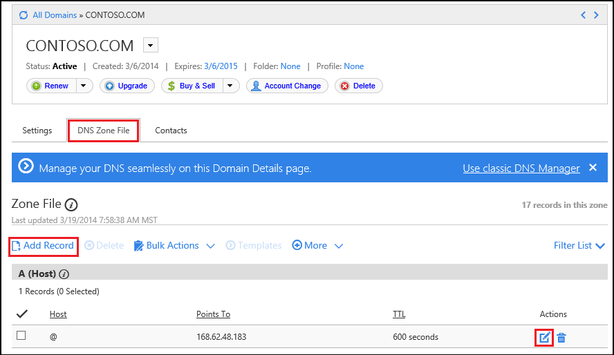

<properties
    pageTitle="Configurar un nombre de dominio personalizado en el servicio de aplicación de Azure (GoDaddy)"
    description="Aprenda a usar un nombre de dominio de GoDaddy con aplicaciones Web de Azure"
    services="app-service"
    documentationCenter=""
    authors="erikre"
    manager="wpickett"
    editor="jimbe"/>

<tags
    ms.service="app-service"
    ms.workload="na"
    ms.tgt_pltfrm="na"
    ms.devlang="na"
    ms.topic="article"
    ms.date="01/12/2016"
    ms.author="cephalin"/>

# Configurar un nombre de dominio personalizado en el servicio de aplicación de Azure (comprado directamente desde GoDaddy)

[AZURE.INCLUDE [web-selector](../../includes/websites-custom-domain-selector.md)]

[AZURE.INCLUDE [intro](../../includes/custom-dns-web-site-intro.md)]

Si ha adquirido dominio a través de Azure aplicación de servicio Web Apps, a continuación, consulte el paso final del [Dominio comprar para las aplicaciones Web](custom-dns-web-site-buydomains-web-app.md).

Este artículo ofrece instrucciones sobre cómo usar un nombre de dominio personalizado que se compró directamente de [GoDaddy](https://godaddy.com) con la [Aplicación de servicio Web Apps](http://go.microsoft.com/fwlink/?LinkId=529714).

[AZURE.INCLUDE [introfooter](../../includes/custom-dns-web-site-intro-notes.md)]

##Descripción de los registros DNS

[AZURE.INCLUDE [understandingdns](../../includes/custom-dns-web-site-understanding-dns-raw.md)]

## Agregar un registro DNS de su dominio personalizado

Para asociar el dominio personalizado con una aplicación web en la aplicación de servicio, debe agregar una nueva entrada en la tabla DNS de su dominio personalizado con herramientas de GoDaddy. Realice los pasos siguientes para ubicar las herramientas DNS de GoDaddy

1. Inicie sesión su cuenta con GoDaddy y seleccione **Mi cuenta** y, a continuación, en **Administrar mis dominios**. Por último, seleccione el menú desplegable Nombre del dominio que desea usar con la aplicación web de Azure y seleccione **Administrar DNS**.

    

2. Desde la página **Detalles del dominio** , desplácese a la ficha **Archivo de zona DNS** . Esta es la sección utilizada para agregar y modificar los registros DNS para su nombre de dominio.

    

    Seleccione **Agregar registro** para agregar un registro existente.

    Para **Editar** un registro existente, seleccione el icono de lápiz y papel junto al registro.

    > [AZURE.NOTE] Antes de agregar registros nuevos, tenga en cuenta que GoDaddy ya ha creado los registros DNS para populares subdominios (denominados **Host** en el editor,) como **correo electrónico**, **archivos**, **correo**y otros usuarios. Si el nombre que desea utilizar ya existe, modifique el registro existente en lugar de crear uno nuevo.

4. Al agregar un registro, primero debe seleccionar el tipo de registro.

    

    A continuación, debe proporcionar el **Host** (el dominio personalizado o subdominio) y lo que **señala**.

    

    * Al agregar un **registro A (host)** - debe establecer el campo de **Host** : **@** (Esto representa el nombre de dominio raíz, como por ejemplo **contoso.com**,) *(un carácter comodín para que coincidan con varios subdominios) o el subdominio que desea utilizar (por ejemplo, * *www**.) Debe establecer el * *destino** campo a la dirección IP de su aplicación web de Azure.

    * Al agregar un **registro CNAME (alias)** - debe establecer el campo de **Host** para el subdominio que desea usar. Por ejemplo, **www**. Debe establecer el campo de **destino** en la **. azurewebsites.net** nombre de dominio de la aplicación web de Azure. Por ejemplo, **contoso.azurewebsites.net**.

5. Haga clic en **Agregar otro**.
6. Seleccione el tipo de registro **TXT** y luego especifique un valor de **Host** de **@** y un valor de **destino** de ** &lt;yourwebappname&gt;. azurewebsites.net**.

    > [AZURE.NOTE] Este registro TXT se usa por Azure para validar que es el propietario del dominio que se describe en el registro a o el primer registro TXT. Una vez que se ha asignado el dominio a la aplicación web en el Portal de Azure, se puede quitar esta entrada de registro TXT.

5. Cuando haya terminado de agregar o modificar los registros, haga clic en **Finalizar** para guardar los cambios.

## Habilitar el nombre de dominio en la aplicación web

[AZURE.INCLUDE [modes](../../includes/custom-dns-web-site-enable-on-web-site.md)]

>[AZURE.NOTE] Si desea empezar a trabajar con el servicio de aplicación de Azure antes de suscribirse para una cuenta de Azure, vaya a [Probar el servicio de aplicaciones](http://go.microsoft.com/fwlink/?LinkId=523751), donde puede crear inmediatamente una aplicación web de starter corta duración en la aplicación de servicio. Sin tarjetas de crédito obligatoria; sin compromisos.

## ¿Qué ha cambiado
* Encontrará una guía para el cambio de sitios Web a la aplicación de servicio: [servicio de aplicación de Azure y su influencia sobre los servicios de Azure existentes](http://go.microsoft.com/fwlink/?LinkId=529714)
