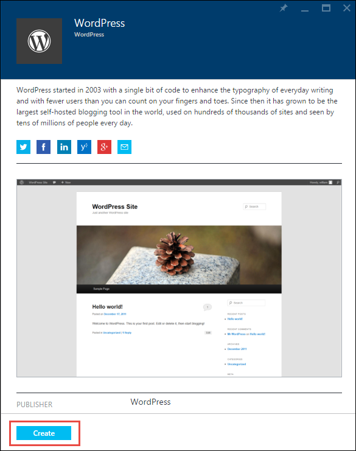
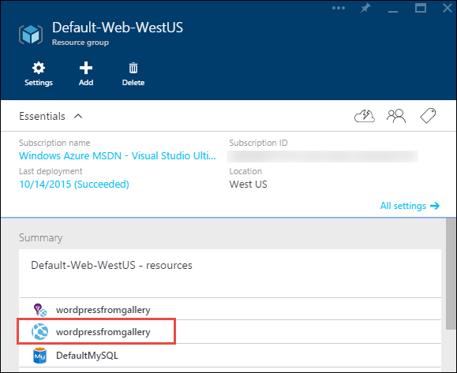

<properties
    pageTitle="Crear una aplicación web de WordPress en servicio de la aplicación de Azure | Microsoft Azure"
    description="Obtenga información sobre cómo crear una nueva aplicación web de Azure para un blog WordPress con el Portal de Azure."
    services="app-service\web"
    documentationCenter="php"
    authors="rmcmurray"
    manager="wpickett"
    editor=""/>

<tags
    ms.service="app-service-web"
    ms.workload="na"
    ms.tgt_pltfrm="na"
    ms.devlang="PHP"
    ms.topic="hero-article"
    ms.date="08/11/2016"
    ms.author="robmcm"/>

# Crear una aplicación web de WordPress en servicio de la aplicación de Azure

[AZURE.INCLUDE [tabs](../../includes/app-service-web-get-started-nav-tabs.md)]

Este tutorial muestra cómo implementar un sitio de blog WordPress de Azure Marketplace.

Cuando haya terminado con el tutorial tendrá su propio sitio de blog WordPress hacia arriba y en la nube.

Aprenderá:

* Cómo buscar una plantilla de aplicación en Azure Marketplace.
* Cómo crear una aplicación web de servicio de la aplicación de Azure que se basa en la plantilla.
* Cómo configurar el servicio de aplicación de Azure para la nueva aplicación web y base de datos.

Azure Marketplace hace que esté disponible una amplia gama de aplicaciones web populares desarrollado por Microsoft, compañías de terceros e iniciativas de software de código abierto. Las aplicaciones web se basan en una amplia gama de marcos populares, como [PHP](/develop/nodejs/) en este ejemplo WordPress, [. NET](/develop/net/), [Node.js](/develop/nodejs/), [Java](/develop/java/)y [Python](/develop/python/), entre otros. Para crear una aplicación web de Azure Marketplace el software solo que necesita es el explorador que use para el [Portal de Azure](https://portal.azure.com/). 

El sitio de WordPress implementar en este tutorial usa MySQL para la base de datos. Si desea usar en su lugar la base de datos de SQL para la base de datos, vea [Nami del proyecto](http://projectnami.org/). **Proyecto Nami** también está disponible mediante el catálogo de soluciones.

> [AZURE.NOTE]
> Para completar este tutorial, necesita una cuenta de Microsoft Azure. Si no tiene una cuenta, puede [activar las ventajas de suscriptor de Visual Studio](/pricing/member-offers/msdn-benefits-details/?WT.mc_id=A261C142F) o [suscribirse a una prueba gratuita](/en-us/pricing/free-trial/?WT.mc_id=A261C142F).
>
> Si desea empezar a trabajar con el servicio de aplicación de Azure antes de suscribirse a una cuenta de Azure, vaya a [Probar el servicio de aplicación](http://go.microsoft.com/fwlink/?LinkId=523751). Allí, puede crear inmediatamente una aplicación web de starter corta duración en la aplicación de servicio: sin tarjeta de crédito obligatorio y sin compromisos.

## Seleccione WordPress y configurar el servicio de aplicación de Azure

1. Inicie sesión en el [Portal de Azure](https://portal.azure.com/).

2. Haga clic en **nuevo**.
    
    ![Crear nuevo][5]
    
3. Buscar **WordPress**y, a continuación, haga clic en **WordPress**. Si desea usar la base de datos de SQL en lugar de MySQL, busque **Nami del proyecto**.

    ![WordPress de lista][7]
    
5. Después de leer la descripción de la aplicación de WordPress, haga clic en **crear**.

    

4. Escriba un nombre para la aplicación web en el cuadro de la **aplicación Web** .

    Este nombre debe ser único en el dominio azurewebsites.net porque la dirección URL de la aplicación web será {nombre}. azurewebsites.net. Si el nombre que escribe no único, aparece un signo de exclamación rojo en el cuadro de texto.

8. Si tiene más de una suscripción, elija el que desee usar. 

5. Seleccione un **Grupo de recursos** o cree uno nuevo.

    Para obtener más información acerca de los grupos de recursos, vea [información general del Administrador de recursos de Azure](../azure-resource-manager/resource-group-overview.md).

5. Seleccione una **Ubicación o plan de aplicación de servicio** o cree uno nuevo.

    Para obtener más información acerca de los planes de servicio de aplicaciones, vea [información general de los planes de servicio de la aplicación de Azure](../azure-web-sites-web-hosting-plans-in-depth-overview.md) 

7. Haga clic en **base de datos**y, a continuación, en el módulo de la **Nueva base de datos MySQL** proporcionarán los valores necesarios para configurar la base de datos MySQL.

    una. Escriba un nombre nuevo o dejar el nombre predeterminado.

    b. Deje el **Tipo de base de datos** establecido en **compartido**.

    c. Elija la misma ubicación que el que eligió en la aplicación web.

    d. Elija un nivel de precios. Mercurio (conexiones permitidas mínimas y espacio en disco) es adecuado para este tutorial.

8. En el módulo de la **Nueva base de datos MySQL** , haga clic en **Aceptar**. 

8. En el módulo **WordPress** , acepte las condiciones legales y, a continuación, haga clic en **crear**. 

    

    Servicio de aplicaciones de Azure crea la aplicación web, normalmente en menos de un minuto. Puede ver el progreso haciendo clic en el icono de campana en la parte superior de la página del portal.

    

## Iniciar y administrar la aplicación web de WordPress
    
7. Cuando haya finalizado la creación de la aplicación web, desplácese en el Portal de Azure al grupo de recursos en la que se creó la aplicación y puede ver la aplicación web y la base de datos.

    El recurso adicional con el icono de bombilla es [Perspectivas de aplicación](/services/application-insights/), que proporciona servicios de supervisión para la aplicación web.

1. En el módulo de **grupo de recursos** , haga clic en la línea de la aplicación web.

    

2. En el módulo de aplicación Web, haga clic en **Examinar**.

    ![dirección URL del sitio][browse]

3. En la página de **bienvenida** WordPress, escriba la información de configuración requerida por WordPress y, a continuación, haga clic en **Instalar WordPress**.

    

4. Inicie sesión con las credenciales que creó en la página **principal** .  

5. Se abrirá la página de panel de sitio.    

    

## Pasos siguientes

Ha visto cómo crear e implementar una aplicación web PHP desde la galería. Para obtener más información sobre cómo usar PHP en Azure, consulte el [Centro para desarrolladores de PHP](/develop/php/).

Para obtener más información sobre cómo trabajar con la aplicación de servicio Web Apps, vea los vínculos en el lado izquierdo de la página (para windows explorador amplia) o en la parte superior de la página (para windows explorador estrecho). 

## ¿Qué ha cambiado
* Para obtener una guía para el cambio de sitios Web a la aplicación de servicio, vea [servicio de aplicación de Azure y su impacto en los servicios de Azure existentes](http://go.microsoft.com/fwlink/?LinkId=529714).

[5]: ./media/web-sites-php-web-site-gallery/startmarketplace.png
[7]: ./media/web-sites-php-web-site-gallery/search-web-app.png
[browse]: ./media/web-sites-php-web-site-gallery/browse-web.png
