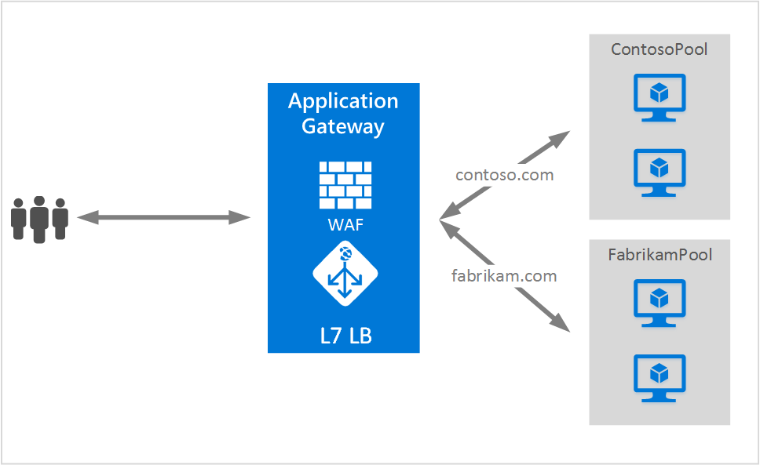

<properties
   pageTitle="Alojar varios sitios en la puerta de enlace de aplicación | Microsoft Azure"
   description="Esta página proporciona información general sobre la compatibilidad con varios sitio de puerta de enlace de aplicación."
   documentationCenter="na"
   services="application-gateway"
   authors="amsriva"
   manager="rossort"
   editor="amsriva"/>
<tags
   ms.service="application-gateway"
   ms.devlang="na"
   ms.topic="hero-article"
   ms.tgt_pltfrm="na"
   ms.workload="infrastructure-services"
   ms.date="10/25/2016"
   ms.author="amsriva"/>

# Puerta de enlace de aplicación alojamiento de varios sitios

Alojamiento de varios sitios permite configurar más de una aplicación web en la misma instancia de puerta de enlace de aplicación. Esta característica le permite configurar una topología más eficaz para las implementaciones agregando sitios Web hasta 20 a la puerta de enlace de una aplicación. Cada sitio Web se puede dirige a su propio grupo de back-end. En el ejemplo siguiente, la puerta de enlace de aplicación está atendiendo tráfico de contoso.com y fabrikam.com de dos grupos de servidor back-end denominados ContosoServerPool y FabrikamServerPool.

Las solicitudes de http://contoso.com se enrutan a ContosoServerPool y http://fabrikam.com se enrutan a FabrikamServerPool.

Del mismo modo dos subdominios del mismo dominio principal pueden estar hospedadas en la misma implementación de puerta de enlace de aplicación. Ejemplos de uso de subdominios pueden incluir http://blog.contoso.com y http://app.contoso.com alojado en una implementación de la puerta de enlace de aplicación única.

## Encabezados de host e indicación de nombre de servidor (SNI)

Existen tres mecanismos comunes para habilitar el alojamiento de varios sitios en la misma infraestructura.

1. Hospedar varias aplicaciones web cada una dirección IP única.
2. Use el nombre de host para hospedar varias aplicaciones web en la misma dirección IP.
3. Usar puertos diferentes para varias aplicaciones web en la misma dirección IP.

Actualmente una puerta de enlace de aplicación obtiene una sola dirección IP pública en el que escucha para el tráfico. Por lo tanto, admitir varias aplicaciones, cada una con su propia dirección IP, no es compatible actualmente. Puerta de enlace de aplicación es compatible con varias aplicaciones de hospedaje cada escucha en puertos diferentes pero este escenario, se requeriría las aplicaciones para aceptar el tráfico en puertos no estándar y no suele ser una configuración deseada. Puerta de enlace de aplicación se basa en los encabezados de host HTTP 1.1 hospedar más de un sitio Web en la misma dirección IP pública y puerto. Los sitios alojados en la puerta de enlace de aplicación también pueden descarga SSL compatibilidad con la extensión de nombre de servidor indicación (SNI) TLS. Este escenario significa que el cliente explorador y back-end granja de servidores web debe ser compatible con HTTP/1.1 y extensión TLS según se define en RFC 6066.

## Elemento de configuración de escucha

Elemento de configuración de HTTPListener existente se ha mejorado para admitir elementos de host name y servidor indicación nombre, que se utiliza por la puerta de enlace de aplicaciones para enrutar el tráfico al grupo de back-end adecuados. En el ejemplo siguiente se es el fragmento de código del elemento HttpListeners del archivo de plantilla.

    "httpListeners": [
                {
                    "name": "appGatewayHttpsListener1",
                    "properties": {
                        "FrontendIPConfiguration": {
                            "Id": "/subscriptions/<subid>/resourceGroups/<rgName>/providers/Microsoft.Network/applicationGateways/applicationGateway1/frontendIPConfigurations/DefaultFrontendPublicIP"
                        },
                        "FrontendPort": {
                            "Id": "/subscriptions/<subid>/resourceGroups/<rgName>/providers/Microsoft.Network/applicationGateways/applicationGateway1/frontendPorts/appGatewayFrontendPort443'"
                        },
                        "Protocol": "Https",
                        "SslCertificate": {
                            "Id": "/subscriptions/<subid>/resourceGroups/<rgName>/providers/Microsoft.Network/applicationGateways/applicationGateway1/sslCertificates/appGatewaySslCert1'"
                        },
                        "HostName": "contoso.com",
                        "RequireServerNameIndication": "true"
                    }
                },
                {
                    "name": "appGatewayHttpListener2",
                    "properties": {
                        "FrontendIPConfiguration": {
                            "Id": "/subscriptions/<subid>/resourceGroups/<rgName>/providers/Microsoft.Network/applicationGateways/applicationGateway1/frontendIPConfigurations/appGatewayFrontendIP'"
                        },
                        "FrontendPort": {
                            "Id": "/subscriptions/<subid>/resourceGroups/<rgName>/providers/Microsoft.Network/applicationGateways/applicationGateway1/frontendPorts/appGatewayFrontendPort80'"
                        },
                        "Protocol": "Http",
                        "HostName": "fabrikam.com",
                        "RequireServerNameIndication": "false"
                    }
                }
            ],

Puede visitar la [plantilla de administrador de recursos con alojamiento de varios sitios](https://github.com/Azure/azure-quickstart-templates/blob/master/201-application-gateway-multihosting) para una implementación de llevar a cabo basado en la plantilla.

## Regla de enrutamiento

No hay ningún cambio necesario en la regla de enrutamiento. La regla de enrutamiento 'Basic' debe seguir elegir asociar la escucha de sitio adecuados para el grupo de direcciones correspondientes de back-end.

    "requestRoutingRules": [
    {
        "name": "<ruleName1>",
        "properties": {
            "RuleType": "Basic",
            "httpListener": {
                "id": "/subscriptions/<subid>/resourceGroups/<rgName>/providers/Microsoft.Network/applicationGateways/applicationGateway1/httpListeners/appGatewayHttpsListener1')]"
            },
            "backendAddressPool": {
                "id": "/subscriptions/<subid>/resourceGroups/<rgName>/providers/Microsoft.Network/applicationGateways/applicationGateway1/backendAddressPools/ContosoServerPool')]"
            },
            "backendHttpSettings": {
                "id": "/subscriptions/<subid>/resourceGroups/<rgName>/providers/Microsoft.Network/applicationGateways/applicationGateway1/backendHttpSettingsCollection/appGatewayBackendHttpSettings')]"
            }
        }

    },
    {
        "name": "<ruleName2>",
        "properties": {
            "RuleType": "Basic",
            "httpListener": {
                "id": "/subscriptions/<subid>/resourceGroups/<rgName>/providers/Microsoft.Network/applicationGateways/applicationGateway1/httpListeners/appGatewayHttpListener2')]"
            },
            "backendAddressPool": {
                "id": "/subscriptions/<subid>/resourceGroups/<rgName>/providers/Microsoft.Network/applicationGateways/applicationGateway1/backendAddressPools/FabrikamServerPool')]"
            },
            "backendHttpSettings": {
                "id": "/subscriptions/<subid>/resourceGroups/<rgName>/providers/Microsoft.Network/applicationGateways/applicationGateway1/backendHttpSettingsCollection/appGatewayBackendHttpSettings')]"
            }
        }

    }
    ]

## Pasos siguientes

Después de aprendizaje sobre alojamiento de varios sitios, vaya a [crear una puerta de enlace de la aplicación con alojamiento de varios sitios](application-gateway-create-multisite-azureresourcemanager-powershell.md) para crear una puerta de enlace de la aplicación con capacidad para admitir más de una aplicación web.
