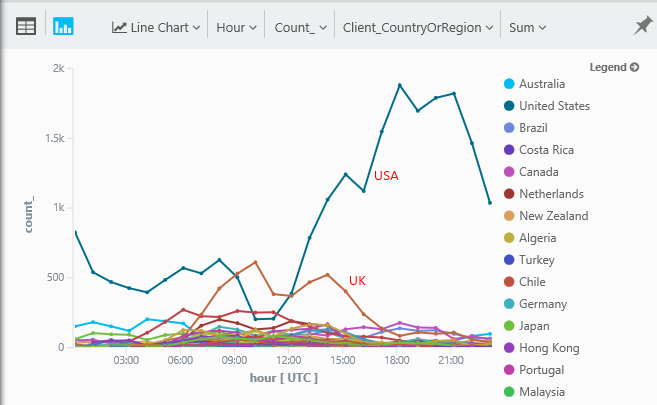
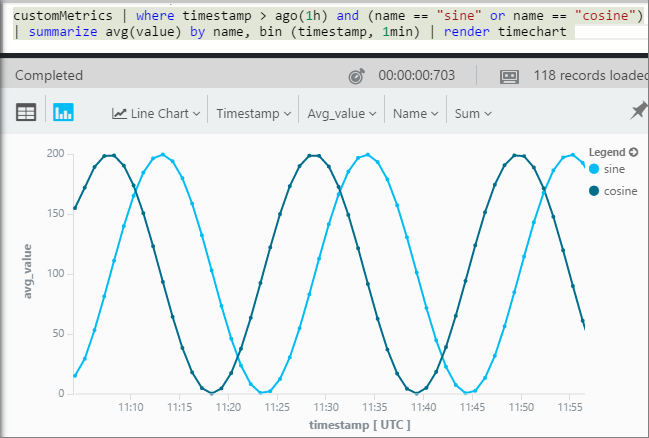
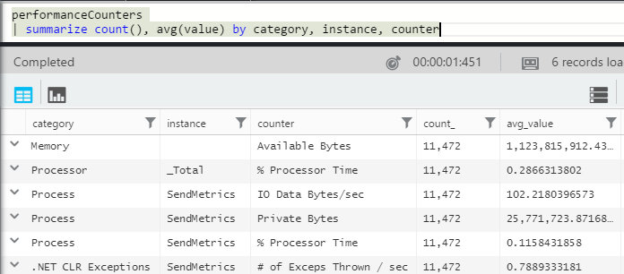
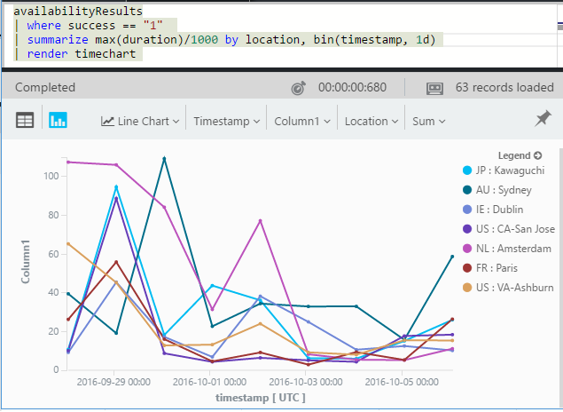

<properties 
    pageTitle="Un paseo por el análisis en la aplicación perspectivas | Microsoft Azure" 
    description="Ejemplos breves de todas las consultas principales de análisis de la herramienta de búsqueda eficaces de perspectivas de aplicación." 
    services="application-insights" 
    documentationCenter=""
    authors="alancameronwills" 
    manager="douge"/>

<tags 
    ms.service="application-insights" 
    ms.workload="tbd" 
    ms.tgt_pltfrm="ibiza" 
    ms.devlang="na" 
    ms.topic="article" 
    ms.date="10/15/2016" 
    ms.author="awills"/>


 
# <a name="a-tour-of-analytics-in-application-insights"></a>Un recorrido de análisis en la aplicación perspectivas


[El análisis](app-insights-analytics.md) es la característica de búsqueda eficaz de [Perspectivas de aplicación](app-insights-overview.md). Estas páginas describen la lanquage de consulta de análisis.


* **[Ver el vídeo de introducción](https://applicationanalytics-media.azureedge.net/home_page_video.mp4)**.
* **[Versión de prueba de análisis en nuestros datos simuladas](https://analytics.applicationinsights.io/demo)** si su aplicación no enviar datos de aplicación impresiones todavía.


Echemos un recorrido por algunas consultas básicas para empezar.

## <a name="connect-to-your-application-insights-data"></a>Conectar a los datos de aplicación perspectivas

Abra el análisis desde el [módulo de información general](app-insights-dashboards.md) de la aplicación en perspectivas de aplicación:


    
## <a name="takeapp-insights-analytics-referencemdtake-operator-show-me-n-rows"></a>[Tomar](app-insights-analytics-reference.md#take-operator): mostrar filas n

Puntos de datos que el registro de las operaciones de usuario (normalmente solicitudes HTTP recibidas por la aplicación web) se almacenan en una tabla denominada `requests`. Cada fila es un punto de datos de telemetría recibido desde el SDK de perspectivas de aplicación en la aplicación.

Empezaremos examinando algunas filas de ejemplo de la tabla:


> [AZURE.NOTE] Coloque el cursor en algún lugar de la instrucción antes de hacer clic en Ir. Puede dividir una instrucción en más de una línea, pero no la someta a líneas en blanco en una instrucción. Líneas en blanco son una forma cómoda de tener varias consultas independientes en la ventana.


Elegir columnas, arrástrelos, agrupar por columnas y filtrar: 


Expandir cualquier elemento para ver los detalles:
 


> [AZURE.NOTE] Haga clic en el encabezado de una columna para cambiar el orden de los resultados disponibles en el explorador web. Pero tenga en cuenta que, para un amplio conjunto de resultados, el número de filas que se descarga en el explorador es limitado. Ordenación de esta manera siempre no muestra los elementos superiores o inferiores. Para ordenar los elementos confiable, use la `top` o `sort` operador. 

## <a name="topapp-insights-analytics-referencemdtop-operator-and-sortapp-insights-analytics-referencemdsort-operator"></a>[Parte superior](app-insights-analytics-reference.md#top-operator) y [Ordenar](app-insights-analytics-reference.md#sort-operator)

`take`es muy útil para obtener un ejemplo rápido de un resultado, pero se muestran las filas de la tabla en ningún orden determinado. Para obtener una vista ordenada, use `top` (para obtener un ejemplo) o `sort` (a través de toda la tabla).

Mostrar las primeras n filas, ordenadas por una columna en particular:

```AIQL

    requests | top 10 by timestamp desc 
```

* *Sintaxis:* La mayoría de los operadores tienen parámetros de palabra clave como `by`.
* `desc`= descendente, `asc` = ascendente.


`top...`es más eficaz de dicho `sort ... | take...`. ¿Podríamos haber escrito:

```AIQL

    requests | sort by timestamp desc | take 10
```

El resultado será el mismo, pero se ejecutará un poco más despacio. (También puede escribir `order`, que es el alias de `sort`.)

Los encabezados de columna en la vista de tabla pueden utilizarse también para ordenar los resultados en la pantalla. Pero, por supuesto, si ha usado `take` o `top` para recuperar parte de una tabla, deberá volver a pida únicamente los registros que se han recuperado.


## <a name="projectapp-insights-analytics-referencemdproject-operator-select-rename-and-compute-columns"></a>[Proyecto](app-insights-analytics-reference.md#project-operator): seleccionar, cambiar el nombre y calcular columnas

Usar [`project`](app-insights-analytics-reference.md#project-operator) elegir solo las columnas que desee:

```AIQL

    requests | top 10 by timestamp desc
             | project timestamp, name, resultCode
```


También puede cambiar el nombre de las columnas y definir nuevos:

```AIQL

    requests 
  	| top 10 by timestamp desc 
  	| project  
            name, 
            response = resultCode,
            timestamp, 
            ['time of day'] = floor(timestamp % 1d, 1s)
```


* [Nombres de columna](app-insights-analytics-reference.md#names) puede incluir espacios o símbolos si están enmarcadas como esta: `['...']` o`["..."]`
* `%`es el operador de módulo habitual. 
* `1d`(que es un dígito uno, entonces ' d ') es un intervalo de tiempo literal lo que significa un día. Estos son algunos literales de intervalo de tiempo más: `12h`, `30m`, `10s`, `0.01s`.
* `floor`(alias `bin`) redondea hacia abajo al múltiplo más cercano del valor base proporciona un valor de. Así que `floor(aTime, 1s)` redondea una hora hacia abajo hasta la segunda más cercana.

[Las expresiones](app-insights-analytics-reference.md#scalars) pueden incluir todos los operadores habituales (`+`, `-`,...), y no hay un rango de funciones útiles.

    

## <a name="extendapp-insights-analytics-referencemdextend-operator-compute-columns"></a>[Ampliar](app-insights-analytics-reference.md#extend-operator): calcular columnas

Si desea agregar columnas a las existentes, use [`extend`](app-insights-analytics-reference.md#extend-operator):

```AIQL

    requests 
  	| top 10 by timestamp desc
  	| extend timeOfDay = floor(timestamp % 1d, 1s)
```

Usando [`extend`](app-insights-analytics-reference.md#extend-operator) es menos detallado [`project`](app-insights-analytics-reference.md#project-operator) si desea conservar todas las columnas existentes.


## <a name="summarizeapp-insights-analytics-referencemdsummarize-operator-aggregate-groups-of-rows"></a>[Resumir](app-insights-analytics-reference.md#summarize-operator): agregar grupos de filas

`Summarize`aplica una *función de agregación* de especificada sobre grupos de filas. 

Por ejemplo, se notifica tarda la aplicación web para responder a una solicitud en el campo `duration`. Veamos el tiempo medio de respuesta a todas las solicitudes:


O bien, nos podemos separar el resultado en solicitudes de nombres diferentes:


`Summarize`recopila los puntos de datos de la secuencia en grupos para que la `by` cláusula evalúa igualmente. Cada valor de la `by` expresión - cada nombre de la operación en el ejemplo anterior - resultados en una fila en la tabla de resultados. 

O bien, nos podemos agrupar resultados por hora del día:


Observe cómo usaremos el `bin` función (también conocido como `floor`). Si acaba de usar `by timestamp`, terminaría cada fila de entrada en su propio grupo pequeño. Para cualquier valor escalar continuo como horas o números, tenemos que dividir el intervalo continuo en un número de valores discretos, manejable y `bin` -que es en realidad la familiar redondeo desplegable `floor` funcione, es la manera más sencilla de hacerlo.

Podemos utilizar esta misma técnica para reducir rangos de cadenas:


Observe que puede usar `name=` para establecer el nombre de una columna de resultados, en las expresiones de agregación o la cláusula.

## <a name="counting-sampled-data"></a>Contar datos de muestra

`sum(itemCount)`es la agregación recomendada para contar los eventos. En muchos casos, itemCount == 1, de modo que la función simplemente cuenta el número de filas en el grupo. Pero cuando [muestreo](app-insights-sampling.md) en operación, sólo una parte de los eventos originales se conservarán como puntos de datos de información de la aplicación, para que cada punto de datos verá, hay `itemCount` eventos. 

Por ejemplo, si muestreo descarta el 75% de los eventos originales y luego itemCount == 4 en los registros se conservan. - es decir, para cada registro de retención, hay cuatro registros originales. 

Muestreo adaptación hace itemCount sea mayor durante los períodos cuando la aplicación más utilizada.

Resumir itemCount, por tanto, se le da una buena estimación del número de eventos original.


También hay una `count()` agregación (y una operación de recuento), en caso de que realmente desea contar el número de filas de un grupo.


Hay una variedad de [funciones de agregación](app-insights-analytics-reference.md#aggregations).


## <a name="charting-the-results"></a>Los resultados de gráficos


```AIQL

    exceptions 
       | summarize count()  
         by bin(timestamp, 1d)
```

De forma predeterminada, los resultados se muestran como una tabla:


Podemos realizar mejor que la vista de tabla. Echemos un vistazo a los resultados en la vista del gráfico con la vertical opción de barra:


Tenga en cuenta que, aunque se no ordenar los resultados por hora (como puede ver en la interfaz de tabla), la presentación del gráfico siempre muestra fechas y horas en el orden correcto.


## <a name="whereapp-insights-analytics-referencemdwhere-operator-filtering-on-a-condition"></a>[Donde](app-insights-analytics-reference.md#where-operator): filtrado en una condición

Si ha configurado aplicación perspectivas supervisión de lado del [cliente](app-insights-javascript.md) y el servidor de la aplicación, algunos de la telemetría en la base de datos proceden de los exploradores.

Veamos simplemente excepciones informadas de los exploradores:

```AIQL

    exceptions 
  	| where client_Type == "Browser" 
  	|  summarize count() 
       by client_Browser, outerMessage 
```


La `where` operador toma una expresión booleana. Estos son algunos puntos clave sobre ellos:

 * `and`, `or`: Operadores booleanos
 * `==`, `<>` : igual y no es igual a
 * `=~`, `!=` : cadena entre mayúsculas y minúsculas igual y no es igual. Hay muchas más operadores de comparación de cadena.

Leer todo sobre [expresiones escalares](app-insights-analytics-reference.md#scalars).

### <a name="filtering-events"></a>Filtrado de eventos

Buscar solicitudes incorrectas:

```AIQL

    requests 
  	| where isnotempty(resultCode) and toint(resultCode) >= 400
```

`responseCode`tiene tipo cadena, por lo que debe [convertirlo](app-insights-analytics-reference.md#casts) para una comparación numérica.

Resumir distintas respuestas:

```AIQL

    requests
  	| where isnotempty(resultCode) and toint(resultCode) >= 400
  	| summarize count() 
      by resultCode
```

## <a name="timecharts"></a>Timecharts

Mostrar cuántos eventos hay es cada día:

```AIQL

    requests
      | summarize event_count=count()
        by bin(timestamp, 1d)
```

Seleccione la opción de visualización del gráfico:


## <a name="multiple-series"></a>Varias series 

Varias expresiones en la `summarize` crea varias columnas.

Varias expresiones en la `by` cláusula crea varias filas, uno para cada combinación de valores.


```AIQL

    requests
  	| summarize count(), avg(duration) 
      by bin(timestamp, 1d), client_StateOrProvince, client_City 
  	| order by timestamp asc, client_StateOrProvince, client_City
```


### <a name="segment-a-chart-by-dimensions"></a>Un gráfico de segmento por dimensiones

Si el gráfico de una tabla que tiene una columna de cadena y una columna numérica, la cadena puede utilizarse para dividir los datos numéricos en otra serie de puntos. Si hay más de una columna de cadena, puede elegir qué columna para usarla como discriminador. 


### <a name="display-multiple-metrics"></a>Mostrar varias métricas

Si el gráfico a una tabla que más de una columna numérica, además de la marca de tiempo, puede mostrar cualquier combinación de ellos.


No dividir debe seleccionar antes de poder seleccionar varias columnas numéricas que no puede dividir una columna de cadena al mismo tiempo como mostrar más de una columna numérica. 


## <a name="daily-average-cycle"></a>Ciclo promedio diaria

¿Cómo se variar uso sobre el día promedio?

Solicitudes de recuento en el momento de módulo un día, binned en horas:

```AIQL

    requests
  	| extend hour = floor(timestamp % 1d , 1h) 
          + datetime("2016-01-01")
  	| summarize event_count=count() by hour
```


>[AZURE.NOTE] Observe que tenemos actualmente convertir las duraciones de tiempo en fechas y horas para que se muestre en la un gráfico.


## <a name="compare-multiple-daily-series"></a>Comparar varias series diarias

¿Cómo variar uso sobre la hora del día en cada país?

```AIQL

 requests  | where tostring(operation_SyntheticSource)
     | extend hour= floor( timestamp % 1d , 1h)
           + datetime("2001-01-01")
     | summarize event_count=count() 
       by hour, client_CountryOrRegion 
     | render timechart
```




## <a name="plot-a-distribution"></a>Trazar una distribución.

¿Cuántas sesiones existen de longitudes diferentes?

```AIQL

    requests 
  	| where isnotnull(session_Id) and isnotempty(session_Id) 
  	| summarize min(timestamp), max(timestamp) 
      by session_Id 
  	| extend sessionDuration = max_timestamp - min_timestamp 
  	| where sessionDuration > 1s and sessionDuration < 3m 
  	| summarize count() by floor(sessionDuration, 3s) 
  	| project d = sessionDuration + datetime("2016-01-01"), count_
```

La última línea es necesaria para convertir a datetime. Actualmente el eje x de un gráfico se muestra como un valor escalar solo si se trata de una fecha y hora.

La `where` cláusula excluya sesiones única (sessionDuration == 0) y establece la longitud del eje x.


## <a name="percentilesapp-insights-analytics-referencemdpercentiles"></a>[Percentiles](app-insights-analytics-reference.md#percentiles)

¿Qué intervalos de duraciones cubrir diferentes porcentajes de sesiones?

Usar la consulta anterior, pero reemplace la última línea:

```AIQL

    requests 
  	| where isnotnull(session_Id) and isnotempty(session_Id) 
  	| summarize min(timestamp), max(timestamp) 
      by session_Id 
  	| extend sesh = max_timestamp - min_timestamp 
  	| where sesh > 1s
  	| summarize count() by floor(sesh, 3s) 
  	| summarize percentiles(sesh, 5, 20, 50, 80, 95)
```

También eliminamos el límite superior en el donde cláusula, con el fin de obtener incluidas todas las sesiones con más de una solicitud de cifras correctas:


Desde la que podemos ver que:

* 5% de sesiones tienen una duración de menos de 3 minutos 34s; 
* 50% de sesiones último menos de 36 minnutes;
* 5% de sesiones últimos más de 7 días

Para obtener un desglose independiente para cada país, simplemente tienen para que aparezca la columna client_CountryOrRegion por separado a través de ambas resumir operadores:

```AIQL

    requests 
  	| where isnotnull(session_Id) and isnotempty(session_Id) 
  	| summarize min(timestamp), max(timestamp) 
      by session_Id, client_CountryOrRegion
  	| extend sesh = max_timestamp - min_timestamp 
  	| where sesh > 1s
  	| summarize count() by floor(sesh, 3s), client_CountryOrRegion
  	| summarize percentiles(sesh, 5, 20, 50, 80, 95)
      by client_CountryOrRegion
```


## <a name="joinapp-insights-analytics-referencemdjoin"></a>[Unirse a](app-insights-analytics-reference.md#join)

Se tiene acceso a varias tablas, incluidas las convocatorias y las excepciones.

Para buscar las excepciones relacionada con una solicitud que devuelven una respuesta de error, nos podemos combine las tablas en `session_Id`:

```AIQL

    requests 
  	| where toint(responseCode) >= 500 
  	| join (exceptions) on operation_Id 
  	| take 30
```


Es recomendable usar `project` para seleccionar solo las columnas que se necesita antes de realizar la combinación.
En las mismas cláusulas, se cambie el nombre de la columna de marca de tiempo.


## <a name="letapp-insights-analytics-referencemdlet-clause-assign-a-result-to-a-variable"></a>[Permitir](app-insights-analytics-reference.md#let-clause): asignar un resultado de una variable

Use [le permiten](./app-insights-analytics-reference.md#let-statements) separar los elementos de la expresión anterior. No se modifican los resultados:

```AIQL

    let bad_requests = 
      requests
        | where  toint(resultCode) >= 500  ;
    bad_requests
  	| join (exceptions) on session_Id 
  	| take 30
```

> Sugerencia: En el cliente de análisis no almacenar líneas en blanco entre los elementos de este. Asegúrese de ejecutar todo.


## <a name="accessing-nested-objects"></a>Obtener acceso a objetos anidados

Objetos anidados se pueden acceder fácilmente. Por ejemplo, en la secuencia de excepciones verá objetos estructurados así:


Para acoplarla, puede elegir las propiedades que le interesa:

```AIQL

    exceptions | take 10
  	| extend method1 = tostring(details[0].parsedStack[1].method)
```

Tenga en cuenta que debe utilizar una [conversión](app-insights-analytics-reference.md#casts) al tipo apropiado.

## <a name="custom-properties-and-measurements"></a>Medidas y propiedades personalizadas

Si la aplicación asocia a [dimensiones personalizadas (propiedades) y medidas personalizadas](app-insights-api-custom-events-metrics.md#properties) a eventos, se muestra en la `customDimensions` y `customMeasurements` objetos.


Por ejemplo, si su aplicación incluye:

```C#

    var dimensions = new Dictionary<string, string> 
                     {{"p1", "v1"},{"p2", "v2"}};
    var measurements = new Dictionary<string, double>
                     {{"m1", 42.0}, {"m2", 43.2}};
    telemetryClient.TrackEvent("myEvent", dimensions, measurements);
```

Para extraer estos valores en el análisis de:

```AIQL

    customEvents
  	| extend p1 = customDimensions.p1, 
      m1 = todouble(customMeasurements.m1) // cast to expected type

``` 

## <a name="tables"></a>Tablas

La secuencia de telemetría recibido desde la aplicación es accesible a través de varias tablas. El esquema de propiedades disponibles para cada tabla está visible en la parte izquierda de la ventana.

### <a name="requests-table"></a>Tabla solicitudes

Solicitudes de recuento HTTP a su aplicación web y el segmento por nombre de la página:


Buscar las solicitudes de que la mayoría de errores:


### <a name="custom-events-table"></a>Tabla de eventos personalizados

Si usa [TrackEvent()](app-insights-api-custom-events-metrics.md#track-event) para enviar sus propios eventos, se puede leer de esta tabla. 

Veamos un ejemplo donde el código de aplicación contiene estas líneas:

```C#

    telemetry.TrackEvent("Query", 
       new Dictionary<string,string> {{"query", sqlCmd}},
       new Dictionary<string,double> {
           {"retry", retryCount},
           {"querytime", totalTime}})
```

Mostrar la frecuencia de estos eventos:
 


Extraer las medidas y dimensiones de los eventos:


### <a name="custom-metrics-table"></a>Tabla de indicadores personalizados

Si está utilizando [TrackMetric()](app-insights-api-custom-events-metrics.md#track-metric) para enviar sus propios valores de métrica, encontrará sus resultados en la secuencia de **customMetrics** . Por ejemplo:  




> [AZURE.NOTE] En el [Explorador de métricas](app-insights-metrics-explorer.md), todas las mediciones personalizadas adjuntadas a cualquier tipo de telemetría aparecen juntas en el módulo de métricas junto con métricas enviados con `TrackMetric()`. Pero en análisis, medidas personalizadas aún se adjuntan a cualquier tipo de telemetría realizaron en - eventos o las convocatorias y así sucesivamente - mientras métricas enviados por TrackMetric aparecen en su propio flujo.

### <a name="performance-counters-table"></a>Tabla de contadores de rendimiento

[Contadores de rendimiento](app-insights-performance-counters.md) se muestran métricas del sistema básico para la aplicación, como la CPU, la memoria y el uso de la red. Puede configurar el SDK para enviar contadores adicionales, incluidas sus propios contadores.

El esquema de **performanceCounters** expone el `category`, `counter` nombre, y `instance` nombre de cada contador de rendimiento. Nombres de instancia de contador solo son aplicables a algunos registros de rendimiento y suele indican el nombre del proceso al que hace referencia el recuento. En la telemetría para cada aplicación, verá únicamente los contadores para la aplicación. Por ejemplo, para ver qué contadores están disponibles: 



Para obtener un gráfico de la memoria disponible durante el período reciente: 


Al igual que otros telemetría **performanceCounters** también tiene una columna `cloud_RoleInstance` que indica la identidad del equipo host en el que se ejecuta la aplicación. Por ejemplo, para comparar el rendimiento de la aplicación en los equipos diferentes: 


### <a name="exceptions-table"></a>Tabla de excepciones

[Excepciones notificado por la aplicación](app-insights-asp-net-exceptions.md) están disponibles en esta tabla. 

Para buscar la solicitud HTTP que estaba controlando la aplicación cuando se inicia la excepción, combinar en operation_Id:


### <a name="browser-timings-table"></a>Tabla de intervalos de explorador

`browserTimings`Muestra los datos de carga de página recopiladas en los exploradores de los usuarios.

[Configurar la aplicación de telemetría de cliente](app-insights-javascript.md) para poder ver estas métricas. 

El esquema incluye [métricas que indica las longitudes de las diferentes fases de la página de proceso de carga](app-insights-javascript.md#page-load-performance). (No indican la duración de que una página de lectura de los usuarios).  

Mostrar la popularities de las distintas páginas y cargar horas para cada página:


### <a name="availbility-results-table"></a>Tabla de resultados de disponibilidad

`availabilityResults`Muestra los resultados de las [pruebas web](app-insights-monitor-web-app-availability.md). Cada ejecución de las pruebas de cada ubicación de la prueba se notifica por separado. 




### <a name="dependencies-table"></a>Tabla dependencias

Contiene los resultados de las llamadas que hace que la aplicación de bases de datos y las API de REST y otras llamadas a TrackDependency().

### <a name="traces-table"></a>Tabla de seguimientos

Contiene la telemetría enviada por la aplicación usando TrackTrace() u [otros marcos de registro](app-insights-asp-net-trace-logs.md).

## <a name="dashboards"></a>Paneles

Puede anclar los resultados a un panel para reunir todos los gráficos y sus tablas más importantes.

* [Azure escritorio compartido](app-insights-dashboards.md#share-dashboards): haga clic en el icono de pin. Antes de hacerlo, debe tener un escritorio compartido. En el portal de Azure, abrir o crear un panel y haga clic en compartir.
* [Paneles de Power BI](app-insights-export-power-bi.md): consulta de Power BI, haga clic en Exportar. Una ventaja de esta alternativa es que puede mostrar la consulta junto con un otros resultados de un gran variedad de orígenes.


## <a name="next-steps"></a>Pasos siguientes

* [Referencia del lenguaje de análisis](app-insights-analytics-reference.md)

[AZURE.INCLUDE [app-insights-analytics-footer](../../includes/app-insights-analytics-footer.md)]


