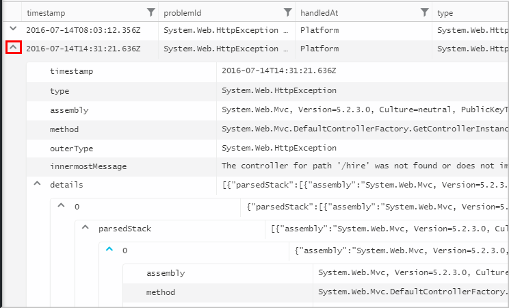

<properties 
    pageTitle="Usar análisis - la herramienta de búsqueda eficaces de perspectivas de aplicación | Microsoft Azure" 
    description="Usar el análisis de la herramienta de búsqueda de diagnóstico potentes de perspectivas de aplicación. " 
    services="application-insights" 
    documentationCenter=""
    authors="danhadari" 
    manager="douge"/>

<tags 
    ms.service="application-insights" 
    ms.workload="tbd" 
    ms.tgt_pltfrm="ibiza" 
    ms.devlang="na" 
    ms.topic="article" 
    ms.date="10/21/2016" 
    ms.author="awills"/>

# Usar el análisis en perspectivas de aplicación

[El análisis](app-insights-analytics.md) es la característica de búsqueda eficaz de [Perspectivas de aplicación](app-insights-overview.md). Estas páginas describen el lenguaje de consulta de análisis.

* **[Ver el vídeo de introducción](https://applicationanalytics-media.azureedge.net/home_page_video.mp4)**.
* **[Versión de prueba de análisis en nuestros datos simuladas](https://analytics.applicationinsights.io/demo)** si su aplicación no enviar datos de aplicación impresiones todavía.

## Abrir el análisis

Recurso de inicio de la aplicación en perspectivas de aplicación, haga clic en análisis.

El tutorial en línea le ofrece algunas ideas sobre lo que puede hacer.

Hay un [recorrido más amplia aquí](app-insights-analytics-tour.md).

## Consultar la telemetría

### Escribir una consulta

Empiece con los nombres de cualquiera de las tablas que aparecen en la parte izquierda (o los operadores de [rango](app-insights-analytics-reference.md#range-operator) o [unión](app-insights-analytics-reference.md#union-operator) ). Usar `|` para crear una canalización de [operadores](app-insights-analytics-reference.md#queries-and-operators). IntelliSense le indicará con los operadores y algunos de los elementos de expresión que puede usar.

Vea la [información general de análisis idioma](app-insights-analytics-tour.md) y la [referencia de idioma](app-insights-analytics-reference.md).

### Ejecutar una consulta

1. Puede usar saltos de línea en una consulta.
2. Coloque el cursor dentro o al final de la consulta que desea ejecutar.
3. Haga clic en Ir para ejecutar la consulta.
4. No incluya líneas en blanco en la consulta. Puede mantener varias consultas separadas en una ficha de consulta, sepárelos con líneas en blanco. Se ejecuta solo con el cursor.

### Guardar una consulta

1. Guarde el archivo de la consulta actual.
2. Abrir un archivo de consulta guardada.
3. Crear un nuevo archivo de consulta.

## Ver los detalles

Expandir cualquier fila en los resultados para ver la lista completa de propiedades. Puede ampliar cualquier propiedad que es un valor estructurado - por ejemplo, dimensiones personalizadas o la pila de lista en una excepción.

 

## Organizar los resultados

Puede ordenar, filtrar, paginar y agrupar los resultados de la consulta.

> [AZURE.NOTE] Ordenar, agrupar y filtrar en el explorador, vuelva a no ejecutarán la consulta. Solo reorganizar los resultados que se han devuelto por la última consulta. 
> 
> Para realizar estas tareas en el servidor antes de que los resultados se devuelven, escriba la consulta con los operadores de [ordenación](app-insights-analytics-reference.md#sort-operator), [resumir](app-insights-analytics-reference.md#summarize-operator) y [dónde](app-insights-analytics-reference.md#where-operator) .

Seleccione las columnas que desea ver, arrastre los encabezados de columna para reorganizarlos y cambiar el tamaño de las columnas arrastrando los bordes.

### Ordenar y filtrar elementos

Ordenar los resultados haciendo clic en el encabezado de una columna. Haga clic de nuevo para ordenar la otra forma y a continuación, haga clic en una tercera vez para volver a la ordenación original devuelto por la consulta.

Use el icono de filtro para limitar la búsqueda.

### Agrupar elementos

Para ordenar por más de una columna, use la agrupación. Habilitarlo y, a continuación, arrastre los encabezados de columna en el espacio encima de la tabla.

### ¿Faltan algunos resultados?

Hay un límite de 10 filas k en los resultados obtenidos mediante el portal. Una advertencia muestra si repase el límite. Si esto sucede, ordenar los resultados de la tabla no siempre muestra todos los resultados de primeros o últimos reales. 

Es recomendable para evitar que se alcance el límite. Usar operadores como:

* [donde marca de tiempo > ago(3d)](app-insights-analytics-reference.md#where-operator)
* [primeros 100 por marca de tiempo](app-insights-analytics-reference.md#top-operator) 
* [tomar 100](app-insights-analytics-reference.md#take-operator)
* [resumir](app-insights-analytics-reference.md#summarize-operator) 

## Diagramas

Seleccione el tipo de diagrama que le gustaría:

Si tiene varias columnas de los tipos de derecho, puede elegir la x y ejes y y una columna de dimensiones para dividir los resultados por.

De forma predeterminada, los resultados se muestran inicialmente como una tabla y seleccione el diagrama manualmente. Pero puede usar la [Directiva de representar](app-insights-analytics-reference.md#render-directive) al final de una consulta para seleccionar un diagrama.

## Anclar a paneles

Puede anclar un diagrama o tabla a uno de los [paneles compartidos](app-insights-dashboards.md) - simplemente haga clic en el pin. (Necesitará [la aplicación de precios del paquete de actualización](app-insights-pricing.md) activar esta característica.) 

Esto significa que, cuando reunido un panel para ayudarle a supervisar el rendimiento o el uso de los servicios web, puede incluir análisis bastante complejo junto con las demás métricas. 

Puede anclar una tabla al panel, si tiene cuatro o menos columnas. Se muestran solo las siete filas superiores.

#### Actualización de paneles

El gráfico anclado a los paneles se actualiza automáticamente al volver a ejecutar la consulta aproximadamente cada media hora.

#### Simplificaciones automáticas

En algunos casos, determinados simplificaciones se aplican a un gráfico si ancla a un panel.

Cuando el pin un gráfico que muestra una gran cantidad de clases independientes (normalmente en un gráfico de barras), las clases menos rellenadas automáticamente se agrupan en un único de clase "otros". Por ejemplo, esta consulta:

    requests | summarize count_search = count() by client_CountryOrRegion

en análisis, es similar a esta:

pero si ancla a un panel, es similar a esta:

## Exportar a Excel

Tras ejecutar una consulta, puede descargar un archivo .csv. Haga clic en **Exportar a Excel**.

## Exportar a Power BI

Coloque el cursor en una consulta y seleccione **Exportar a Power BI**.

Ejecute la consulta de Power BI. Puede configurarlo para actualizar una programación.

Con Power BI, puede crear paneles que reúnan los datos desde una amplia variedad de orígenes.

[Obtenga más información sobre la exportación a Power BI](app-insights-export-power-bi.md)

[AZURE.INCLUDE [app-insights-analytics-footer](../../includes/app-insights-analytics-footer.md)]

