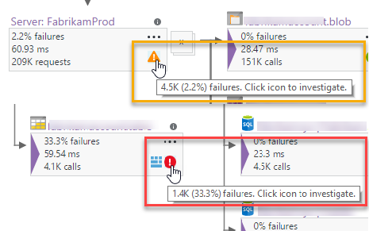

<properties 
    pageTitle="Asignación de aplicación de la aplicación perspectivas | Microsoft Azure" 
    description="Una presentación visual de las dependencias entre los componentes de la aplicación, etiquetados con KPI y alertas." 
    services="application-insights" 
    documentationCenter=""
    authors="SoubhagyaDash" 
    manager="douge"/>

<tags 
    ms.service="application-insights" 
    ms.workload="tbd" 
    ms.tgt_pltfrm="ibiza" 
    ms.devlang="na" 
    ms.topic="article" 
    ms.date="06/15/2016" 
    ms.author="awills"/>
 
# Asignación de aplicación de la información de la aplicación

En [Información de aplicación de Visual Studio](app-insights-overview.md), asignación de aplicación es un diseño visual de las relaciones de dependencia de componentes de la aplicación. Cada componente muestra KPI como carga, rendimiento, errores y alertas, que le ayudarán a descubrir cualquier componente causando un error o un problema de rendimiento. Puede hacer clic en desde cualquier componente a diagnósticos más detalladas, tanto desde la aplicación perspectivas, y - si su aplicación usa servicios de Azure - diagnóstico de Azure, como las recomendaciones Asesor de base de datos de SQL.

Al igual que otros gráficos, puede anclar una asignación de aplicación en el panel de Azure, sea completamente funcional. 

## Abra el mapa de aplicación

Abrir el mapa desde el módulo de información general de la aplicación:

Muestra el mapa:

* Pruebas de disponibilidad
* Componente del lado cliente (supervisada con el SDK de JavaScript)
* Componente del lado servidor
* Dependencias de los componentes de cliente y de servidor

Puede expandir y contraer los grupos de vínculos de dependencia:

 
Si tiene un gran número de dependencias de un tipo (SQL, etc. HTTP), aparecen agrupados. 

 
 
## Detectar problemas

Cada nodo tiene indicadores de rendimiento relevante, como las tasas de error, el rendimiento y la carga para que el componente. 

Iconos de advertencia resaltan posibles problemas. Una advertencia de naranja significa que hay errores en las solicitudes de vistas de página o llamadas de dependencia. Rojo indica una tasa de error más del 5%.

 
Active alertas también mostrar hacia arriba: 

 
Si usa SQL Azure, hay un icono que se muestra cuando hay recomendaciones sobre cómo mejorar el rendimiento. 

Haga clic en cualquier icono para obtener más detalles:

 
 
## Diagnóstico haga clic en

Cada uno de los nodos en el mapa ofrece destino clics para diagnósticos. Las opciones varían según el tipo de nodo.

 
Para componentes que se hospedan en Azure, las opciones son vínculos directos a ellos.

## Intervalo de tiempo y filtros

De forma predeterminada, el mapa resume todos los datos disponibles para el intervalo de tiempo seleccionado. Pero puede filtrar para incluir solo los nombres de operación específica o dependencias.

* Nombre de la operación: Esto incluye vistas de página y tipos de solicitud del lado servidor. Con esta opción, el mapa muestra el KPI en el nodo de lado de servidor y cliente para solo las operaciones seleccionadas. Muestra las dependencias llamadas en el contexto de las operaciones específicas.
* Nombre de base de dependencia: Esto incluye las dependencias de lado de explorador de AJAX y dependencias del lado del servidor. Si el informe de telemetría de dependencia personalizada con la API TrackDependency, también se muestran aquí. Puede seleccionar las dependencias para mostrar en el mapa. Tenga en cuenta que en este momento, esto no filtrará las solicitudes del lado servidor o las vistas de página del lado cliente.

 
 
## Guardar filtros

Para guardar los filtros que haya aplicado, anclar la vista filtrada en un [panel](app-insights-dashboards.md).

 

## Comentarios

Por favor, [proporcionar comentarios a través de la opción de comentarios de portal](app-insights-get-dev-support.md).

