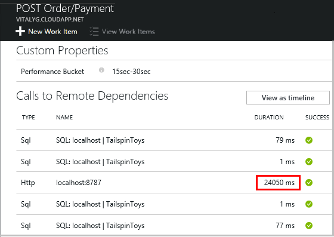
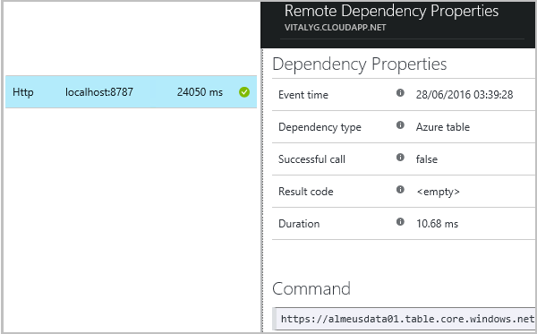

<properties 
    pageTitle="Dependencia de seguimiento en perspectivas de aplicación" 
    description="Analizar uso, disponibilidad y rendimiento de local o de la aplicación web de Microsoft Azure con recomendaciones de aplicación." 
    services="application-insights" 
    documentationCenter=".net"
    authors="alancameronwills" 
    manager="douge"/>

<tags 
    ms.service="application-insights" 
    ms.workload="tbd" 
    ms.tgt_pltfrm="ibiza" 
    ms.devlang="na" 
    ms.topic="article" 
    ms.date="10/24/2016" 
    ms.author="awills"/>


# <a name="set-up-application-insights-dependency-tracking"></a>Configurar perspectivas de aplicación: seguimiento de dependencia


[AZURE.INCLUDE [app-insights-selector-get-started-dotnet](../../includes/app-insights-selector-get-started-dotnet.md)]


Una *dependencia* es un componente externo que llama a la aplicación. Normalmente es un servicio denominado utilizando HTTP, o una base de datos o un sistema de archivos. En perspectivas de aplicación de Visual Studio, puede ver fácilmente espera su aplicación dependencias y con qué frecuencia se produce un error en una llamada de dependencia.


Actualmente, el monitor de dependencia del cuadro informes llamadas a estos tipos de dependencias:

* ASP.NET
 * Bases de datos SQL
 * Web ASP.NET y los servicios WCF que usan enlaces de HTTP
 * Llamadas HTTP locales o remotas
 * Azure DocumentDb, tabla, almacenamiento de blobs y cola
* Java
 * Llamadas a una base de datos a través de un controlador [JDBC](http://docs.oracle.com/javase/7/docs/technotes/guides/jdbc/) , como MySQL, SQL Server, PostgreSQL o SQLite.
* JavaScript en páginas web: la [página web SDK](app-insights-javascript.md) registra automáticamente las llamadas de Ajax como dependencias.

Puede escribir sus propias llamadas SDK para supervisar otras dependencias con la [API de TrackDependency](app-insights-api-custom-events-metrics.md#track-dependency).


## <a name="to-set-up-dependency-monitoring"></a>Para configurar la supervisión de dependencia

Tiene una suscripción de [Microsoft Azure](http://azure.com) .

### <a name="if-your-app-runs-on-your-iis-server"></a>Si la aplicación se ejecuta en el servidor IIS

Si la aplicación web se ejecuta en .NET 4.6 o posterior, puede alguno [instalar el SDK de perspectivas de aplicación](app-insights-asp-net.md) en la aplicación, o instalar el Monitor de estado de aplicación perspectivas. No es necesario ambas.

En caso contrario, instale a Monitor de estado de perspectivas de aplicación en el servidor:

1. En el servidor web IIS, inicie sesión con credenciales de administrador.
2. Descargar y ejecutar el [Monitor de estado del instalador](http://go.microsoft.com/fwlink/?LinkId=506648).
4. En el Asistente de instalación, inicie sesión en Microsoft Azure.

    

    *¿Errores de conexión? Vea [solución de problemas](#troubleshooting).*

5. Seleccione la aplicación web instalado o el sitio Web que desea supervisar y configurar el recurso en el que desea ver los resultados en el portal de información de la aplicación.

    

    Normalmente, elija Configurar un nuevo recurso y el [grupo de recursos][roles].

    En caso contrario, use un recurso existente si ya configuró [prueba web] [ availability] para el sitio o la [supervisión de los clientes web][client].

6. Reiniciar IIS.

    

    El servicio web se se interrumpe por unos minutos.

6. Observe que se ha insertado ApplicationInsights.config en las aplicaciones web que desee supervisar.

    

   También hay algunos cambios a web.config.

#### <a name="want-to-reconfigure-later"></a>¿Desea (re) configurar más tarde?

Después de completar al asistente, puede volver a configurar al agente siempre que lo desee. También puede usar esta opción si ha instalado al agente pero hubo algunos problemas con la instalación inicial.


### <a name="if-your-app-runs-as-an-azure-web-app"></a>Si la aplicación se ejecuta como una aplicación Web de Azure

En el panel de control de la aplicación Web de Azure, agregue la extensión perspectivas de aplicación.


### <a name="if-its-an-azure-cloud-services-project"></a>Si es un proyecto de servicios de nube de Azure

[Agregar secuencias de comandos de los roles de web y trabajador](app-insights-cloudservices.md#dependencies). O bien, [instale .NET framework 4.6 o posterior](../cloud-services/cloud-services-dotnet-install-dotnet.md).

## <a name="diagnosis"></a>Diagnosticar problemas de rendimiento de dependencia

Para evaluar el rendimiento de las solicitudes en el servidor, abra el módulo de rendimiento y desplácese hacia abajo para buscar en la cuadrícula de solicitudes:


El elemento superior se tarda mucho tiempo. Vamos a ver si nos podemos averiguar el tiempo empleado.

Haga clic en esa fila para ver los eventos de solicitud individual:


Haga clic en cualquier instancia de ejecución larga para asegurarse de que aún más.

Desplácese hacia abajo para las llamadas de dependencia remoto relacionada con esta petición:



Parece que la mayoría del tiempo para atender que esta solicitud se ha invertido en una llamada a un servicio local. 


Seleccione esa fila para obtener más información:



El detalle incluye suficiente información para diagnosticar el problema.


En caso diferentes, ninguna llamada de dependencia es larga, pero al cambiar a la vista escala de tiempo, podemos ver dónde se produjo el retraso en nuestro procesamiento interno:


## <a name="failures"></a>Errores

Si hay errores en las peticiones, haga clic en el gráfico.


Haga clic en un tipo de solicitud y la instancia de solicitud para buscar un error de la llamada a una dependencia remota.


## <a name="custom-dependency-tracking"></a>Seguimiento de dependencia personalizada

El módulo de seguimiento de dependencia estándar descubre automáticamente las dependencias externas, como bases de datos y las API de REST. Pero que podría querer algunos componentes adicionales para tratar de la misma manera. 

Puede escribir código que envía información de dependencia, con la misma [API TrackDependency](app-insights-api-custom-events-metrics.md#track-dependency) usado por los módulos estándar.

Por ejemplo, si genera el código con un ensamblado que no haya escrito usted mismo, podría tiempo todas las llamadas a ella, para averiguar qué contribución los tiempos de respuesta. Para que estos datos que se muestra en los gráficos de dependencia en perspectivas de aplicación, envíelo con `TrackDependency`.

```C#

            var startTime = DateTime.UtcNow;
            var timer = System.Diagnostics.Stopwatch.StartNew();
            try
            {
                success = dependency.Call();
            }
            finally
            {
                timer.Stop();
                telemetry.TrackDependency("myDependency", "myCall", startTime, timer.Elapsed, success);
            }
```

Si desea desactivar el módulo de seguimiento de dependencia estándar, quite la referencia a DependencyTrackingTelemetryModule en [ApplicationInsights.config](app-insights-configuration-with-applicationinsights-config.md).

## <a name="troubleshooting"></a>Solución de problemas

*Indicador de éxito de dependencia siempre muestra true o false.*

* Actualizar a la última versión del SDK. Si su versión de .NET es menor que 4.6, instale el [monitor de estado](app-insights-monitor-performance-live-website-now.md).

## <a name="next-steps"></a>Pasos siguientes

- [Excepciones](app-insights-asp-net-exceptions.md)
- [Datos de usuario y de página][client]
- [Disponibilidad](app-insights-monitor-web-app-availability.md)


<!--Link references-->

[api]: app-insights-api-custom-events-metrics.md
[apikey]: app-insights-api-custom-events-metrics.md#ikey
[availability]: app-insights-monitor-web-app-availability.md
[azure]: ../insights-perf-analytics.md
[client]: app-insights-javascript.md
[diagnostic]: app-insights-diagnostic-search.md
[metrics]: app-insights-metrics-explorer.md
[netlogs]: app-insights-asp-net-trace-logs.md
[portal]: http://portal.azure.com/
[qna]: app-insights-troubleshoot-faq.md
[redfield]: app-insights-asp-net-dependencies.md
[roles]: app-insights-resources-roles-access-control.md

 
