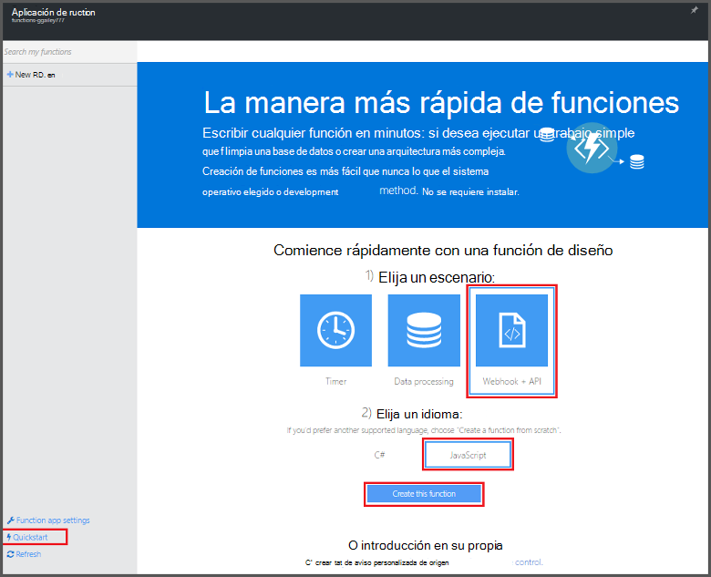
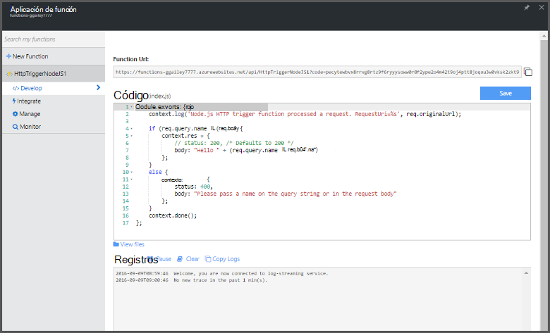

<properties
   pageTitle="Crear su primera función Azure | Microsoft Azure"
   description="Crear su primera función Azure, una aplicación sin servidor, en menos de dos minutos."
   services="functions"
   documentationCenter="na"
   authors="ggailey777"
   manager="erikre"
   editor=""
   tags=""
/>

<tags
   ms.service="functions"
   ms.devlang="multiple"
   ms.topic="hero-article"
   ms.tgt_pltfrm="multiple"
   ms.workload="na"
   ms.date="09/08/2016"
   ms.author="glenga"/>

#Crear su primera función de Azure

##Información general
Funciones de Azure es una experiencia de cálculo a petición, condicionados por eventos que se extiende la plataforma de Azure aplicación existente con funciones para implementar código desencadenado por eventos que se producen en otros servicios de Azure, SaaS productos y sistemas locales. Con funciones de Azure, las aplicaciones escalar según demanda y pagar solo para los recursos que consume. Azure permite funciones crear programado o desencadenado unidades de código implementado en una gran variedad de lenguajes de programación. Para obtener más información acerca de las funciones de Azure, vea la [Información general de las funciones de Azure](functions-overview.md).

En este tema se muestra cómo usar el tutorial de funciones de Azure en el portal para crear una función simple de "Hola a todos" Node.js que invoca un desencadenador de HTTP. También puede ver un breve vídeo para ver cómo se realizan estos pasos en el portal.

## Vea el vídeo

El siguiente vídeo se muestra cómo llevar a cabo los pasos básicos en este tutorial. 

[AZURE.VIDEO create-your-first-azure-function-simple]

##Crear una función del tutorial rápido

Una aplicación de la función aloja la ejecución de las funciones de Azure. Siga estos pasos para crear una nueva aplicación de la función, así como la nueva función. La nueva aplicación de la función se creó con una configuración predeterminada. Para obtener un ejemplo de cómo crear explícitamente la aplicación de la función, consulte [el tutorial de rápido de funciones de Azure](functions-create-first-azure-function-azure-portal.md).

Antes de crear la primera función, debe tener una cuenta de Azure active. Si todavía no tiene una cuenta de Azure, [están disponibles las cuentas gratuitas](https://azure.microsoft.com/free/).

1. Vaya al [portal de funciones de Azure](https://functions.azure.com/signin) e iniciar sesión con su cuenta de Azure.

2. Escriba un **nombre** único para la nueva aplicación de la función o acepte la generado una, seleccione su preferido **región**y después haga clic en **crear + Introducción**. 

3. En la pestaña **Tutorial rápido** , haga clic en **WebHook + API** y **JavaScript**, haga clic en **crear una función**. Se crea una nueva función Node.js predefinida. 

    

4. (Opcional) En este momento en el tutorial, puede elegir una visita rápida de las características de las funciones de Azure en el portal.   Una vez que ha realizado u omitió el recorrido, puede probar la nueva función con el desencadenador de HTTP.

##La función de prueba

Puesto que los tutoriales de Azure funciones contienen código funcional, puede probar la nueva función inmediatamente.

1. En la pestaña **desarrollar** , revise la ventana de **código** y observe que este código Node.js espera una solicitud HTTP con un valor de *nombre* pasado en el cuerpo del mensaje o en una cadena de consulta. Cuando se ejecuta la función, se devuelve este valor en el mensaje de respuesta.

    

2. Desplácese hacia abajo hasta el cuadro de texto de **cuerpo de la solicitud** , cambie el valor de la propiedad *nombre de* su nombre y haga clic en **Ejecutar**. Verá que se activa la ejecución por una solicitud de HTTP de prueba, se escribe información en los registros de streaming y se muestra la respuesta "Hola" en el **resultado**. 

3. Para desencadenar la ejecución de la misma función desde otra ventana del explorador o pestaña, copie el valor de **Dirección URL de la función** de la pestaña **desarrollar** y péguela en una barra de direcciones del explorador, el valor de cadena de consulta de datos anexados `&name=yourname` y presione ENTRAR. Se escribe la misma información en los registros y el explorador mostrará la respuesta "Hola" como antes.

##Pasos siguientes

En este tutorial se muestra una ejecución muy simple de una función de HTTP desencadenadas básica. Consulte estos temas para obtener más información sobre cómo aprovechar las ventajas de las funciones de Azure en las aplicaciones.

+ [Referencia del programador de Azure funciones](functions-reference.md)  
Referencia del programador para funciones de codificación y definir desencadenadores y enlaces.
+ [Probar funciones de Azure](functions-test-a-function.md)  
Describe diversas herramientas y técnicas para probar sus funciones.
+ [Cómo ampliar las funciones de Azure](functions-scale.md)  
Se tratan los planes de servicio disponibles con funciones de Azure, incluidos el plan de servicio dinámicos y cómo elegir el plan de la derecha. 
+ [¿Qué es el servicio de aplicación de Azure?](../app-service/app-service-value-prop-what-is.md)  
Funciones de Azure aprovecha la plataforma de servicio de la aplicación de Azure funcionalidad principales como implementaciones, variables de entorno y diagnósticos. 

[AZURE.INCLUDE [Getting Started Note](../../includes/functions-get-help.md)]
