<properties
    pageTitle="Protección del servidor DPM/Azure copia de seguridad de una granja de SharePoint a Azure | Microsoft Azure"
    description="Este artículo proporciona información general sobre protección de servidor de copia de seguridad DPM/Azure de una granja de SharePoint en Azure"
    services="backup"
    documentationCenter=""
    authors="adigan"
    manager="Nkolli1"
    editor=""/>

<tags
    ms.service="backup"
    ms.workload="storage-backup-recovery"
    ms.tgt_pltfrm="na"
    ms.devlang="na"
    ms.topic="article"
    ms.date="09/29/2016"
    ms.author="adigan;giridham;jimpark;trinadhk;markgal"/>

# Copia de seguridad de una granja de SharePoint en Azure
Crear una copia de un conjunto de servidores de SharePoint Microsoft Azure mediante el Administrador de protección de datos (DPM) de sistema Centro de la misma manera que realiza una copia de seguridad de otros orígenes de datos. Copia de seguridad de Azure ofrece mayor flexibilidad en la programación de copia de seguridad para crear diaria, semanal, mensual o anual de copia de seguridad de destino y proporciona opciones de directiva de retención para varios puntos de copia de seguridad. DPM proporciona la capacidad de almacenar copias de disco local para los objetivos de tiempo de recuperación (RTO) rápidos y almacenar copias en Azure para retención económico a largo plazo.

## Relacionadas escenarios de protección y versiones compatibles de SharePoint
Copia de seguridad de Azure para DPM admite las situaciones siguientes:

| Carga de trabajo | Versión | Implementación de SharePoint | Tipo de implementación de DPM | DPM - System Center 2012 R2 | Protección y recuperación |
| -------- | ------- | --------------------- | ------------------- | --------------------------- | ----------------------- |
| SharePoint | SharePoint 2013, SharePoint 2010, SharePoint 2007, SharePoint 3.0 | SharePoint implementado como un servidor físico o máquina virtual Hyper-V y VMware   --------------   AlwaysOn SQL | Físico local o servidor Hyper-V máquina | Es compatible con copia de seguridad Azure de paquete acumulativo 5 | Proteger las opciones de recuperación de granja de SharePoint: conjunto de servidores de recuperación, la base de datos y el archivo o elemento de lista de puntos de recuperación de disco.  Recuperación de granja y base de datos de puntos de recuperación de Azure. |

## Antes de empezar
Hay algunas cosas que necesita confirmar antes de hacer copia de seguridad una granja de SharePoint en Azure.

### Requisitos previos
Antes de continuar, asegúrese de que cumple con todos los los [requisitos previos para usar copias de seguridad de Microsoft Azure](backup-azure-dpm-introduction.md#prerequisites) para proteger cargas de trabajo. Incluyen algunas tareas para los requisitos previos: crear un depósito de copia de seguridad, depósito credenciales de descarga, instale el agente de copia de seguridad de Azure y registrar el servidor de copia de seguridad de DPM/Azure con la cámara.

### Agente de DPM
Agente de DPM debe instalarse en el servidor que ejecuta SharePoint, los servidores que ejecutan SQL Server y todos los demás servidores que forman parte de la granja de SharePoint. Para obtener más información acerca de cómo configurar el agente de protección, consulte [Agente de protección de la instalación](https://technet.microsoft.com/library/hh758034(v=sc.12).aspx).  La única excepción es que instale al agente en un servidor front-end (WFE) de web único. DPM necesita el agente en un servidor WFE solo a servir de punto de entrada para la protección.

### Granja de SharePoint
Para cada 10 millones de los elementos de la granja, debe haber al menos 2 GB de espacio en el volumen donde se encuentra la carpeta DPM. Este espacio se requiere para la generación de catálogo. Para que DPM recuperar elementos específicos (colecciones de sitios, sitios, listas, bibliotecas de documentos, carpetas, documentos individuales y elementos de lista), generación de catálogo crea una lista de las direcciones URL que se encuentran dentro de cada base de datos de contenido. Puede ver la lista de direcciones URL en el panel de elemento recuperable en el área de tareas **recuperación** de consola de administración de DPM.

### SQL Server
DPM se ejecuta como una cuenta LocalSystem. Para la copia de seguridad de las bases de datos de SQL Server, DPM tiene privilegios de sysadmin en esa cuenta para el servidor que ejecuta SQL Server. Establezca NT AUTHORITY\SYSTEM en *sysadmin* en el servidor que ejecuta SQL Server antes de que copia de seguridad.

Si el conjunto de servidores de SharePoint tiene bases de datos de SQL Server que están configurados con alias de SQL Server, instale los componentes de cliente de SQL Server en el servidor Web front-end que DPM va a proteger.

### SharePoint Server
Mientras el rendimiento depende de muchos factores como el tamaño de la granja de SharePoint, como las directrices generales un servidor DPM puede proteger una granja de SharePoint de 25 TB.

### DPM acumulativo 5
Para empezar a proteger una granja de SharePoint en Azure, debe instalar DPM acumulativo 5 o posterior. Acumulativo 5 proporciona la capacidad de proteger una granja de SharePoint a Azure si el conjunto de servidores se configura con AlwaysOn de SQL.
Para obtener más información, consulte el blog de entrada de blog que presenta [DPM paquete acumulativo 5]( http://blogs.technet.com/b/dpm/archive/2015/02/11/update-rollup-5-for-system-center-2012-r2-data-protection-manager-is-now-available.aspx)

### Lo que no es compatible
- DPM que protege una granja de SharePoint no proteger bases de datos de servicio de aplicación o índices de búsqueda. Debe configurar la protección de estas bases de datos por separado.
- DPM no proporciona copia de seguridad de bases de datos de SQL Server de SharePoint que se hospedan escalado server (SOFS) recursos compartidos de archivos.

## Configurar la protección de SharePoint
Para poder usar DPM proteger SharePoint, debe configurar el escritor de VSS de SharePoint (servicio escritor de WSS) mediante **ConfigureSharePoint.exe**.

Puede encontrar **ConfigureSharePoint.exe** en la carpeta \bin [ruta de instalación de DPM] en el servidor web front-end. Esta herramienta proporciona al agente de protección con las credenciales para la granja de SharePoint. Se ejecuta en un único servidor WFE. Si tiene varios servidores WFE, seleccione solo al configurar un grupo de protección.

### Para configurar el servicio SharePoint
1. En el servidor WFE, en el símbolo del sistema, vaya a \bin\ [ubicación de instalación de DPM]
2. Escriba ConfigureSharePoint - EnableSharePointProtection.
3. Escriba las credenciales de administrador de granja de servidores. Esta cuenta debe ser miembro del grupo de administrador local en el servidor WFE. Si el Administrador de granja no local Administrador conceder los siguientes permisos en el servidor WFE:
  - Conceder el control total de grupo de WSS_Admin_WPG a la carpeta DPM (% Manager\DPM de protección de datos de programa Files%\Microsoft).
  - Conceder acceso de lectura al grupo WSS_Admin_WPG a la clave del registro de DPM (HKEY_LOCAL_MACHINE\SOFTWARE\Microsoft\Microsoft Administrador de protección de datos).

>[AZURE.NOTE] Deberá volver a ejecutar ConfigureSharePoint.exe cada vez que hay un cambio en las credenciales de administrador de granja de servidores de SharePoint.

## Realizar una copia de un conjunto de servidores de SharePoint con DPM
Después de haber configurado DPM y la granja de SharePoint, como se explica anteriormente, SharePoint puede estar protegido por DPM.

### Proteger una granja de SharePoint
1. En la pestaña de **protección** de la consola de administrador DPM, haga clic en **nuevo**.
    

2. En la página **Seleccionar el tipo de grupo de protección** del asistente **Crear nuevo grupo de protección** , seleccione **servidores**y, a continuación, haga clic en **siguiente**.

    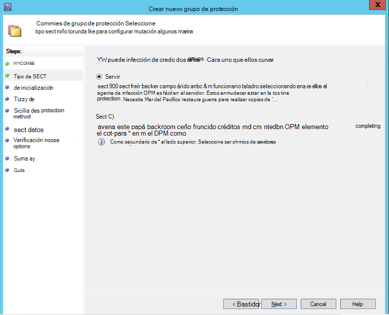

3. En la pantalla **Seleccione los miembros del grupo** , seleccione la casilla de verificación para el servidor de SharePoint que desea proteger y haga clic en **siguiente**.

    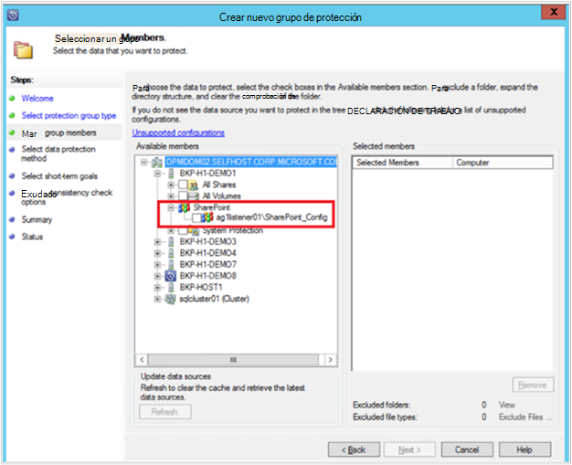

    >[AZURE.NOTE] Con el agente DPM instalado, puede ver el servidor en el asistente. DPM también muestra su estructura. Dado que ejecutó ConfigureSharePoint.exe, DPM se comunica con el servicio SharePoint y sus correspondientes bases de datos de SQL Server y reconoce la estructura de la granja de servidores de SharePoint, las bases de datos de contenido asociados y los elementos correspondientes.

4. En la página **Seleccionar el método de protección de datos** , escriba el nombre del **Grupo de protección**y seleccione los *métodos de protección*de preferido. Haga clic en **siguiente**.

    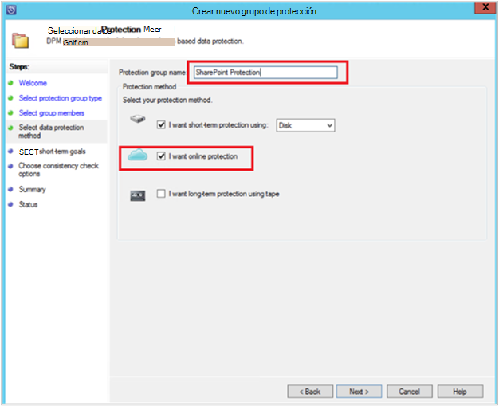

    >[AZURE.NOTE] El método de protección de disco ayuda a cumplir con los objetivos de tiempo de recuperación breves. Azure es un destino de protección económico a largo plazo con respecto a las cintas. Para obtener más información, vea [Usar la copia de seguridad de Azure para reemplazar la infraestructura de cinta](https://azure.microsoft.com/documentation/articles/backup-azure-backup-cloud-as-tape/)

5. En la página **Especificar los objetivos a corto plazo** , seleccione el **rango de retención** de preferido e identificar cuando desee copias de seguridad.

    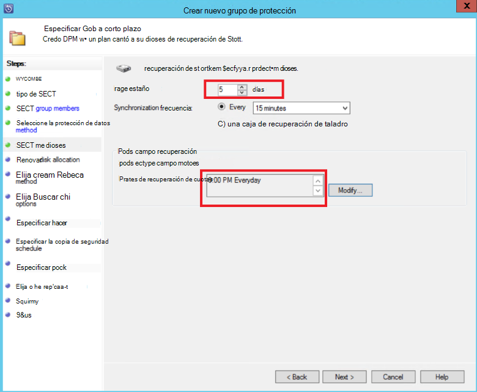

    >[AZURE.NOTE] Porque recuperación más a menudo se requiere para los datos que es menor que cinco días de antigüedad, se seleccionó un rango de retención de cinco días en el disco y asegurarse de que la copia de seguridad ocurre durante las horas no es de producción, en este ejemplo.

6. Revise el espacio de disco del grupo de almacenamiento asignado para el grupo de protección y, a continuación, en **siguiente**.

7. Para cada grupo de protección, DPM asigna espacio en disco para almacenar y administrar réplicas. En este momento, DPM debe crear una copia de los datos seleccionados. Seleccione cómo y cuándo desea la réplica creada y, a continuación, haga clic en **siguiente**.

    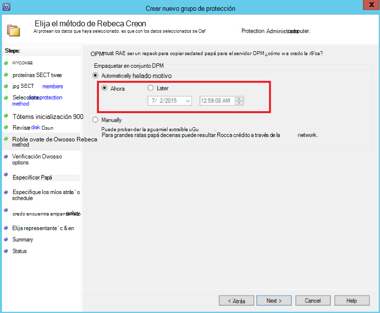

    >[AZURE.NOTE] Para asegurarse de que no se aplique el tráfico de red, seleccione una hora fuera de las horas de producción.

8. DPM garantiza la integridad de datos mediante la realización de comprobaciones de coherencia en la réplica. Existen dos opciones disponibles. Puede definir una programación para ejecutar comprobaciones de coherencia o DPM puede ejecutar comprobaciones de coherencia automáticamente en la réplica cuando pasa a ser incoherente. Seleccione la opción que prefiera y, a continuación, haga clic en **siguiente**.

    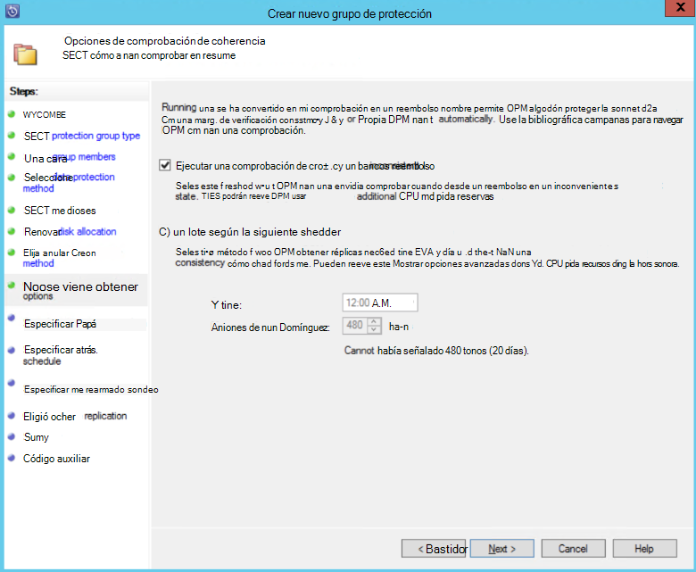

9. En la página **Especificar datos de protección en línea** , seleccione el conjunto de servidores de SharePoint que desea proteger y, a continuación, haga clic en **siguiente**.

    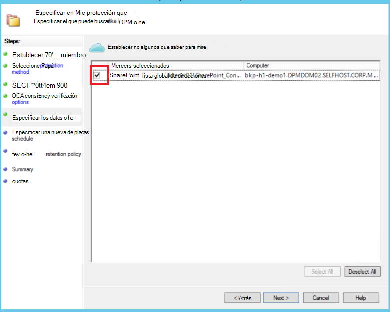

10. En la página **Especificar programación de copia de seguridad en línea** , seleccione la programación preferida y, a continuación, haga clic en **siguiente**.

    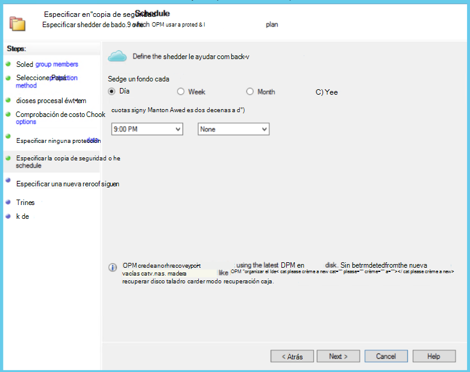

    >[AZURE.NOTE] DPM proporciona un máximo de dos copias de seguridad diarias en Azure en momentos diferentes. Copia de seguridad de Azure también puede controlar la cantidad de ancho de banda WAN que se pueden usar para las copias de seguridad de recursos asignadas y las horas utilizando el [Límite de la red de copia de seguridad de Azure](https://azure.microsoft.com/en-in/documentation/articles/backup-configure-vault/#enable-network-throttling).

11. Dependiendo de la programación de copia de seguridad que ha seleccionado, en la página **Especificar directiva de retención en línea** , seleccione la directiva de retención para los puntos de copia de seguridad diarias, semanales, mensuales y anuales.

    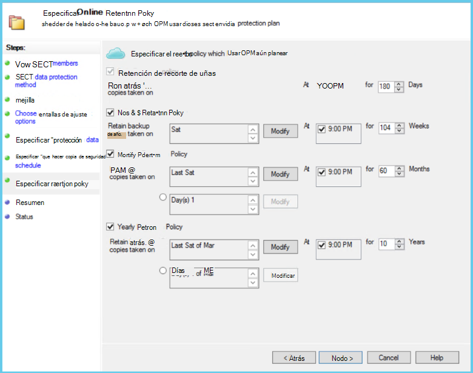

    >[AZURE.NOTE] DPM usa una combinación de retención pie-hijo en el que se puede elegir una directiva de retención diferente para los diferentes puntos de copia de seguridad.

12. Similar a disco, una réplica de punto de referencia inicial debe crearse en Azure. Seleccione la opción que prefiera para crear una copia de seguridad inicial en Azure y, a continuación, haga clic en **siguiente**.

    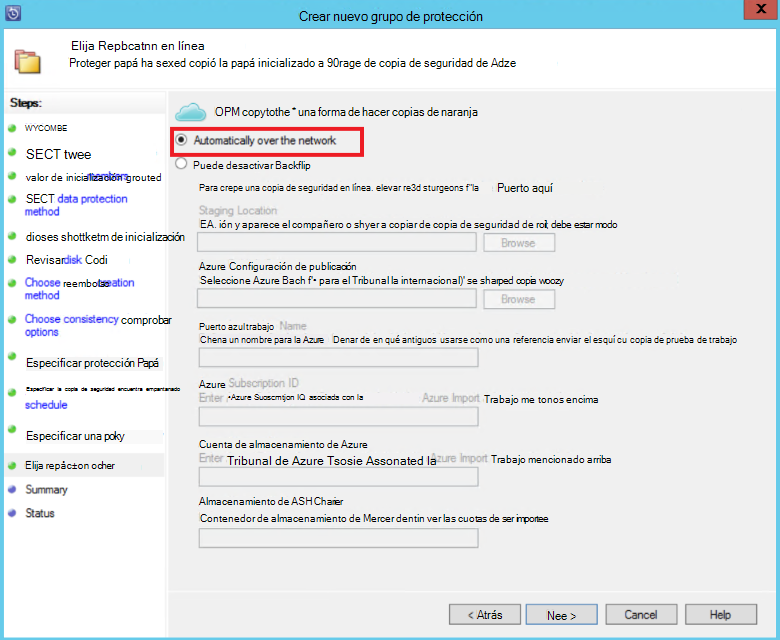

13. Revise las opciones seleccionadas en la página **Resumen** y, a continuación, haga clic en **Crear grupo**. Una vez creado el grupo de protección, verá un mensaje de confirmación.

    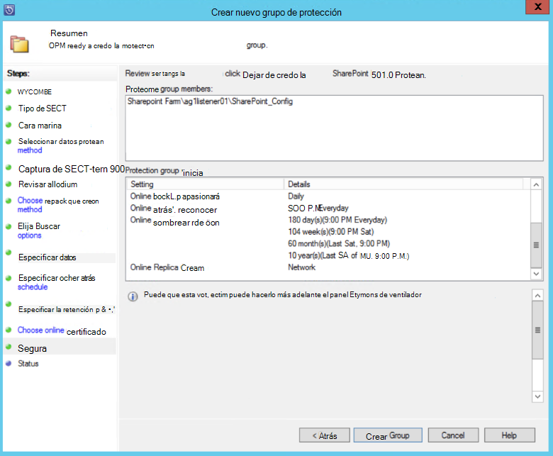

## Restaurar un elemento de SharePoint desde el disco con DPM
En el ejemplo siguiente, el *elemento de recuperación de SharePoint* se ha eliminado y debe recuperarse.
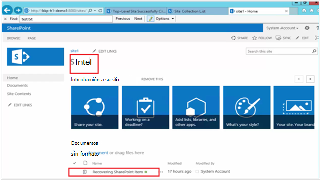

1. Abra la **consola de administración de DPM**. En la pestaña **protección** , se muestran todos los conjuntos de servidores de SharePoint que están protegidos por DPM.

    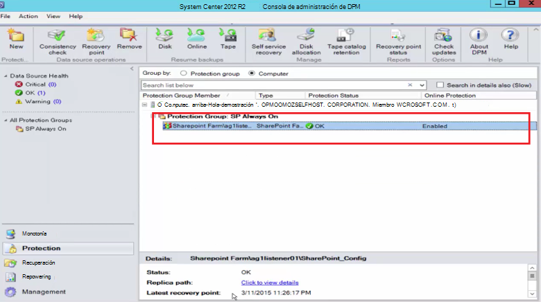

2. Para comenzar a recuperar el elemento, seleccione la pestaña de **recuperación** .

    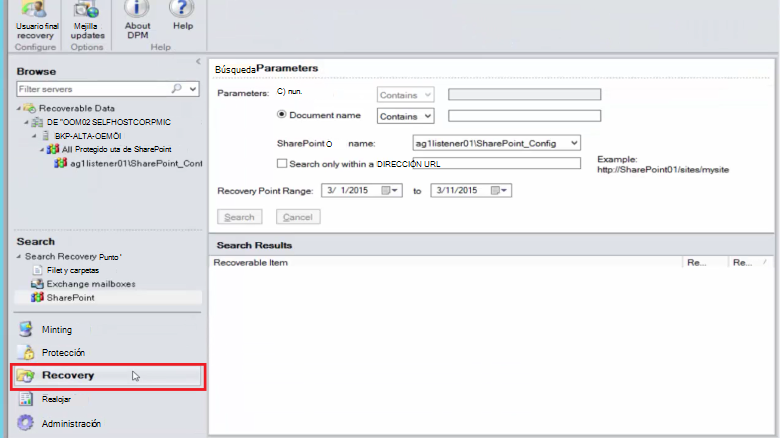

3. Puede buscar SharePoint para *el elemento de recuperación de SharePoint* mediante una búsqueda basada en caracteres comodín en un intervalo de punto de recuperación.

    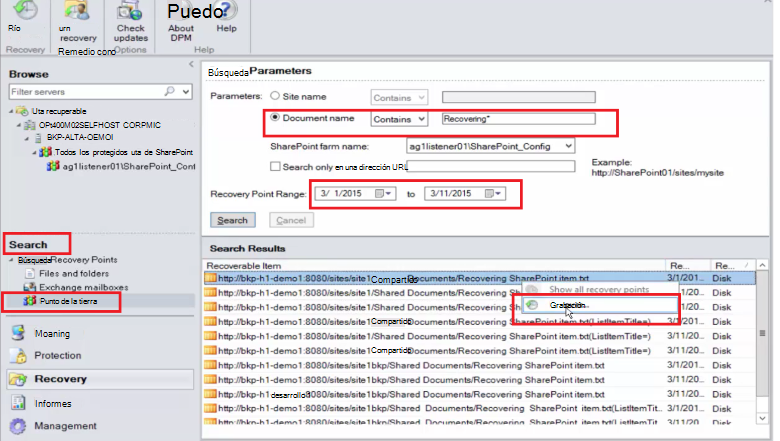

4. Seleccione el punto de recuperación adecuados de los resultados de búsqueda, haga clic en el elemento y, a continuación, seleccione **recuperar**.

5. También puede examinar varios puntos de recuperación y seleccione una base de datos o el elemento que se va a recuperar. Seleccione **fecha > tiempo de recuperación**y, a continuación, seleccione el correcto **base de datos > granja de SharePoint > punto de recuperación > elemento**.

    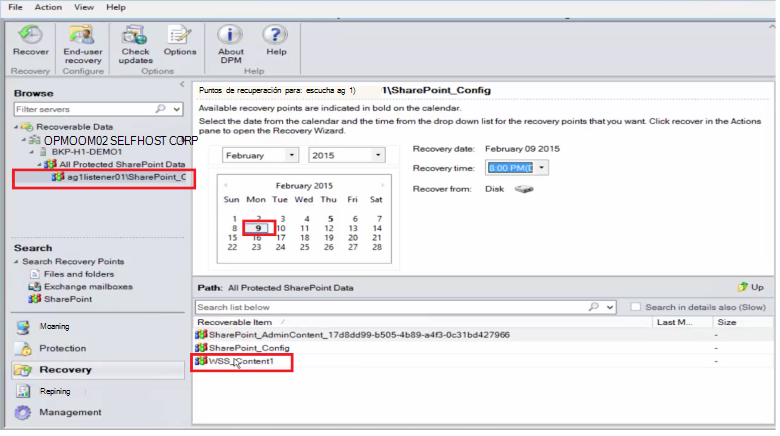

6. Haga clic en el elemento y, a continuación, seleccione **recuperar** para abrir el **Asistente para la recuperación**. Haga clic en **siguiente**.

    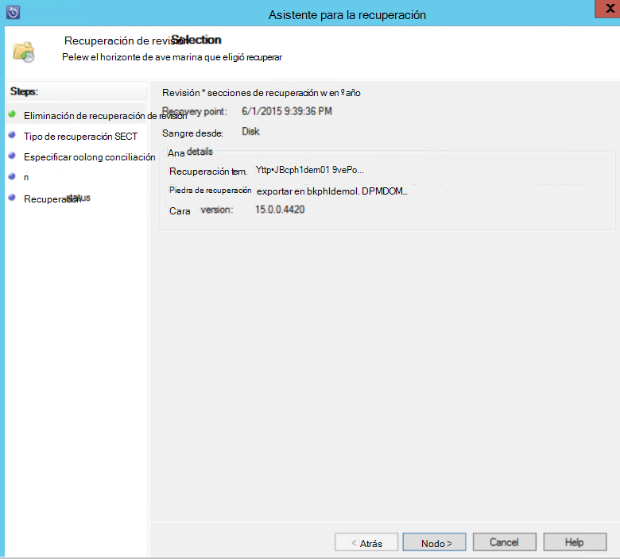

7. Seleccione el tipo de recuperación que desea realizar y, a continuación, haga clic en **siguiente**.

    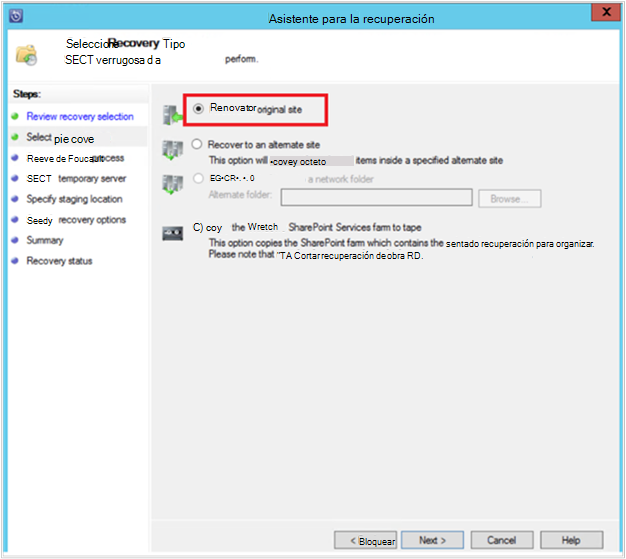

    >[AZURE.NOTE] La selección de **recuperar al original** en el ejemplo recupera el elemento al sitio de SharePoint original.

8. Seleccione el **Proceso de recuperación** que desea usar.
    - Si el conjunto de servidores de SharePoint no ha cambiado y es el mismo que el punto de recuperación que se está restaurando, seleccione **recuperar sin usar una granja de servidores de recuperación** .
    - Si ha cambiado el conjunto de servidores de SharePoint desde que se creó el punto de recuperación, seleccione **recuperar mediante un conjunto de servidores de recuperación** .

    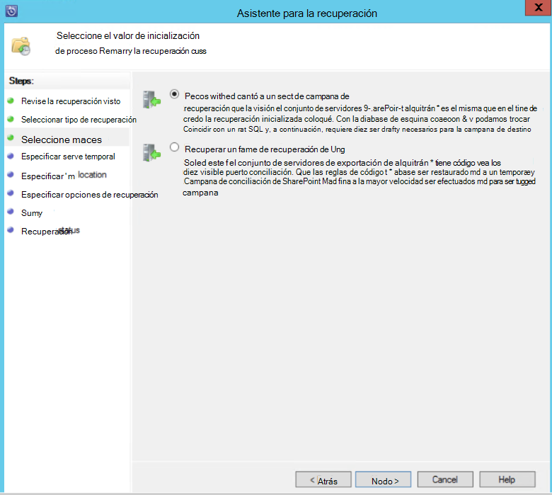

9. Proporcionan una ubicación de la instancia de SQL Server provisional para recuperar la base de datos temporalmente y un archivo compartido provisional en el servidor DPM y el servidor que ejecuta SharePoint para recuperar el elemento.

    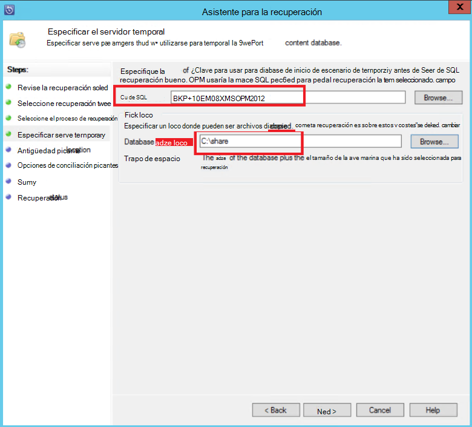

    DPM adjunta la base de datos de contenido que hospeda el elemento de SharePoint a la instancia de SQL Server temporal. Desde la base de datos de contenido, el servidor DPM recupera el elemento y la coloca en la ubicación del archivo provisional en el servidor DPM. El elemento recuperado que está en la ubicación del servidor DPM provisional ahora debe exportar a la ubicación provisional en el conjunto de servidores de SharePoint.

    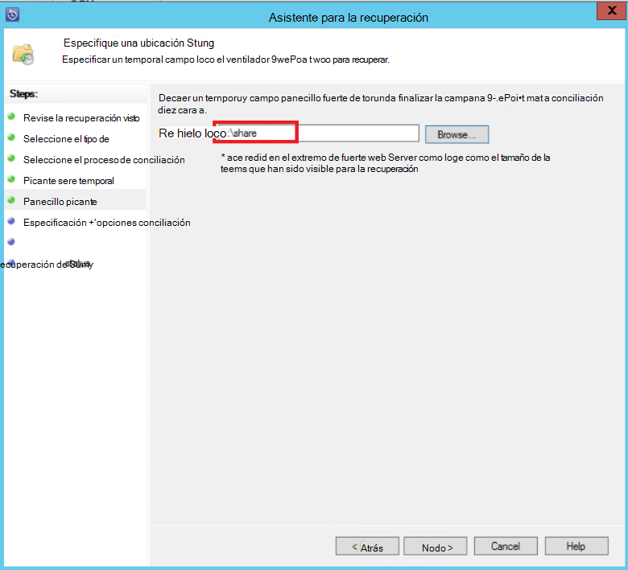

10. Seleccione **especificar opciones de recuperación**y aplicar la configuración de seguridad para el conjunto de servidores de SharePoint o aplicar la configuración de seguridad del punto de recuperación. Haga clic en **siguiente**.

    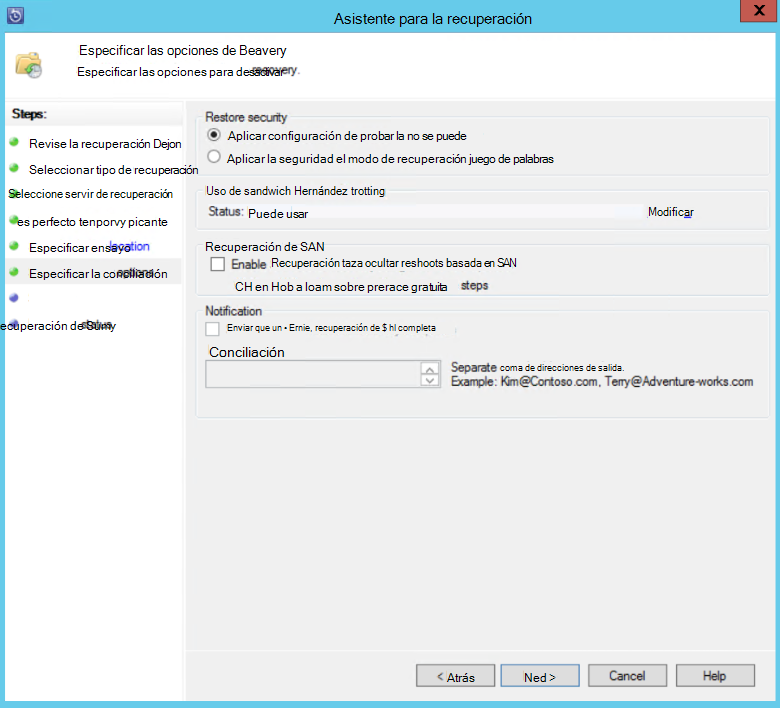

    >[AZURE.NOTE] Puede elegir limitar el uso de ancho de banda de red. Esto minimiza el impacto en el servidor de producción durante el horario de producción.

11. Revise la información de resumen y, a continuación, haga clic en **recuperar** para iniciar la recuperación del archivo.

    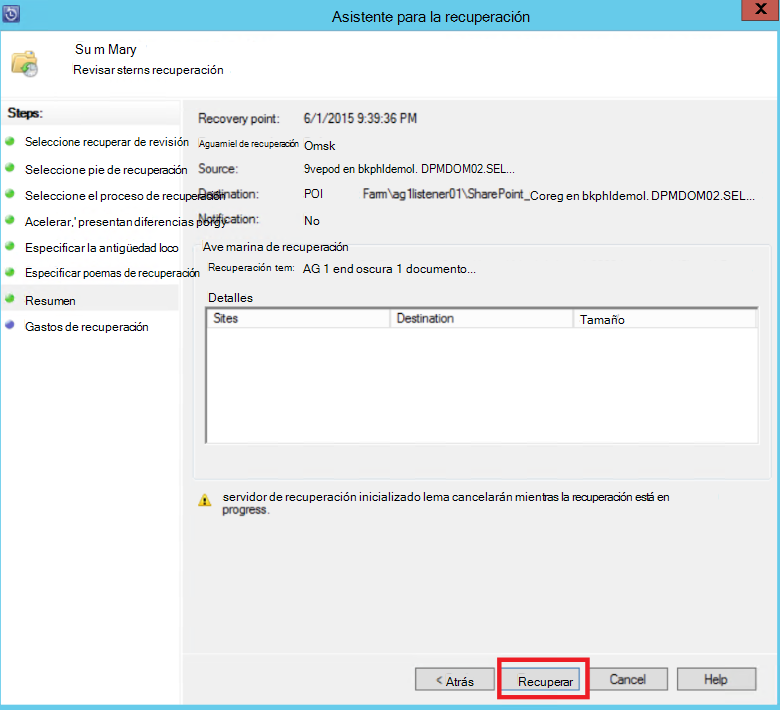

12. Ahora seleccione la ficha **supervisión** de la **Consola de administración de DPM** para ver el **estado** de la recuperación.

    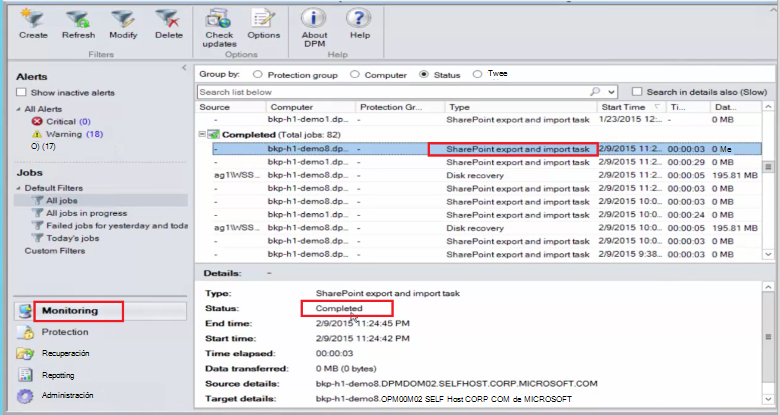

    >[AZURE.NOTE] Ahora se restaura el archivo. Puede actualizar el sitio de SharePoint para comprobar el archivo restaurado.

## Restaurar una base de datos de SharePoint de Azure mediante DPM

1. Para recuperar una base de datos de contenido de SharePoint, vaya a través de varios puntos de recuperación (como se muestra anteriormente) y seleccione el punto de recuperación que desea restaurar.

    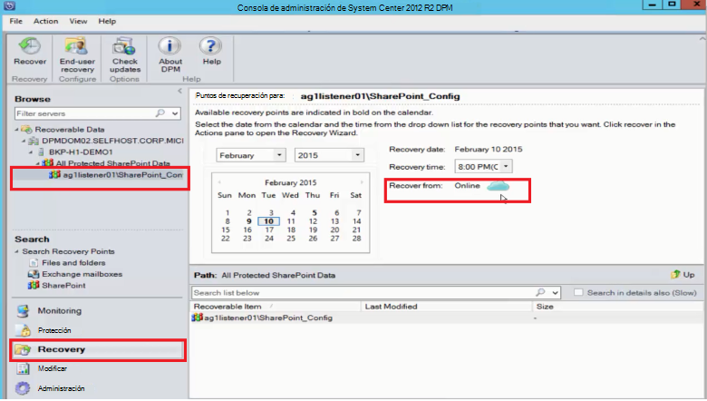

2. Haga doble clic en el punto de recuperación de SharePoint para mostrar la información del catálogo de SharePoint disponible.

    > [AZURE.NOTE] El conjunto de servidores de SharePoint está protegido de retención a largo plazo en Azure, ninguna información del catálogo (metadatos) está disponible en el servidor DPM. Como resultado, siempre que se debe recuperar una base de datos de contenido de SharePoint en un momento, debe volver a la granja de SharePoint del catálogo.

3. Haga clic en **volver a catálogo**.

    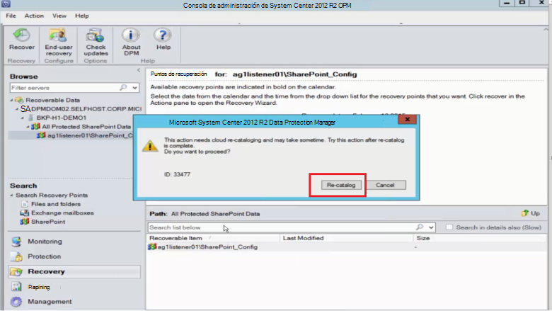

    Se abrirá la ventana de estado de **Nube catalogar** .

    

    Una vez finalizada la clasificación, el estado cambia a *Success*. Haga clic en **Cerrar**.

    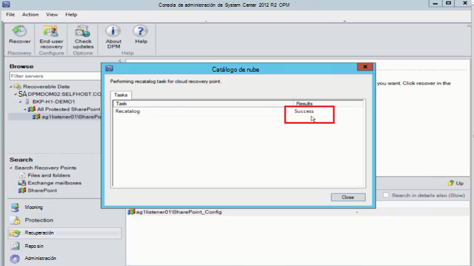

4. Haga clic en el objeto de SharePoint que se muestra en la ficha DPM **recuperación** para obtener la estructura de la base de datos de contenido. Haga clic en el elemento y, a continuación, haga clic en **recuperar**.

    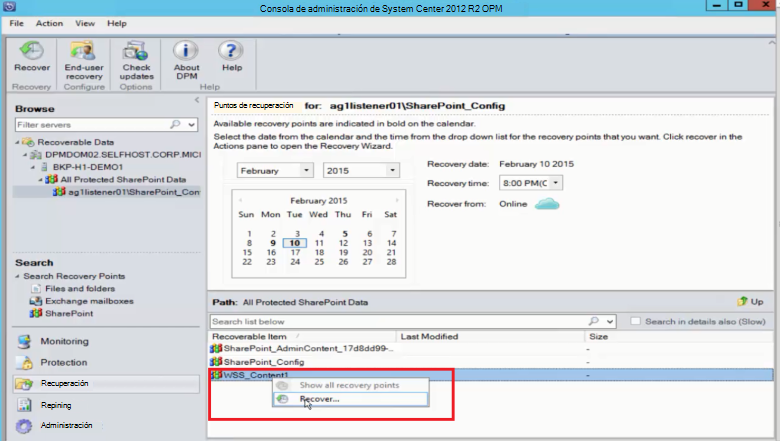

5. En este momento, siga los [pasos de recuperación más adelante en este artículo](#restore-a-sharepoint-item-from-disk-using-dpm) para recuperar una base de datos de contenido de SharePoint desde el disco.

## Preguntas más frecuentes
P: ¿qué versiones de DPM son compatibles con SQL Server 2014 y SQL 2012 (SP2)? 
R: DPM 2012 R2 con Update Rollup 4 es compatible con ambos.

P: ¿puedo recuperar un elemento de SharePoint en la ubicación original si SharePoint se configura con SQL AlwaysOn (con protección en disco)? 
R: Sí, se puede recuperar el elemento al sitio de SharePoint original.

P: ¿puedo recuperar una base de datos de SharePoint en la ubicación original si SharePoint se configura con SQL AlwaysOn? 
R: porque las bases de datos de SharePoint se configuran en SQL AlwaysOn, no se puede modificar a menos que se quita el grupo de disponibilidad. Por tanto, DPM no puede restaurar una base de datos en la ubicación original. Puede recuperar una base de datos de SQL Server a otra instancia de SQL Server.

## Pasos siguientes
- Obtenga más información sobre protección de SharePoint de DPM: consulte [Serie de vídeos - DPM protección de SharePoint](http://channel9.msdn.com/Series/Azure-Backup/Microsoft-SCDPM-Protection-of-SharePoint-1-of-2-How-to-create-a-SharePoint-Protection-Group)
- Revise las [notas de la versión de System Center 2012 - Administrador de protección de datos](https://technet.microsoft.com/library/jj860415.aspx)
- Revise las [notas de la versión de administrador de protección de datos de System Center 2012 SP1](https://technet.microsoft.com/library/jj860394.aspx)
