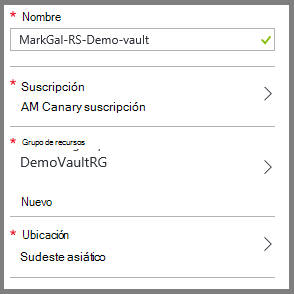
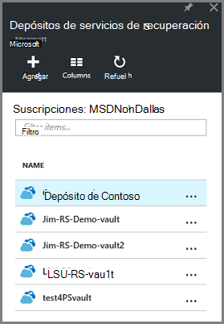
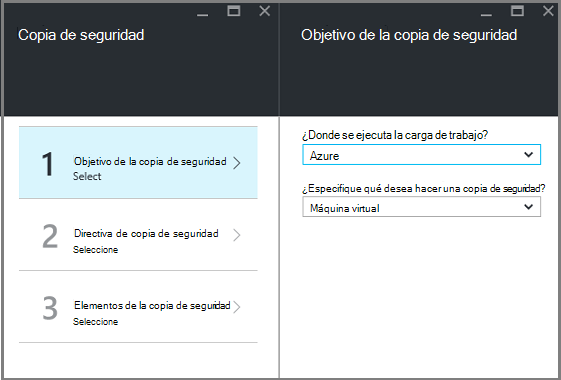
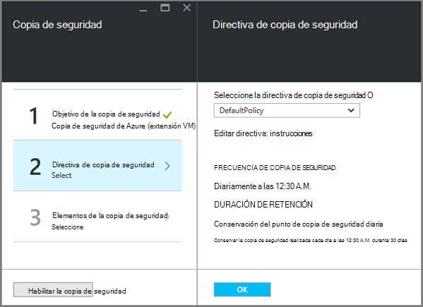
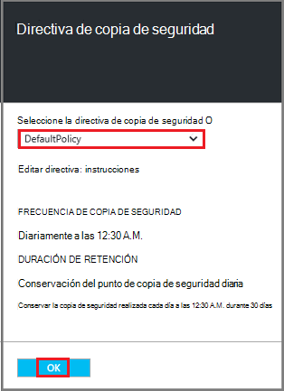
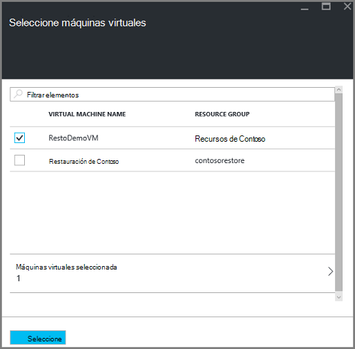
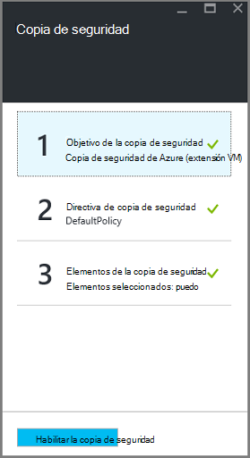
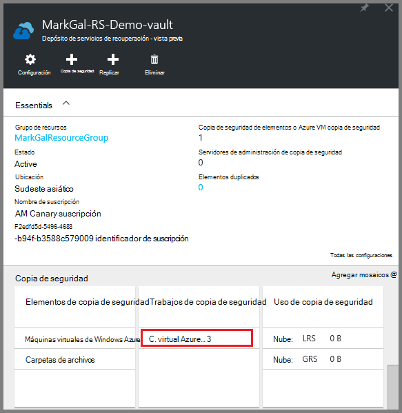

<properties
    pageTitle="Buscar primero: proteger máquinas virtuales de Azure con un depósito de servicios de recuperación | Microsoft Azure"
    description="Proteger máquinas virtuales de Azure con un depósito de servicios de recuperación. Usar copias de seguridad de máquinas virtuales implementado por el Administrador de recursos, máquinas virtuales implementado clásica y máquinas virtuales de almacenamiento Premium para proteger los datos. Crear y registrar un depósito de servicios de recuperación. Registrar VM, crear directivas y proteger máquinas virtuales en Azure."
    services="backup"
    documentationCenter=""
    authors="markgalioto"
    manager="cfreeman"
    editor=""
    keyword="backups; vm backup"/>

<tags
    ms.service="backup"
    ms.workload="storage-backup-recovery"
    ms.tgt_pltfrm="na"
    ms.devlang="na"
    ms.topic="hero-article"
    ms.date="10/13/2016"
    ms.author="markgal; jimpark"/>

# Buscar primero: proteger máquinas virtuales de Azure con un depósito de servicios de recuperación

> [AZURE.SELECTOR]
- [Proteger máquinas virtuales con un depósito de servicios de recuperación](backup-azure-vms-first-look-arm.md)
- [Proteger máquinas virtuales con un depósito de copia de seguridad](backup-azure-vms-first-look.md)

Este tutorial le guiará en los pasos necesarios para crear un depósito de servicios de recuperación y copia de seguridad una máquina virtual Azure (VM). Protección depósitos de servicios de recuperación:

- Azure VM implementado por el Administrador de recursos
- Máquinas virtuales clásicas
- Máquinas virtuales de almacenamiento estándar
- Almacenamiento de Premium VM
- Máquinas virtuales cifradas con cifrado de disco de Azure, con BEK y KEK

Para obtener más información sobre la protección de almacenamiento de Premium máquinas virtuales, vea [realizar copias de seguridad y restaurar máquinas virtuales de almacenamiento Premium](backup-introduction-to-azure-backup.md#back-up-and-restore-premium-storage-vms)

>[AZURE.NOTE] Este tutorial se supone que ya tiene una máquina virtual en su suscripción de Azure y que han adoptado medidas para permitir que el servicio de copia de seguridad tener acceso a la máquina virtual.

[AZURE.INCLUDE [learn-about-Azure-Backup-deployment-models](../../includes/backup-deployment-models.md)]

En un nivel alto, estos son los pasos que debe realizar.  

1. Crear un depósito de servicios de recuperación de una máquina virtual.
2. Usar el portal de Azure para seleccionar un escenario, establecer la directiva e identificar los elementos de proteger.
3. Ejecutar la copia de seguridad inicial.

## Crear un depósito de servicios de recuperación de una máquina virtual

Un depósito de servicios de recuperación es una entidad que almacena todas las copias de seguridad y los puntos de recuperación que se han creado a lo largo del tiempo. El depósito de servicios de recuperación también contiene la directiva de copia de seguridad aplicada a las VM protegidas.

>[AZURE.NOTE] La copia de seguridad de máquinas virtuales es un proceso local. No puede crear una copia de máquinas virtuales de una ubicación un depósito de servicios de recuperación en otra ubicación. Por lo tanto, para cada ubicación Azure con máquinas virtuales de copia de seguridad, depósito de servicios de recuperación al menos una debe existir en esa ubicación.

Para crear un depósito de servicios de recuperación:

1. Inicie sesión en el [portal de Azure](https://portal.azure.com/).

2. En el menú de concentrador, haga clic en **Examinar** y en la lista de recursos, escriba **Servicios de recuperación**. Cuando comience a escribir, los filtros de la lista en función de la entrada. Haga clic en **Servicios de recuperación de cámara**.

      

    Se muestra la lista de depósitos de servicios de recuperación.

3. En el menú de **Servicios de recuperación de depósitos** , haga clic en **Agregar**.

    

    Se abre el módulo de cámara de servicios de recuperación, que le pide que proporcione un **nombre**, la **suscripción**, el **grupo de recursos**y la **ubicación**.

    

4. En **nombre**, escriba un nombre descriptivo para identificar la cámara. El nombre debe ser único para la suscripción de Azure. Escriba un nombre que contenga entre 2 y 50 caracteres. Debe comenzar con una letra y puede contener sólo letras, números y guiones.

5. Haga clic en la **suscripción** para ver la lista de suscripciones disponibles. Si no está seguro de qué suscripción a usar, use el valor predeterminado (o sugeridos) suscripción. Existen varias opciones solo si su cuenta profesional está asociado con varias suscripciones de Azure.

6. Haga clic en el **grupo de recursos** para ver la lista de grupos de recursos disponibles o haga clic en **nuevo** para crear un grupo de recursos. Para obtener información completa sobre los grupos de recursos, consulte [información general del Administrador de recursos de Azure](../azure-resource-manager/resource-group-overview.md)

7. Haga clic en **ubicación** para seleccionar la región geográfica de la cámara. La cámara **debe** estar en la misma región como las máquinas virtuales que desea proteger.

    >[AZURE.IMPORTANT] Si no está seguro de la ubicación donde se encuentra su máquina virtual, cerrar el cuadro de diálogo de creación de cámara y vaya a la lista de máquinas virtuales en el portal. Si tiene máquinas virtuales de Windows en varias regiones, cree un depósito de servicios de recuperación de cada región. Crear la cámara en la primera ubicación antes de pasar a la siguiente ubicación. No es necesario para especificar las cuentas de almacenamiento para almacenar los datos de copia de seguridad: el depósito de servicios de recuperación y el servicio de copia de seguridad de Azure controle automáticamente.

8. Haga clic en **crear**. Puede pasar un tiempo para el depósito de servicios de recuperación que debe crearse. Supervisar las notificaciones de estado en el área superior derecha en el portal. Una vez creada la cámara, aparece en la lista de depósitos de servicios de recuperación.

    

Ahora que ha creado su cámara, obtenga información sobre cómo configurar la replicación de almacenamiento.

### Configurar la replicación de almacenamiento

La opción de replicación de almacenamiento le permite elegir entre almacenamiento geo redundantes y almacenamiento redundante local. De forma predeterminada, el depósito tiene almacenamiento geo redundantes. Deje la opción establecida en almacenamiento geo redundantes si se trata de la copia de seguridad principal. Si desea una opción económica que no sea tan resistente, elija almacenamiento redundante local. Leer más sobre [geo redundantes](../storage/storage-redundancy.md#geo-redundant-storage) y las opciones de almacenamiento [redundante local](../storage/storage-redundancy.md#locally-redundant-storage) en la [Visión general de la replicación de almacenamiento de Azure](../storage/storage-redundancy.md).

Para editar la configuración de replicación de almacenamiento:

1. Seleccione el depósito para abrir el panel de la cámara y el módulo de configuración. Si no se abre el módulo de **configuración** , haga clic en **todas las opciones** en el panel de la cámara.

2. En el módulo de **configuración** , haga clic en **La infraestructura de copia de seguridad** > **Configuración de copia de seguridad** para abrir el módulo de **Configuración de copia de seguridad** . En el módulo de **Configuración de copia de seguridad** , elija la opción de replicación de almacenamiento de la cámara.

    

    Después de elegir la opción de almacenamiento de la cámara, ya está listo para asociar la máquina virtual con la cámara. Para comenzar la asociación, debe descubrir y registrar los equipos virtuales Azure.

## Seleccione un objetivo de copia de seguridad, establecer la directiva y definir elementos para proteger

Antes de registrar una máquina virtual con un depósito, ejecute el proceso de detección para asegurarse de que se identifica las nuevas máquinas virtuales que se han agregado a la suscripción. Las consultas de proceso Azure para la lista de máquinas virtuales de la suscripción, junto con información adicional, como el nombre de servicio de nube y la región. En el portal de Azure escenario se refiere a lo que se va a colocar en la cámara de servicios de recuperación. Directiva es el plan para la frecuencia y cuándo se toman puntos de recuperación. Directiva también incluye el intervalo de retención para los puntos de recuperación.

1. Si ya tiene una cámara abrir los servicios de recuperación, vaya al paso 2. Si no tiene una recuperación servicios depósito abierta, pero en el portal de Azure, en el menú de concentrador, haga clic en **Examinar**.

  - En la lista de recursos, escriba **Servicios de recuperación**.
  - Cuando comience a escribir, los filtros de la lista en función de la entrada. Cuando vea **depósitos de servicios de recuperación**, haga clic en él.

      

    Aparece la lista de depósitos de servicios de recuperación.
  - En la lista de depósitos de servicios de recuperación, seleccione un depósito.

    Se abre el panel de depósito seleccionado.

    

2. En el menú de paneles de cámara, haga clic en **copia de seguridad** para abrir el módulo de copia de seguridad.

    

    Cuando se abre el módulo, el servicio de copia de seguridad busca cualquier nuevas máquinas virtuales de la suscripción.

    

3. En el módulo de copia de seguridad, haga clic en el **objetivo de copia de seguridad** para abrir el módulo de objetivo de copia de seguridad.

    

4. En el módulo de objetivo de la copia de seguridad, establezca **donde se ejecuta la carga de trabajo** en Azure y **Especifique qué desea hacer una copia de seguridad** a máquina Virtual, a continuación, haga clic en **Aceptar**.

    El módulo de objetivo de copia de seguridad se cierra y se abre el módulo de directivas de copia de seguridad.

    

5. En el módulo de directivas de copia de seguridad, seleccione la directiva de copia de seguridad que desea aplicar a la cámara y haga clic en **Aceptar**.

    

    Los detalles de la directiva predeterminada se muestran en los detalles. Si desea crear una directiva, seleccione **Crear nuevo** en el menú desplegable. El menú desplegable también proporciona una opción para cambiar la hora cuando se toma la instantánea a 7 PM. Para obtener instrucciones sobre cómo definir una directiva de copia de seguridad, consulte [definir una directiva de copia de seguridad](backup-azure-vms-first-look-arm.md#defining-a-backup-policy). Una vez que haga clic en **Aceptar**, la directiva de copia de seguridad está asociada con la cámara.

    A continuación, seleccione las máquinas virtuales para asociarla con la cámara.

6. Elija los equipos virtuales para asociar con la directiva especificada y haga clic en **Seleccionar**.

    

    Si no ve la VM deseada, compruebe que se encuentra en la misma ubicación de Azure como depósito de servicios de recuperación.

7. Ahora que ha definido toda la configuración de la cámara, en el módulo de copia de seguridad, haga clic en **Habilitar la copia de seguridad** en la parte inferior de la página. Esto implementa la directiva a la cámara y las máquinas virtuales.

    

## Copia de seguridad inicial

Una vez que se ha implementado una directiva de copia de seguridad en la máquina virtual, que no significa que los datos se copia. De forma predeterminada, la primera copia de seguridad programada (según se define en la directiva de copia de seguridad) es la copia de seguridad inicial. Hasta que se produce la copia de seguridad inicial, el último estado de copia de seguridad en el módulo de **Trabajos de copia de seguridad** se muestra como **Advertencia (copia de seguridad inicial pendiente)**.

A menos que la copia de seguridad inicial vence comenzar lo antes posible, se recomienda que ejecute la **copia de seguridad ahora**.

Para ejecutar la **copia de seguridad ahora**:

1. En el panel de la cámara, en el mosaico de la **copia de seguridad** , haga clic en **máquinas virtuales de Azure**  
    

    Se abre el módulo de **Copia de seguridad de elementos** .

2. En el módulo de **Copia de seguridad de elementos** , contextual depósito que desea hacer copia de seguridad y haga clic en **copia de seguridad ahora**.

    

    El trabajo de copia de seguridad se activa.  

    

3. Para ver que se ha completado la copia de seguridad inicial, en el panel de la cámara, en el mosaico de **Trabajos de copia de seguridad** , haga clic en **máquinas virtuales de Windows Azure**.

    

    Se abre el módulo de trabajos de copia de seguridad.

4. En el módulo de trabajos de copia de seguridad, puede ver el estado de todas las tareas.

    

    >[AZURE.NOTE] Como parte de la operación de copia de seguridad, el servicio de copia de seguridad de Azure emite un comando a la extensión de copia de seguridad en cada máquina virtual para vaciar escribe todos y tomar una instantánea coherente.

    Cuando haya finalizado el trabajo de copia de seguridad, el estado es *completada*.

[AZURE.INCLUDE [backup-create-backup-policy-for-vm](../../includes/backup-create-backup-policy-for-vm.md)]

## Instalar al agente de máquina virtual en la máquina virtual

Esta información se proporciona en caso de que sea necesario. El agente de Azure VM debe instalarse en la máquina virtual de Azure para que funcione la extensión de copia de seguridad. Sin embargo, si se creó la máquina virtual de la Galería de Azure, a continuación, el agente de VM ya está presente en la máquina virtual. Máquinas virtuales que se migran desde los centros de datos locales no habría instalado el agente de máquina virtual. En este caso, el agente de VM debe instalarse. Si tiene problemas de la copia de seguridad de la máquina virtual de Azure, compruebe que el agente de Azure VM está instalado correctamente en la máquina virtual (consulte la tabla siguiente). Si crea una máquina virtual personalizada, [Asegúrese de que está seleccionada la casilla de verificación **instalar el agente de VM** ](../virtual-machines/virtual-machines-windows-classic-agents-and-extensions.md) antes de la máquina virtual está configurado.

Obtenga información sobre el [Agente de VM](https://go.microsoft.com/fwLink/?LinkID=390493&clcid=0x409) y [cómo instalarlo](../virtual-machines/virtual-machines-windows-classic-manage-extensions.md).

En la tabla siguiente proporciona información adicional acerca de la máquina virtual agente para Windows y máquinas virtuales de Linux.

| **Operación** | **Windows** | **Linux** |
| --- | --- | --- |
| Instalar al agente VM | <li>Descargue e instale el [agente de MSI](http://go.microsoft.com/fwlink/?LinkID=394789&clcid=0x409). Necesita privilegios de administrador para completar la instalación. <li>[Actualizar la propiedad VM](http://blogs.msdn.com/b/mast/archive/2014/04/08/install-the-vm-agent-on-an-existing-azure-vm.aspx) para indicar que está instalado el agente. | <li> Instale la última [Linux agente](https://github.com/Azure/WALinuxAgent) de GitHub. Necesita privilegios de administrador para completar la instalación. <li> [Actualizar la propiedad VM](http://blogs.msdn.com/b/mast/archive/2014/04/08/install-the-vm-agent-on-an-existing-azure-vm.aspx) para indicar que está instalado el agente. |
| Actualizar al agente VM | Actualizar al agente de VM es tan sencillo como volver a instalar los [archivos binarios de agente de máquina virtual](http://go.microsoft.com/fwlink/?LinkID=394789&clcid=0x409).  Asegúrese de que ninguna operación de copia de seguridad se está ejecutando mientras se actualiza el agente de máquina virtual. | Siga las instrucciones sobre cómo [actualizar el agente de máquina virtual Linux ](../virtual-machines-linux-update-agent.md).  Asegúrese de que ninguna operación de copia de seguridad se está ejecutando mientras se actualiza el agente de máquina virtual. |
| Validar la instalación del agente de VM | <li>Vaya a la carpeta *C:\WindowsAzure\Packages* en la máquina virtual de Azure. <li>Encontrará el archivo de WaAppAgent.exe.<li> Haga clic en el archivo, vaya a las **Propiedades**y, a continuación, seleccione la ficha **Detalles** . El campo de versión del producto debe ser 2.6.1198.718 o superior. | N/A. |

### Extensión de copia de seguridad

Una vez instalado el agente de máquina virtual en la máquina virtual, el servicio de copia de seguridad de Azure instala la extensión de copia de seguridad en el agente de máquina virtual. El servicio de copia de seguridad de Azure sin problemas actualizaciones y revisiones de la extensión de copia de seguridad sin intervención del usuario adicionales.

La extensión de copia de seguridad está instalada en el servicio de copia de seguridad si está ejecutando la máquina virtual. Una VM en ejecución proporciona las mayores posibilidades de obtener un punto de recuperación consistente para la aplicación. Sin embargo, el servicio de copia de seguridad de Azure continúa hacer una copia de la máquina virtual incluso si está desactivada y no se pudo instalar la extensión. Esto se conoce como VM sin conexión. En este caso, el punto de recuperación será *coherente con los bloqueos*.

## Información de solución de problemas
Si tiene problemas al realizar algunas de las tareas de este artículo, consulte la [Guía de solución de problemas](backup-azure-vms-troubleshoot.md).

## Precios
Copia de seguridad de Azure VM se cargará según modelo de instancias protegido. Más información sobre los [Precios de copia de seguridad](https://azure.microsoft.com/pricing/details/backup/)

## ¿Preguntas?
Si tiene preguntas, o si no hay ninguna característica que le gustaría ver incluyen, [envíenos sus comentarios](http://aka.ms/azurebackup_feedback).
