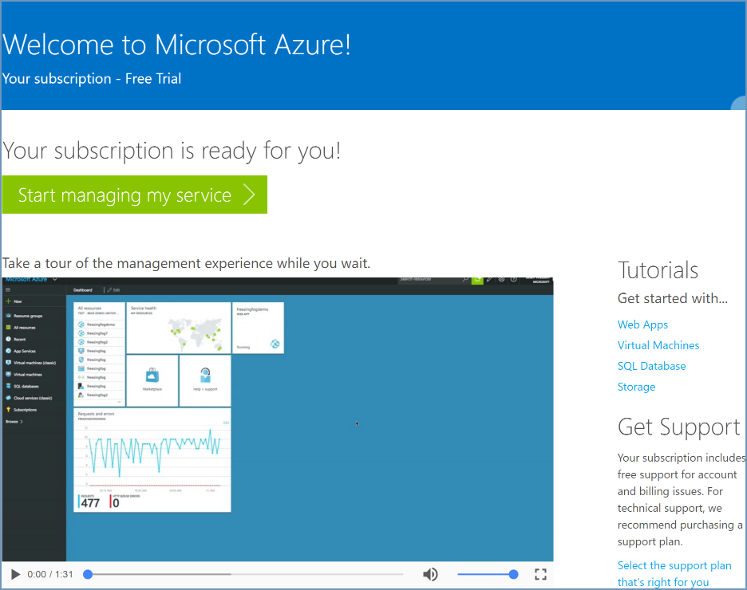
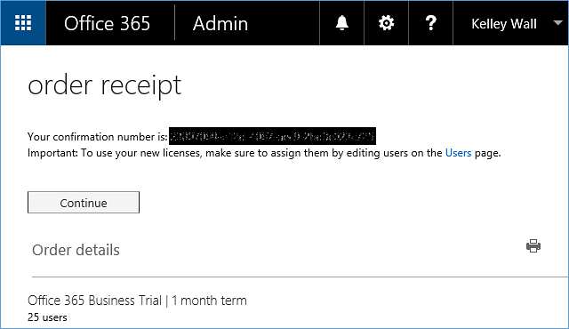
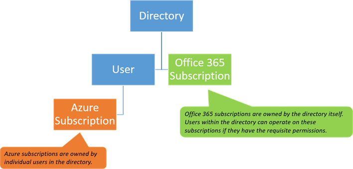

<properties
    pageTitle="Compartir una única inquilino de Azure AD entre suscripciones a Office 365 y Azure | Microsoft Azure"
    description="Aprenda a compartir su inquilino de Azure AD de Office 365 y sus usuarios a su suscripción de Azure, o viceversa"
    services=""
    documentationCenter=""
    authors="JiangChen79"
    manager="mbaldwin"
    editor=""
    tags="billing,top-support-issue"/>

<tags
    ms.service="billing"
    ms.workload="na"
    ms.tgt_pltfrm="ibiza"
    ms.devlang="na"
    ms.topic="article"
    ms.date="08/17/2016"
    ms.author="cjiang"/>

# Usar una cuenta existente de Office 365 con su suscripción a Azure o viceversa
Escenario: Ya tiene una suscripción de Office 365 y está listo para una suscripción de Azure, pero desea utilizar las cuentas de usuario de Office 365 existentes para la suscripción de Azure. Como alternativa, un suscriptor de Azure y desea obtener una suscripción de Office 365 para los usuarios de Azure Active Directory existente. Este artículo le muestra lo fácil que es conseguir ambos.

> [AZURE.NOTE] En este artículo no se aplica a los clientes del contrato Enterprise (EA). Si necesita más ayuda en cualquier momento en este artículo, [póngase en contacto con soporte técnico](https://portal.azure.com/?#blade/Microsoft_Azure_Support/HelpAndSupportBlade) para obtener el problema resuelto rápidamente.

## Guía rápida

- Si ya tiene una suscripción a Office 365 y desea suscribirse a Azure, use la opción de **iniciar sesión con su cuenta de la organización** . Continúe el proceso de suscripción Azure con su cuenta de Office 365. Consulte [los pasos detallados más adelante en este artículo](#s1).

- Si ya tiene una suscripción de Azure y desea obtener una suscripción de Office 365, inicie sesión en Office 365 con su cuenta de Azure. Continúe con los pasos de la suscripción. Después de completar la suscripción, la suscripción a Office 365 se agrega a la misma instancia de Azure Active Directory al que pertenece la suscripción de Azure. Para obtener más información, vea la sección [pasos detallados más adelante en este artículo](#s2).

>[AZURE.NOTE] Para obtener una suscripción de Office 365, la cuenta utilice para suscripción debe ser miembro del rol de administrador Global o administrador de facturación de directorio de su inquilino de Azure Active Directory. [Obtenga información sobre cómo determinar la función de Azure Active Directory](#how-to-know-your-role-in-your-azure-active-directory).

Para entender lo que ocurre cuando se agrega una suscripción a una cuenta, consulte la [información de fondo más adelante en el artículo](#background-information).

## Pasos detallados

### Escenario 1: Los usuarios de Office 365 que va a comprar Azure
En este escenario, se supone que Kelley Wall es un usuario que tiene una suscripción de Office 365 y planificación para suscribirse a Azure. Existen dos usuarios activos adicionales, Jane y Tricia. Cuenta de Kelley es admin@contoso.onmicrosoft.com.

Para iniciar sesión en Azure, siga estos pasos:

1. Suscríbase a Azure en [Azure.com](https://azure.microsoft.com/). Haga clic en **probar de forma gratuita**. En la siguiente página, haga clic en **Iniciar ahora**.

    

2. Haga clic en **iniciar sesión con su cuenta de la organización**.

    

3. Inicie sesión con su cuenta de Office 365. En este caso, es una cuenta de Office 365 de Kelley.

    

4. Rellene la información y completar el proceso de suscripción.

    

    

Ahora está listo. En el portal de Azure, verá los mismos usuarios que aparecen. Para comprobarlo, siga estos pasos:

1. En la pantalla que se muestra anteriormente, haga clic en **Iniciar mi servicio de administración** .
2. Haga clic en **Examinar**y, a continuación, haga clic en **Active Directory**.

    

3. Haga clic en **usuarios**.

    

4. Se muestran todos los usuarios, incluidos a Kelley, según lo esperado.

    

### Escenario 2: Los usuarios de Azure que va a comprar Office 365

En este escenario, Kelley Wall es un usuario que tiene una suscripción de Azure en la cuenta admin@contoso.onmicrosoft.com. Kelley desea suscribirse a Office 365 y utilizar el mismo directorio que ya tiene con Azure.

>[AZURE.NOTE] Para obtener una suscripción de Office 365, la cuenta que utiliza para iniciar sesión debe ser miembro del rol de administrador Global o administrador de facturación de directorio de su inquilino de Azure Active Directory. [Obtenga información sobre cómo saber el rol de Azure Active Directory](#how-to-know-your-role-in-your-azure-active-directory).

Para suscribirse a Office 365, siga estos pasos:

1. Vaya a la [página de producto de Office 365](https://products.office.com/business)y, a continuación, seleccione un plan que es adecuado para usted.
2. Después de seleccionar el plan, se abrirá la página siguiente. Rellene el formulario. En la esquina superior derecha de la página, haga clic en **iniciar sesión** .

    

3. Inicie sesión con sus credenciales de cuenta. En este ejemplo, es una cuenta de Kelley.

    

4. Haga clic en **Probar ahora**.

    

5. En la página de confirmación del pedido, haga clic en **continuar**.

    

Ahora está listo. En el centro de administración de Office 365, debe ver usuarios desde el directorio de Contoso que se muestran como usuarios activos. Para comprobarlo, siga estos pasos:

1. Abra el centro de administración de Office 365.
2. Expanda **usuarios**y, a continuación, haga clic en **Usuarios activos**.

    

### Cómo saber su rol en Azure Active Directory

1. Inicie sesión en el [portal de Azure](https://portal.azure.com/).
2. Haga clic en **Examinar**y, a continuación, haga clic en **Active Directory**.

    

3. Haga clic en **usuarios**.

    

4. Haga clic en el usuario. En este ejemplo, el usuario está Kelley Wall.

    Observe que el campo de **Función de la organización**.

    

## Información general acerca de las suscripciones de Azure y Office 365
Office 365 y Azure utilizan el servicio de Azure Active Directory para administrar los usuarios y las suscripciones. Considere la posibilidad de un directorio de Azure como un contenedor en el que puede agrupar usuarios y suscripciones. Para usar la misma cuenta de usuario para las suscripciones de Azure y Office 365, debe asegurarse de que las suscripciones se crean en el mismo directorio. Tenga en cuenta los siguientes puntos:

- Una suscripción se creará en un directorio, no al revés.
- Los usuarios pertenecen a directorios, no al revés.
- Una suscripción lleva en el directorio del usuario que crea la suscripción. Como resultado, la suscripción de Office 365 está ligada a la misma cuenta que la suscripción de Azure cuando utilice esa cuenta para crear la suscripción de Office 365.

Para obtener más información, vea [cómo Azure suscripciones están asociadas a Azure Active Directory](./active-directory/active-directory-how-subscriptions-associated-directory.md).

>[AZURE.NOTE] Suscripciones de Azure pertenecen a usuarios individuales en el directorio.

>[AZURE.NOTE] Suscripciones a Office 365 pertenecen el propio directorio. Si los usuarios dentro del directorio tienen los permisos necesarios, puede trabajar con en estas suscripciones.

## Pasos siguientes
Si adquirió la Azure y Office 365 suscripciones por separado en el pasado y que desea tener acceso a los inquilinos de Office 365 de la suscripción de Azure, vea [asociar a un inquilino de Office 365 con una suscripción de Azure](billing-add-office-365-tenant-to-azure-subscription.md).

> [AZURE.NOTE] Si sigue teniendo preguntas, [póngase en contacto con soporte técnico](https://portal.azure.com/?#blade/Microsoft_Azure_Support/HelpAndSupportBlade) para obtener el problema resuelto rápidamente.
