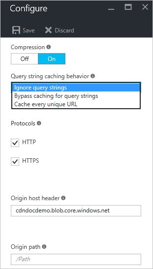

<properties
    pageTitle="Controlar el comportamiento de las solicitudes de cadenas de consulta de almacenamiento en caché de CDN de Azure | Microsoft Azure"
    description="Cadena de consulta CDN Azure almacenamiento en caché controles cómo son los archivos en caché que contengan cadenas de consulta."
    services="cdn"
    documentationCenter=""
    authors="camsoper"
    manager="erikre"
    editor=""/>

<tags
    ms.service="cdn"
    ms.workload="tbd"
    ms.tgt_pltfrm="na"
    ms.devlang="na"
    ms.topic="article"
    ms.date="07/28/2016"
    ms.author="casoper"/>

#Controlar el comportamiento de la caché de solicitudes CDN cadenas de consulta

> [AZURE.SELECTOR]
- [Estándar](cdn-query-string.md)
- [CDN Azure Premium desde Verizon](cdn-query-string-premium.md)

##Información general

Los controles de almacenamiento en caché de cadena de consulta cómo son los archivos en caché que contengan cadenas de consulta.

> [AZURE.IMPORTANT] Los productos estándar y Premium CDN proporcionan la misma cadena de consulta funcionalidad de caché, pero difiere de la interfaz de usuario.  Este documento describe la interfaz de ** **Azure CDN de Akamai Azure CDN estándar**y de Verizon** .  Cadena de consulta almacenamiento en caché con **Azure CDN Premium desde Verizon**, vea [controlar el comportamiento de almacenamiento en caché de solicitudes CDN cadenas de consulta - Premium](cdn-query-string-premium.md).

Existen tres modos:

- **Omitir las cadenas de consulta**: este es el modo predeterminado.  El nodo del borde CDN pasará la cadena de consulta del solicitante al origen en la primera solicitud y la caché del activo.  Todas las solicitudes subsiguientes para ese activo atendidas desde el nodo del borde omitirá la cadena de consulta hasta que expire el activo en caché.
- **Almacenamiento en caché de derivación de la dirección URL con las cadenas de consulta**: en este modo, las solicitudes de cadenas de consulta no se en caché en el nodo del borde CDN.  El nodo del borde recupera activo directamente desde el origen y pasa al solicitante con cada solicitud.
- **Caché de cada dirección URL única**: este modo trata cada solicitud con una cadena de consulta como un único activo con su propia memoria caché.  Por ejemplo, la respuesta desde el origen de una solicitud de *foo.ashx?q=bar* desea en caché en el nodo del borde y se devuelve para la caché subsiguientes con esa misma cadena de consulta.  Una solicitud de *foo.ashx?q=somethingelse* se podría caché como un activo independiente con su propia hora Live.

##Cambiar la configuración de perfiles CDN estándar de caché de cadena de consulta

1. En el módulo de perfil CDN, haga clic en el extremo CDN que desea administrar.

    

    Se abre el módulo de extremo CDN.

2. Haga clic en el botón **Configurar** .

    

    Se abre el módulo de configuración de CDN.

3. Seleccione una opción del menú desplegable de la **cadena de consulta comportamiento almacenamiento en caché** .

    

4. Después de realizar la selección, haga clic en el botón **Guardar** .

> [AZURE.IMPORTANT] Los cambios de configuración no pueden ser inmediatamente visibles, como el tiempo para el registro en propagarse a través de la CDN.  Perfiles de <b>Azure CDN de Akamai</b> , propagación normalmente se completará en un minuto.  Perfiles de <b>Azure CDN de Verizon</b> , propagación normalmente se completará en 90 minutos, pero en algunos casos puede tardar más.
