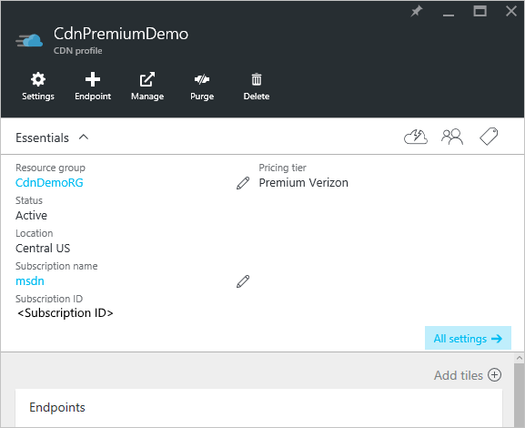

<properties
    pageTitle="Real-tiempo estadísticas en Azure CDN | Microsoft Azure"
    description="Estadísticas en tiempo real proporcionan datos en tiempo real sobre el rendimiento de Azure CDN cuando la entrega de contenido a sus clientes."
    services="cdn"
    documentationCenter=""
    authors="camsoper"
    manager="erikre"
    editor=""/>

<tags
    ms.service="cdn"
    ms.workload="tbd"
    ms.tgt_pltfrm="na"
    ms.devlang="na"
    ms.topic="article"
    ms.date="07/28/2016"
    ms.author="casoper"/>

# Estadísticas en tiempo real en Microsoft Azure CDN

[AZURE.INCLUDE [cdn-premium-feature](../../includes/cdn-premium-feature.md)]

## Información general

Este documento explica las estadísticas en tiempo real en Microsoft Azure CDN.  Esta funcionalidad proporciona datos en tiempo real, como el ancho de banda, Estados de caché y conexiones simultáneas a su perfil CDN cuando la entrega de contenido a sus clientes. Esto permite la supervisión continua del estado de su servicio en cualquier momento, incluidos los eventos de poner en marcha.

Los gráficos siguientes están disponibles:

* [Ancho de banda](#bandwidth)
* [Códigos de estado](#status-codes)
* [Estados de caché](#cache-statuses)
* [Conexiones](#connections)

## Acceso a estadísticas en tiempo real

1. En el [Portal de Azure](https://portal.azure.com), vaya a su perfil CDN.

    

2. En el módulo de perfil CDN, haga clic en el botón **Administrar** .

    

    Se abre el portal de administración de CDN.

3. Desplace el puntero sobre la pestaña **análisis** , a continuación, desplace el puntero sobre el flotante **Estadísticas en tiempo real** .  Haga clic en **objeto grande de HTTP**.

    

    Se muestran los gráficos de estadísticas en tiempo real.
    
Cada uno de los gráficos muestra estadísticas en tiempo real para el período de tiempo seleccionado, iniciar cuando se cargue la página.  Los gráficos se actualizan automáticamente cada pocos segundos.  El botón **Actualizar el gráfico** , si está presente, desactive el gráfico, después de que solo mostrará los datos seleccionados.

## Ancho de banda

El gráfico de **ancho de banda** muestra la cantidad de ancho de banda utilizado para la plataforma actual en el intervalo de tiempo seleccionado. La parte del gráfico sombreada indica el uso de ancho de banda. Se muestra la cantidad de ancho de banda se utiliza actualmente exacto directamente debajo del gráfico de líneas.

## Códigos de estado

El gráfico de **Códigos de estado** indica con qué frecuencia se producen ciertos códigos de respuesta HTTP durante el período de tiempo seleccionado.

> [AZURE.TIP]  Para obtener una descripción de cada opción de código de estado HTTP, consulte [Códigos de estado de HTTP de Azure CDN](https://msdn.microsoft.com/library/mt759238.aspx).

Se muestra una lista de códigos de estado HTTP directamente encima del gráfico. Esta lista indica cada código de estado que se puede incluir en el gráfico de líneas y el número de apariciones por segundo para ese código de estado actual. De forma predeterminada, se muestra una línea para cada uno de estos códigos de estado en el gráfico. Sin embargo, puede supervisar sólo los códigos de estado que relevancia para su configuración de CDN. Para ello, compruebe los códigos de estado que desee y desactive todas las demás opciones y haga clic en **Actualizar el gráfico**. 

Puede ocultar temporalmente datos registrados para un código de estado en particular.  En la leyenda directamente debajo del gráfico, haga clic en el código de estado que desee ocultar. El código de estado se ocultarán inmediatamente del gráfico. Clic de nuevo en ese código de estado hará que esta opción para que se muestre de nuevo.

## Estados de caché

El gráfico de **Estados de caché** indica con qué frecuencia se producen ciertos tipos de Estados de caché durante el período de tiempo seleccionado. 

> [AZURE.TIP]  Para obtener una descripción de cada opción de código de estado de caché, consulte [Códigos de estado de caché de Azure CDN](https://msdn.microsoft.com/library/mt759237.aspx).

Se muestra una lista de códigos de estado de caché directamente encima del gráfico. Esta lista indica cada código de estado que se puede incluir en el gráfico de líneas y el número de apariciones por segundo para ese código de estado actual. De forma predeterminada, se muestra una línea para cada uno de estos códigos de estado en el gráfico. Sin embargo, puede supervisar sólo los códigos de estado que relevancia para su configuración de CDN. Para ello, compruebe los códigos de estado que desee y desactive todas las demás opciones y haga clic en **Actualizar el gráfico**. 

Puede ocultar temporalmente datos registrados para un código de estado en particular.  En la leyenda directamente debajo del gráfico, haga clic en el código de estado que desee ocultar. El código de estado se ocultarán inmediatamente del gráfico. Clic de nuevo en ese código de estado hará que esta opción para que se muestre de nuevo.

## Conexiones

Este gráfico indica que se han establecido cuántas conexiones a los servidores de borde. Cada solicitud de un activo que pasa a través de nuestros resultados CDN en una conexión.

## Pasos siguientes

- Recibir una notificación con [alertas en tiempo real en CDN de Azure](cdn-real-time-alerts.md)
- Profundizar con [informes HTTP avanzados](cdn-advanced-http-reports.md)
- Analizar [patrones de uso](cdn-analyze-usage-patterns.md)

