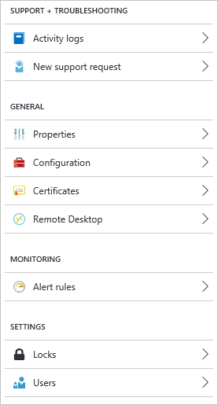

<properties 
    pageTitle="Cómo configurar un servicio de nube (portal) | Microsoft Azure" 
    description="Obtenga información sobre cómo configurar los servicios en la nube en Azure. Aprenda a actualizar la configuración del servicio de nube y configurar el acceso remoto a las instancias de la función. Estos ejemplos usan el portal de Azure." 
    services="cloud-services" 
    documentationCenter="" 
    authors="Thraka" 
    manager="timlt" 
    editor=""/>

<tags 
    ms.service="cloud-services" 
    ms.workload="tbd" 
    ms.tgt_pltfrm="na" 
    ms.devlang="na" 
    ms.topic="article" 
    ms.date="10/11/2016"
    ms.author="adegeo"/>

# Cómo configurar los servicios de nube

> [AZURE.SELECTOR]
- [Portal de Azure](cloud-services-how-to-configure-portal.md)
- [Portal de clásico de Azure](cloud-services-how-to-configure.md)

Puede configurar las opciones más utilizadas de un servicio de nube en el portal de Azure. O bien, si desea actualizar los archivos de configuración directamente, descargar un archivo de configuración de servicio para actualizar y, a continuación, cargar el archivo actualizado y actualizar el servicio de nube con los cambios de configuración. En ambos casos, las actualizaciones de configuración se resaltan los a todas las instancias de la función.

También puede administrar las instancias de su escritorio remoto o funciones de servicio de nube en ellos.

Azure solo puede garantizar la disponibilidad de servicio de 99,95 por ciento durante las actualizaciones de configuración si tiene al menos dos instancias de rol para cada rol. Que permite una máquina virtual procesar las solicitudes de cliente mientras se actualiza el otro. Para obtener más información, consulte [Service Level Agreements](https://azure.microsoft.com/support/legal/sla/).

## Cambiar un servicio de nube

Después de abrir el [portal de Azure](https://portal.azure.com/), vaya a su servicio de nube. Desde aquí administrar muchos aspectos de la misma. 

Los vínculos de **configuración** o **toda la configuración** se abrirían la placa **configuración** donde puede cambiar las **Propiedades**, cambiar la **configuración**, administrar los **certificados**, configurar **reglas de alertas**y administrar los **usuarios** que tienen acceso a este servicio de nube.

>[AZURE.NOTE]
>No se puede cambiar el sistema operativo utilizado para el servicio de nube con el **portal de Azure**, solo puede cambiar esta configuración a través del [portal clásica Azure](http://manage.windowsazure.com/). Esto se detalla [aquí](cloud-services-how-to-configure.md#update-a-cloud-service-configuration-file).

## Supervisión

Puede agregar alertas en el servicio de nube. Haga clic en **configuración** > **Reglas de alerta** > **Agregar aviso**. 

Desde aquí puede configurar una alerta. Con el cuadro desplegable **Mertic** , puede configurar una alerta para los siguientes tipos de datos.

- Lectura de disco
- Escritura de disco
- En la red
- Fuera de la red
- Porcentaje de CPU 

### Configurar la supervisión de un mosaico métrico

En lugar de usar **configuración** > **Reglas de alertas**, puede hacer clic en uno de los mosaicos métricos en la sección **supervisión** del módulo de **servicio de nube** .

Desde aquí puede personalizar el gráfico que se usa con el icono, o agregar una regla de alerta.

## Reiniciar el equipo, crear una nueva imagen o escritorio remoto

En este momento no puede configurar Escritorio remoto con el **portal de Azure**. Sin embargo, puede configurarlo a través del [portal clásica Azure](cloud-services-role-enable-remote-desktop.md), [PowerShell](cloud-services-role-enable-remote-desktop-powershell.md), o a través de [Visual Studio](../vs-azure-tools-remote-desktop-roles.md). 

En primer lugar, haga clic en la instancia de servicio de nube.

Desde el módulo que se abre uou puede iniciar una conexión a Escritorio remoto, reiniciar la instancia de forma remota o crear una nueva imagen remotamente (empezar con una imagen de un nuevo) la instancia.

## Volver a configurar su .cscfg

Puede que necesite cambiar servicio de nube mediante el archivo de [configuración de servicio (cscfg)](cloud-services-model-and-package.md#cscfg) . En primer lugar debe descargar el archivo .cscfg, modificar y luego cárguelo.

1. Haga clic en el icono **configuración** o en el vínculo de **todas las opciones** para abrir la hoja de **configuración** .

    

2. Haga clic en el elemento de **configuración** .

    

3. Haga clic en el botón **Descargar** .

    

4. Después de actualizar el archivo de configuración de servicio, cargar y aplicar las actualizaciones de configuración:

     
    
5. Seleccione el archivo .cscfg y haga clic en **Aceptar**.

            
## Pasos siguientes

* Obtenga información sobre cómo [implementar un servicio de nube](cloud-services-how-to-create-deploy-portal.md).
* Configurar un [nombre de dominio personalizado](cloud-services-custom-domain-name-portal.md).
* [Administrar el servicio de nube](cloud-services-how-to-manage-portal.md).
* Configurar [certificados ssl](cloud-services-configure-ssl-certificate-portal.md).