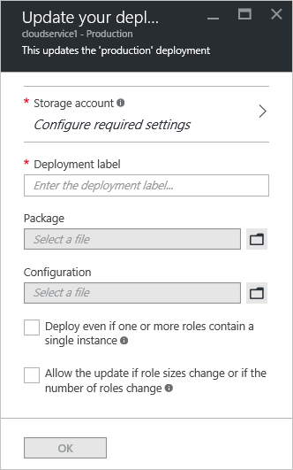

<properties 
    pageTitle="Tareas comunes de administración de servicio de nube | Microsoft Azure" 
    description="Obtenga información sobre cómo administrar servicios en la nube en el portal de Azure. Estos ejemplos usan el portal de Azure." 
    services="cloud-services" 
    documentationCenter="" 
    authors="Thraka" 
    manager="timlt" 
    editor=""/>

<tags 
    ms.service="cloud-services" 
    ms.workload="tbd" 
    ms.tgt_pltfrm="na" 
    ms.devlang="na" 
    ms.topic="article" 
    ms.date="08/02/2016"
    ms.author="adegeo"/>

# Cómo administrar servicios en la nube

> [AZURE.SELECTOR]
- [Portal de Azure](cloud-services-how-to-manage-portal.md)
- [Portal de clásico de Azure](cloud-services-how-to-manage.md)

Su servicio de nube se administra en el área de **Servicios de nube (clásico)** del portal de Azure. En este artículo se describe algunas acciones comunes que tardarían mientras se administran los servicios de nube. Lo que incluye actualizar, eliminar, ajuste de escala y promover una implementación preconfigurada de producción.

Para obtener más información sobre cómo ajustar el tamaño de su servicio de nube está disponible [aquí](cloud-services-how-to-scale-portal.md).

## Cómo: actualizar un rol de servicio de nube o una implementación

Si necesita actualizar el código de la aplicación del servicio de nube, use la **actualización** en el módulo de servicio de nube. Puede actualizar una única función o todas las funciones. Para actualizar, puede cargar un nuevo paquete de servicio o el archivo de configuración de servicio.

1. En el [portal de Azure][], seleccione el servicio de nube que desea actualizar. Este paso abre el módulo de instancia de servicio de nube.

2. En el módulo, haga clic en el botón **Actualizar** .

    

3. Actualizar la implementación con un nuevo archivo de paquete de servicio (.cspkg) y el archivo de configuración de servicio (.cscfg).

    

4. **Opcionalmente,** actualice la etiqueta de implementación y la cuenta de almacenamiento. 

5. Si las funciones tienen solo una instancia de rol, seleccione el **implementar incluso si una o varias funciones contienen una sola instancia** para habilitar la actualización continuar. 

    Azure sólo puede garantizar disponibilidad del servicio 99,95 por ciento durante una actualización de servicio de nube si cada rol tiene al menos dos instancias de función (máquinas virtuales). Con dos instancias de la función, una máquina virtual procesará las solicitudes de cliente mientras se actualiza el otro.

6. Consulte **Iniciar implementación** para tiene aplicada una vez finalizada la carga del paquete de la actualización.

7. Haga clic en **Aceptar** para iniciar la actualización del servicio.

## Cómo: intercambiar implementaciones para promover una implementación preconfigurada de producción

Cuando decida implementar una nueva versión de un servicio de nube fase y probar la nueva versión en su entorno de ensayo de servicio de nube. Use **intercambiar** para cambiar las direcciones URL que las dos implementaciones dirigidas y promover una versión nueva de producción. 

Puede intercambiar implementaciones desde la página de **Servicios de nube** o el panel.

1. En el [portal de Azure][], seleccione el servicio de nube que desea actualizar. Este paso abre el módulo de instancia de servicio de nube.

2. En el módulo, haga clic en el botón **intercambiar** .

    

3. Se abre el siguiente mensaje de confirmación.

    

4. Después de comprobar la información de implementación, haga clic en **Aceptar** para intercambiar las implementaciones.

    Intercambio de implementación rápidamente ocurre porque lo único que cambia es las direcciones IP virtuales (VIP) para las implementaciones.

    Para guardar los costos de proceso, puede eliminar la implementación de ensayo después de comprobar que la implementación de producción funciona según lo esperado.

## Cómo: vincular un recurso a un servicio de nube

El portal de Azure no vincular recursos como el portal clásico Azure actual. En su lugar, implementar recursos adicionales en el mismo grupo de recursos que se usa el servicio de nube.

## Cómo: eliminar implementaciones y un servicio de nube

Antes de eliminar un servicio de nube, debe eliminar cada implementación existente.

Para guardar los costos de proceso, puede eliminar la implementación de ensayo después de comprobar que la implementación de producción funciona según lo esperado. Se cargarán para calcular los costes de instancias de rol implementado que se detienen.

Use el procedimiento siguiente para eliminar una implementación o su servicio de nube. 

1. En el [portal de Azure][], seleccione el servicio de nube que desea eliminar. Este paso abre el módulo de instancia de servicio de nube.

2. En el módulo, haga clic en el botón **Eliminar** .

    

3. Puede eliminar el servicio de nube toda marcando **sus implementaciones y servicio de nube** o elegir la **implementación de producción** o la **implementación de ensayo**.

     

4. Haga clic en el botón **Eliminar** en la parte inferior.

5. Para eliminar el servicio de nube, haga clic en **servicio de nube de eliminar**. A continuación, en el mensaje de confirmación, haga clic en **Sí**.

> [AZURE.NOTE]
> Cuando se elimina un servicio de nube y supervisión detallado está configurado, debe eliminar manualmente los datos de su cuenta de almacenamiento. Para obtener información acerca de dónde buscar las tablas métricas, consulte [este](cloud-services-how-to-monitor.md) artículo.

[Portal de Azure]: https://portal.azure.com

## Pasos siguientes

* [Configuración general de su servicio de nube](cloud-services-how-to-configure-portal.md).
* Obtenga información sobre cómo [implementar un servicio de nube](cloud-services-how-to-create-deploy-portal.md).
* Configurar un [nombre de dominio personalizado](cloud-services-custom-domain-name-portal.md).
* Configurar [certificados ssl](cloud-services-configure-ssl-certificate-portal.md).