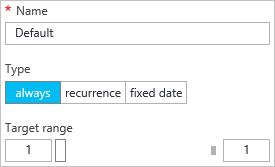

<properties
    pageTitle="Automáticamente ajustar un servicio de nube en el portal de | Microsoft Azure"
    description="Obtenga información sobre cómo usar el portal para configurar reglas de escala automático para una función de web del servicio de nube o trabajo en Azure."
    services="cloud-services"
    documentationCenter=""
    authors="Thraka"
    manager="timlt"
    editor=""/>

<tags
    ms.service="cloud-services"
    ms.workload="tbd"
    ms.tgt_pltfrm="na"
    ms.devlang="na"
    ms.topic="article"
    ms.date="09/06/2016"
    ms.author="adegeo"/>

# Cómo Autoescala un servicio de nube

> [AZURE.SELECTOR]
- [Portal de Azure](cloud-services-how-to-scale-portal.md)
- [Portal de clásico de Azure](cloud-services-how-to-scale.md)

Se pueden establecer condiciones para una función de trabajo de servicio de nube que desencadenar una escala en u operación. Las condiciones de la función se pueden basar en la CPU, disco o de la función de carga de red. También puede establecer un conditation en función de una cola de mensajes o la métrica de algún otro recurso Azure asociada a su suscripción.

>[AZURE.NOTE] En este artículo se centra en los roles de web y trabajador de servicio de nube. Cuando se crea una máquina virtual (clásico) directamente, está alojado en un servicio de nube. Puede ajustar el tamaño de una máquina virtual estándar asociarla con un [conjunto de disponibilidad](../virtual-machines/virtual-machines-windows-classic-configure-availability.md) y manualmente activar o desactivar.

## Consideraciones

Debe tener en cuenta la siguiente información antes de configurar la escala de la aplicación:

- Uso de core afecta a escala. Las instancias de función mayores use más núcleos. Puede ajustar una aplicación solo dentro del límite de núcleos para su suscripción. Por ejemplo, si su suscripción tiene un límite de veinte núcleos y ejecutar una aplicación con dos medio tamaño (un total de cuatro núcleos) de servicios de nube, solo puede escalar el otras implementaciones de servicio de nube en su suscripción por la 16 extracción de. Para obtener más información sobre los tamaños, vea [Tamaños de servicio de nube](cloud-services-sizes-specs.md) .

- Puede escalar en función de un umbral de cola de mensajes. Para obtener más información sobre cómo usar colas, vea [cómo usar el servicio de almacenamiento de cola](../storage/storage-dotnet-how-to-use-queues.md).

- También puede escalar otros recursos asociadas a su suscripción.

- Para habilitar alta disponibilidad de la aplicación, debe asegurarse de que se ha implementado con dos o más instancias de la función. Para obtener más información, consulte [Service Level Agreements](https://azure.microsoft.com/support/legal/sla/).

## ¿Dónde se encuentra escala

Después de seleccionar el servicio en la nube, debe tener el módulo de servicio de nube visible.

1. En el módulo de servicio de nube, en el mosaico de **Roles e instancias** , seleccione el nombre del servicio de nube.   
**Importante**: asegúrese de hacer clic en el rol de servicio de nube, no la instancia de la función que está por debajo de la función.

    

2. Seleccione el icono de **escala** .

    

## Escala automático

Puede configurar la configuración de escala de una función con dos modos **manual** o **automática**. Manual es como cabría esperar, establezca el número de instancias absoluto. Sin embargo, automático permite para establecer reglas que rigen cómo y cuánto se debe escalar.

Establezca la opción de **escala por** reglas de **programación y rendimiento**.

1. Un perfil existente.
2. Agregar una regla para el perfil principal.
3. Agregar otro perfil.

Seleccione **Agregar perfil**. El perfil determina el modo en que desea usar para la escala: **siempre**, **Periodicidad**, **fecha fija**.

Después de haber configurado el perfil y las reglas, seleccione el icono **Guardar** en la parte superior.

#### Perfil

El perfil de conjuntos de instancias máximos y mínimos de la escala, y también si está activo este intervalo de la escala.

* **Siempre**

    Mantener siempre este intervalo de instancias disponibles.  

    
    
* **Periodicidad**

    Elija un conjunto de días de la semana escalar.

    
    
* **Fecha fija**

    Un intervalo de fechas fijo para ajustar el tamaño de la función.

    

Una vez que haya configurado el perfil, seleccione el botón **Aceptar** en la parte inferior del módulo de perfil.

#### Regla

Las reglas se agregan a un perfil y representan una condición que se activará la escala. 

El desencadenador regla está basado en una métrica del servicio de nube (uso de CPU, la actividad del disco o actividad de la red) a la que puede agregar un valor condicional. Además puede hacer que el desencadenador en función de una cola de mensajes o la métrica de algún otro recurso Azure asociada a su suscripción.

Una vez que haya configurado la regla, seleccione el botón **Aceptar** en la parte inferior del módulo de regla.

## Volver a escala manual

Desplácese a la [configuración de escala](#where-scale-is-located) y establezca la opción de **escala por** en **un recuento de la instancia que escribo manualmente**.

Esto elimina el ajuste de escala automática de la función y, a continuación, puede establecer el recuento de instancia directamente. 

1. La opción escala (manual o automática).
2. Función instancia control deslizante para establecer las instancias de tamaño.
3. Instancias de la función escalar.

Después de haber configurado la configuración de escala, seleccione el icono **Guardar** en la parte superior.

