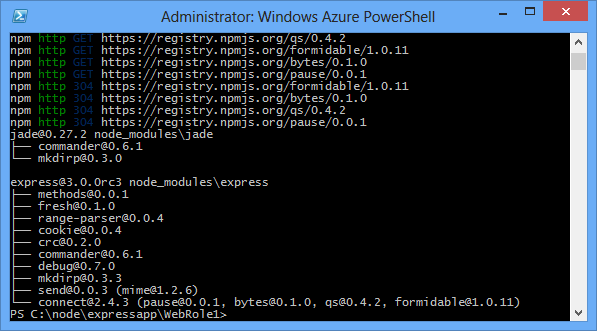
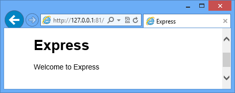

<properties 
    pageTitle="Web App con Express (Node.js) | Microsoft Azure" 
    description="Tutorial que se basa en el tutorial de servicio de nube y a continuación, se muestra cómo usar el módulo de Express." 
    services="cloud-services" 
    documentationCenter="nodejs" 
    authors="rmcmurray" 
    manager="wpickett" 
    editor=""/>

<tags 
    ms.service="cloud-services" 
    ms.workload="tbd" 
    ms.tgt_pltfrm="na" 
    ms.devlang="nodejs" 
    ms.topic="article" 
    ms.date="08/11/2016" 
    ms.author="robmcm"/>

# Crear una aplicación web de Node.js con Express en un servicio de nube de Azure

Node.js incluye un conjunto mínimo de funcionalidad en el tiempo de ejecución principal.
Los desarrolladores a menudo utilizar 3ª módulos de terceros para proporcionar funcionalidad adicional al desarrollar una aplicación de Node.js. En este tutorial creará una nueva aplicación mediante el módulo [Express][] , que proporciona un marco de MVC para crear aplicaciones web de Node.js.

Captura de pantalla de la aplicación completada está por debajo de:

##Crear un proyecto de servicio de nube

Realice los pasos siguientes para crear un nuevo proyecto de servicio de nube denominado 'expressapp':

1. Desde el **Menú Inicio** o la **Pantalla de inicio**, busque **Windows PowerShell**. Por último, haga clic en **Windows PowerShell** y seleccione **Ejecutar como administrador**.

    

    [AZURE.INCLUDE [install-dev-tools](../../includes/install-dev-tools.md)]

2. Cambie los directorios a la **c:\\nodo** directorio y, a continuación, escriba los siguientes comandos para crear una nueva solución denominada **expressapp** y una función de web denominada **WebRole1**:

        PS C:\node> New-AzureServiceProject expressapp
        PS C:\Node\expressapp> Add-AzureNodeWebRole
        PS C:\Node\expressapp> Set-AzureServiceProjectRole WebRole1 Node 0.10.21

    > [AZURE.NOTE] De forma predeterminada, **Agregar AzureNodeWebRole** usa una versión anterior de Node.js. La instrucción **AzureServiceProjectRole conjunto** anterior indica que Azure usar v0.10.21 de nodo.  Tenga en cuenta que los parámetros distinguen mayúsculas de minúsculas.  Puede comprobar que la versión correcta de Node.js se ha seleccionado la propiedad **motores** en **WebRole1\package.json**.

##Instalación Express

1. Instalar el generador de Express mediante el comando siguiente:

        PS C:\node\expressapp> npm install express-generator -g

    El resultado del comando npm debe ser similar al siguiente resultado. 

    

2. Cambie los directorios al directorio **WebRole1** y use el comando express para generar una nueva aplicación:

        PS C:\node\expressapp\WebRole1> express

    Se le pedirá que sobrescriba la aplicación anterior. Escriba **y** o en **Sí** para continuar. Express generará el archivo app.js y una estructura de carpetas para la creación de la aplicación.

    

5.  Para instalar las dependencias adicionales definidas en el archivo package.json, escriba el siguiente comando:

        PS C:\node\expressapp\WebRole1> npm install

    

6.  Use el comando siguiente para copiar el archivo **bin/www** en **server.js**. Esto es para que el servicio de nube puede encontrar el punto de entrada para esta aplicación.

        PS C:\node\expressapp\WebRole1> copy bin/www server.js

    Una vez finalizado este comando, debe tener un archivo de **server.js** en el directorio WebRole1.

7.  Modificar el **server.js** para quitar una de las '.' caracteres de la línea siguiente.

        var app = require('../app');

    Después de realizar esta modificación, la línea debería aparecer como sigue.

        var app = require('./app');

    Este cambio es necesario puesto que se movió el archivo (anteriormente **Papelera/www**,) para el mismo directorio que el archivo de la aplicación que sea necesario. Después de realizar este cambio, guarde el archivo **server.js** .

8.  Use el comando siguiente para ejecutar la aplicación en el emulador Azure:

        PS C:\node\expressapp\WebRole1> Start-AzureEmulator -launch

    

## Modificación de la vista

Ahora modifique la vista para mostrar el mensaje "Bienvenido a Express en Azure".

1.  Escriba el comando siguiente para abrir el archivo index.jade:

        PS C:\node\expressapp\WebRole1> notepad views/index.jade

    

    Jade es el motor de vistas predeterminado usado por aplicaciones Express. Para obtener más información sobre el motor de vista Jade, consulte [http://jade-lang.com][].

2.  Modificar la última línea de texto agregando **en Azure**.

    

3.  Guarde el archivo y salga de Bloc de notas.

4.  Actualice el explorador y verá los cambios.

    

Después de probar la aplicación, use el cmdlet **Stop AzureEmulator** para detener el emulador.

##Publicar la aplicación en Azure

En la ventana de PowerShell de Azure, use el cmdlet **AzureServiceProject publicar** para implementar la aplicación a un servicio de nube

    PS C:\node\expressapp\WebRole1> Publish-AzureServiceProject -ServiceName myexpressapp -Location "East US" -Launch

Cuando se completa la operación de implementación, se abra el explorador y mostrar la página web.

## Pasos siguientes

Para obtener más información, consulte el [Centro para desarrolladores de Node.js](/develop/nodejs/).

  [Node.js Web Application]: http://www.windowsazure.com/develop/nodejs/tutorials/getting-started/
  [Express]: http://expressjs.com/
  [http://jade-lang.com]: http://jade-lang.com

 
