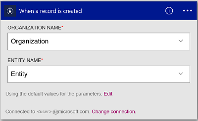
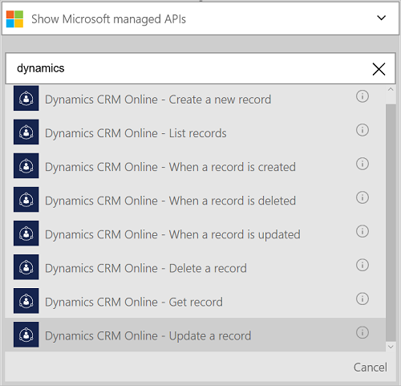

<properties
    pageTitle="Agregar el conector de Dynamics CRM Online a sus aplicaciones de lógica | Microsoft Azure"
    description="Crear aplicaciones de lógica con el servicio de aplicación de Azure. El proveedor de conexiones de Dynamics CRM Online proporciona una API para trabajar con entidades de Dynamics CRM Online."
    services="logic-apps"    
    documentationCenter=""     
    authors="MandiOhlinger"    
    manager="erikre"    
    editor="" 
    tags="connectors" />

<tags
ms.service="logic-apps"
ms.devlang="na"
ms.topic="article"
ms.tgt_pltfrm="na"
ms.workload="integration"
ms.date="08/15/2016"
ms.author="mandia"/>

# Empezar a trabajar con el conector de Dynamics CRM Online
Conectar con Dynamics CRM Online para crear un nuevo registro, actualizar un elemento y mucho más. Con CRM Online, puede:

- Crear el flujo de negocio basándose en los datos que recibe de CRM Online. 
- Acciones de uso que se elimina un registro, obtener entidades y mucho más. Estas acciones obtienen una respuesta y, a continuación, hacer que el resultado esté disponible para otras acciones. Por ejemplo, cuando se actualiza un elemento en CRM, puede enviar un correo electrónico usando Office 365.

Este tema muestra cómo usar el conector de Dynamics CRM Online en una aplicación de lógica y también enumera los desencadenadores y acciones.

>[AZURE.NOTE] Esta versión de este artículo se aplica a la disponibilidad de aplicaciones de lógica general (GA).

Para obtener más información acerca de la lógica de aplicaciones, vea [¿qué aplicaciones de lógica](../app-service-logic/app-service-logic-what-are-logic-apps.md) y [crear una aplicación de lógica](../app-service-logic/app-service-logic-create-a-logic-app.md).

## Conectar con Dynamics CRM Online

Antes de la aplicación de lógica puede tener acceso a cualquier servicio, primero crear una *conexión* al servicio. Una conexión proporciona conectividad entre una aplicación de lógica y otro servicio. Por ejemplo, para conectar con Dynamics, primero tendrá una *conexión*de Dynamics CRM Online. Para crear una conexión, escriba las credenciales que normalmente se utilizan para tener acceso al servicio que desea conectarse. Por lo tanto con Dynamics, escriba las credenciales de su cuenta de Dynamics CRM Online para crear la conexión.

### Crear la conexión

>[AZURE.INCLUDE [Steps to create a connection to Dynamics CRM Online Connection Provider](../../includes/connectors-create-api-crmonline.md)]

## Use un desencadenador

Un desencadenador es un evento que se pueden usar para iniciar el flujo de trabajo que se definen en una aplicación de lógica. Desencadenadores "sondean" el servicio en un intervalo y la frecuencia con la que desee. [Obtenga más información acerca de desencadenadores](../app-service-logic/app-service-logic-what-are-logic-apps.md#logic-app-concepts).

1. En la aplicación lógica, escriba "dynamics" para obtener una lista de los desencadenadores:  

    

2. Seleccione **Dynamics CRM Online - cuando se crea un registro**. Si ya existe una conexión, seleccione una organización y entidad de la lista desplegable.

    

    Si se le pide que inicie sesión en, a continuación, escriba el signo de detalles para crear la conexión. [Crear la conexión](connectors-create-api-crmonline.md#create-the-connection) en este tema se enumeran los pasos. 

    > [AZURE.NOTE] En este ejemplo, la aplicación de la lógica se ejecuta cuando se crea un registro. Para ver los resultados de este desencadenador, agregar otra acción que envía un correo electrónico. Por ejemplo, agregue la acción de Office 365 *Enviar un correo electrónico* que envía por correo electrónico cuando se agrega el nuevo registro. 

3. Seleccione el botón **Editar** y establecer los valores de **frecuencia** y el **intervalo** . Por ejemplo, si desea que el desencadenador para sondear cada 15 minutos, a continuación, establezca la **frecuencia** en **minuto**y establecer el **intervalo de** **15**. 

    

4. **Guardar** los cambios (esquina superior izquierda de la barra de herramientas). La aplicación de la lógica se guarda y se puede activar automáticamente.

## Usar una acción

Una acción es una operación que lleva a cabo por el flujo de trabajo que se definen en una aplicación de lógica. [Más información acerca de las acciones](../app-service-logic/app-service-logic-what-are-logic-apps.md#logic-app-concepts).

1. Seleccione el signo más. Ver varias opciones: **Agregar una acción**, **Agregar una condición**o una de las opciones **más** .

    

2. Elija **Agregar una acción**.

3. En el cuadro de texto, escriba "dynamics" para obtener una lista de todas las acciones disponibles.

    

4. En nuestro ejemplo, elija **Dynamics CRM Online - actualizar un registro**. Si ya existe una conexión, a continuación, elija el **Nombre de la organización**, el **Nombre de la entidad**y otras propiedades:  

    

    Si se le pide la información de conexión, a continuación, escriba los detalles para crear la conexión. [Crear la conexión](connectors-create-api-crmonline.md#create-the-connection) en este tema se describen las propiedades. 

    > [AZURE.NOTE] En este ejemplo, se actualice un registro existente en CRM Online. Puede usar el resultado de otro desencadenador para actualizar el registro. Por ejemplo, agregar el desencadenador de SharePoint *cuando se modifica un elemento existente* . A continuación, agregue la acción *actualizar un registro* de CRM Online que usa los campos de SharePoint para actualizar el registro existente en CRM Online. 

5. **Guardar** los cambios (esquina superior izquierda de la barra de herramientas). La aplicación de la lógica se guarda y se puede activar automáticamente.

## Detalles técnicos

## Desencadenadores

|Desencadenador | Descripción|
|--- | ---|
|[Cuando se crea un registro](connectors-create-api-crmonline.md#when-a-record-is-created)|Activa un flujo cuando se crea un objeto en CRM.|
|[Cuando se actualiza un registro](connectors-create-api-crmonline.md#when-a-record-is-updated)|Activa un flujo cuando se modifica un objeto en CRM.|
|[Cuando se elimina un registro](connectors-create-api-crmonline.md#when-a-record-is-deleted)|Activa un flujo cuando se elimina un objeto en CRM.|

## Acciones

|Acción|Descripción|
|--- | ---|
|[Registros de la lista](connectors-create-api-crmonline.md#list-records)|Esta operación obtiene los registros de una entidad.|
|[Crear un nuevo registro](connectors-create-api-crmonline.md#create-a-new-record)|Esta operación crea un nuevo registro de una entidad.|
|[Obtener registro](connectors-create-api-crmonline.md#get-record)|Esta operación obtiene el registro especificado para una entidad.|
|[Eliminar un registro](connectors-create-api-crmonline.md#delete-a-record)|Esta operación elimina un registro de una colección de entidades.|
|[Actualizar un registro](connectors-create-api-crmonline.md#update-a-record)|Esta operación actualiza un registro existente de una entidad.|

### Detalles de desencadenador y acción

En esta sección, vea los detalles específicos acerca de cada desencadenador y la acción, incluidas las propiedades de entrada opcionales o requeridas y ningún resultado correspondiente asociado con el conector.

#### Cuando se crea un registro
Activa un flujo cuando se crea un objeto en CRM. 

|Nombre de propiedad| Nombre para mostrar|Descripción|
| ---|---|---|
|conjunto de datos *|Nombre de la organización|Nombre de la organización de CRM como Contoso|
|tabla *|Nombre de la entidad|Nombre de la entidad|
|$skip|Número de saltos|Número de entradas para omitir (predeterminado = 0)|
|$top|Recuento de obtener máximo|Número máximo de entradas para obtener (predeterminado = 256)|
|$filter|Consulta de filtro|Una consulta de filtro ODATA para restringir las entradas devueltas|
|$orderby|Ordenar por|Una consulta ODATA orderBy para especificar el orden de las entradas.|

Un asterisco (*) significa que la propiedad es necesaria.

##### Detalles de salida
Elementos

| Nombre de propiedad | Tipo de datos |
|---|---|
|valor|matriz|

#### Cuando se actualiza un registro
Activa un flujo cuando se modifica un objeto en CRM. 

|Nombre de propiedad| Nombre para mostrar|Descripción|
| ---|---|---|
|conjunto de datos *|Nombre de la organización|Nombre de la organización de CRM como Contoso|
|tabla *|Nombre de la entidad|Nombre de la entidad|
|$skip|Número de saltos|Número de entradas para omitir (predeterminado = 0)|
|$top|Recuento de obtener máximo|Número máximo de entradas para obtener (predeterminado = 256)|
|$filter|Consulta de filtro|Una consulta de filtro ODATA para restringir las entradas devueltas|
|$orderby|Ordenar por|Una consulta ODATA orderBy para especificar el orden de las entradas.|

Un asterisco (*) significa que la propiedad es necesaria.

##### Detalles de salida
Elementos

| Nombre de propiedad | Tipo de datos |
|---|---|
|valor|matriz|

#### Cuando se elimina un registro
Activa un flujo cuando se elimina un objeto en CRM. 

|Nombre de propiedad| Nombre para mostrar|Descripción|
| ---|---|---|
|conjunto de datos *|Nombre de la organización|Nombre de la organización de CRM como Contoso|
|tabla *|Nombre de la entidad|Nombre de la entidad|
|$skip|Número de saltos|Número de entradas para omitir (predeterminado = 0)|
|$top|Recuento de obtener máximo|Número máximo de entradas para obtener (predeterminado = 256)|
|$filter|Consulta de filtro|Una consulta de filtro ODATA para restringir las entradas devueltas|
|$orderby|Ordenar por|Una consulta ODATA orderBy para especificar el orden de las entradas.|

Un asterisco (*) significa que la propiedad es necesaria.

##### Detalles de salida
Elementos

| Nombre de propiedad | Tipo de datos |
|---|---|
|valor|matriz|

#### Registros de la lista
Esta operación obtiene los registros de una entidad. 

|Nombre de propiedad| Nombre para mostrar|Descripción|
| ---|---|---|
|conjunto de datos *|Nombre de la organización|Nombre de la organización de CRM como Contoso|
|tabla *|Nombre de la entidad|Nombre de la entidad|
|$skip|Número de saltos|Número de entradas para omitir (predeterminado = 0)|
|$top|Recuento de obtener máximo|Número máximo de entradas para obtener (predeterminado = 256)|
|$filter|Consulta de filtro|Una consulta de filtro ODATA para restringir las entradas devueltas|
|$orderby|Ordenar por|Una consulta ODATA orderBy para especificar el orden de las entradas.|

Un asterisco (*) significa que la propiedad es necesaria.

##### Detalles de salida
Elementos

| Nombre de propiedad | Tipo de datos |
|---|---|
|valor|matriz|

#### Crear un nuevo registro
Esta operación crea un nuevo registro de una entidad. 

|Nombre de propiedad| Nombre para mostrar|Descripción|
| ---|---|---|
|conjunto de datos *|Nombre de la organización|Nombre de la organización de CRM como Contoso|
|tabla *|Nombre de la entidad|Nombre de la entidad|

Un asterisco (*) significa que la propiedad es necesaria.

##### Detalles de salida
Ninguno.

#### Obtener registro
Esta operación obtiene el registro especificado para una entidad. 

|Nombre de propiedad| Nombre para mostrar|Descripción|
| ---|---|---|
|conjunto de datos *|Nombre de la organización|Nombre de la organización de CRM como Contoso|
|tabla *|Nombre de la entidad|Nombre de la entidad|
|Id *|Identificador del elemento|Especificar el identificador del registro|

Un asterisco (*) significa que la propiedad es necesaria.

##### Detalles de salida
Ninguno.

#### Eliminar un registro
Esta operación elimina un registro de una colección de entidades. 

|Nombre de propiedad| Nombre para mostrar|Descripción|
| ---|---|---|
|conjunto de datos *|Nombre de la organización|Nombre de la organización de CRM como Contoso|
|tabla *|Nombre de la entidad|Nombre de la entidad|
|Id *|Identificador del elemento|Especificar el identificador del registro|

Un asterisco (*) significa que la propiedad es necesaria.

#### Actualizar un registro
Esta operación actualiza un registro existente de una entidad. 

|Nombre de propiedad| Nombre para mostrar|Descripción|
| ---|---|---|
|conjunto de datos *|Nombre de la organización|Nombre de la organización de CRM como Contoso|
|tabla *|Nombre de la entidad|Nombre de la entidad|
|Id *|Identificador del registro|Especificar el identificador del registro|

Un asterisco (*) significa que la propiedad es necesaria.

##### Detalles de salida
Ninguno.

## Respuestas HTTP

Las acciones y desencadenadores pueden devolver uno o varios de los siguientes códigos de estado HTTP: 

|Nombre|Descripción|
|---|---|
|200|Vale|
|202|Aceptado|
|400|Solicitud incorrecta|
|401|No autorizado|
|403|Prohibido|
|404|No se encontró|
|500|Error de servidor interno. Se produjo un error desconocido.|
|predeterminado|Error en la operación.|

## Pasos siguientes

[Crear una aplicación de lógica](../app-service-logic/app-service-logic-create-a-logic-app.md). Explore los otros conectores disponibles en las aplicaciones de lógica en nuestra [lista de API](apis-list.md).

