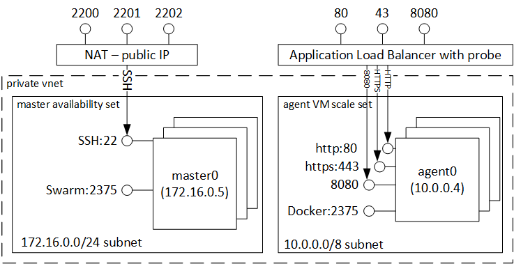

<properties
   pageTitle="Introducción de servicio del contenedor de Azure | Microsoft Azure"
   description="Servicio de contenedor Azure ofrece una manera para simplificar la creación, configuración y administración de un clúster de máquinas virtuales preconfiguradas para ejecutar aplicaciones de contenido."
   services="container-service"
   documentationCenter=""
   authors="rgardler"
   manager="timlt"
   editor=""
   tags="acs, azure-container-service"
   keywords="Docker, contenedores, Micro-services, Mesos, Azure"/>

<tags
   ms.service="container-service"
   ms.devlang="na"
   ms.topic="article"
   ms.tgt_pltfrm="na"
   ms.workload="na"
   ms.date="09/13/2016"
   ms.author="rogardle"/>

# Introducción de servicio del contenedor de Azure

Servicio de contenedor Azure simplifica crear, configurar y administrar un clúster de máquinas virtuales preconfiguradas para ejecutar aplicaciones de contenido. Utiliza una configuración optimizada de herramientas de programación y orquestación populares de código abierto. Esto le permite usar sus conocimientos o dibujar en un cuerpo grande y creciente de experiencia de comunidad para implementar y administrar aplicaciones basadas en el contenedor en Microsoft Azure.

Servicio de contenedor Azure aprovecha el formato de contenedor Docker para asegurarse de que los contenedores de aplicación son totalmente portátiles. También admite la posibilidad de maratón y DC/OS o enjambre Docker para que pueda escalar estas aplicaciones a miles de contenedores o incluso decenas de miles.

Mediante el servicio de contenedor de Azure, puede aprovechar las ventajas de las características de nivel empresarial de Azure, manteniendo portabilidad aplicación - incluidos portabilidad en las capas de orquestación.

Utilizar el servicio de contenedor de Azure
-----------------------------

Nuestro objetivo con el servicio de contenedor de Azure es proporcionar un contenedor en el entorno de hospedaje mediante herramientas de código abierto y tecnologías que son populares entre nuestros clientes hoy. Para ello, se exponen los extremos de la API estándares para su elegido orchestrator (DC/OS o Docker enjambre). Mediante el uso de estos extremos, puede aprovechar cualquier software que pueda hablar con los extremos. Por ejemplo, en el caso del extremo enjambre Docker, puede usar la interfaz de línea de comandos de Docker (CLI). Para DC/OS, puede utilizar la CLI DCOS.

Crear un clúster de Docker mediante el servicio de contenedor de Azure
-------------------------------------------------------

Para empezar a usar el servicio de contenedor de Azure, implementar un clúster de servicio del contenedor de Azure a través del portal (busque 'Servicio de Azure contenedor'), mediante una plantilla de administrador de recursos de Azure ([Enjambre Docker](https://github.com/Azure/azure-quickstart-templates/tree/master/101-acs-swarm) o [DC/OS](https://github.com/Azure/azure-quickstart-templates/tree/master/101-acs-dcos)) o con la [CLI](/documentation/articles/xplat-cli-install/). Las plantillas de tutorial proporcionado pueden modificarse para incluir la configuración de Azure adicional o avanzado. Para obtener más información sobre cómo implementar un clúster de servicio del contenedor de Azure, vea [implementar un clúster de servicio del contenedor de Azure](container-service-deployment.md).

Implementar una aplicación
------------------------

Servicio de contenedor Azure ofrece una selección de Docker enjambre o DC/OS para orquestación. ¿Cómo implementar la aplicación depende de su elección de orchestrator.

### Usar DC/OS

DC/OS es un sistema operativo distribuido basado en el núcleo de sistemas distribuidos Mesos Apache. Apache Mesos alojados en Apache Software Foundation y se muestran algunas de las [principales nombres de TI](http://mesos.apache.org/documentation/latest/powered-by-mesos/) como usuarios y colaboradores.

DC/OS y Apache Mesos incluyen un conjunto de características impresionante:

-   Escalabilidad comprobada

-   Tolerancia replica maestra y esclavos con Apache ZooKeeper

-   Compatibilidad con el formato Docker contenedores

-   Nativo aislamiento entre tareas con Linux contenedores

-   Multiresource programación (memoria, CPU, disco y puertos)

-   Java, Python y APIs de C++ para desarrollar nuevas aplicaciones en paralelo

-   Una interfaz de usuario de web para ver el estado de clúster

De forma predeterminada, DC/OS que se ejecuta en Azure contenedor servicio incluye la plataforma de orquestación maratón para la programación de cargas de trabajo. Sin embargo, incluido con la implementación de DC/OS de ACS es el universo de Mesosphere de los servicios que se pueden agregar a su servicio, se incluyen motor, Hadoop, Casandra y mucho más.

#### Uso de maratón

Maratón es un sistema de control para los servicios en cgroups--o, en el caso de servicio de contenedor de Azure, con formato de Docker contenedores y de inicialización de todo el clúster. Maratón proporciona una interfaz de usuario de web desde el que puede implementar las aplicaciones. Puede tener acceso a esta en una dirección URL que tiene un aspecto similar `http://DNS_PREFIX.REGION.cloudapp.azure.com` donde DNS\_PREFIJO y región se definen en tiempo de implementación. Por supuesto, también puede proporcionar su propio nombre de DNS. Para obtener más información sobre cómo ejecutar un contenedor utilizando la interfaz de usuario de web maratón, vea [administración de contenedor a través de la interfaz de usuario de web](container-service-mesos-marathon-ui.md).

También puede usar las API de REST para comunicarse con maratón. Hay una serie de bibliotecas de cliente que están disponibles para cada herramienta. Carta de una gran variedad de idiomas, y, por supuesto, puede usar el protocolo HTTP en cualquier idioma. Además, muchas de las herramientas DevOps populares proporcionan compatibilidad para maratón. Cuando se trabaja con un clúster de servicio del contenedor de Azure proporciona máxima flexibilidad para su equipo de operaciones. Para obtener más información sobre cómo ejecutar un contenedor mediante el uso de la API de REST de maratón, vea [administración de contenedor con la API de REST](container-service-mesos-marathon-rest.md).

### Uso conjunto de Docker

Conjunto de docker proporciona clústeres nativa para Docker. Debido a que Docker enjambre sirve la API Docker estándar, cualquier herramienta que ya se comunica con un demonio Docker puede usar conjunto transparente escalar a varios hosts de servicio del contenedor de Azure.

Herramientas compatibles para administrar contenedores en un clúster de conjunto incluyen, pero no se limitan a, los siguientes:

-   Dokku

-   Redacción docker CLI y Docker

-   Krane

-   Jenkins

Vídeos
------

Introducción a Azure contenedor servicio (101):  

> [AZURE.VIDEO azure-container-service-101]

Creación de aplicaciones con el servicio de contenedor Azure (compilación 2016)

> [AZURE.VIDEO build-2016-building-applications-using-the-azure-container-service]
