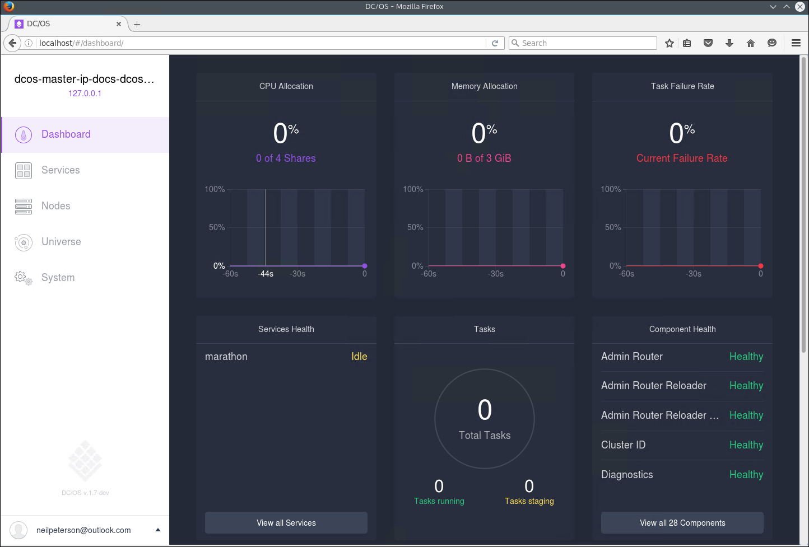

<properties
   pageTitle="Administración de contenedores de servicio de contenedor Azure a través de la interfaz de usuario de web | Microsoft Azure"
   description="Implementar contenedores en un servicio de clúster de servicio del contenedor de Azure mediante la interfaz de usuario de web maratón."
   services="container-service"
   documentationCenter=""
   authors="neilpeterson"
   manager="timlt"
   editor=""
   tags="acs, azure-container-service"
   keywords="Docker, contenedores, Micro-services, Mesos, Azure"/>

<tags
   ms.service="container-service"
   ms.devlang="na"
   ms.topic="get-started-article"
   ms.tgt_pltfrm="na"
   ms.workload="na"
   ms.date="09/19/2016"
   ms.author="timlt"/>

# <a name="container-management-through-the-web-ui"></a>Administración de contenedor a través de la interfaz de usuario de web

DC/OS proporciona un entorno para implementar y escalar agrupadas cargas de trabajo, mientras condensar el hardware subyacente. En la parte superior DC/OS, hay un marco que administra la programación y ejecución de cargas de trabajo de cálculo.

Mientras marcos están disponibles para muchas cargas de trabajo populares, este documento describe cómo puede crear y ajustar las implementaciones de contenedor con maratón. Antes de trabajar con estos ejemplos, necesitará un clúster de DC/OS está configurado en el servicio de contenedor de Azure. También debe tener conectividad remota de este clúster. Para obtener más información sobre estos elementos, consulte los siguientes artículos:

- [Implementar un clúster de servicio del contenedor de Azure](container-service-deployment.md)
- [Conectarse a un clúster de servicio del contenedor de Azure](container-service-connect.md)

## <a name="explore-the-dcos-ui"></a>Explorar la interfaz de usuario de DC/OS

Con un túnel de Shell seguro (SSH) establecido, vaya a http://localhost/. Esto carga la interfaz de usuario de web DC/OS y muestra información sobre el clúster, como los recursos utilizados, agentes activos y servicios en ejecución.



## <a name="explore-the-marathon-ui"></a>Explorar el maratón interfaz de usuario

Para ver la interfaz de usuario de maratón, vaya a http://localhost/Marathon. Desde esta pantalla, puede iniciar un nuevo contenedor u otra aplicación en el clúster de servicio de contenedor de Azure DC/OS. También puede ver información sobre cómo ejecutar contenedores y aplicaciones.  


## <a name="deploy-a-docker-formatted-container"></a>Implementar un contenedor con formato Docker

Implementar un nuevo contenedor mediante maratón, haga clic en el botón **Crear aplicación** y escriba la información siguiente en el formulario:

Campo           | Valor
----------------|-----------
ID.              | nginx
Imagen           | nginx
Red         | Puente
Puerto de host       | 80
Protocolo        | TCP


Si desea para la asignación estática el puerto contenedor a un puerto en el agente, debe usar el modo de JSON. Para ello, cambia al Asistente para la nueva aplicación **JSON modo** usando el botón de alternancia. A continuación, escriba lo siguiente en la `portMappings` sección de la definición de aplicación. Este ejemplo enlaza puerto 80 del contenedor al puerto 80 del agente DC/OS. Puede cambiar a este asistente del modo de JSON después de realizar este cambio.

```none
"hostPort": 80,
```


Se implementa el clúster DC/OS con conjunto de agentes públicos y privados. Para que el clúster puedan tener acceso a aplicaciones de Internet, debe implementar las aplicaciones a un agente de público. Para ello, seleccione la pestaña **opcional** del Asistente para la nueva aplicación y escriba **slave_public** para las **Funciones de recursos aceptado**.


En la página principal de maratón, puede ver el estado de implementación para el contenedor.


Cuando cambia a la web DC/OS (http://localhost/) de la interfaz de usuario, verá que se está ejecutando una tarea (en este caso, un contenedor con formato Docker) en el clúster DC/OS.


También puede ver el nodo que se está ejecutando la tarea.


## <a name="scale-your-containers"></a>Ajustar el tamaño de los contenedores

Puede usar la interfaz de usuario de maratón escalar el recuento de la instancia de un contenedor. Para ello, vaya a la página de **maratón** , seleccione el contenedor que desee ajustar y haga clic en el botón de **escala** . En el cuadro de diálogo **Escala de aplicación** , escriba el número de instancias de contenedor que desee y seleccione **Escala de aplicación**.


Una vez que termine la operación de escala, verá varias instancias de la misma tarea distribuidos en agentes DC/OS.


## <a name="next-steps"></a>Pasos siguientes

- [Trabajar con DC/OS y la API de maratón](container-service-mesos-marathon-rest.md)

Análisis detallado en el servicio de contenedor de Azure con Mesos

> [AZURE. Azurecon-2015-deep-dive-on-the-azure-container-service-with-mesos vídeo]]
